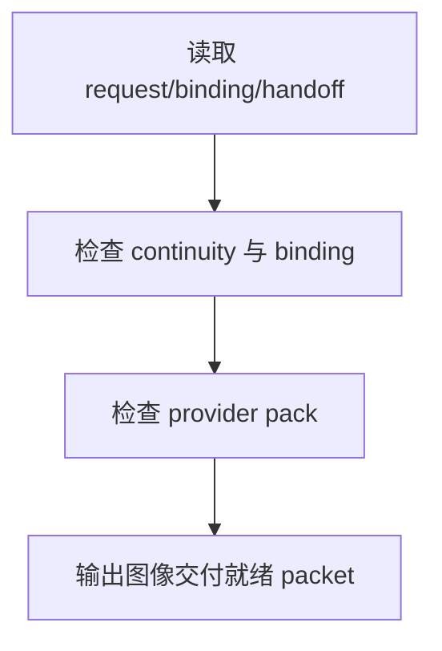

# review / 图像交付就绪

## Context Loading Contract

- 每次调用本技能时，必须同时加载同目录 `CONTEXT.md`。
- 必须回读父层 `review/SKILL.md`、`../_shared/review-root-contract.md`、`../_shared/review-child-output-contract.md`。

## Invocation Modes

- `checkpoint_inline`
- `stage_acceptance`
- `package_release`

## Parent Positioning

本 child 负责检查：

- `6-图像/A-分镜画面` 请求对象是否稳定
- `6-图像/B-分镜故事板` 是否可信
- 图像 handoff pack 是否完整
- 主体 continuity 是否可追溯

它不负责：

- 视频 motion 交付

## Output Contract

- `role_id`: `image-delivery-validator`
- `dimension_report_ref`: `图像交付就绪.md`
- 默认返工入口：
  - `6-图像/A-分镜画面`
  - `6-图像/B-分镜故事板`

## Visual Map

## Thinking-Action Network

| node_id | objective | actions | evidence | route_out | gate |
| --- | --- | --- | --- | --- | --- |
| `N1-IMAGE-READ` | 锁图像链路输出 | 读取 request/binding/handoff refs | `image_note` | `N2` | scope 明确 |
| `N2-CONTINUITY-CHECK` | 检查 continuity 与 binding | 审 request/binding 是否稳定 | `continuity_note` | `N3` | continuity 成立 |
| `N3-PROVIDER-CHECK` | 检查 handoff pack | 审 submit-plan / brief / output root | `provider_note` | `N4` | provider pack 成立 |
| `N4-PACKET-WRITE` | 输出维度 packet | 生成 `dimension_packet + report_ref` | `packet_note` | done | 只写本维度 |

## Lite Field Contract

| field_id | output_slot | pass_standard | fail_code | rework_entry |
| --- | --- | --- | --- | --- |
| `FIELD-ID-01` | request/binding continuity | continuity 与 binding 稳定 | `FAIL-ID-01` | `N2` |
| `FIELD-ID-02` | provider pack | provider handoff 完整 | `FAIL-ID-02` | `N3` |
| `FIELD-ID-03` | dimension packet | 报告完整可聚合 | `FAIL-ID-03` | `N4` |

## Root-Cause Execution Contract (Mandatory)

若本维度失效，先修 `6-图像` 的分镜画面、故事板与 handoff pack，不要只看最终资产是否存在。

## Completion Contract

- 已指出图像链路的 continuity、storyboard 或 provider 问题
- 已给出回退到 `6-图像` 对应子路径的建议
