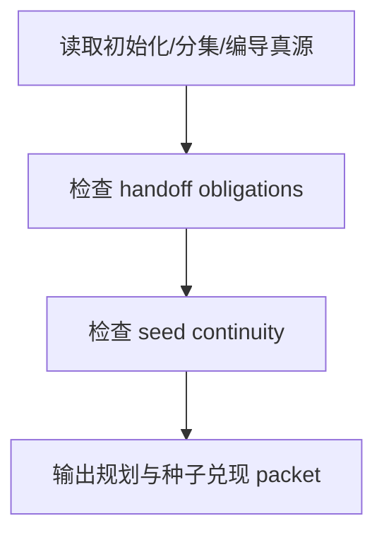

# review / 规划与种子兑现

## Context Loading Contract

- 每次调用本技能时，必须同时加载同目录 `CONTEXT.md`。
- 必须回读父层 `review/SKILL.md`、`../_shared/review-root-contract.md`、`../_shared/review-child-output-contract.md`、`../_shared/review-fact-pack-spec.md`。

## Invocation Modes

- `checkpoint_inline`
- `stage_acceptance`
- `package_release`

## Parent Positioning

本 child 负责检查：

- `0-初始化 -> 1-分集 -> 2-编导` 的 seed 与 obligation 是否连续
- `north_star / init_handoff / 分集稿 / 编导稿` 是否在正确阶段兑现
- 上游项目种子是否在编导稿中仍可追溯

它不负责：

- 单镜级构图语法细节
- 设计、图像、视频 provider 交付

## Canonical Sources

- `../SKILL.md`
- `../_shared/review-root-contract.md`
- `../_shared/review-child-output-contract.md`
- `../_shared/review-dimension-registry.yaml`

## Business Requirement Analysis Contract

| analysis_slot | 当前结论 |
| --- | --- |
| `business_goal` | 判断初始化、分集、编导的 seed 与 handoff 有没有断链。 |
| `business_object` | `north_star`、`init_handoff`、分集稿、编导稿。 |
| `constraint_profile` | 先锁 handoff obligations，再判 seed 是否兑现，不能只看文件存在。 |
| `success_criteria` | 能指出哪一层 seed 漂移、哪一层 obligation 漏传、该回退哪一层 source owner。 |

## Output Contract

- `role_id`: `planning-seed-validator`
- `dimension_report_ref`: `规划与种子兑现.md`
- 默认返工入口：
  - `0-初始化`
  - `1-分集`
  - `2-编导`

## Visual Map

## Thinking-Action Network

| node_id | objective | actions | evidence | route_out | gate |
| --- | --- | --- | --- | --- | --- |
| `N1-SEED-READ` | 锁上游真源 | 读取初始化/分集/编导 refs | `seed_note` | `N2` | 真源明确 |
| `N2-HANDOFF-CHECK` | 检查 handoff obligations | 核对 `north_star / init_handoff / 分集稿 / 编导稿` | `handoff_note` | `N3` | obligations 可追溯 |
| `N3-CONTINUITY-CHECK` | 检查 seed 连续性 | 对照初始化/分集/编导是否断链 | `continuity_note` | `N4` | continuity 成立 |
| `N4-PACKET-WRITE` | 输出维度 packet | 生成 `dimension_packet + report_ref` | `packet_note` | done | 只写本维度 |

## Lite Field Contract

| field_id | output_slot | pass_standard | fail_code | rework_entry |
| --- | --- | --- | --- | --- |
| `FIELD-PS-01` | handoff obligations | handoff 引用完整可追溯 | `FAIL-PS-01` | `N2` |
| `FIELD-PS-02` | seed continuity | 初始化/分集/编导没有断链 | `FAIL-PS-02` | `N3` |
| `FIELD-PS-03` | dimension packet | 报告完整可聚合 | `FAIL-PS-03` | `N4` |

## Root-Cause Execution Contract (Mandatory)

若本维度失效，先回看 `north_star / init_handoff / 分集稿 / 编导稿` 的 handoff 链，而不是先改下游 prose。

## Completion Contract

- 已指出 seed 断链或 handoff 漏传位置
- 已给出回退到 `0-初始化 / 1-分集 / 2-编导` 的建议
