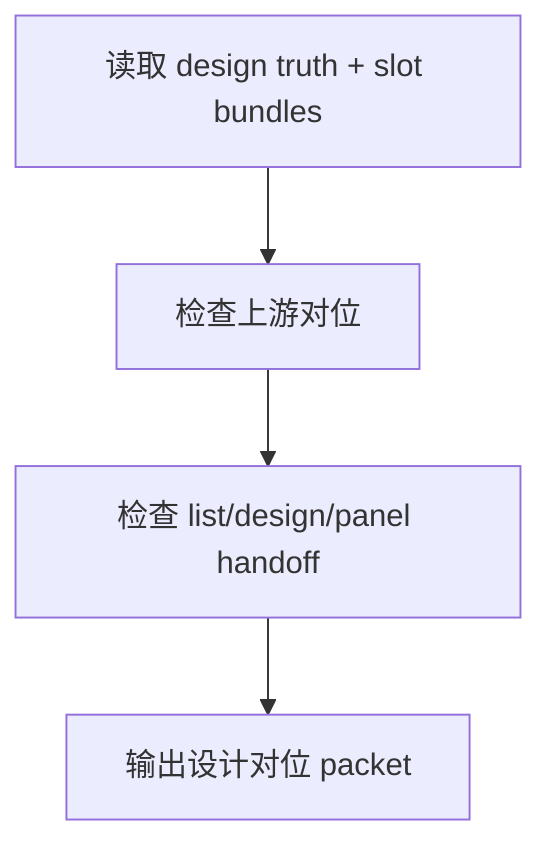

# review / 设计对位

## Context Loading Contract

- 每次调用本技能时，必须同时加载同目录 `CONTEXT.md`。
- 必须回读父层 `review/SKILL.md`、`../_shared/review-root-contract.md`、`../_shared/review-child-output-contract.md`。

## Invocation Modes

- `checkpoint_inline`
- `stage_acceptance`
- `package_release`

## Parent Positioning

本 child 负责检查：

- `5-设计` 各域输出是否仍对位 `4-分组`
- 清单/设计/生成各层 handoff 是否一致
- slot bundle 粒度的设计 continuity 是否稳定

它不负责：

- provider 级 image/video 提交

## Output Contract

- `role_id`: `design-alignment-validator`
- `dimension_report_ref`: `设计对位.md`
- 默认返工入口：
  - `5-设计/场景`
  - `5-设计/角色`
  - `5-设计/道具`

## Visual Map

## Thinking-Action Network

| node_id | objective | actions | evidence | route_out | gate |
| --- | --- | --- | --- | --- | --- |
| `N1-DESIGN-READ` | 锁 design truth | 读取 list/design/panel canonical refs 与 slot bundles | `design_note` | `N2` | 真源明确 |
| `N2-UPSTREAM-CHECK` | 检查上游对位 | 对照分组 truth 是否漂移 | `alignment_note` | `N3` | 上游对位成立 |
| `N3-HANDOFF-CHECK` | 检查 tranche handoff | 检查 list/design/panel 一致性与下游 readiness | `handoff_note` | `N4` | handoff 成立 |
| `N4-PACKET-WRITE` | 输出维度 packet | 生成 `dimension_packet + report_ref` | `packet_note` | done | 只写本维度 |

## Lite Field Contract

| field_id | output_slot | pass_standard | fail_code | rework_entry |
| --- | --- | --- | --- | --- |
| `FIELD-DA-01` | upstream alignment | 仍对位分组 truth | `FAIL-DA-01` | `N2` |
| `FIELD-DA-02` | tranche handoff | list/design/panel handoff 稳定 | `FAIL-DA-02` | `N3` |
| `FIELD-DA-03` | dimension packet | 报告完整可聚合 | `FAIL-DA-03` | `N4` |

## Root-Cause Execution Contract (Mandatory)

若本维度失效，先修 `5-设计` 与 `4-分组` 的对位关系，不要把 design drift 直接甩给 image/video 阶段。

## Completion Contract

- 已指出设计对位或 tranche handoff 问题
- 已给出回退到 `5-设计` 对应领域的建议
