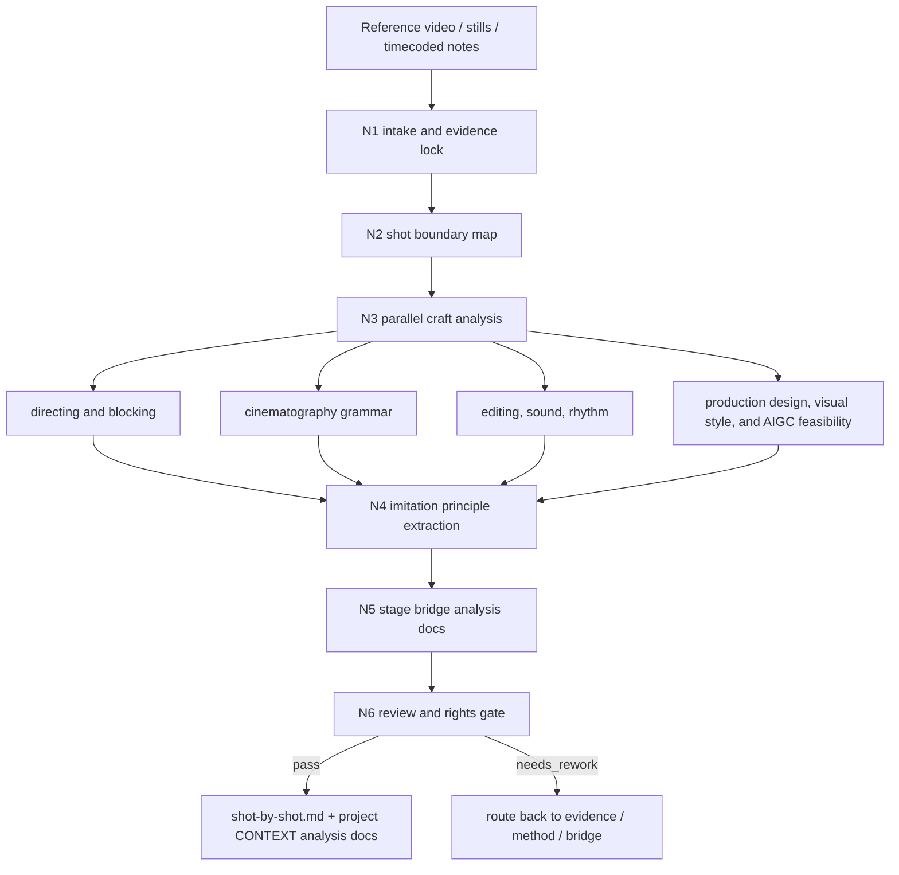
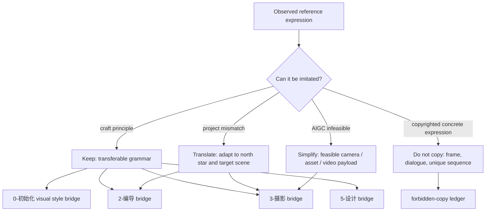
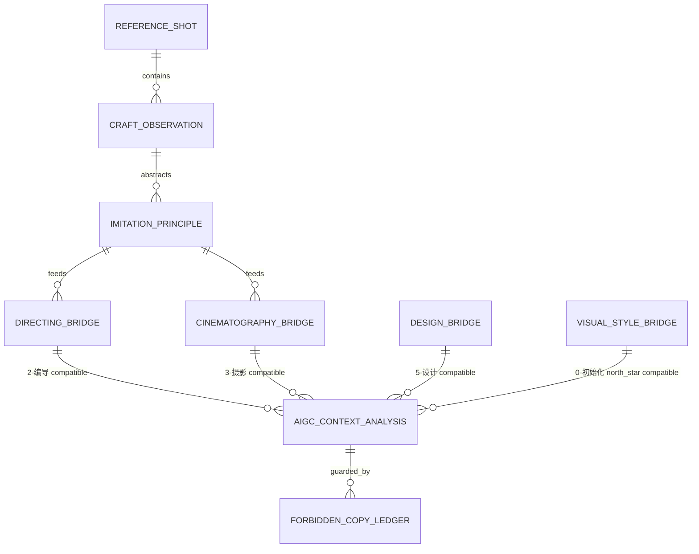

# aigc shot-by-shot

`shot-by-shot` 是 `.agents/skills/aigc` 的临摹型卫星技能。它把参考影片、短片、广告、剧集片段或用户提供的视频逐镜拆解为可复用的导演策略、表演/场面调度策略、摄影运镜策略、设计资产策略和画面风格策略，再投影成能被 `0-初始化`、`2-编导`、`3-摄影` 与 `5-设计` 直接消费的项目 `CONTEXT/` 解析文档。

它不替代 `0-初始化` 的 `north_star.yaml` 主真源，不替代 `2-编导` 的剧本化主创，不替代 `3-摄影` 的分镜明细主创，也不替代 `5-设计` 的角色、场景、道具正式设计主创；它只拥有参考素材分析、风格语法提炼、临摹边界裁决、跨阶段解析文档和证据报告。不得把参考影片的剧情、构图、台词、角色设计、场景设计、道具设计、画面风格、镜头序列或受版权保护的具体表达逐字逐帧照搬到项目 canonical 产物。

## Context Loading Contract

- 每次调用 `$aigc-shot-by-shot` 时，必须同时加载同目录 `CONTEXT.md`。
- 每次调用本技能时，必须同时识别并加载同目录 `types/` 中选中的类型包（单选或多选）。
- 若任务绑定 `projects/aigc/<项目名>/`，必须先加载项目根 `MEMORY.md`、`0-初始化/north_star.yaml`、`team.yaml`，再按需加载项目根 `CONTEXT/` 中与参考片、导演、摄影、美术、表演或制作约束相关的上下文文件。
- 若本轮输出将服务 `0-初始化`、`2-编导`、`3-摄影` 或 `5-设计`，必须按需加载对应 owning stage 的 `SKILL.md + CONTEXT.md`，并遵循其字段边界。服务 `0-初始化` 时，必须对齐 `north_star.yaml` 的 `全局风格 / 细分风格 / 类型元素` 边界；`5-设计` 细分到角色、场景、道具时，必须分别对齐 `.agents/skills/aigc/5-设计/角色/2-设计`、`.agents/skills/aigc/5-设计/场景/2-设计`、`.agents/skills/aigc/5-设计/道具/2-设计`。
- 冲突优先级：用户显式请求 > 根 `AGENTS.md` / meta 规则 > 本 `SKILL.md` > `references/` / `steps/` / `types/` / `review/` / `templates/` > `agents/openai.yaml` > 项目 `MEMORY.md` > 项目 `CONTEXT/` > 本 `CONTEXT.md`。
- 核心视频理解、逐镜判断、风格归纳、临摹映射和迁移策略必须由 LLM 直接完成；`scripts/` 只能做文件存在检查、字段完整性校验、统计和格式辅助。

## Business Requirement Analysis Contract (Mandatory)

在进入逐镜拆解前，先锁定业务需求画像：

| analysis field | required decision |
| --- | --- |
| `business_goal` | 本轮是学习导演调度、摄影语法、剪辑节奏、类型氛围，还是为某集/某场/某镜建立临摹参照 |
| `business_object` | 参考素材、目标 AIGC 项目、目标阶段、目标集/场/分镜组 |
| `constraint_profile` | 版权边界、不可照搬项、项目北极星、制作限制、AIGC 可执行限制 |
| `success_criteria` | 输出能否直接喂给 `0-初始化`、`2-编导`、`3-摄影` 或 `5-设计`，并能说明“学什么、不学什么、怎么迁移” |
| `topology_fit` | 单素材逐镜、片段对比、目标场景反向临摹或多参考融合 |
| `step_strategy` | 主干串行取证 + 并行维度分析 + 项目 `CONTEXT/` 解析文档汇流 |

## Input Contract

Accepted input:

- 本地视频文件、视频截图序列、用户粘贴的时间码描述、可访问的视频链接，或用户描述的指定影片片段。
- 用户要求“拉片”“逐镜分析”“shot by shot”“镜头拆解”“分析这段视频怎么拍”“把参考片临摹成 AIGC 可用摄影稿/编导参照”等任务。
- 已绑定的 `projects/aigc/<项目名>/`、目标集号、目标场景、目标分镜组或目标阶段。

Required input:

- 可观察的参考素材证据，或足够明确的片段范围和分析目标。
- 至少一个临摹用途：`0-初始化` 画面风格补强、`2-编导`、`3-摄影`、`5-设计`、`4-分组` 辅助、项目风格库、或单次研究报告。

Optional input:

- 参考影片名、导演/摄影师、时间码范围、镜头粒度、目标题材、项目 `MEMORY.md` 中的长期视觉偏好。
- 用户指定“只看摄影”“只看场面调度”“只看剪辑节奏”“只输出 3-摄影 可套用语言”等限制。

Reject or clarify when:

- 用户要求复制受版权保护素材的具体镜头序列、台词、角色造型、画面构图或剧情表达。
- 参考素材不可见、不可读，且用户也没有提供足够的时间码/截图/描述。
- 用户要求本技能直接改写 `0-初始化/north_star.yaml`、`2-编导`、`3-摄影` 或 `5-设计` canonical 文件；本技能只能输出项目 `CONTEXT/` 解析文档，正式写回交给 owning stage。

## Mode Selection

| mode | trigger | output |
| --- | --- | --- |
| `single_reference` | 单个视频或片段逐镜分析 | `projects/aigc/<项目名>/shot-by-shot/<reference_slug>/shot-by-shot.md` |
| `targeted_stage_bridge` | 明确服务 `0-初始化`、`2-编导`、`3-摄影` 或 `5-设计` | 主报告 + `CONTEXT/shot-by-shot/<reference_slug>/画面风格解析.md` / `编导解析.md` / `摄影解析.md` / `设计解析.md` |
| `scene_imitation_packet` | 为目标场景、场面、分镜组建立临摹策略 | 目标场景临摹映射与 forbidden-copy 清单 |
| `comparative_reference` | 多个参考片段比较 | 多参考风格矩阵与融合裁决 |
| `repair` | 既有拉片包缺证据、字段不对齐、临摹边界不清 | 最小修复后的拉片包与修复报告 |
| `review_only` | 只审查已有拉片包 | 审查报告，不改写原包 |

## Reference Loading Guide

| need | load |
| --- | --- |
| 任意逐镜拉片 | `references/analysis-method.md`、`steps/shot-by-shot-workflow.md` |
| 与 `0-初始化` / `2-编导` / `3-摄影` / `5-设计` 对接 | `references/adaptation-output-contract.md` |
| 版权、临摹边界和证据标注 | `references/evidence-and-rights-boundary.md` |
| 判断素材类型和输出路线 | `types/source-type-map.md` |
| 验收、修复和 review gate | `review/review-contract.md` |
| 输出样板 | `templates/output-template.md` |
| 脚本辅助边界 | `scripts/README.md` |
| 可复用经验 | `knowledge-base/shot-by-shot-heuristics.md` |
| 产品入口元数据 | `agents/openai.yaml` |

## Visual Maps

## Execution Contract

1. 读取本 `SKILL.md + CONTEXT.md`，若绑定项目则读取项目 `MEMORY.md`、`north_star.yaml`、`team.yaml` 与相关 `CONTEXT/`。
2. 按 `types/source-type-map.md` 判定素材类型、证据可信度、时间码粒度和目标对接阶段。
3. 按 `steps/shot-by-shot-workflow.md` 建立逐镜边界：镜头编号、时间码、画面事件、进入/退出点、镜头功能、可观察证据。
4. 按 `references/analysis-method.md` 并行分析导演调度、表演任务、空间权力、摄影语法、运镜、光影色彩、剪辑节奏、声音接口、类型氛围和 AIGC 可执行性。
5. 按 `references/evidence-and-rights-boundary.md` 将观察结果抽象成可迁移原则，明确禁止照搬项；所有临摹建议必须脱离参考片的具体角色、剧情、台词、构图复制和镜头顺序复制。
6. 按 `references/adaptation-output-contract.md` 汇流输出：`0-初始化` 侧只给能服务 `north_star.yaml` 的 `全局风格`、`细分风格.画面风格` 与 `类型元素` 的画面风格解析，不直接改写 north star。`2-编导` 侧只给戏剧问题、人物压力、表演任务、场面调度、潜台词行为和可拍承托；不得写摄影机位、景别或分镜编号。`3-摄影` 侧给 `visual_unit`、`beat_map`、`rhythm_profile`、`camera_grammar_plan`、`functional_projection_payload` 和可改写成 `分镜明细：` 的示范语法；不得改写项目编导正文。`5-设计` 侧按角色、场景、道具拆分可迁移视觉资产原则，并保留各设计子技能的画面合同。
7. 输出前执行 `review/review-contract.md`：证据可回指、临摹边界清楚、0/2/3/5 阶段字段不越权、AIGC 可执行、没有复制具体表达。
8. 写入 `projects/aigc/<项目名>/shot-by-shot/<reference_slug>/shot-by-shot.md`；若未绑定项目，则在当前回复中交付结构化拉片包，不落入项目 runtime。

## Output Contract

### Required Output

1. 主拉片报告：`projects/aigc/<项目名>/shot-by-shot/<reference_slug>/shot-by-shot.md`。
2. `0-初始化` 画面风格解析：`projects/aigc/<项目名>/CONTEXT/shot-by-shot/<reference_slug>/画面风格解析.md`，仅在本轮需要服务 north star 风格块时生成。
3. `2-编导` 解析：`projects/aigc/<项目名>/CONTEXT/shot-by-shot/<reference_slug>/编导解析.md`，仅在本轮需要服务编导时生成。
4. `3-摄影` 解析：`projects/aigc/<项目名>/CONTEXT/shot-by-shot/<reference_slug>/摄影解析.md`，仅在本轮需要服务摄影时生成。
5. `5-设计` 解析：`projects/aigc/<项目名>/CONTEXT/shot-by-shot/<reference_slug>/设计解析.md`，仅在本轮需要服务角色、场景或道具设计时生成。
6. 执行报告：`projects/aigc/<项目名>/shot-by-shot/<reference_slug>/执行报告.md`。

### Output Format

- 主报告必须包含：`思考过程`、素材证据、逐镜表、解析维度、临摹原则、禁止照搬清单、阶段对接包和风险。
- `画面风格解析.md` 必须使用 `0-初始化` 可消费字段：`north_star_field`、`global_style_dimension`、`sub_style_field`、`type_element`、`safe_phrase_seed`、`可回刷建议`、`Do Not Import`。
- `编导解析.md` 必须使用 `2-编导` 可消费字段：戏剧问题、人物选择压力、观众位置、表演任务、场面调度、场景状态差、可拍承托、禁用摄影越权。
- `摄影解析.md` 必须使用 `3-摄影` 可消费字段：`visual_unit_function`、`beat_map`、`rhythm_profile`、`continuity_profile`、`camera_grammar_plan`、`functional_projection_payload`、`shot_design_seed`、`分镜明细` 写法参考。
- `设计解析.md` 必须按 `角色解析`、`场景解析`、`道具解析` 分区，分别服务角色全身试装照、场景空镜、道具纯色背景 45 度完整近摄的设计合同。

### Completion Gate

- 已说明为什么选择当前逐镜分析拓扑，并在 `思考过程` 中给出关键裁决。
- 每条重要结论均能回指参考素材时间码、截图序号或用户提供描述。
- 临摹建议已经抽象为可迁移 craft principle，没有复制参考片具体表达。
- 输出解析能被 `0-初始化`、`2-编导`、`3-摄影` 或 `5-设计` 直接作为项目附加上下文消费，且不越权改写 owning stage canonical 文件。
- 若发现素材不可见、证据不足、版权边界不清或阶段字段冲突，已输出阻断原因与最小补证需求。

## Field Master

| field_id | output/evidence | content requirement | fail code |
| --- | --- | --- | --- |
| `FIELD-SBS-01` | evidence lock | 参考素材、时间码/截图、项目目标、目标阶段明确 | `FAIL-SBS-EVIDENCE` |
| `FIELD-SBS-02` | shot boundary map | 镜头边界、进入点、退出点和可观察事件可回指 | `FAIL-SBS-SHOT-MAP` |
| `FIELD-SBS-03` | craft observation | 导演、表演、摄影、剪辑、声音、美术与 AIGC 可行性分维度拆解 | `FAIL-SBS-OBSERVATION` |
| `FIELD-SBS-04` | imitation principle | 观察被抽象为可迁移原则，禁止具体复制 | `FAIL-SBS-IMITATION` |
| `FIELD-SBS-05` | 0-初始化 visual style bridge | 输出能被 `north_star.yaml` 风格块消费的画面风格、细分风格和类型元素补强 | `FAIL-SBS-STYLE-BRIDGE` |
| `FIELD-SBS-06` | 2-编导 bridge | 只输出编导可消费的戏剧/表演/调度/承托字段 | `FAIL-SBS-DIRECTING-BRIDGE` |
| `FIELD-SBS-07` | 3-摄影 bridge | 输出能转成 `分镜明细：` 的摄影语法和 shot payload | `FAIL-SBS-CINE-BRIDGE` |
| `FIELD-SBS-08` | 5-设计 bridge | 输出能被角色、场景、道具设计消费的资产原则和画面合同边界 | `FAIL-SBS-DESIGN-BRIDGE` |
| `FIELD-SBS-09` | rights ledger | 禁止照搬项、证据不足项、项目不适配项清楚 | `FAIL-SBS-RIGHTS` |
| `FIELD-SBS-10` | output landing | `shot-by-shot` 末端同名主报告与项目 `CONTEXT/` 阶段解析落点稳定 | `FAIL-SBS-OUTPUT` |

## Thought Pass Map

| pass_id | focus field | core question | action | evidence |
| --- | --- | --- | --- | --- |
| `PASS-SBS-00` | `FIELD-SBS-01` | 本轮看什么、为谁服务、能看到多少证据 | 锁素材、目标项目、目标阶段和证据粒度 | source profile |
| `PASS-SBS-01` | `FIELD-SBS-02` | 镜头边界在哪里，进入/退出点是什么 | 建立 shot boundary map | timecode / still anchors |
| `PASS-SBS-02` | `FIELD-SBS-03` | 每镜的导演、表演、摄影、剪辑、声音、美术功能是什么 | 并行拆解 craft observations | observation matrix |
| `PASS-SBS-03` | `FIELD-SBS-04` | 哪些是可临摹原则，哪些是不可复制表达 | 抽象 craft grammar，写 forbidden-copy ledger | imitation principles |
| `PASS-SBS-04` | `FIELD-SBS-05` | 哪些结果能服务 `0-初始化/north_star.yaml` 且不直接覆盖 north star | 投影 visual style analysis packet | visual style bridge |
| `PASS-SBS-05` | `FIELD-SBS-06` | 哪些结果能服务 `2-编导` 且不越权摄影 | 投影 director bridge packet | directing bridge |
| `PASS-SBS-06` | `FIELD-SBS-07` | 哪些结果能服务 `3-摄影` 的 `分镜明细：` | 投影 camera grammar / shot design seed | cinematography bridge |
| `PASS-SBS-07` | `FIELD-SBS-08` | 哪些结果能服务 `5-设计` 且不复制参考片具体美术表达 | 投影 design analysis packet | design bridge |
| `PASS-SBS-08` | `FIELD-SBS-09` | 版权、项目适配和 AIGC 可行性是否过门 | 执行 review gate 和风险裁决 | rights and feasibility verdict |
| `PASS-SBS-09` | `FIELD-SBS-10` | 最终包是否唯一、可消费、可回指 | 写回主报告和项目 `CONTEXT/` 解析 | output paths |

## Pass Table

| pass_id | pass standard | fail code | rework entry |
| --- | --- | --- | --- |
| `PASS-SBS-00` | 素材、项目、目标阶段和证据粒度明确 | `FAIL-SBS-EVIDENCE` | Input Contract / `types/source-type-map.md` |
| `PASS-SBS-01` | 逐镜边界可复查，不用剧情段落冒充镜头 | `FAIL-SBS-SHOT-MAP` | `steps/shot-by-shot-workflow.md` |
| `PASS-SBS-02` | 至少覆盖导演/表演/摄影/剪辑/声音/美术/AIGC 可行性中的任务相关维度 | `FAIL-SBS-OBSERVATION` | `references/analysis-method.md` |
| `PASS-SBS-03` | 可迁移原则与禁止照搬项分离 | `FAIL-SBS-IMITATION` | `references/evidence-and-rights-boundary.md` |
| `PASS-SBS-04` | `画面风格解析.md` 对齐 `全局风格 / 细分风格 / 类型元素`，且不直接改写 `north_star.yaml` | `FAIL-SBS-STYLE-BRIDGE` | `references/adaptation-output-contract.md` |
| `PASS-SBS-05` | `编导解析.md` 不含机位、景别、运镜、分镜编号 | `FAIL-SBS-DIRECTING-BRIDGE` | `references/adaptation-output-contract.md` |
| `PASS-SBS-06` | `摄影解析.md` 能转成 `分镜明细：`，且不改写编导正文 | `FAIL-SBS-CINE-BRIDGE` | `references/adaptation-output-contract.md` |
| `PASS-SBS-07` | `设计解析.md` 按角色/场景/道具拆分，且保留各自画面合同 | `FAIL-SBS-DESIGN-BRIDGE` | `references/adaptation-output-contract.md` |
| `PASS-SBS-08` | 没有复制参考片具体表达，AIGC 可执行风险清楚 | `FAIL-SBS-RIGHTS` | `review/review-contract.md` |
| `PASS-SBS-09` | 主报告和项目 `CONTEXT/` 解析路径稳定，最终输出含 `思考过程` | `FAIL-SBS-OUTPUT` | `templates/output-template.md` |

## Root-Cause Execution Contract (Mandatory)

出现以下问题时，必须沿链路上溯并修复源层合同：

- 把“拉片”写成剧情摘要或影评，而不是逐镜 craft 证据。
- 只输出抽象“电影感/高级感/压迫感”，没有可迁移导演、表演或摄影语法。
- 把参考片具体画面、台词、角色、镜头顺序或构图复制到 AIGC 项目。
- 给 `画面风格解析.md` 写成分场景摄影表、直接覆盖 `north_star.yaml`，或把参考片专属画面组合偷渡进全局风格。
- 给 `编导解析.md` 写入机位、景别、运镜或分镜编号，越权到 `3-摄影`。
- 给 `摄影解析.md` 只有参数清单，无法消费为自然中文 `分镜明细：`。
- 给 `设计解析.md` 复制参考片具体人物脸、服装纹样、场景构图、道具纹章，或违反角色/场景/道具设计子技能的画面合同。
- 脚本替代 LLM 做逐镜审美判断或临摹策略归纳。

必经链路：

`Symptom -> Direct Analysis/Bridge/Rights Failure -> shot-by-shot Section Owner -> 0-初始化 / 2-编导 / 3-摄影 / 5-设计 Contract -> AGENTS.md LLM-first / Skill 2.0 Rule`
