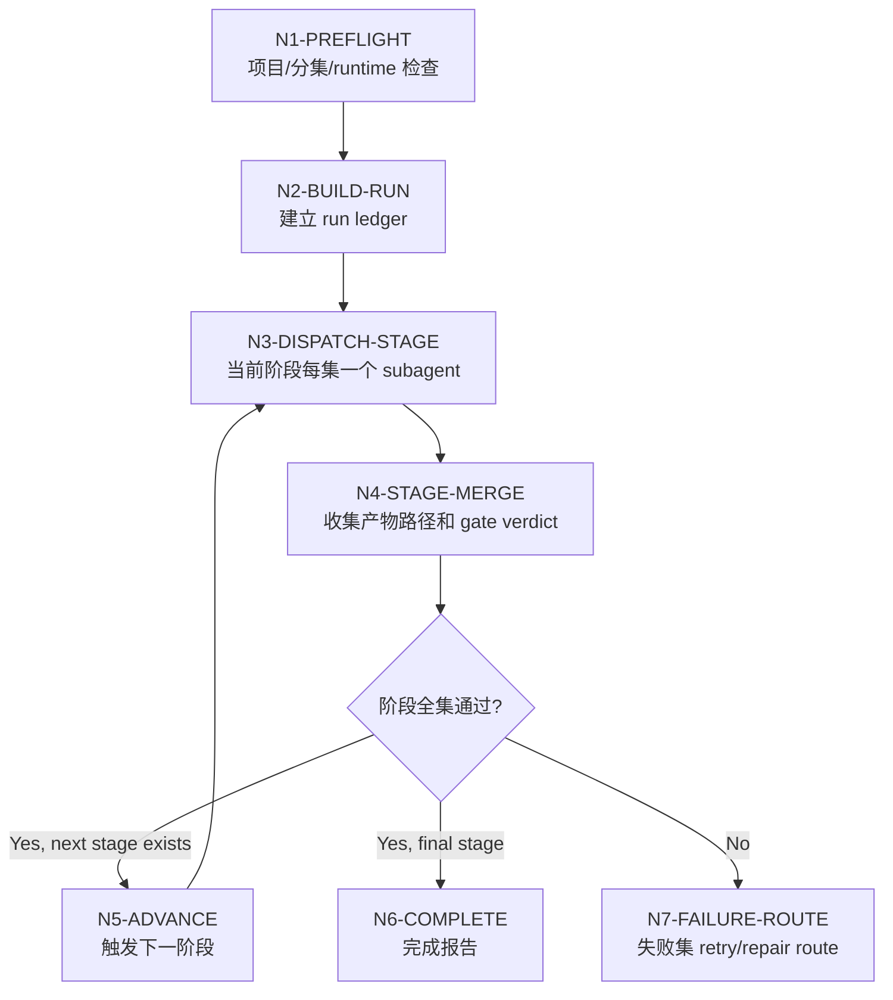

# Sword6 Workflow

本文件定义 `sword6` 的思行一体执行拓扑：阶段间串行，阶段内按分集并发 subagent，主窗口只做汇流。

## Node Network

## Thinking-Action Nodes

| node_id | objective | inputs | actions | evidence | route_out | gate |
| --- | --- | --- | --- | --- | --- | --- |
| `N1-PREFLIGHT` | 锁定项目、集数、起止阶段和 runtime | user request、project root、types | 检查 `MEMORY.md`、上游产物、阶段技能、subagent runtime | preflight evidence table | `N2-BUILD-RUN` or blocked | `GATE-SWORD6-01` |
| `N2-BUILD-RUN` | 建立本轮最小账本 | preflight pass | 创建 `workflow/sword6/<run_id>/` 与 stage plan | `run-ledger.yaml` initial | `N3-DISPATCH-STAGE` | `GATE-SWORD6-06` |
| `N3-DISPATCH-STAGE` | 当前阶段按分集派发 subagents | stage plan、episode list | 为每集写 dispatch packet，启动隔离 subagent | dispatch packets、subagent ids | `N4-STAGE-MERGE` | `GATE-SWORD6-02` |
| `N4-STAGE-MERGE` | 汇流阶段结果，避免把正文带回主上下文 | subagent statuses、output paths | 记录 pass/fail、校验 canonical 输出存在 | stage verdict table | `N5-ADVANCE` / `N7-FAILURE-ROUTE` / `N6-COMPLETE` | `GATE-SWORD6-04` |
| `N5-ADVANCE` | 触发下一阶段 | current stage all pass | 根据 stage chain 选择下一阶段，并复核输入路径 | next stage dispatch plan | `N3-DISPATCH-STAGE` | `GATE-SWORD6-04` |
| `N6-COMPLETE` | 输出完成报告 | final stage pass | 汇总 run ledger、产物路径、残余风险 | `completion-report.md` | done | `GATE-SWORD6-06` |
| `N7-FAILURE-ROUTE` | 保持失败边界并给出续跑入口 | failed episode table | 写 retry packet 或 repair route，不推进失败集 | failed episodes、retry start_stage | done or retry | `GATE-SWORD6-05` |

## Stage Order

| order | stage_slug | next_stage |
| --- | --- | --- |
| 1 | `2-编导` | `3-运动` |
| 2 | `3-运动` | `4-摄影` |
| 3 | `4-摄影` | `5-分组` |
| 4 | `5-分组` | complete |

## Failure Rules

- `N1` 失败：不创建阶段 subagents，只输出阻断原因。
- `N3` runtime 失败：停止派发，标记 `degraded-subagent-unavailable`。
- `N4` 单集失败：默认停止该集下游推进；批处理模式可允许已通过集继续，但必须在 completion report 中分开列示。
- `N5` 发现下一阶段输入缺失：回到 producing stage，而不是从下游造补丁。

## Evidence Discipline

主窗口 evidence 只保留：

- dispatch packet path
- subagent runtime mode
- stage input/output paths
- gate verdict
- fail code
- retry route

不保留：

- 阶段正文全文
- subagent 长推理
- 未经阶段 skill 验收的临时草稿
