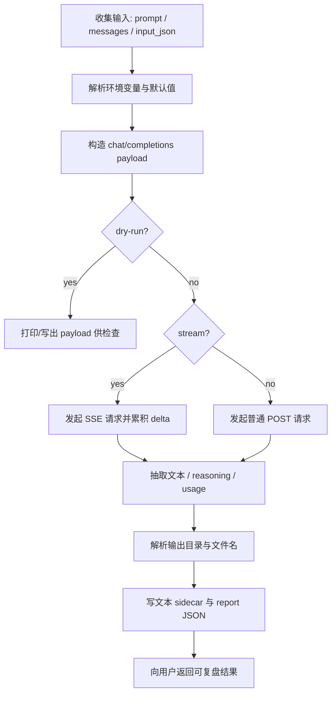
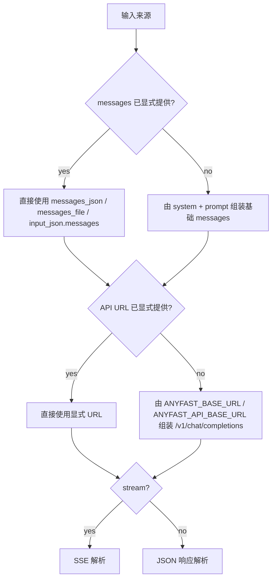

# 豆包 Seed 2.0 Pro

## Context Loading Contract

- 每次调用本技能时，必须同时加载同目录 `CONTEXT.md` 作为预加载上下文。
- 每次调用本技能时，必须同时识别并加载同目录 `types/` 中选中的类型包（单选或多选）。
- 若同目录 `CONTEXT.md` 缺失，应先补齐最小知识库骨架，或向用户明确报告阻塞；不得在未检查该上下文的情况下执行技能。
- 冲突优先级：用户显式请求 > 仓库/全局 `AGENTS.md` > 本 `SKILL.md` > 同目录 `CONTEXT.md`。

## 1. 作用范围

本技能是 AnyFast 上 `doubao-seed-2.0-pro` 的 repo-local provider skill，负责把任务整理为 OpenAI 兼容 `chat/completions` 请求，执行调用，并把文本结果、流式事件摘要和报告 JSON 落到可复盘目录。

- 官方模型页：
  - `https://docs.anyfast.ai/zh/guides/model-api/bytedance/doubao-seed-2.0-pro`
  - `https://docs.anyfast.ai/zh/api-reference/model-api/bytedance/doubao-seed-2.0-pro`
- 兼容端点：
  - `POST https://www.anyfast.ai/v1/chat/completions`
- 默认模型：
  - `doubao-seed-2.0-pro`
- 默认脚本入口：
  - `python3 .agents/skills/api/anyfast/llm/doubao-seed-2.0-pro/scripts/doubao_seed_chat.py ...`

职责边界：

- 本技能负责：
  - 普通文本对话
  - 结构化 `messages` 直传
  - 参数校验与默认值注入
  - 流式/非流式响应解析
  - 文本与报告落盘
- 本技能不负责：
  - 上游业务 prompt 模板设计
  - 项目主真源裁决
  - 多技能编排后的最终业务写回

## 1.1 视觉流程



## 1.2 分支与回退



## 2. 必需输入

- 二选一：
  - `prompt`
  - `messages`（通过 `--messages-json` / `--messages-file` / `--input-json` 提供）
- API Key：
  - 优先读取根目录 `.env` 中的 `ANYFAST_DOUBAO_SEED_2_0_PRO_API_KEY`
  - 若未设置则回退到 `ANYFAST_API_KEY`
  - 可显式传 `--api-key`

可选输入：

- `system`
- `model`（默认固定 `doubao-seed-2.0-pro`）
- `max_tokens`
- `temperature`
- `top_p`
- `frequency_penalty`
- `presence_penalty`
- `stop`
- `stream`
- `extra_json`
- `output_dir`
- `project_name`
- `task_kind`
- `filename_prefix`
- `text_output`
- `report_json`

## 3. 核心约束（Mandatory）

1. **模型默认锁定**
   - 默认模型必须是 `doubao-seed-2.0-pro`。
   - 若用户明确要求其他模型，应优先改用对应 skill，而不是静默漂移本技能语义。
2. **认证单一事实源**
   - 本技能专用密钥默认从根目录 `.env` 的 `ANYFAST_DOUBAO_SEED_2_0_PRO_API_KEY` 读取。
   - 若专用密钥缺失，才允许回退到 `ANYFAST_API_KEY`。
   - 无密钥时必须硬退出，不得发出匿名请求。
3. **端点解析优先级**
   - API URL 优先级：
     1. `--api-url`
     2. `.env` 的 `ANYFAST_BASE_URL`
     3. `.env` 的 `ANYFAST_API_BASE_URL`
     4. 官方默认 `https://www.anyfast.ai`
   - 若拿到的是 base URL，脚本必须自动补全为 `/v1/chat/completions`。
4. **输入收束契约**
   - 若显式提供 `messages`，不得再强制改写为 `prompt` 单字符串模式。
   - 若未提供 `messages`，必须由 `system + prompt` 生成最小合法消息数组。
5. **参数范围校验**
   - `temperature` 必须位于 `0..2`
   - `top_p` 必须位于 `0..1`
   - `max_tokens >= 1`
   - `stop` 最多 `4` 条
6. **流式解析双轨兼容**
   - `stream=true` 时必须从 SSE `data:` 事件中累积 `choices[].delta.content`
   - 若最终汇总为空，必须回退检查最终 payload 的 `choices[].message.content`
7. **输出项目化**
   - 默认输出目录：`output/影片/[项目名]/5-API/llm/doubao-seed-2.0-pro/`
   - 若未显式提供 `project_name`：
     - `task_kind=test` 使用 `测试`
     - `task_kind=temp` 使用 `临时`
     - 其他情况使用 `未命名项目`
8. **失败优先修源层**
   - 若出现认证错误、SSE 解析失败、参数越界、报告缺失或输出路径漂移，应优先修复：
     - `scripts/doubao_seed_chat.py`
     - 本 `SKILL.md`
   - 禁止只在单次调用里手工绕过而不修技能源层。
9. **日志脱敏**
   - 控制台与报告 JSON 不得写出 Bearer token、`sk-...` 或带密钥的完整 URL。

## 4. 统一字段主表（Mandatory）

| field_id | 输出位置/字段 | 内容要求 | 证据来源 | 默认责任Step | 质量维度 | 失败码 |
| --- | --- | --- | --- | --- | --- | --- |
| `FIELD-DBP-01` | 输入解析结果：`prompt / system / messages / input_json` | 至少形成一组合法 `messages`；不得出现“既无 prompt 也无 messages”的空请求 | CLI 参数、结构化输入 | Step 1 | 输入完整度 | `FAIL-DBP-INPUT` |
| `FIELD-DBP-02` | 参数解析结果：`model / max_tokens / temperature / top_p / penalties / stop / stream` | 默认值清晰，范围合法，显式值优先保留 | CLI 参数、官方文档 | Step 2 | 参数合规性 | `FAIL-DBP-PARAMS` |
| `FIELD-DBP-03` | 请求体：`api_url / payload` | 必须符合 AnyFast OpenAI 兼容 `chat/completions` 契约 | 官方文档、脚本构造结果 | Step 3 | 请求体合法性 | `FAIL-DBP-PAYLOAD` |
| `FIELD-DBP-04` | 执行结果：`stream_events / response_json / usage / content / reasoning_content` | 能稳定抽取文本、reasoning 与 usage 摘要；失败时报告应可复盘 | API 响应、SSE 事件流 | Step 4 | 解析稳定性 | `FAIL-DBP-EXEC` |
| `FIELD-DBP-05` | 输出产物：文本 sidecar、报告 JSON、输出目录 | 产物路径清晰、文件命名稳定、错误信息脱敏 | 落盘结果、报告文件 | Step 5 | 输出可追溯性 | `FAIL-DBP-OUTPUT` |

## 5. 思维导引与执行流程（Mandatory）

### 5.1 固定步骤

1. **Step 1 / 输入收束**
   - 读取 `--prompt / --system / --messages-json / --messages-file / --input-json`
   - 若已有 `messages` 则直接保留
   - 否则用 `system + prompt` 构造最小消息数组
2. **Step 2 / 参数解析**
   - 解析 `model / max_tokens / temperature / top_p / frequency_penalty / presence_penalty / stop / stream`
   - 从 `.env` 解析 `ANYFAST_DOUBAO_SEED_2_0_PRO_API_KEY` / `ANYFAST_API_KEY` 与 base URL
   - 做范围校验
3. **Step 3 / 请求体构造**
   - 构造 OpenAI 兼容 payload
   - 合并 `extra_json`
   - 支持 `--dry-run --print-payload`
4. **Step 4 / 调用与响应处理**
   - 流式：解析 SSE，累积 `delta.content`
   - 非流式：直接读取 JSON body
   - 同时提取 `content / reasoning_content / finish_reason / usage`
5. **Step 5 / 落盘与汇报**
   - 解析输出目录
   - 视配置写文本 sidecar
   - 写 `doubao_seed_report_*.json`
   - 控制台输出主文本

### 5.2 思维导引表

| step_id | 聚焦字段(field_id) | 核心问题 | 生成动作 | 未达标信号 |
| --- | --- | --- | --- | --- |
| `Step 1` | `FIELD-DBP-01` | 当前是简单 prompt，还是高级 messages 直传？ | 统一为合法 `messages[]` | `messages` 为空、角色缺失、content 为空 |
| `Step 2` | `FIELD-DBP-02` | 参数是否越界？密钥和端点是否可解析？ | 注入默认值并校验范围 | 温度越界、stop 超限、缺少密钥 |
| `Step 3` | `FIELD-DBP-03` | payload 是否贴合官方 chat/completions 契约？ | 构造并可选打印 payload | 字段名错误、base URL 未补全 |
| `Step 4` | `FIELD-DBP-04` | 流式和非流式能否都稳定拿到文本？ | 解析响应并抽取 usage / finish_reason | SSE 累积为空、usage 丢失、响应报错 |
| `Step 5` | `FIELD-DBP-05` | 结果是否可复盘且路径稳定？ | 写文本与报告，并输出主结果 | 无 report、无文本、路径漂移 |

## 6. 标准调用

### 6.1 最小文本调用

```bash
python3 .agents/skills/api/anyfast/llm/doubao-seed-2.0-pro/scripts/doubao_seed_chat.py \
  --prompt "用简单的话解释量子纠缠。"
```

### 6.2 带 system 的分析任务

```bash
python3 .agents/skills/api/anyfast/llm/doubao-seed-2.0-pro/scripts/doubao_seed_chat.py \
  --system "你是一个严谨的中文研究助手。" \
  --prompt "请比较方案 A 和方案 B 的主要风险，并给出结论。"
```

### 6.3 流式输出

```bash
python3 .agents/skills/api/anyfast/llm/doubao-seed-2.0-pro/scripts/doubao_seed_chat.py \
  --prompt "写一首关于大海的短诗。" \
  --stream
```

### 6.4 结构化 messages 直传

```bash
python3 .agents/skills/api/anyfast/llm/doubao-seed-2.0-pro/scripts/doubao_seed_chat.py \
  --messages-file /absolute/path/messages.json \
  --max-tokens 2048
```

### 6.5 Dry Run

```bash
python3 .agents/skills/api/anyfast/llm/doubao-seed-2.0-pro/scripts/doubao_seed_chat.py \
  --prompt "测试 payload" \
  --dry-run --print-payload
```

## 7. 参数约定

| CLI 参数 | API 字段 | 默认值 | 说明 |
| --- | --- | --- | --- |
| `--model` | `model` | `doubao-seed-2.0-pro` | 模型名 |
| `--prompt` + `--system` | `messages[]` | 无 | 简单文本输入 |
| `--messages-json` / `--messages-file` | `messages` | 无 | 高级消息直传 |
| `--max-tokens` | `max_tokens` | 无 | 最大生成 token |
| `--temperature` | `temperature` | `1` | 采样温度 |
| `--top-p` | `top_p` | `1` | 核采样阈值 |
| `--frequency-penalty` | `frequency_penalty` | `0` | 频率惩罚 |
| `--presence-penalty` | `presence_penalty` | `0` | 存在惩罚 |
| `--stream` | `stream` | `false` | 是否使用 SSE |
| `--stop` | `stop` | 无 | 最多 4 条停止序列 |
| `--extra-json` | 顶层合并 | 无 | 扩展参数透传 |

详细字段见 `references/api.md`。

## 8. 输出约定

- 默认输出目录：
  - `output/影片/[项目名]/5-API/llm/doubao-seed-2.0-pro/`
- 默认产物：
  - `doubao_seed_YYYYmmdd_HHMMSS.txt`
  - `doubao_seed_report_YYYYmmdd_HHMMSS.json`
- 报告必须至少包含：
  - `ok`
  - `api_url`
  - `request_summary`
  - `response_text`
  - `reasoning_content`
  - `usage`
  - `finish_reason`
  - `saved_files`
  - `error`

## 9. 参考资料

- 接口摘要：`.agents/skills/api/anyfast/llm/doubao-seed-2.0-pro/references/api.md`
- 官方模型页：`https://docs.anyfast.ai/zh/guides/model-api/bytedance/doubao-seed-2.0-pro`
- 官方 API 参考：`https://docs.anyfast.ai/zh/api-reference/model-api/bytedance/doubao-seed-2.0-pro`
- 兼容端点说明：`https://docs.anyfast.ai/zh/guides/endpoints/doubao`
- 文档索引：`https://docs.anyfast.ai/llms.txt`

## 10. Root-Cause 执行契约（Mandatory）

当调用失败、参数异常或输出与预期不符时，按以下链路上溯：

`Symptom/Failure`
-> `Direct Cause`：缺少密钥、URL 拼装错误、参数越界、SSE 解析失败、文本 sidecar 或 report 缺失
-> `规则源`：`.agents/skills/api/anyfast/llm/doubao-seed-2.0-pro/SKILL.md` 与 `scripts/doubao_seed_chat.py`
-> `规则源的规则源`：仓库根 `AGENTS.md` 中的 Root-Cause First / CONTEXT / 技能治理基线
-> `Fix Landing Points`：优先修脚本的输入收束、URL 组装、流式解析、报告落盘和本技能说明，再修局部样例

用户侧关闭语必须至少包含：

- 根因位置
- 立即修复
- 系统性预防修复

## 11. 失败排查

1. 检查根目录 `.env` 是否优先存在 `ANYFAST_DOUBAO_SEED_2_0_PRO_API_KEY`
2. 若专用 key 缺失，再检查 `ANYFAST_API_KEY`
3. 检查 `.env` 是否存在 `ANYFAST_BASE_URL` 或 `ANYFAST_API_BASE_URL`
3. 先运行 `--dry-run --print-payload` 检查最终 payload
4. 若流式为空，先去掉 `--stream` 回退非流式
5. 若 `messages` 直传报错，检查 JSON 结构是否符合 OpenAI 兼容格式
6. 若输出目录不正确，检查 `--output-dir / --project-name / --task-kind`
7. 若日志出现密钥片段，优先修脚本脱敏逻辑
