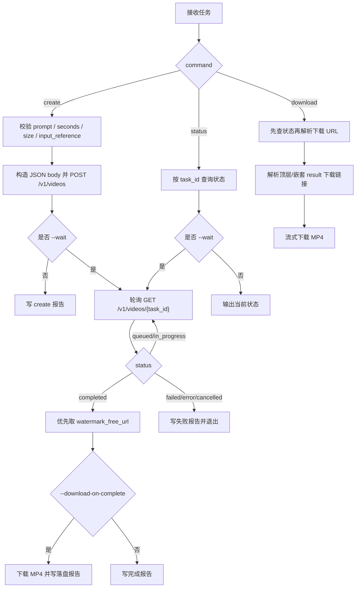
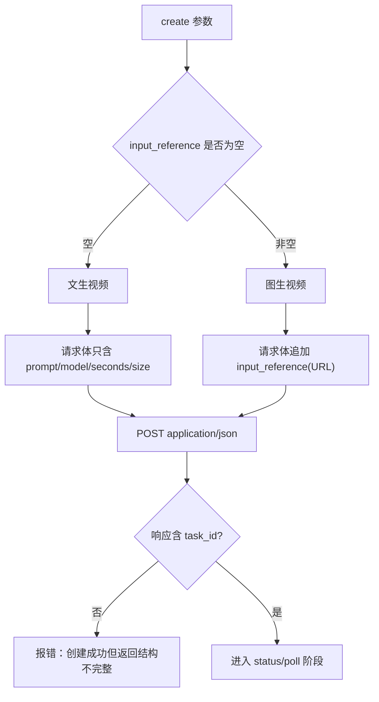

# 漫涂 Sora 2 异步视频技能

## Context Loading Contract

- 每次调用本技能时，必须同时加载同目录 `CONTEXT.md` 作为预加载上下文。
- 若同目录 `CONTEXT.md` 缺失，应先补齐最小知识库骨架，或向用户明确报告阻塞；不得在未检查该上下文的情况下执行技能。
- 冲突优先级：用户显式请求 > 仓库/全局 `AGENTS.md` > 本 `SKILL.md` > 同目录 `CONTEXT.md`。

## 1. 作用范围

- 本技能用于通过漫涂 Sora 2 异步视频接口执行以下动作：
  - `POST /v1/videos`：提交视频生成任务
  - `GET /v1/videos/{task_id}`：查询任务状态
  - 完成后优先读取 `watermark_free_url` 下载最终 MP4
- 默认模型：`sora-2`
- 默认 API 根地址：优先读取根目录 `.env` 的 `MAN_TUI_API_BASE_URL`，回退 `https://api.man-tui.com`
- 默认认证：优先读取根目录 `.env` 的 `MAN_TUI_API_KEY`
- Provider 确认：`sora` 走“默认分组”，`grok` 异步轮询是单独分组，画图也是单独分组
- repo-local 默认策略：不默认注入实验性 group 覆盖；若需要排障，可显式传 `--group*` 参数做兼容性试探
- 统一脚本入口：

```bash
python3 .agents/skills/api/man-tui/video/sora/scripts/sora_video.py [subcommand] [参数]
```

## 2. 必需输入

### 2.1 提交任务

- `prompt`
- API Key（优先读取 `.env` 中的 `MAN_TUI_API_KEY`，也可显式传 `--api-key`）

可选输入：
- `model`，默认 `sora-2`
- `seconds`，允许值：`10 / 15`
- `size`，允许值：`720x1280 / 1280x720`
- `input_reference`：公网可访问参考图 URL，用于图生视频
- `group`，仅在显式排障时使用
- `group_transport`：`off / header / body / both`
- `group_header`：当 `group_transport` 包含 `header` 时生效，默认 `X-Group`
- `project_name`
- `task_kind`：`project / test / temp`
- `output_dir`
- `report_json`
- `wait / poll_interval / wait_timeout`
- `download_on_complete`

### 2.2 查询状态 / 下载结果

- `task_id`
- API Key

## 3. Visual Maps (Mermaid)





## 4. 核心约束（Mandatory）

1. **认证单一事实源**
   - 优先从根目录 `.env` 读取 `MAN_TUI_API_KEY` 与 `MAN_TUI_API_BASE_URL`。
   - 无 API Key 时必须硬退出，不得伪造 dry-run 成功。
2. **提交接口必须使用 `application/json`**
   - `POST /v1/videos` 必须提交 JSON body。
   - 禁止把 Sora 创建任务错误写成 multipart 请求。
3. **默认分组以 provider 后台配置为准**
   - 对方已明确：`sora` 在“默认分组”，不在 `GrokVideo-异步轮询`
   - repo-local 不再默认注入实验性 group 覆盖，避免把“后台默认分组”与“客户端字段”混为一谈
   - 若需要兼容性排障，可临时显式传 `--group default --group-transport header|body|both`
4. **图生视频只接受公网 URL**
   - `input_reference` 只能是公网可访问图片 URL。
   - 若传入本地路径、相对路径或明显不是 URL 的值，必须拒绝执行。
5. **时长 / 画幅必须严格枚举**
   - `seconds` 仅允许：`10 / 15`
   - `size` 仅允许：`720x1280 / 1280x720`
6. **状态轮询必须基于 `task_id`**
   - 创建成功后，唯一可靠追踪键为 `task_id`
   - 不得依赖 prompt 或时间戳猜测任务身份
7. **下载地址优先级固定**
   - 下载时必须按以下优先级解析 URL：
   - 顶层 `watermark_free_url`
   - 顶层 `video_url`
   - `result.watermark_free_url`
   - `result.share_url`
8. **`content_violation=true` 视为不可下载终态**
   - 即使 `status=completed`，只要 `content_violation=true` 或缺少可用下载 URL，都不得伪装为成功下载。
9. **默认输出必须项目化**
   - 默认输出目录：`output/影片/[项目名]/5-API/video/man-tui/sora/`
   - 若 `task_kind=test` 且未显式传 `project_name`，默认项目名为 `测试`
   - 若 `task_kind=temp` 且未显式传 `project_name`，默认项目名为 `临时`
   - 若显式传 `--output-dir`，允许覆盖默认目录
10. **日志与报告禁止泄露密钥或带签名下载 URL**
   - 控制台日志、报告 JSON、异常文本不得写出 Bearer token、`sk-...`、未脱敏签名 URL
   - `watermark_free_url`、`video_url`、`share_url` 若带 query，报告中必须脱敏
11. **失败优先修源层**
    - 若出现 JSON 构造错误、轮询失稳、下载 URL 解析失败、内容违规判定遗漏、输出路径漂移、密钥泄露等问题，优先修复：
      - `scripts/sora_video.py`
      - 本 `SKILL.md`
    - 禁止只在单次调用时手工绕过而不修技能源层。

## 5. 统一字段主表（Mandatory）

| field_id | 输出位置/字段 | 内容要求 | 证据来源 | 默认责任Step | 质量维度 | 失败码 |
| --- | --- | --- | --- | --- | --- | --- |
| `FIELD-MTS-01` | 输入解析结果：`prompt / input_reference / task_id / command` | 创建任务必须有 `prompt`；图生视频 URL 合法；状态与下载必须有 `task_id` | 用户输入、CLI 参数、`.env` | Step 1 | 输入收束完整度 | `FAIL-MTS-INPUT` |
| `FIELD-MTS-02` | 参数解析结果：`model / seconds / size / output_dir / wait_policy / group_route` | 参数只允许落在已发布枚举中；输出路径和轮询策略明确；若启用 group 排障则要显式可见 | 用户输入、默认值、项目化路径规则 | Step 2 | 参数合规性 | `FAIL-MTS-PARAMS` |
| `FIELD-MTS-03` | 创建请求：`headers / json body / group route` | 创建任务必须是合法 JSON 请求；`input_reference` 仅在图生视频模式出现；group 排障注入只能作为兼容性试探，不得默认假定生效 | OpenAPI、脚本构造结果 | Step 3 | 请求体合法性 | `FAIL-MTS-CREATE` |
| `FIELD-MTS-04` | 状态与等待结果：`task_id / status / progress / content_violation / error` | 状态轮询必须稳定；等待结束必须给出终态或超时结论 | 状态接口响应、轮询日志 | Step 4 | 执行稳定性 | `FAIL-MTS-STATUS` |
| `FIELD-MTS-05` | 输出产物：`report json / downloaded mp4 / final_url` | 报告可追溯；视频可落盘；去水印 URL 优先级和异常原因可复盘 | 状态接口响应、落盘文件、报告 JSON | Step 5 | 输出可追溯性 | `FAIL-MTS-OUTPUT` |

## 6. 思维导引与执行流程（Mandatory）

### 6.1 固定步骤

1. **Step 1 / 输入收束**
   - 判断当前是 `create / status / download`
   - 收束 `prompt / input_reference / task_id / output_dir / project_name / task_kind`
2. **Step 2 / 参数校验**
   - 校验 `seconds / size`
   - 校验 `input_reference` 是否是公网 URL
   - 若启用排障模式，再校验 `group / group_transport / group_header`
   - 解析默认输出路径与等待策略
3. **Step 3 / 请求构造**
   - `create`：构造 JSON body
   - `status`：构造带认证的 GET
   - `download`：先查状态，再解析下载链接并执行 GET
4. **Step 4 / 调用与轮询**
   - 创建成功后读取 `task_id`
   - 若启用 `--wait`，按 `poll_interval` 轮询直到终态或超时
   - 终态至少区分：`completed / failed / timeout / content_violation / other terminal`
5. **Step 5 / 落盘与报告**
   - 创建/查询写任务报告 JSON
   - 下载时保存 MP4
   - 报告中记录 `request_summary / response / saved_file / final_url / error`

### 6.2 思维导引表

| step_id | 聚焦字段(field_id) | 核心问题 | 生成动作 | 未达标信号 |
| --- | --- | --- | --- | --- |
| `Step 1` | `FIELD-MTS-01` | 当前是创建、查询还是下载？输入最小闭环是否齐全？ | 收束命令类型与关键字段 | 缺 prompt、缺 task_id、图生视频 URL 非法 |
| `Step 2` | `FIELD-MTS-02` | 参数是否落在接口枚举内？输出路径是否可落盘？若启用 group 排障，配置是否可见？ | 校验枚举与输出根 | seconds/size 非法，路径漂移，group 排障配置漂移 |
| `Step 3` | `FIELD-MTS-03` | 创建请求是否真的是 JSON？`input_reference` 是否只在 URL 模式出现？若排障注入 group，是否按预期带出？ | 组装 headers/json | 错把请求做成 multipart，或 input_reference 不是 URL，或 group 排障注入丢失 |
| `Step 4` | `FIELD-MTS-04` | 是否拿到了稳定 `task_id`？等待过程是否能明确结束？ | 发起请求、轮询状态 | 轮询无法结束、状态不透明、完成但违规 |
| `Step 5` | `FIELD-MTS-05` | 结果能否下载并复盘？ | 保存 MP4、写报告 | 视频未保存、报告缺字段、下载 URL 丢失 |

## 7. 标准调用

### 7.1 提交文生视频任务

```bash
python3 .agents/skills/api/man-tui/video/sora/scripts/sora_video.py create \
  --prompt "一只橙色猫咪在樱花树下打盹，花瓣飘落，电影级光影" \
  --seconds 10 \
  --size 1280x720
```

### 7.2 提交图生视频任务

```bash
python3 .agents/skills/api/man-tui/video/sora/scripts/sora_video.py create \
  --prompt "花瓣随风飘落，猫咪缓缓睁开眼睛，镜头轻微推进" \
  --seconds 10 \
  --size 720x1280 \
  --input-reference "https://example.com/reference.png"
```

### 7.3 创建后等待并自动下载

```bash
python3 .agents/skills/api/man-tui/video/sora/scripts/sora_video.py create \
  --prompt "赛博都市夜景中的角色回头，霓虹倒影，电影感镜头运动。" \
  --seconds 10 \
  --size 1280x720 \
  --wait \
  --download-on-complete
```

### 7.4 查询状态

```bash
python3 .agents/skills/api/man-tui/video/sora/scripts/sora_video.py status \
  task_xxx \
  --wait
```

### 7.5 下载视频

```bash
python3 .agents/skills/api/man-tui/video/sora/scripts/sora_video.py download \
  task_xxx \
  --output output/影片/测试/5-API/video/man-tui/sora/task_xxx.mp4
```

### 7.6 仅用于排障的 group 覆盖试探

```bash
python3 .agents/skills/api/man-tui/video/sora/scripts/sora_video.py create \
  --prompt "test prompt" \
  --group default \
  --group-transport both \
  --dry-run --print-request
```

## 8. 输出约定

- 默认输出目录：`output/影片/[项目名]/5-API/video/man-tui/sora/`
- 默认项目名映射：
  - `task_kind=project`：必须显式给 `project_name`，否则回退 `未命名项目`
  - `task_kind=test`：默认 `测试`
  - `task_kind=temp`：默认 `临时`
- 默认产物：
  - `man_tui_sora_create_report_YYYYmmdd_HHMMSS.json`
  - `man_tui_sora_status_report_YYYYmmdd_HHMMSS.json`
  - `task_<task_id>.mp4`
- 报告文件必须至少包含：
  - `ok`
  - `command`
  - `request_summary`
  - `response`
  - `saved_file`
  - `final_url`
  - `error`

## 9. 参考资料

- 接口摘要：`.agents/skills/api/man-tui/video/sora/references/api.md`
- 环境变量源：根目录 `.env`
- 分组路由覆盖：
  - `MAN_TUI_API_GROUP`
  - `MAN_TUI_API_GROUP_TRANSPORT`
  - `MAN_TUI_API_GROUP_HEADER`
  - 默认不启用；仅在兼容性排障时使用

## 10. Root-Cause 执行契约（Mandatory）

当调用失败、轮询异常或视频无法下载时，按以下链路上溯：

`Symptom/Failure`
-> `Direct Cause`：API Key 缺失、JSON body 构造错误、`input_reference` 不是公网 URL、状态轮询超时、`content_violation=true`、下载 URL 缺失、输出路径漂移
-> `规则源`：`.agents/skills/api/man-tui/video/sora/SKILL.md` 与 `scripts/sora_video.py`
-> `规则源的规则源`：仓库根 `AGENTS.md` 中的 Root-Cause First / Context Loading / Registry Governance 契约
-> `Fix Landing Points`：优先修脚本请求构造、轮询逻辑、URL 优先级解析、下载逻辑、报告脱敏与技能说明，再修局部调用样例

用户侧关闭语必须至少包含：
- 根因位置
- 立即修复
- 系统性预防修复

## 11. 失败排查

1. 检查根目录 `.env` 是否存在：
   - `MAN_TUI_API_KEY`
   - `MAN_TUI_API_BASE_URL`
2. 使用 dry-run 验证创建参数：

```bash
python3 .agents/skills/api/man-tui/video/sora/scripts/sora_video.py create \
  --prompt "test" \
  --dry-run --print-request
```

3. 若创建报 4xx：
   - 先检查是否误用了 multipart
   - 再检查 `seconds / size` 是否落在发布枚举中
   - 若启用了 group 排障，再检查请求摘要中是否真的带了预期 group
4. 若图生视频报错：
   - 检查 `--input-reference` 是否是公网 URL，而不是本地路径
5. 若等待一直无结果：
   - 先单独执行 `status task_xxx`
   - 再检查 `wait_timeout` 是否过短
6. 若下载失败：
   - 检查状态是否已 `completed`
   - 检查 `content_violation` 是否为 `true`
   - 检查返回中是否存在 `watermark_free_url / video_url / result.share_url`
7. 若创建直接返回 `model_not_found` 且错误中出现 `under group ...`：
   - 先按 provider 回答判断：当前 key 的后台默认分组大概率选错了
   - 再检查是否需要请 provider 直接切换该 key 的默认分组
   - 客户端 group 注入只作为辅助排障，不再当成主修复路径
8. 若 `x-api-key` 调用失败：
   - 当前环境优先使用 `Authorization`
   - 不要把 `401 Invalid token` 误判成 `.env` 缺失
9. 若报告中出现密钥或完整签名 URL：
   - 必须回到脚本脱敏层修复，不得接受“只是测试日志”
