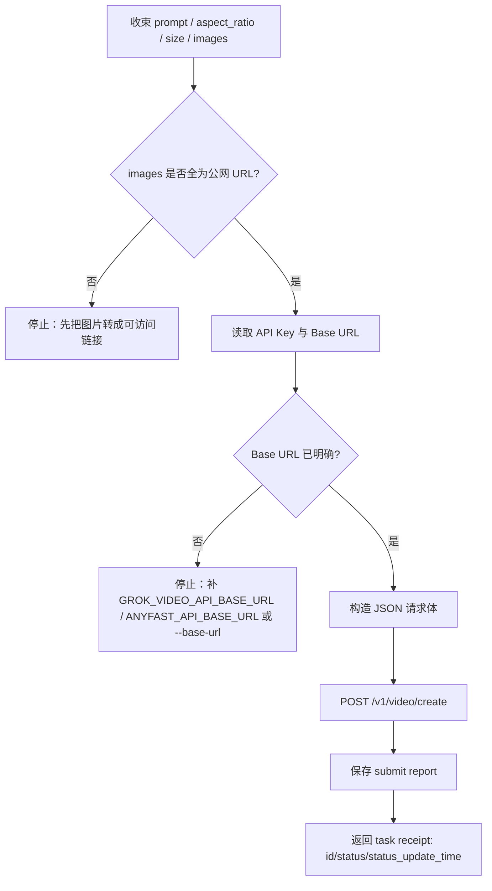
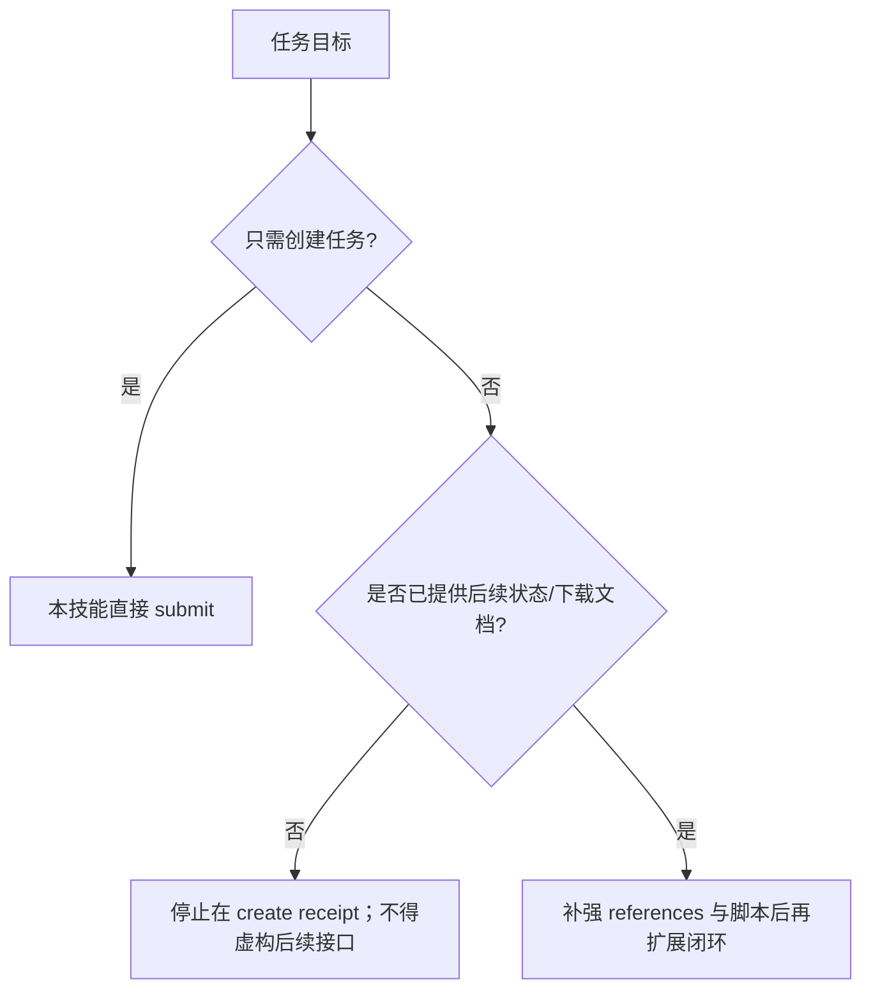

# Grok Video 3 生视频技能

## Context Loading Contract

- 每次调用本技能时，必须同时加载同目录 `CONTEXT.md` 作为预加载上下文。
- 若同目录 `CONTEXT.md` 缺失，应先补齐最小知识库骨架，或向用户明确报告阻塞；不得在未检查该上下文的情况下执行技能。
- 冲突优先级：用户显式请求 > 仓库/全局 `AGENTS.md` > 本 `SKILL.md` > 同目录 `CONTEXT.md`。

## 1. 作用范围

- 本技能用于通过 FineAPI 的 Grok Video 3 创建接口提交异步视频任务。
- 当前已确认真源：
  - 文档页：`https://docs.fineapi.cloud/403045611e0`
  - 创建接口：`POST /v1/video/create`
  - 已确认字段：`model / prompt / aspect_ratio / size / images`
  - 已确认返回：`id / status / status_update_time`
- 当前公开可确认材料仅稳定覆盖“创建任务”这一步；查询状态与结果下载的具体端点在本轮可见材料中尚未锁定，因此本技能不得擅自虚构后续端点。
- 默认执行脚本：

```bash
python3 .agents/skills/api/video/grok/scripts/grok_video_generate.py submit ...
```

## 2. 已确认接口契约

### 2.1 请求头

- `Accept: application/json`
- `Content-Type: application/json`
- `Authorization: Bearer <token>`

### 2.2 Body 字段

| 字段 | 类型 | 必填 | 当前规则 |
| --- | --- | --- | --- |
| `model` | string | 是 | 默认使用当前环境最高已验证可用模型 `grok-video-3`；`2026-04-17` 实测 `grok-video-3-max` 返回 `model_not_found` |
| `prompt` | string | 是 | 保留原样提交，可包含 `--mode=custom` 等后缀 |
| `aspect_ratio` | string | 是 | `2:3 / 3:2 / 1:1` |
| `size` | string | 是 | 文档截图显示 `720P` 或 `1080P`，但注明“暂只支持 720P” |
| `images` | array[string] | 是 | 图片链接数组；当前按“公网可访问 URL”处理，不接受本地文件直传 |

### 2.3 响应字段

| 字段 | 说明 |
| --- | --- |
| `id` | 视频任务 ID |
| `status` | 初始状态，示例为 `pending` |
| `status_update_time` | 最近状态更新时间戳 |

## 3. 核心约束（Mandatory）

1. **当前只锁定创建接口**
   - 已证实的是 `POST /v1/video/create`。
   - 在未获得后续文档前，不得编造状态查询或下载端点。
2. **JSON 提交刚性**
   - 当前接口使用 `application/json`。
   - 不得把它误改成 multipart/form-data。
3. **图片输入是链接数组**
   - `images` 当前按“图片链接数组”处理。
   - 本地路径、二进制文件、base64 文本都不得静默塞进该字段。
4. **`720P` 优先**
   - 截图显示 `720P / 1080P`，但同时注明“暂只支持 720P”。
   - 默认值必须是 `720P`；若显式使用 `1080P`，要保留风险提示，而不是假装完全受支持。
5. **Base URL 必须走统一 AnyFast/FineAPI 回退链**
   - `grok` 与同目录其他视频 provider 一样，优先继承仓库统一的 AnyFast 网关基线。
   - 调用时优先读取 `ANYFAST_API_BASE_URL`，再回退 `GROK_VIDEO_API_BASE_URL / FINEAPI_GROK_API_BASE_URL / FINEAPI_API_BASE_URL`，必要时才由 `--base-url` 覆盖。
6. **项目化输出路径**
   - 默认输出目录必须为 `output/影片/[项目名]/5-API/video/grok/`。
   - 若未显式传 `project-name`，默认项目名使用 `测试`。
7. **失败优先修源层**
   - 若出现鉴权错误、Base URL 漂移、图片输入类型错误、`1080P` 不可用或字段命名不匹配，优先修：
     - `scripts/grok_video_generate.py`
     - 本 `SKILL.md`
     - `references/api.md`
8. **最高版本以真实可用性为准**
   - 默认模型不是按第三方站点或命名猜测升级，而是按“当前 provider 实测可用的最高版本”确定。
   - 截至 `2026-04-17`，当前环境真实提交 `grok-video-3-max` 返回 `model_not_found`，因此默认仍保持 `grok-video-3`。

## 4. Visual Maps (Mermaid)

### 4.1 主流程



### 4.2 分支与边界



## 5. 统一字段主表（Mandatory）

| field_id | 输出位置/字段 | 内容要求 | 证据来源 | 默认责任 Step | 质量维度 | 失败码 |
| --- | --- | --- | --- | --- | --- | --- |
| `FIELD-GROK-01` | 输入解析结果：`prompt / images / project_name` | `prompt` 非空；`images` 至少 1 条且均为公网 URL | 用户输入、CLI 参数、截图“图片链接” | Step 1 | 输入收束完整度 | `FAIL-GROK-INPUT` |
| `FIELD-GROK-02` | 参数裁决结果：`model / aspect_ratio / size / base_url` | 枚举值合法；默认模型为当前环境最高已验证可用版本；`720P` 作为默认；Base URL 已明确 | 用户样例、截图、实测回执、脚本默认值 | Step 2 | 参数与环境一致性 | `FAIL-GROK-PARAMS` |
| `FIELD-GROK-03` | 创建请求：`POST /v1/video/create` JSON 请求体 | 头与 Body 字段名准确；`images` 为数组 | 文档页、用户样例、截图 | Step 3 | 请求体合法性 | `FAIL-GROK-CREATE` |
| `FIELD-GROK-04` | 创建回执：`id / status / status_update_time` | 报告完整保留任务回执，不把其误判为成片结果 | 用户样例、API 响应 | Step 4 | 回执闭环完整性 | `FAIL-GROK-RECEIPT` |

## 6. 思维导引与执行流程（Mandatory）

### 6.1 固定步骤

1. **Step 1 / 输入收束**
   - 读取 `prompt`、`images`、`project_name`
   - 校验 `images` 至少一条，且全为 `http/https` 公网 URL
2. **Step 2 / 参数与环境裁决**
   - 优先使用当前环境最高已验证可用模型；截至 `2026-04-17` 为 `grok-video-3`
   - 校验 `aspect_ratio` 枚举
   - 校验 `size` 枚举；若为 `1080P`，保留“文档写有该值但截图注明暂只支持 720P”的风险提示
   - 读取 `ANYFAST_VIDEO_API_KEY / GROK_VIDEO_API_KEY / ANYFAST_API_KEY / FINEAPI_GROK_API_KEY / FINEAPI_API_KEY`
   - 读取 `ANYFAST_API_BASE_URL / GROK_VIDEO_API_BASE_URL / FINEAPI_GROK_API_BASE_URL / FINEAPI_API_BASE_URL`
3. **Step 3 / 创建任务**
   - 组装 JSON：`model / prompt / aspect_ratio / size / images`
   - 提交到 `/v1/video/create`
4. **Step 4 / 回执落盘**
   - 保存任务回执 JSON
   - 输出 `id / status / status_update_time`
   - 明确声明“当前闭环停在 create receipt，不含状态轮询与下载”

### 6.2 思维导引表

| step_id | 聚焦字段(field_id) | 核心问题 | 生成动作 | 未达标信号 |
| --- | --- | --- | --- | --- |
| `Step 1` | `FIELD-GROK-01` | prompt 与 images 是否收束完整？ | 校验 prompt 与公网图片链接数组 | prompt 为空、images 为空、本地路径混入 |
| `Step 2` | `FIELD-GROK-02` | API Key、Base URL、最高已验证模型与枚举参数是否明确？ | 裁决环境变量和参数风险提示 | Base URL 缺失、模型按猜测漂移、枚举越界、1080P 风险被吞掉 |
| `Step 3` | `FIELD-GROK-03` | 是否严格按 JSON 接口提交？ | 构造并发送 JSON 请求 | 错用 multipart、字段拼错、images 非数组 |
| `Step 4` | `FIELD-GROK-04` | 是否把创建回执完整落盘并正确解释？ | 保存 submit report，回传 task receipt | 把 `pending` 回执误说成已出视频 |

## 7. 标准调用

### 7.1 直接提交

```bash
python3 .agents/skills/api/video/grok/scripts/grok_video_generate.py submit \
  --base-url "https://<your-fineapi-host>" \
  --prompt "小猫在吃鱼 --mode=custom" \
  --aspect-ratio 3:2 \
  --size 720P \
  --image "https://ark-project.tos-cn-beijing.volces.com/doc_image/seedream4_5_imageToimage.png" \
  --project-name "测试"
```

### 7.2 Dry Run 检查请求体

```bash
python3 .agents/skills/api/video/grok/scripts/grok_video_generate.py submit \
  --base-url "https://<your-fineapi-host>" \
  --prompt "测试请求 --mode=custom" \
  --aspect-ratio 1:1 \
  --size 720P \
  --image "https://example.com/reference.png" \
  --dry-run \
  --print-payload
```

- `--dry-run` 只校验请求结构与落盘报告，可不提供 API Key。
- 若环境中已配置 API Key，报告会显示脱敏后的 `Authorization`；未配置时，dry-run 不再因缺少密钥而阻断。

### 7.3 多图链接输入

```bash
python3 .agents/skills/api/video/grok/scripts/grok_video_generate.py submit \
  --base-url "https://<your-fineapi-host>" \
  --prompt "两张参照图融合成一段产品演示视频 --mode=custom" \
  --image "https://example.com/ref-a.png" \
  --image "https://example.com/ref-b.png"
```

## 8. 参数约定

| CLI 参数 | 创建字段 | 默认值 | 说明 |
| --- | --- | --- | --- |
| `--model` | `model` | `grok-video-3` | 当前环境最高已验证可用默认值；`grok-video-3-max` 在 `2026-04-17` 实测返回 `model_not_found` |
| `--prompt` | `prompt` | 必填 | 视频提示词 |
| `--aspect-ratio` | `aspect_ratio` | `3:2` | `2:3 / 3:2 / 1:1` |
| `--size` | `size` | `720P` | 支持传 `720P / 1080P`，但当前默认只信任 `720P` |
| `--image` | `images[]` | 至少一条 | 公网图片链接，可重复传参 |
| `--base-url` | API Base URL | `.env` 回退链 | 优先 `ANYFAST_API_BASE_URL`，回退 `GROK_VIDEO_API_BASE_URL / FINEAPI_GROK_API_BASE_URL / FINEAPI_API_BASE_URL` |
| `--api-key` | 鉴权 Token | `.env` 回退链 | 支持原始 token 或 `Bearer ...` |

完整字段说明见：`references/api.md`

## 9. 输出约定

- 默认输出目录：`output/影片/[项目名]/5-API/video/grok/`
- 默认产物：
  - `grok_submit_report_YYYYmmdd_HHMMSS.json`
- 报告至少包含：
  - `ok`
  - `command`
  - `request_summary`
  - `normalized_submit`
  - `raw_response`
  - `diagnostic_hint`
  - `error`

## 10. Root-Cause 执行契约（Mandatory）

当创建失败、Base URL 未配置、图片不是公网 URL、`1080P` 报不支持，或调用方误以为任务已产出视频时，按以下链路上溯：

`Symptom/Failure`
-> `Direct Cause`：API Key 缺失、Base URL 未配置、`images` 不是 URL 数组、JSON 字段错名、`1080P` 当前未开、把 `pending` 回执误读为成片
-> `规则源`：`.agents/skills/api/video/grok/SKILL.md`、`references/api.md`、`scripts/grok_video_generate.py`
-> `规则源的规则源`：仓库根 `AGENTS.md` 中的 Root-Cause First / Context Loading / Canonical Source / Composite Output 治理契约
-> `Fix Landing Points`：优先修正脚本的环境变量回退、Base URL 诊断、图片输入校验与回执解释，再修调用样例

用户侧关闭语必须至少包含：
- 根因位置
- 立即修复
- 系统性预防修复

## 11. 失败排查

1. 检查 `.env` 是否存在 `ANYFAST_VIDEO_API_KEY / GROK_VIDEO_API_KEY / FINEAPI_GROK_API_KEY`
2. 检查 `.env` 或命令行是否已提供 `ANYFAST_API_BASE_URL / GROK_VIDEO_API_BASE_URL / --base-url`
3. 使用 `submit --dry-run --print-payload` 确认 JSON 请求体；这一步不要求必须先拿到 API Key
4. 若 `images` 中混入本地路径，先把图片上传到可访问 URL，再重提
5. 若 `size=1080P` 报错，优先回退 `720P`
6. 若返回只有 `id/status/status_update_time`，说明只是创建成功，不是下载完成
