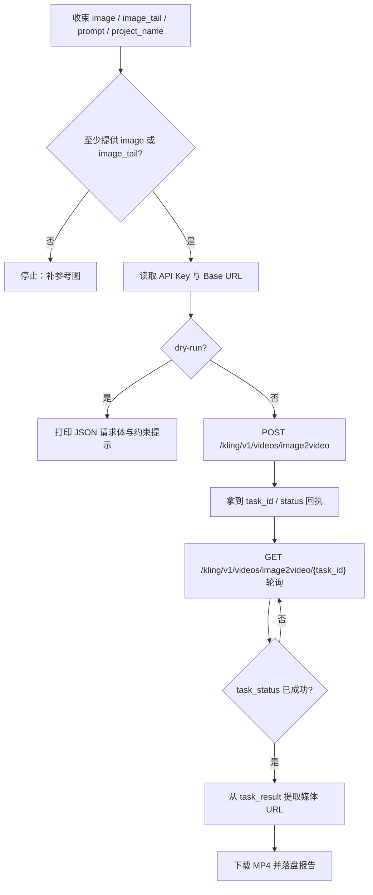
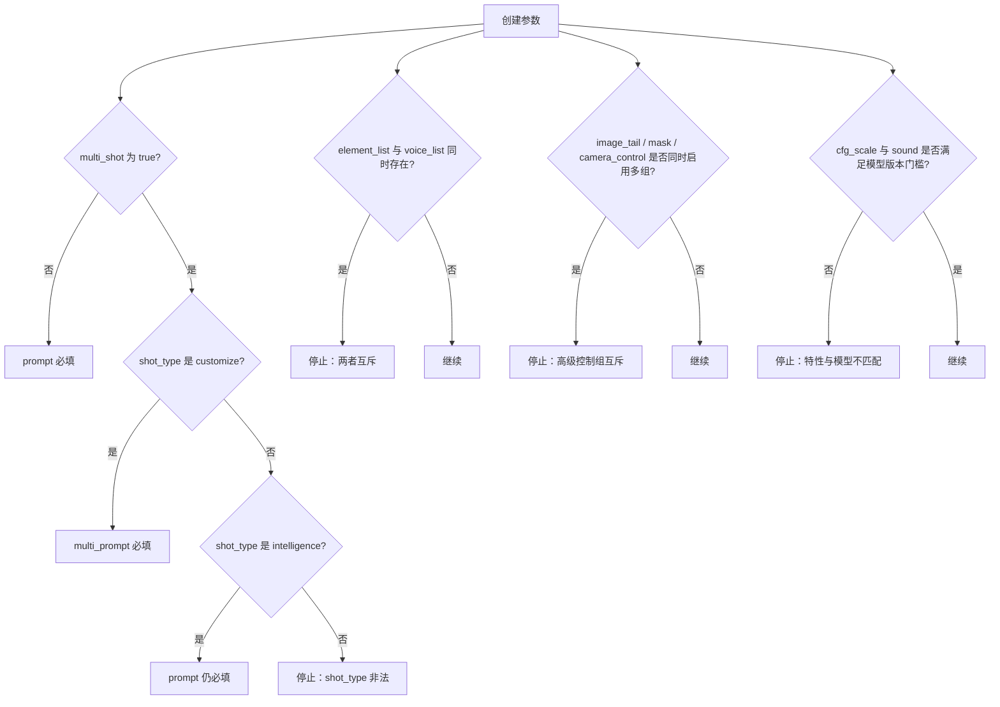

# FineAPI Kling 图生视频技能

## Context Loading Contract

- 每次调用本技能时，必须同时加载同目录 `CONTEXT.md` 作为预加载上下文。
- 若同目录 `CONTEXT.md` 缺失，应先补齐最小知识库骨架，或向用户明确报告阻塞；不得在未检查该上下文的情况下执行技能。
- 冲突优先级：用户显式请求 > 仓库/全局 `AGENTS.md` > 本 `SKILL.md` > 同目录 `CONTEXT.md`。

## 1. 作用范围

- 本技能用于通过 FineAPI 的 Kling 接口执行 **图生视频** 任务。
- 2026-04-17 实测可稳定抓取到的 Kling 真源页面：
  - 创建页（新版，含 `kling-v3`）：`https://docs.fineapi.cloud/422568253e0`
  - 创建页（旧版，补充基础约束）：`https://docs.fineapi.cloud/403045624e0`
  - 查询页：`https://docs.fineapi.cloud/403045626e0`
- 用户给出的 `https://docs.fineapi.cloud/403045611e0` 在 2026-04-17 实际对应 Veo 的 OpenAI 风格视频页，不是 Kling；后续维护不得再把该页当成 Kling 真源。
- 默认脚本入口：

```bash
python3 .agents/skills/api/video/kling/scripts/kling_video_generate.py ...
```

- 默认模型治理统一回指父级 `../runbooks/default-model-policy.md` 的 `highest-available-general` 规则族。
  - 脚本共享骨架使用 `../shared/default_model_policy.py`
  - Kling 的 provider 特有差异是：从 `ALLOWED_MODELS` 中按版本与 `master/turbo` 档位排序；截至 2026-04-17 当前解析结果为 `kling-v3`
- 覆盖动作：
  - `submit/create`：创建图生视频任务
  - `status`：查询 `image2video` 任务状态
  - `download`：通过查询结果中的资产 URL 下载最终视频
  - `run`：创建 -> 轮询 -> 下载

## 2. 必需输入

- 至少一个参考图：
  - `image`
  - 或 `image_tail`
- API Key
  - 优先读取根目录 `.env` 中的 `ANYFAST_VIDEO_API_KEY`
  - 回退 `KLING_API_KEY`
  - 回退 `FINEAPI_KLING_API_KEY`
  - 回退 `ANYFAST_API_KEY`
  - 再回退 `FINEAPI_API_KEY`
  - 也可显式传 `--api-key`
- Base URL
  - 优先读取 `.env` 中的 `ANYFAST_API_BASE_URL`
  - 回退 `KLING_API_BASE_URL`
  - 回退 `FINEAPI_KLING_API_BASE_URL`
  - 再回退 `FINEAPI_API_BASE_URL`
  - 也可显式传 `--base-url`

常用可选输入：

- `prompt`
- `negative_prompt`
- `model`：默认自动选择最高版本，当前为 `kling-v3`
- `mode`：`std / pro`
- `duration`：`3-15`
- `cfg_scale`
- `sound`：`on / off`
- `project-name`
- `output-dir`
- `poll-interval`
- `max-wait-seconds`
- `filename-prefix`
- `report-json`
- `timeout`
- `dry-run`

高级可选输入：

- `multi_shot`
- `shot_type`
- `multi_prompt`
- `static_mask`
- `dynamic_masks`
- `camera_control`
- `element_list`
- `voice_list`
- `watermark_info.enabled`
- `callback_url`
- `external_task_id`

## 3. 核心约束（Mandatory）

1. **页面漂移显式承认**
   - 2026-04-17 抓到的 Kling 真源不是用户给的 `403045611e0`，而是 `422568253e0 / 403045624e0 / 403045626e0`。
   - 任何后续修复都必须回到这三页和本技能的 `references/api.md`，不得继续引用错页。
2. **JSON 提交刚性**
   - 创建端点是 `POST /kling/v1/videos/image2video`
   - `Content-Type` 固定 `application/json`
   - 不得误改为 multipart/form-data
3. **参考图至少二选一**
   - `image` 与 `image_tail` 至少要有一个
   - 不得允许两者同时为空
4. **高级控制组互斥**
   - `image_tail`
   - `static_mask / dynamic_masks`
   - `camera_control`
   - 三组最多启用一组；`static_mask` 与 `dynamic_masks` 也不得同时传入
5. **模型版本特性门槛**
   - `cfg_scale` 仅允许 `kling-v1.x`
   - `sound=on` 仅允许 `kling-v2-6` 及后续版本；当前本技能按 `>= kling-v2-6` 自动推导支持集合，截至 2026-04-17 可见 `kling-v2-6 / kling-v3`
6. **本技能默认只治理 `videos/image2video`**
   - 查询端点模板是 `GET /kling/v1/{action}/{action2}/{task_id}`
   - 本技能固定在 `action=videos`、`action2=image2video`
   - 不得擅自把本技能扩写成 text2video、lip-sync 或其他 Kling 子能力
7. **默认模型覆写统一回指父级真源**
   - 新版创建页写的默认值仍是 `kling-v1`
   - 本地默认模型如何前移，不再在本文件重复展开算法；统一遵循父级 `../runbooks/default-model-policy.md`
   - Kling 当前使用其中的 `highest-available-general` 规则族，脚本经 `../shared/default_model_policy.py` 解析后当前结果为 `kling-v3`
   - 技能、脚本、样例、报告只允许引用当前解析结果，不再各自维护一份“最高版本选择逻辑”
8. **高级字段只做“受控透传”**
   - 对 `multi_prompt / dynamic_masks / camera_control / element_list / voice_list` 这类复杂结构，优先通过 JSON 文件或 JSON 字符串透传
   - 不要在 `SKILL.md` 或脚本中发明额外子 schema
9. **结果下载来自查询页 URL**
   - Kling 当前可确认的是查询页会回 `task_result`
   - 下载动作应通过查询结果中可提取的媒体 URL 完成，而不是虚构新的 `/content` 端点
10. **失败优先修源层**
   - 若出现页面 ID 漂移、字段命名不匹配、状态机判断错误、媒体 URL 提取失败、或 Base64/URL 输入处理错误，优先修：
     - `scripts/kling_video_generate.py`
     - `references/api.md`
     - 本 `SKILL.md`

## 4. Visual Maps (Mermaid)

### 4.1 主流程



### 4.2 分支与约束



## 5. 统一字段主表（Mandatory）

| field_id | 输出位置/字段 | 内容要求 | 证据来源 | 默认责任Step | 质量维度 | 失败码 |
| --- | --- | --- | --- | --- | --- | --- |
| `FIELD-KLING-01` | 输入解析结果：`image / image_tail / prompt / project_name` | 至少有一张参考图；单镜头模式下 prompt 合法 | 用户输入、CLI 参数、创建页 | Step 1 | 输入收束完整度 | `FAIL-KLING-INPUT` |
| `FIELD-KLING-02` | 参数裁决结果：`model / mode / duration / sound / multi_shot` | 默认模型自动落到当前最高版本（当前 `kling-v3`）；枚举合法；互斥/依赖关系明确 | 用户要求、新旧创建页、脚本默认值 | Step 2 | 参数与契约一致性 | `FAIL-KLING-PARAMS` |
| `FIELD-KLING-03` | 创建请求：`POST /kling/v1/videos/image2video` JSON 请求体 | 头与字段名准确；媒体值已归一为 URL 或不带前缀的 Base64 | FineAPI 创建页、脚本构造结果 | Step 3 | 请求体合法性 | `FAIL-KLING-CREATE` |
| `FIELD-KLING-04` | 查询状态：`GET /kling/v1/videos/image2video/{task_id}` | `code/message/data.task_status/task_result` 被稳定提取；保留原始响应 | FineAPI 查询页、API 响应 | Step 4 | 异步状态机稳定性 | `FAIL-KLING-STATUS` |
| `FIELD-KLING-05` | 下载结果：查询页中的媒体 URL + 本地 MP4 | 成功提取资产 URL；可选下载到项目化目录；报告含 task 回执与落盘路径 | FineAPI 查询页、下载响应 | Step 5 | 输出闭环完整性 | `FAIL-KLING-DOWNLOAD` |

## 6. 思维导引与执行流程（Mandatory）

### 6.1 固定步骤

1. **Step 1 / 输入收束**
   - 读取 `image`、`image_tail`、`prompt`、`project_name`
   - 本地文件统一转为 **不带 `data:` 前缀** 的 Base64
   - 远程 URL 保留原样
2. **Step 2 / 参数与环境裁决**
   - 读取 `ANYFAST_VIDEO_API_KEY / KLING_API_KEY / FINEAPI_KLING_API_KEY / ANYFAST_API_KEY / FINEAPI_API_KEY`
   - 读取 `ANYFAST_API_BASE_URL / KLING_API_BASE_URL / FINEAPI_KLING_API_BASE_URL / FINEAPI_API_BASE_URL`
   - 默认模型按本任务要求自动选择允许列表中的最高版本，当前为 `kling-v3`
   - 校验 `mode / duration / sound / cfg_scale / multi_shot / shot_type`
   - 校验 `image_tail`、`static_mask/dynamic_masks`、`camera_control` 的互斥关系
3. **Step 3 / 创建任务**
   - 组装 JSON 到 `/kling/v1/videos/image2video`
   - 仅在用户显式传值时附加高级字段
4. **Step 4 / 轮询状态**
   - 调用 `/kling/v1/videos/image2video/{task_id}`
   - 识别 `submitted / processing / succeed / failed` 等状态
   - 保留 `raw_response`，避免字段漂移时只剩半结构化结果
5. **Step 5 / 下载与落盘**
   - 从 `task_result` 提取媒体 URL
   - 下载 MP4 到 `output/影片/[项目名]/5-API/video/kling/`
   - 若查询返回的仍是图片 URL 或结构漂移，保留报告并显式报错

### 6.2 思维导引表

| step_id | 聚焦字段(field_id) | 核心问题 | 生成动作 | 未达标信号 |
| --- | --- | --- | --- | --- |
| `Step 1` | `FIELD-KLING-01` | 参考图是否已收束，prompt 是否满足当前模式约束？ | 统一媒体输入并校验必填关系 | image/image_tail 同时为空；单镜头无 prompt |
| `Step 2` | `FIELD-KLING-02` | 默认模型是否已自动落到当前最高版本（当前 `kling-v3`），以及 mode、duration、互斥关系和模型版本门槛是否都已明确？ | 裁决环境变量、默认值和高级字段依赖 | 仍沿用 `kling-v1`；默认值未随最高版本前移；multi_shot 约束缺失；`cfg_scale/sound` 与模型不匹配 |
| `Step 3` | `FIELD-KLING-03` | 是否严格按 JSON 字段提交？ | 构造创建请求并保留 request summary | 把本地图当路径原样传；字段名写错 |
| `Step 4` | `FIELD-KLING-04` | 查询结果是否能稳定识别 `task_status` 与 `task_result`？ | 轮询并最小规范化状态 | 只读 HTTP 200，不看 `code`；状态机卡住 |
| `Step 5` | `FIELD-KLING-05` | 是否拿到可下载的视频 URL 并完成落盘？ | 提取 URL、下载文件、写 run report | 只拿到 task_id 未下载；媒体 URL 路径提取失败 |

## 7. 标准调用

### 7.1 一步跑完：提交 + 轮询 + 下载

```bash
python3 .agents/skills/api/video/kling/scripts/kling_video_generate.py run \
  --prompt "宇航员站起身走了" \
  --image "https://example.com/image.jpg" \
  --model kling-v3 \
  --mode pro \
  --duration 5 \
  --project-name "测试"
```

### 7.2 本地首帧图：自动转 Base64

```bash
python3 .agents/skills/api/video/kling/scripts/kling_video_generate.py submit \
  --prompt "角色缓慢抬头，镜头微微推近" \
  --image "/absolute/path/to/reference.png" \
  --model kling-v3 \
  --mode std \
  --duration 5
```

### 7.3 使用尾帧控制

```bash
python3 .agents/skills/api/video/kling/scripts/kling_video_generate.py submit \
  --prompt "镜头从起始画面过渡到尾帧姿态，动作自然连贯" \
  --image "/absolute/path/to/start.png" \
  --image-tail "/absolute/path/to/end.png" \
  --duration 5 \
  --mode pro
```

### 7.4 多镜头：customize

```bash
python3 .agents/skills/api/video/kling/scripts/kling_video_generate.py submit \
  --image "/absolute/path/to/reference.png" \
  --multi-shot \
  --shot-type customize \
  --multi-prompt-json "/absolute/path/to/multi_prompt.json"
```

### 7.5 只查状态

```bash
python3 .agents/skills/api/video/kling/scripts/kling_video_generate.py status \
  --task-id "CjgHYGhmPtsAAAAAAE9m7g"
```

### 7.6 只下载

```bash
python3 .agents/skills/api/video/kling/scripts/kling_video_generate.py download \
  --task-id "CjgHYGhmPtsAAAAAAE9m7g" \
  --project-name "测试"
```

### 7.7 Dry Run 检查请求体

```bash
python3 .agents/skills/api/video/kling/scripts/kling_video_generate.py submit \
  --prompt "测试请求" \
  --image "/absolute/path/to/reference.png" \
  --model kling-v3 \
  --dry-run \
  --print-payload
```

## 8. 参数约定

| CLI 参数 | 接口字段 | 默认值 | 说明 |
| --- | --- | --- | --- |
| `--model` | `model_name` | 自动选择最高版本，当前 `kling-v3` | 本任务要求默认值；非 FineAPI 页面原始默认 |
| `--mode` | `mode` | `std` | `std=720P`，`pro=1080P` |
| `--duration` | `duration` | `5` | `3-15` |
| `--image` | `image` | 无 | 支持本地文件、远程 URL、data URL、裸 Base64 |
| `--image-tail` | `image_tail` | 无 | 规则同 `image` |
| `--prompt` | `prompt` | 无 | 单镜头或 `shot_type=intelligence` 时必填 |
| `--negative-prompt` | `negative_prompt` | 无 | 负向提示词 |
| `--cfg-scale` | `cfg_scale` | 无 | 仅 `kling-v1.x` 支持 |
| `--sound` | `sound` | `off` | `on / off`；仅 `kling-v2-6` 及后续版本启用，当前可见 `kling-v2-6 / kling-v3` |
| `--multi-shot` | `multi_shot` | `false` | 开启多镜头模式 |
| `--shot-type` | `shot_type` | 无 | `customize / intelligence` |
| `--multi-prompt-json` | `multi_prompt` | 无 | 传 JSON 文件或 JSON 字符串 |
| `--dynamic-masks-json` | `dynamic_masks` | 无 | 传 JSON 文件或 JSON 字符串；与 `image_tail / camera_control / static_mask` 互斥 |
| `--camera-control-json` | `camera_control` | 无 | 传 JSON 文件或 JSON 字符串；与 `image_tail / static_mask / dynamic_masks` 互斥 |
| `--element-list-json` | `element_list` | 无 | 最多 3 个；与 `voice_list` 互斥 |
| `--voice-list-json` | `voice_list` | 无 | 最多 2 个；与 `element_list` 互斥 |
| `--watermark-enabled` | `watermark_info.enabled` | 无 | 显式传时才写入请求 |
| `--callback-url` | `callback_url` | 无 | 状态回调 |
| `--external-task-id` | `external_task_id` | 无 | 用户侧唯一任务 ID |

完整字段说明见：`references/api.md`

## 9. 输出约定

- 默认输出目录：`output/影片/[项目名]/5-API/video/kling/`
- 默认产物：
  - `kling_submit_report_YYYYmmdd_HHMMSS.json`
  - `kling_status_report_YYYYmmdd_HHMMSS.json`
  - `kling_download_report_YYYYmmdd_HHMMSS.json`
  - `kling_run_report_YYYYmmdd_HHMMSS.json`
  - `*.mp4`
- 报告至少包含：
  - `ok`
  - `command`
  - `request_summary`
  - `normalized_submit`
  - `normalized_status`
  - `saved_file`
  - `asset_url`
  - `raw_response`
  - `diagnostic_hint`
  - `error`

## 10. Root-Cause 执行契约（Mandatory）

当创建失败、查询状态异常、默认模型未自动落到当前最高版本（当前 `kling-v3`）、媒体 URL 提取失败，或调用方继续误用 `403045611e0` 时，按以下链路上溯：

`Symptom/Failure`
-> `Direct Cause`：页面真源选错、默认模型仍停在 `kling-v1`、把旧经验误升格为当前硬约束、JSON 字段不匹配、Base64 前缀未清理、查询状态机误判、下载 URL 提取失败
-> `规则源`：`.agents/skills/api/video/kling/SKILL.md`、`references/api.md`、`scripts/kling_video_generate.py`
-> `规则源的规则源`：仓库根 `AGENTS.md` 中的 Root-Cause First / Context Loading / Canonical Source / Composite Output 治理契约
-> `Fix Landing Points`：优先修页面映射、脚本默认值、状态规范化和资产 URL 提取逻辑，再修调用样例

用户侧关闭语必须至少包含：
- 根因位置
- 立即修复
- 系统性预防修复

## 11. 失败排查

1. 先确认 Base URL 与 API Key：
   - `KLING_API_BASE_URL`
   - `KLING_API_KEY`
2. 先做 `submit --dry-run --print-payload`
3. 若创建成功但查询不到结果：
   - 确认查询路径固定为 `/kling/v1/videos/image2video/{task_id}`
4. 若查询成功但下载失败：
   - 先看 `task_result` 里是否有 `videos[].url`
   - 再看脚本是否回退到了其他媒体路径
5. 若仍沿用 `403045611e0` 维护：
   - 直接修回本技能和 `references/api.md` 中声明的三页真源
