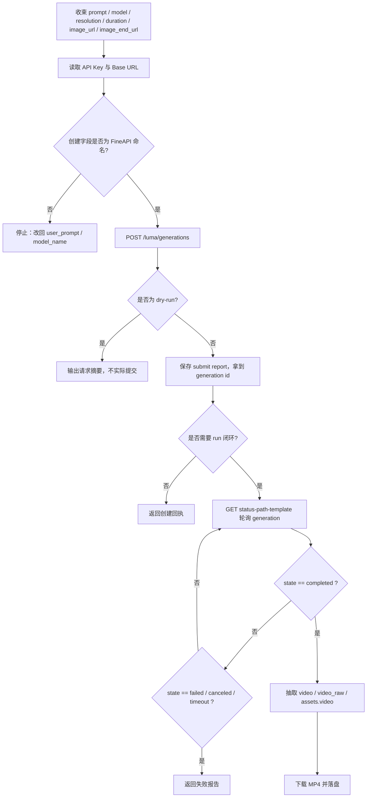
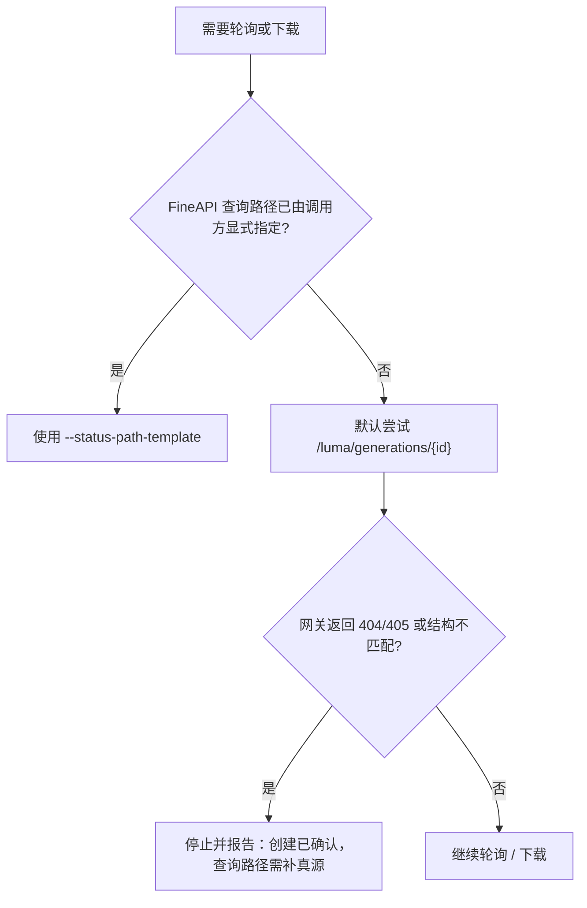

# Luma 生视频技能

## Context Loading Contract

- 每次调用本技能时，必须同时加载同目录 `CONTEXT.md` 作为预加载上下文。
- 若同目录 `CONTEXT.md` 缺失，应先补齐最小知识库骨架，或向用户明确报告阻塞；不得在未检查该上下文的情况下执行技能。
- 冲突优先级：用户显式请求 > 仓库/全局 `AGENTS.md` > 本 `SKILL.md` > 同目录 `CONTEXT.md`。

## 1. 作用范围

- 本技能用于通过 FineAPI 兼容的 Luma 接口提交、轮询并下载 Luma Ray 视频生成任务。
- 当前已确认真源：
  - FineAPI 文档页：`https://docs.fineapi.cloud/403045611e0`
  - 已确认创建接口：`POST /luma/generations`
  - 已确认请求字段：`user_prompt / model_name / duration / resolution`
  - 截图确认的可选字段：`expand_prompt / loop / image_url / image_end_url / notify_hook`
  - 已确认创建响应字段：`id / prompt / state / queue_state / created_at / batch_id / video / video_raw / thumbnail / last_frame / estimate_wait_seconds`
- 官方 Luma 文档同时确认了 generation-by-id 的轮询模型与成片 URL 出现在 generation 对象中，因此本技能默认提供轮询与下载闭环；但 FineAPI 查询路径是否严格镜像官方路径并未在当前页直接展开，所以脚本将查询路径模板做成显式可覆盖参数，而不是把推断写死成不可变真源。
- 默认执行脚本：

```bash
python3 .agents/skills/api/video/luma/scripts/luma_video_generate.py ...
```

- 覆盖四类动作：
  - 文生视频
  - 起始参考图视频（`image_url`）
  - 起始 + 结束关键帧视频（`image_url` + `image_end_url`）
  - 提交 + 轮询 + 下载

## 2. 必需输入

- `prompt`
- API Key
  - 优先读取根目录 `.env` 中的 `LUMA_API_KEY`
  - 回退 `FINEAPI_API_KEY`
  - 再回退 `ANYFAST_VIDEO_API_KEY`
  - 再回退 `ANYFAST_API_KEY`
  - 也可显式传 `--api-key`
- API Base URL
  - 优先 `.env` 中 `LUMA_API_BASE_URL`
  - 回退 `FINEAPI_API_BASE_URL`
  - 也可显式传 `--base-url`

可选输入：

- `model`：默认自动选择当前已登记 Ray 系列最高版本（当前解析为 `ray-2`）；若当前网关只接受旧别名，脚本自动回退到 `ray-v2`
- `resolution`：默认 `720p`
- `duration`：当前固定 `5s`
- `expand_prompt`
- `loop`
- `image_url`
- `image_end_url`
- `notify_hook`
- `status-path-template`：默认 `/luma/generations/{id}`
- `project-name`
- `output-dir`
- `poll-interval`
- `max-wait-seconds`
- `filename-prefix`
- `report-json`
- `timeout`
- `dry-run`

## 3. 核心约束（Mandatory）

1. **创建接口真源固定**
   - 当前已直接确认的是 `POST /luma/generations`。
   - 请求头必须带 `Accept: application/json`、`Content-Type: application/json`、`Authorization: Bearer <token>`。
2. **字段映射不能混写官方命名**
   - FineAPI 创建请求使用 `user_prompt / model_name`，不是官方 Luma 的 `prompt / model`。
   - 不得把官方字段名直接塞进 FineAPI 创建请求体。
3. **查询路径属于“官方模式确认 + FineAPI 镜像推断”**
   - 官方 Luma 已确认 generation 需要轮询，视频 URL 随 generation 对象返回。
   - FineAPI 当前页面未直接展示查询端点，因此默认查询模板使用 `/luma/generations/{id}`，同时必须允许调用方通过 `--status-path-template` 覆盖。
4. **成片 URL 不能假定只在单一字段**
   - FineAPI 创建响应展示了 `video / video_raw / thumbnail / last_frame`。
   - 官方 Luma 文档又说明成片可能体现在 `assets.video`。
   - 脚本必须兼容多种返回形态，而不是只盯死一个字段。
5. **时长边界刚性**
   - 截图已明确“时长只支持 5s”。
   - 当前技能只接受 `5s`，不得静默放过其他时长值。
6. **项目化输出路径**
   - 默认输出目录必须为 `output/影片/[项目名]/5-API/video/luma/`。
   - 若未显式传 `project-name`，默认项目名使用 `测试`。
7. **密钥只引用环境变量名**
   - 技能文档、报告、脚本日志只引用环境变量名，不落明文 token。
   - 用户给出的明文 key 视为运行时私密信息，不回写进仓库。
8. **Base URL 不再静默回退到通用 AnyFast host**
   - 当前真实探测表明：工作区 `.env` 中的 `ANYFAST_API_BASE_URL=https://fw2afus.ent.acc.kurtisasia.com` 对 `POST /luma/generations` 返回的是前端 HTML，`/v1/luma/generations` 返回 `Invalid URL`。
   - 因此本技能默认只接受 `LUMA_API_BASE_URL / FINEAPI_API_BASE_URL` 或显式 `--base-url`，避免把未确认网关当作 Luma 真源。
9. **失败优先修源层**
   - 若出现字段错名、查询路径不匹配、视频 URL 抽取失败、分辨率/时长不被接受或鉴权错位，优先修复：
     - `scripts/luma_video_generate.py`
     - 本 `SKILL.md`
     - `references/api.md`

## 4. Visual Maps (Mermaid)

### 4.1 主流程



### 4.2 查询路径风险分支



## 5. 统一字段主表（Mandatory）

| field_id | 输出位置/字段 | 内容要求 | 证据来源 | 默认责任 Step | 质量维度 | 失败码 |
| --- | --- | --- | --- | --- | --- | --- |
| `FIELD-LUMA-01` | 输入解析结果：`prompt / image_url / image_end_url / project_name` | `prompt` 非空；起止图可选但 URL 需可追溯 | 用户输入、CLI 参数 | Step 1 | 输入收束完整度 | `FAIL-LUMA-INPUT` |
| `FIELD-LUMA-02` | 参数裁决结果：`model / resolution / duration / expand_prompt / loop / base_url` | `duration` 固定 `5s`；`resolution` 合法；环境变量与 CLI 覆盖关系明确 | FineAPI 截图、请求示例、脚本默认值 | Step 2 | 参数与环境一致性 | `FAIL-LUMA-PARAMS` |
| `FIELD-LUMA-03` | 创建请求：`POST /luma/generations` JSON 请求体 | 使用 FineAPI 字段名；可选字段只在显式提供时发送 | FineAPI 页面、截图、请求样例 | Step 3 | 请求体合法性 | `FAIL-LUMA-CREATE` |
| `FIELD-LUMA-04` | 查询请求：`GET status-path-template` | 查询路径可解释；默认模板可覆盖；状态值正确归一 | 官方 Luma generation 查询文档 + FineAPI 镜像推断 | Step 4 | 异步状态机稳定性 | `FAIL-LUMA-STATUS` |
| `FIELD-LUMA-05` | 下载结果：`video / video_raw / assets.video` + 本地 MP4 | 成片 URL 被正确抽取；报告保留原始 generation 结构和本地文件路径 | FineAPI 响应字段、官方 Luma 轮询说明 | Step 5 | 输出闭环完整性 | `FAIL-LUMA-DOWNLOAD` |

## 6. 思维导引与执行流程（Mandatory）

### 6.1 固定步骤

1. **Step 1 / 输入收束**
   - 读取 `prompt`、`image_url`、`image_end_url`、`project_name`
   - 若存在参考图，当前按远程 URL 透传；不得假装支持本地文件直传
2. **Step 2 / 参数与环境裁决**
   - 校验 `resolution` 与 `duration`
   - 读取 `LUMA_API_KEY / FINEAPI_API_KEY / ANYFAST_VIDEO_API_KEY / ANYFAST_API_KEY`
   - 读取 `LUMA_API_BASE_URL / FINEAPI_API_BASE_URL`
   - 构造模型候选序列：优先用户指定值；未指定时自动选择当前已登记 Ray 系列最高版本（当前解析为 `ray-2`），必要时回退 `ray-v2`
3. **Step 3 / 创建任务**
   - 组装 JSON：`user_prompt / model_name / duration / resolution`
   - 按需附加 `expand_prompt / loop / image_url / image_end_url / notify_hook`
   - 提交到 `/luma/generations`
4. **Step 4 / 轮询状态**
   - 访问 `status-path-template`
   - 若状态为 `pending / queued / processing / dreaming` 等进行中状态，则按 `poll_interval` 轮询直到完成或超时
   - 若状态为 `failed / canceled`，保留错误并终止
5. **Step 5 / 下载与落盘**
   - 从 generation 对象中依次提取 `video / video_raw / assets.video`
   - 下载 MP4 到默认项目化目录
   - 生成报告 JSON，记录创建、状态、下载三段摘要

### 6.2 思维导引表

| step_id | 聚焦字段(field_id) | 核心问题 | 生成动作 | 未达标信号 |
| --- | --- | --- | --- | --- |
| `Step 1` | `FIELD-LUMA-01` | 是否已收束 prompt 与关键帧 URL？ | 统一输入并校验必填项 | prompt 为空、把本地路径误当 URL |
| `Step 2` | `FIELD-LUMA-02` | API Key、Base URL、时长与模型候选是否明确？ | 裁决环境变量、参数枚举与回退链 | Base URL 缺失、duration 不是 5s、模型漂移无解释 |
| `Step 3` | `FIELD-LUMA-03` | 创建请求是否严格使用 FineAPI 字段名？ | 构造 JSON 并发起创建 | 把 `prompt/model` 塞进请求、可选字段无故常驻 |
| `Step 4` | `FIELD-LUMA-04` | 查询路径与状态归一是否稳定？ | 轮询 generation 并规范状态报告 | 404/405 未暴露、无限轮询、失败状态被吞掉 |
| `Step 5` | `FIELD-LUMA-05` | 是否从 generation 对象里正确提取成片并落盘？ | 抽取 URL、下载 MP4、写 run report | `completed` 后仍拿不到视频、只存 JSON 不落 MP4 |

## 7. 标准调用

### 7.1 一步跑完：提交 + 轮询 + 下载

```bash
python3 .agents/skills/api/video/luma/scripts/luma_video_generate.py run \
  --prompt "一阵风吹过树林，使女人的面纱微微飘动。" \
  --model ray-2 \
  --resolution 720p \
  --duration 5s \
  --project-name "测试"
```

### 7.2 起始关键帧图生视频

```bash
python3 .agents/skills/api/video/luma/scripts/luma_video_generate.py run \
  --prompt "角色从静止首帧缓慢抬头，镜头轻推近，电影自然光" \
  --image-url "https://example.com/start-frame.png" \
  --resolution 720p \
  --duration 5s
```

### 7.3 起始 + 结束关键帧

```bash
python3 .agents/skills/api/video/luma/scripts/luma_video_generate.py run \
  --prompt "角色从站立转为回头，形成自然过渡，镜头缓慢跟拍" \
  --image-url "https://example.com/frame0.png" \
  --image-end-url "https://example.com/frame1.png" \
  --loop
```

### 7.4 只创建任务，不等待

```bash
python3 .agents/skills/api/video/luma/scripts/luma_video_generate.py submit \
  --prompt "赛博城市高空俯拍，雨夜，车流穿梭" \
  --model ray-2 \
  --resolution 720p \
  --duration 5s
```

### 7.5 只查状态

```bash
python3 .agents/skills/api/video/luma/scripts/luma_video_generate.py status \
  --generation-id "4665a07c-7641-4809-a133-10786201bb56"
```

### 7.6 只下载

```bash
python3 .agents/skills/api/video/luma/scripts/luma_video_generate.py download \
  --generation-id "4665a07c-7641-4809-a133-10786201bb56" \
  --project-name "测试"
```

### 7.7 Dry Run 检查请求体

```bash
python3 .agents/skills/api/video/luma/scripts/luma_video_generate.py submit \
  --prompt "测试请求" \
  --model ray-2 \
  --resolution 720p \
  --duration 5s \
  --dry-run \
  --print-payload
```

## 8. 参数约定

| CLI 参数 | 创建/查询/下载字段 | 默认值 | 说明 |
| --- | --- | --- | --- |
| `--model` | `model_name` | `ray-2` | 自动从已登记 Ray 系列里取最高版本；当前解析为官方最新稳定模型 `ray-2`，若代理网关仍沿用旧别名则自动回退 `ray-v2` |
| `--prompt` | `user_prompt` | 必填 | 视频提示词 |
| `--image-url` | `image_url` | 无 | 起始关键帧 URL |
| `--image-end-url` | `image_end_url` | 无 | 结束关键帧 URL |
| `--expand-prompt` | `expand_prompt` | 无 | 提示词优化开关，默认不发送 |
| `--loop` | `loop` | 无 | 循环视频开关，默认不发送 |
| `--notify-hook` | `notify_hook` | 无 | 处理完成后的回调地址 |
| `--resolution` | `resolution` | `720p` | `720p / 1080p` |
| `--duration` | `duration` | `5s` | 当前仅允许 `5s` |
| `--status-path-template` | 查询路径模板 | `/luma/generations/{id}` | 若网关查询路径不同，显式覆盖 |
| `--base-url` | API Base URL | `.env` 回退链 | 当前不硬编码 host |
| `--poll-interval` | 轮询间隔 | `10` | 仅 `run` 命令使用 |
| `--max-wait-seconds` | 最大等待时长 | `900` | 仅 `run` 命令使用 |

完整字段与来源说明见：`references/api.md`

## 9. 输出约定

- 默认输出目录：`output/影片/[项目名]/5-API/video/luma/`
- 默认产物：
  - `luma_submit_report_YYYYmmdd_HHMMSS.json`
  - `luma_status_report_YYYYmmdd_HHMMSS.json`
  - `luma_download_report_YYYYmmdd_HHMMSS.json`
  - `luma_run_report_YYYYmmdd_HHMMSS.json`
  - `*.mp4`
- 报告至少包含：
  - `ok`
  - `command`
  - `request_summary`
  - `normalized_submit`
  - `normalized_status`
  - `normalized_download`
  - `saved_file`
  - `raw_response`
  - `diagnostic_hint`
  - `error`

## 10. Root-Cause 执行契约（Mandatory）

当创建失败、轮询报 404/405、状态长期不变、成片 URL 缺失、时长不被接受或 API Key/Base URL 错位时，按以下链路上溯：

`Symptom/Failure`
-> `Direct Cause`：API Key 缺失、Base URL 未配置、把 `prompt/model` 错发为官方字段、`status-path-template` 与网关不匹配、`duration` 不是 `5s`、成片 URL 字段变体未被抽取
-> `规则源`：`.agents/skills/api/video/luma/SKILL.md`、`references/api.md`、`scripts/luma_video_generate.py`
-> `规则源的规则源`：仓库根 `AGENTS.md` 中的 Root-Cause First / Context Loading / Field-Centric / Canonical Source 治理契约
-> `Fix Landing Points`：优先修脚本字段映射、查询路径模板、视频 URL 抽取逻辑与环境变量回退，再修调用样例

用户侧关闭语必须至少包含：
- 根因位置
- 立即修复
- 系统性预防修复

## 11. 失败排查

1. 检查 `.env` 是否存在 `LUMA_API_BASE_URL / FINEAPI_API_BASE_URL`；若没有，则显式传 `--base-url`
2. 确认 `.env` 中至少存在 `LUMA_API_KEY / FINEAPI_API_KEY / ANYFAST_VIDEO_API_KEY / ANYFAST_API_KEY` 之一
3. 若当前只有 `ANYFAST_API_BASE_URL`，不要直接拿来跑 Luma；本技能会要求显式配置 Luma/FineAPI Base URL
4. 使用 `submit --dry-run --print-payload` 确认请求体字段名是 `user_prompt / model_name`
5. 若创建阶段报模型错误：
   - 先用默认自动解析出的最高版本 `ray-2`
   - 若代理网关不认官方名，再回退 `ray-v2`
6. 若轮询阶段 404/405：
   - 先确认当前网关是否支持 `GET /luma/generations/{id}`
   - 若不支持，显式用 `--status-path-template` 覆盖，或先停在 submit receipt
7. 若 `submit/status` 收到 HTTP 200 但返回 HTML：
   - 先判定为 Base URL 错位或该网关未开放 Luma 路由
   - 不要继续把该响应当作成功回执
8. 若 `completed` 后仍无视频：
   - 先查看原始 generation 是否带 `video` / `video_raw`
   - 再检查是否变成了 `assets.video` 这类官方结构
