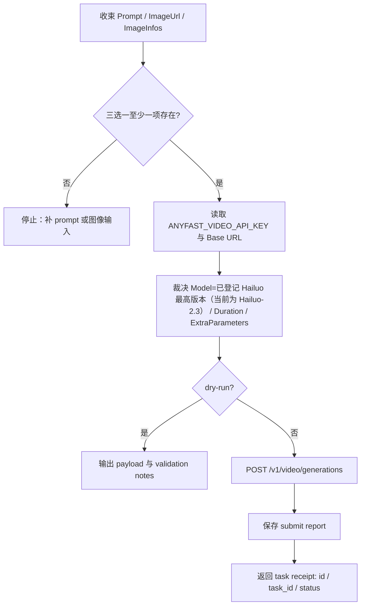
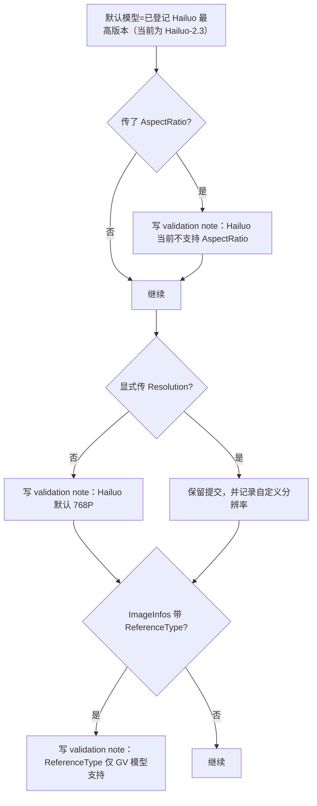

# MiniMax 海螺生视频技能

## Context Loading Contract

- 每次调用本技能时，必须同时加载同目录 `CONTEXT.md` 作为预加载上下文。
- 若同目录 `CONTEXT.md` 缺失，应先补齐最小知识库骨架，或向用户明确报告阻塞；不得在未检查该上下文的情况下执行技能。
- 冲突优先级：用户显式请求 > 仓库/全局 `AGENTS.md` > 本 `SKILL.md` > 同目录 `CONTEXT.md`。

## 1. 作用范围

- 本技能用于通过 FineAPI 的统一视频创建接口提交 MiniMax 海螺视频任务。
- 当前已确认真源：
  - 文档页：`https://docs.fineapi.cloud/403045611e0`
  - 创建接口：`POST /v1/video/generations`
  - 当前截图与文档可确认字段：
    - 请求头：`Accept / Content-Type / Authorization`
    - Body：`Model / SceneType / Prompt / NegativePrompt / EnhancePrompt / ImageUrl / ImageInfos / LastImageUrl / Duration / AdditionalParameters / Operator / StoreCosParam / ExtraParameters`
    - 响应：`id / task_id / model / status / created_at`
- 当前公开材料只稳定覆盖“创建任务”这一步；查询状态与下载结果端点在本轮材料中未锁定，因此本技能不得擅自虚构后续接口。
- 默认执行脚本：

```bash
python3 .agents/skills/api/video/minimax/scripts/minimax_video_generate.py submit ...
```

## 2. 必需输入

以下三者至少满足其一：

- `prompt`
- `image-url`
- `image-info / image-info-json`

API Key：

- 优先读取根目录 `.env` 中的 `ANYFAST_VIDEO_API_KEY`
- 回退 `ANYFAST_API_KEY`
- 再回退 `FINEAPI_API_KEY`
- 也可显式传 `--api-key`

可选输入：

- `model`：默认模型治理统一回指父级 `../runbooks/default-model-policy.md` 的 `highest-available-general` 规则族；脚本共享骨架使用 `../shared/default_model_policy.py`，MiniMax 的 provider 特有差异是只让 `Hailuo-*` 家族参与默认值解析；当前解析结果为 `Hailuo-2.3`
- `scene-type`
- `negative-prompt`
- `enhance-prompt`
- `last-image-url`
- `duration`
- `additional-parameters`
- `operator`
- `cos-bucket-name / cos-bucket-region / cos-bucket-path`
- `resolution / aspect-ratio / logo-add / enable-audio / offpeak`
- `base-url`
  - 优先 `MINIMAX_API_BASE_URL`
  - 回退 `ANYFAST_API_BASE_URL`
  - 再回退 `FINEAPI_API_BASE_URL`
  - 再回退 `https://fw2afus.ent.acc.kurtisasia.com`
- `project-name`
- `output-dir`
- `filename-prefix`
- `report-json`
- `timeout`
- `dry-run`

## 3. 核心约束（Mandatory）

1. **当前只锁定创建接口**
   - 已证实的是 `POST /v1/video/generations`。
   - 在没有后续文档前，不得编造状态查询或下载端点。
2. **JSON 提交刚性**
   - 当前接口使用 `application/json`。
   - 不得误改为 multipart/form-data。
3. **输入门槛是“三选一”**
   - `Prompt / ImageUrl / ImageInfos` 至少填一项。
   - 不得把三项都空的请求静默发出。
4. **默认模型必须跟随当前已登记 Hailuo 系列最高版本**
   - 默认模型治理统一遵循父级 `../runbooks/default-model-policy.md` 的 `highest-available-general` 规则族。
   - 共享算法骨架由 `../shared/default_model_policy.py` 提供；`scripts/minimax_video_generate.py` 只补 Hailuo 家族过滤条件。
   - 当前解析结果为 `Hailuo-2.3`；所有技能文档、脚本默认值、样例与 UI 元数据都必须引用这一解析结果，而不是再散落硬编码。
5. **统一以 `.env` 的 `ANYFAST_VIDEO_API_KEY` 为主事实源**
   - `MINIMAX` 技能不再以 `MINIMAX_API_KEY` 作为主合同真源。
   - 不在技能文件、脚本样例、报告中写明文 token。
6. **海螺模型边界必须显式提示**
   - 截图标注：`Hailuo` 默认分辨率为 `768P`。
   - 截图标注：`Hailuo` 当前“不支持 AspectRatio”。
   - `LogoAdd` 截图标注为 Hailuo/Kling/Vidu 支持。
   - 脚本应保留这些风险提示，而不是假装所有扩展参数都完全可用。
7. **跨模型字段边界仍需保留**
   - `ReferenceType` 截图标注“仅 GV 模型支持”。
   - `4:3 / 3:4` 截图标注“仅 q2 支持”。
   - `OffPeak` 截图标注“仅 Vidu 支持”。
   - 即使默认模型是海螺，也要保留这些字段风险说明，避免调用者用同接口切别的模型时失真。
8. **项目化输出路径**
   - 默认输出目录必须为 `output/影片/[项目名]/5-API/video/minimax/`。
   - 若未显式传 `project-name`，默认项目名使用 `测试`。
9. **失败优先修源层**
   - 若出现鉴权错误、字段大小写不匹配、Hailuo 宽高比误用、Base URL 漂移或把创建回执误认成成片，优先修：
     - `scripts/minimax_video_generate.py`
     - `references/api.md`
     - 本 `SKILL.md`

## 4. Visual Maps (Mermaid)

### 4.1 主流程



### 4.2 海螺参数边界



## 5. 统一字段主表（Mandatory）

| field_id | 输出位置/字段 | 内容要求 | 证据来源 | 默认责任Step | 质量维度 | 失败码 |
| --- | --- | --- | --- | --- | --- | --- |
| `FIELD-MINIMAX-01` | 输入解析结果：`Prompt / ImageUrl / ImageInfos / project_name` | 三者至少一项有效；`ImageInfos` 结构合法 | 文档页、截图、CLI 参数 | Step 1 | 输入收束完整度 | `FAIL-MINIMAX-INPUT` |
| `FIELD-MINIMAX-02` | 参数裁决结果：`Model / Duration / Base URL / ExtraParameters` | 默认模型按已登记 Hailuo 系列最高版本自动选择；海螺边界已显式提示；枚举字段合法 | 文档页、截图、脚本默认值 | Step 2 | 参数与环境一致性 | `FAIL-MINIMAX-PARAMS` |
| `FIELD-MINIMAX-03` | 创建请求：`POST /v1/video/generations` JSON 请求体 | Header 与 Body 字段名准确；可选嵌套对象结构正确 | 文档页、截图、脚本构造结果 | Step 3 | 请求体合法性 | `FAIL-MINIMAX-CREATE` |
| `FIELD-MINIMAX-04` | 创建回执：`id / task_id / model / status / created_at` | 报告完整保留任务回执，不把其误判为成片结果 | 文档页、截图、API 响应 | Step 4 | 回执闭环完整性 | `FAIL-MINIMAX-RECEIPT` |

## 6. 思维导引与执行流程（Mandatory）

### 6.1 固定步骤

1. **Step 1 / 输入收束**
   - 读取 `prompt`、`image_url`、`image_infos`
   - 校验三者至少一项存在
   - 若传 `image_infos`，统一归一成 `[{ImageUrl, ReferenceType?}]`
2. **Step 2 / 参数与环境裁决**
   - 读取 `.env` 中的 `ANYFAST_VIDEO_API_KEY`
   - 读取 `MINIMAX_API_BASE_URL / ANYFAST_API_BASE_URL / FINEAPI_API_BASE_URL`
   - 校验 `resolution / aspect_ratio / logo_add`
   - 对海螺的 `768P 默认值 / AspectRatio 暂不支持` 写入 validation notes
   - 对 `ReferenceType / 4:3 / 3:4 / OffPeak` 写入跨模型边界提示
3. **Step 3 / 创建任务**
   - 组装 JSON：`Model / SceneType / Prompt / NegativePrompt / EnhancePrompt / ImageUrl / ImageInfos / LastImageUrl / Duration / AdditionalParameters / Operator / StoreCosParam / ExtraParameters`
   - 提交到 `/v1/video/generations`
4. **Step 4 / 回执落盘**
   - 保存任务回执 JSON
   - 输出 `id / task_id / model / status / created_at`
   - 明确声明“当前闭环停在 create receipt，不含状态轮询与下载”

### 6.2 思维导引表

| step_id | 聚焦字段(field_id) | 核心问题 | 生成动作 | 未达标信号 |
| --- | --- | --- | --- | --- |
| `Step 1` | `FIELD-MINIMAX-01` | 是否至少收束了 prompt、单图或多图参考之一？ | 校验三选一与 `ImageInfos` 结构 | 三项全空、`ImageInfos` 非法、空字符串输入 |
| `Step 2` | `FIELD-MINIMAX-02` | API Key、Base URL 与海螺边界是否明确？ | 裁决环境变量并生成 validation notes | Base URL 缺失、海螺宽高比边界被吞掉、枚举越界 |
| `Step 3` | `FIELD-MINIMAX-03` | 请求体是否严格贴合字段大小写与嵌套对象？ | 构造 JSON 并提交 | 字段拼成小写、嵌套对象结构错、布尔型误传字符串 |
| `Step 4` | `FIELD-MINIMAX-04` | 是否把创建回执正确落盘并解释为 task receipt？ | 保存 submit report 并规范化回执 | 把 `queued/processing` 说成已出片 |

## 7. 标准调用

### 7.1 文生视频

```bash
python3 .agents/skills/api/video/minimax/scripts/minimax_video_generate.py submit \
  --prompt "一只猫在草地上奔跑，阳光明媚，镜头轻微跟拍" \
  --project-name "测试"
```

### 7.2 图生视频

```bash
python3 .agents/skills/api/video/minimax/scripts/minimax_video_generate.py submit \
  --image-url "https://example.com/reference.jpg" \
  --prompt "保持角色主体，镜头缓慢推进，电影级自然光" \
  --project-name "测试"
```

### 7.3 多图参考

```bash
python3 .agents/skills/api/video/minimax/scripts/minimax_video_generate.py submit \
  --prompt "让角色延续参考图中的服装与质感，形成平稳推镜" \
  --image-info "https://example.com/ref-a.jpg" \
  --image-info "https://example.com/ref-b.jpg"
```

### 7.4 首尾帧

```bash
python3 .agents/skills/api/video/minimax/scripts/minimax_video_generate.py submit \
  --image-url "https://example.com/start.jpg" \
  --last-image-url "https://example.com/end.jpg" \
  --prompt "从首帧自然过渡到尾帧，动作连续"
```

### 7.5 Dry Run 检查请求体

```bash
python3 .agents/skills/api/video/minimax/scripts/minimax_video_generate.py submit \
  --prompt "测试请求" \
  --resolution 768P \
  --dry-run \
  --print-payload
```

## 8. 参数约定

| CLI 参数 | 创建字段 | 默认值 | 说明 |
| --- | --- | --- | --- |
| `--model` | `Model` | `Hailuo-2.3` | 自动从已登记 Hailuo 系列里取最高版本；当前解析为 `Hailuo-2.3` |
| `--scene-type` | `SceneType` | 不发送 | 场景类型字符串 |
| `--prompt` | `Prompt` | 无 | 可选，但与图像输入三选一 |
| `--negative-prompt` | `NegativePrompt` | 不发送 | 负向提示词 |
| `--enhance-prompt` | `EnhancePrompt` | 不发送 | 显式传 `true/false` 时才写入 |
| `--image-url` | `ImageUrl` | 不发送 | 单图参考 |
| `--image-info` | `ImageInfos[]` | 可重复 | 格式：`URL|style` 或 `URL|asset`；若无 `|type` 则仅传 `ImageUrl` |
| `--image-info-json` | `ImageInfos[]` | 可重复 | 直接传单个 JSON 对象 |
| `--last-image-url` | `LastImageUrl` | 不发送 | 尾帧图 |
| `--duration` | `Duration` | 不发送 | 秒数，文档截图示例为 `5` |
| `--additional-parameters` | `AdditionalParameters` | 不发送 | 原样字符串 |
| `--operator` | `Operator` | 不发送 | 操作者标识 |
| `--resolution` | `ExtraParameters.Resolution` | 不发送 | `720P / 768P / 1080P`；海螺默认 `768P` |
| `--aspect-ratio` | `ExtraParameters.AspectRatio` | 不发送 | `16:9 / 9:16 / 1:1 / 4:3 / 3:4`；海螺当前不支持 |
| `--logo-add` | `ExtraParameters.LogoAdd` | 不发送 | `0 / 1`，截图标注 Hailuo 支持 |
| `--enable-audio` | `ExtraParameters.EnableAudio` | 不发送 | 显式传 `true/false` |
| `--offpeak` | `ExtraParameters.OffPeak` | 不发送 | 截图标注仅 Vidu 支持 |
| `--base-url` | API Base URL | `.env` 回退链 | 优先 `MINIMAX_API_BASE_URL`，回退 `ANYFAST_API_BASE_URL` |

完整字段说明见：`references/api.md`

## 9. 输出约定

- 默认输出目录：`output/影片/[项目名]/5-API/video/minimax/`
- 默认产物：
  - `minimax_submit_report_YYYYmmdd_HHMMSS.json`
- 报告至少包含：
  - `ok`
  - `command`
  - `request_summary`
  - `normalized_submit`
  - `validation_notes`
  - `diagnostic_hint`
  - `raw_response`
  - `error`

## 10. Root-Cause 执行契约（Mandatory）

当创建失败、字段大小写不对、三选一输入缺失、Hailuo 宽高比误用、Base URL 漂移或调用方误以为任务已出片时，按以下链路上溯：

`Symptom/Failure`
-> `Direct Cause`：API Key 缺失、Base URL 未配置、`Prompt/ImageUrl/ImageInfos` 同时为空、Hailuo 误传 `AspectRatio`、把 task receipt 误读为成片
-> `规则源`：`.agents/skills/api/video/minimax/SKILL.md`、`references/api.md`、`scripts/minimax_video_generate.py`
-> `规则源的规则源`：仓库根 `AGENTS.md` 中的 Root-Cause First / Context Loading / Canonical Source / Composite Output 治理契约
-> `Fix Landing Points`：优先修脚本的环境变量回退、字段映射、validation notes 和回执解释，再修样例

用户侧关闭语必须至少包含：
- 根因位置
- 立即修复
- 系统性预防修复

## 11. 失败排查

1. 检查 `.env` 是否存在 `ANYFAST_VIDEO_API_KEY`
2. 检查 `.env` 或命令行是否已提供 `MINIMAX_API_BASE_URL / ANYFAST_API_BASE_URL / --base-url`
3. 使用 `submit --dry-run --print-payload` 确认 JSON 请求体
4. 若 `Prompt / ImageUrl / ImageInfos` 三项都空，先补至少一项再提交
5. 若默认海螺模型还传了 `AspectRatio`，先去掉该字段再试
6. 若只返回 `id / task_id / status / created_at`，停在 create receipt，不继续脑补状态与下载
