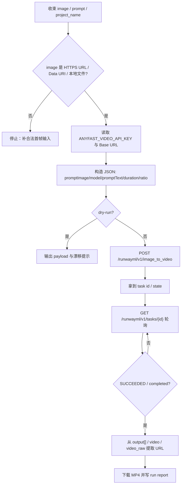
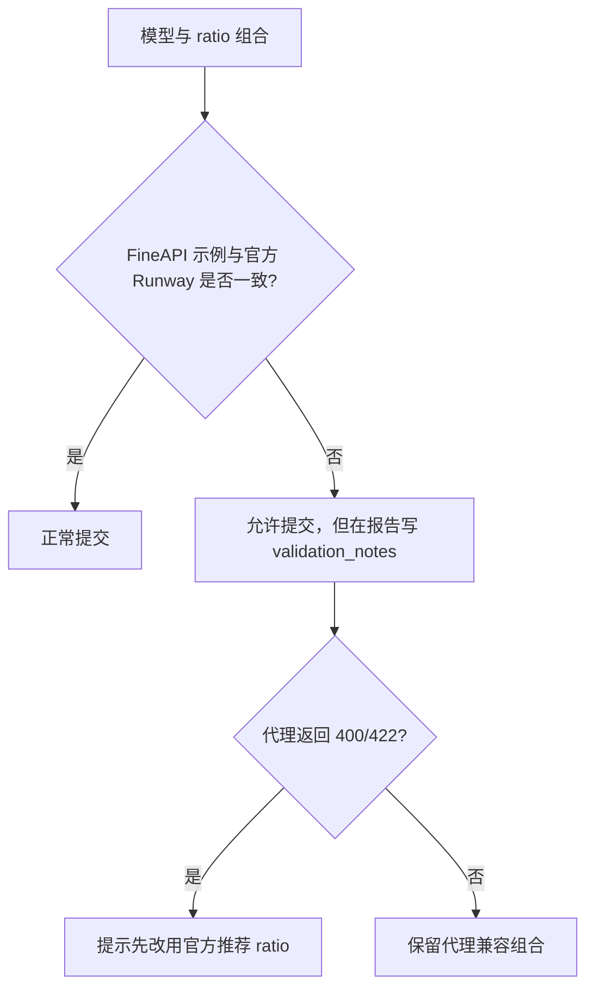

# FineAPI Runway 图生视频技能

## Context Loading Contract

- 每次调用本技能时，必须同时加载同目录 `CONTEXT.md` 作为预加载上下文。
- 若同目录 `CONTEXT.md` 缺失，应先补齐最小知识库骨架，或向用户明确报告阻塞；不得在未检查该上下文的情况下执行技能。
- 冲突优先级：用户显式请求 > 仓库/全局 `AGENTS.md` > 本 `SKILL.md` > 同目录 `CONTEXT.md`。

## 1. 作用范围

- 本技能用于通过 FineAPI 的 Runway 代理接口执行 **图生视频** 任务。
- 当前已确认真源：
  - FineAPI 创建页：`https://docs.fineapi.cloud/403045611e0`
  - 创建接口：`POST /runwayml/v1/image_to_video`
  - 官方 Runway 任务模型：
    - 创建：`POST /v1/image_to_video`
    - 查询：`GET /v1/tasks/{id}`
    - 输出：成功任务通过 `output[]` 返回临时下载 URL
- 默认脚本入口：

```bash
python3 .agents/skills/api/video/runway/scripts/runway_video_generate.py ...
```

- 覆盖动作：
  - `submit`：创建任务
  - `status`：查询任务状态
  - `download`：下载成片
  - `run`：创建 -> 轮询 -> 下载

## 2. 必需输入

- `image`
  - 支持 `https://` URL
  - 支持 `data:image/...` Data URI
  - 支持本地路径；脚本会自动转成 Data URI 再提交
- `prompt`
- API Key
  - 优先读取根目录 `.env` 中的 `ANYFAST_VIDEO_API_KEY`
  - 回退 `RUNWAY_API_KEY`
  - 再回退 `ANYFAST_API_KEY`
  - 也可显式传 `--api-key`

可选输入：

- `model`
  - FineAPI 页面截图当前明确给出：`gen4_turbo / gen3a_turbo`
  - 官方 Runway `POST /v1/image_to_video` 文档当前接受值还包含：`gen4.5 / veo3.1 / veo3.1_fast / veo3`
  - 本技能默认按**当前已知最高版本**自动取 `gen4.5`；若官方文档后续新增更高版本，应先同步更新模型集合，再由脚本自动抬升默认值
  - 本技能允许按官方超集显式传入，但代理网关是否放行要以实际响应为准
- `ratio`
- `duration`
- `watermark`
- `seed`
- `base-url`
  - 优先 `.env` 中 `RUNWAY_API_BASE_URL`
  - 再回退 `FINEAPI_API_BASE_URL`
  - 对真实请求，不再静默回退到通用 `ANYFAST_API_BASE_URL`
  - 也可显式传 `--base-url`
- `project-name`
- `output-dir`
- `poll-interval`
- `max-wait-seconds`
- `filename-prefix`
- `report-json`
- `timeout`
- `dry-run`

## 3. 核心约束（Mandatory）

1. **创建页是真源，状态页是兼容推导**
   - FineAPI 这轮明确提供的是创建页 `POST /runwayml/v1/image_to_video`。
   - `GET /runwayml/v1/tasks/{id}` 属于“官方 Runway `GET /v1/tasks/{id}` + 代理前缀推导”的兼容路径。
   - 文档与脚本必须显式写清这层推导，不得把它伪装成 FineAPI 页面已明示的字段。
2. **JSON 提交刚性**
   - 创建端点使用 `application/json`。
   - 不得误改为 multipart/form-data。
3. **图片输入边界明确**
   - FineAPI 页面要求 `promptImage` 为 HTTPS URL 或 Data URI。
   - 本地文件只能通过 Data URI 方式适配，不得把本地路径原样塞进请求体。
4. **时长与比例显式化**
   - 页面截图显示 `duration` 可选值为 `5 / 10`，且页面默认值说明与用户示例存在差异。
   - 本技能本地默认统一显式发送 `duration=5`，避免依赖供应商隐式默认值。
5. **模型-比例存在文档漂移**
   - 用户给的 FineAPI 示例使用 `gen4_turbo + 1280:768`。
   - 官方 Runway 文档把 `1280:768` 归到 `gen3a_turbo`，把 `gen4_turbo` 归到 `1280:720 / 1584:672 / 1104:832 / 720:1280 / 832:1104 / 960:960`。
   - 官方文档还将 `gen4.5` 归到 `1280:720 / 1584:672 / 1104:832 / 720:1280 / 832:1104 / 672:1584 / 960:960`。
   - 脚本默认必须保证“默认模型”和“默认 ratio”自洽：当前默认 `gen4.5 + 1280:720`。
   - 对旧示例组合不得直接硬拒，而要保留兼容，同时在报告里给出漂移提示。
6. **结果 URL 是临时地址**
   - 官方输出文档说明成功任务会在 `output[]` 返回临时 URL，通常 24-48 小时内失效。
   - 下载后必须落本地项目目录，不得把临时 URL 当长期真源。
7. **统一使用 `.env` 的 `ANYFAST_VIDEO_API_KEY`**
   - 技能、脚本、参考文档、样例说明都以 `ANYFAST_VIDEO_API_KEY` 为主事实源。
   - 文档不得写入明文 token。
8. **Base URL 不再静默回退到通用 AnyFast host**
   - 2026-04-17 真实探测表明：当前工作区 `.env` 中的 `ANYFAST_API_BASE_URL=https://fw2afus.ent.acc.kurtisasia.com` 对 `POST /runwayml/v1/image_to_video` 返回的是前端 HTML，而不是 Runway API JSON。
   - 因此真实请求默认只接受 `RUNWAY_API_BASE_URL / FINEAPI_API_BASE_URL` 或显式 `--base-url`；`ANYFAST_API_BASE_URL` 只允许在 dry-run 中作为可观测的未验证值展示。
9. **真实响应必须通过 JSON + task_id gate**
   - `submit` 如果收到 `200 + HTML`、非 JSON、或 JSON 中缺少 `task id`，都必须视为失败。
   - `run` 不得在 `task_id=null` 的情况下继续轮询。
10. **失败优先修源层**
   - 若出现模型拒绝、比例不兼容、状态路径 404、下载字段漂移或密钥读错，优先修：
     - `scripts/runway_video_generate.py`
     - `references/api.md`
     - 本 `SKILL.md`

## 4. Visual Maps (Mermaid)

### 4.1 主流程



### 4.2 漂移与回退



## 5. 统一字段主表（Mandatory）

| field_id | 输出位置/字段 | 内容要求 | 证据来源 | 默认责任Step | 质量维度 | 失败码 |
| --- | --- | --- | --- | --- | --- | --- |
| `FIELD-RUNWAY-01` | 输入解析结果：`image / prompt / project_name` | `image` 可归一成 HTTPS URL 或 Data URI；`prompt` 非空 | 用户输入、CLI 参数、FineAPI 创建页 | Step 1 | 输入收束完整度 | `FAIL-RUNWAY-INPUT` |
| `FIELD-RUNWAY-02` | 参数裁决结果：`model / ratio / duration / watermark / seed / base_url` | 枚举合法；文档漂移被显式提示；Base URL 已明确 | FineAPI 创建页、官方 Runway 文档、脚本默认值 | Step 2 | 参数与真源一致性 | `FAIL-RUNWAY-PARAMS` |
| `FIELD-RUNWAY-03` | 创建请求：`POST /runwayml/v1/image_to_video` JSON 请求体 | 头与 Body 字段名准确；本地图已转 Data URI | FineAPI 创建页、脚本构造结果 | Step 3 | 请求体合法性 | `FAIL-RUNWAY-CREATE` |
| `FIELD-RUNWAY-04` | 轮询状态：`GET /runwayml/v1/tasks/{id}` 返回体 | 保留原始响应；能稳定识别 `state/status` 与终态 | 官方 Runway 任务文档、代理前缀推导、API 响应 | Step 4 | 异步状态机稳定性 | `FAIL-RUNWAY-STATUS` |
| `FIELD-RUNWAY-05` | 下载结果：`output[] / video / video_raw` + 本地 MP4 | 成功提取视频 URL；落盘报告与视频路径完整 | 官方 Runway 输出文档、代理响应 | Step 5 | 输出闭环完整性 | `FAIL-RUNWAY-DOWNLOAD` |

## 6. 思维导引与执行流程（Mandatory）

### 6.1 固定步骤

1. **Step 1 / 输入收束**
   - 读取 `image`、`prompt`、`project_name`
   - 将本地图片转为 Data URI
   - 保留远程 HTTPS URL 原样
2. **Step 2 / 参数与环境裁决**
   - 校验 `duration` 只能为 `5 / 10`
   - 校验 `ratio` 是否落在已知集合
   - 若用户未显式传 `ratio`，按当前 `model` 自动补对应默认比例，避免默认参数自相矛盾
   - 读取 `.env` 中的 `ANYFAST_VIDEO_API_KEY`
   - 读取 `RUNWAY_API_BASE_URL / FINEAPI_API_BASE_URL`
   - 若真实请求场景下只检测到 `ANYFAST_API_BASE_URL`，应本地 fail-fast，不得继续把 HTML 壳页当成成功回执
   - 若模型与比例组合有文档漂移，写入 `validation_notes`
3. **Step 3 / 创建任务**
   - 向 `/runwayml/v1/image_to_video` 提交 JSON
   - 发送 `promptImage / model / promptText / duration / ratio`
   - 仅在用户显式传值时发送 `watermark / seed`
4. **Step 4 / 轮询状态**
   - 用 `GET /runwayml/v1/tasks/{id}` 轮询
   - 兼容 `status` 与 `state`
   - 终态至少识别：`SUCCEEDED / completed / FAILED / failed / CANCELED`
5. **Step 5 / 下载与落盘**
   - 优先从 `output[]` 提取 URL
   - 若代理返回 `video / video_raw / video_url`，也应兼容
   - 下载 MP4 到默认项目化目录

### 6.2 思维导引表

| step_id | 聚焦字段(field_id) | 核心问题 | 生成动作 | 未达标信号 |
| --- | --- | --- | --- | --- |
| `Step 1` | `FIELD-RUNWAY-01` | 首帧输入是否已转成供应商可接受格式？ | 统一到 HTTPS URL 或 Data URI | 本地路径原样提交、HTTP URL、空 prompt |
| `Step 2` | `FIELD-RUNWAY-02` | 模型、ratio、duration 与环境变量是否都可解释？ | 裁决枚举并生成漂移提示 | 无 Base URL、ratio 越界、文档漂移被吞掉 |
| `Step 3` | `FIELD-RUNWAY-03` | JSON 请求体是否完全贴合创建页？ | 构造 payload 并提交 | 字段名错、watermark 布尔型错误 |
| `Step 4` | `FIELD-RUNWAY-04` | 状态查询是否能稳定识别终态并保留原始响应？ | 轮询并最小规范化 | 路径 404、只看 HTTP 200、不看任务状态 |
| `Step 5` | `FIELD-RUNWAY-05` | 是否拿到真实视频 URL 并成功落盘？ | 提取 URL、下载 MP4、写报告 | output 为空、只拿缩略图、未落本地文件 |

## 7. 标准调用

### 7.1 一步跑完：提交 + 轮询 + 下载

```bash
python3 .agents/skills/api/video/runway/scripts/runway_video_generate.py run \
  --prompt "cat dance" \
  --image "https://www.bt.cn/bbs/template/qiao/style/image/btlogo.png" \
  --model gen4.5 \
  --duration 5 \
  --ratio 1280:720 \
  --watermark false \
  --project-name "测试"
```

### 7.2 本地首帧图：自动转 Data URI

```bash
python3 .agents/skills/api/video/runway/scripts/runway_video_generate.py submit \
  --prompt "让角色从静止首帧轻微抬眼，镜头微推" \
  --image "/absolute/path/to/reference.png" \
  --model gen4.5 \
  --duration 5 \
  --ratio 1280:720
```

### 7.3 只查状态

```bash
python3 .agents/skills/api/video/runway/scripts/runway_video_generate.py status \
  --task-id "4665a07c-7641-4809-a133-10786201bb56"
```

### 7.4 只下载

```bash
python3 .agents/skills/api/video/runway/scripts/runway_video_generate.py download \
  --task-id "4665a07c-7641-4809-a133-10786201bb56" \
  --project-name "测试"
```

### 7.5 Dry Run 检查请求体

```bash
python3 .agents/skills/api/video/runway/scripts/runway_video_generate.py submit \
  --prompt "测试请求" \
  --image "https://www.bt.cn/bbs/template/qiao/style/image/btlogo.png" \
  --model gen4.5 \
  --duration 5 \
  --ratio 1280:720 \
  --dry-run \
  --print-payload
```

## 8. 参数约定

| CLI 参数 | 接口字段 | 默认值 | 说明 |
| --- | --- | --- | --- |
| `--model` | `model` | `gen4.5` | 默认按当前官方图生视频已知最高版本自动选择 |
| `--image` | `promptImage` | 必填 | 支持 HTTPS URL、Data URI、本地文件 |
| `--prompt` | `promptText` | 必填 | 视频提示词 |
| `--duration` | `duration` | `5` | 仅 `5 / 10`；本地默认显式写入 |
| `--ratio` | `ratio` | 随 `model` 动态决定 | 当前默认模型 `gen4.5` 对应 `1280:720`；显式传值则按用户值提交 |
| `--watermark` | `watermark` | 不发送 | 显式传 `true / false` 时才写入请求 |
| `--seed` | `seed` | 不发送 | 可选随机种子 |
| `--base-url` | API Base URL | `.env` 回退链 | 真实请求优先 `RUNWAY_API_BASE_URL`，回退 `FINEAPI_API_BASE_URL`；dry-run 可展示未验证的 `ANYFAST_API_BASE_URL` |

完整字段与漂移说明见：`references/api.md`

## 9. 输出约定

- 默认输出目录：`output/影片/[项目名]/5-API/video/runway/`
- 默认产物：
  - `runway_submit_report_YYYYmmdd_HHMMSS.json`
  - `runway_status_report_YYYYmmdd_HHMMSS.json`
  - `runway_download_report_YYYYmmdd_HHMMSS.json`
  - `runway_run_report_YYYYmmdd_HHMMSS.json`
  - `*.mp4`
- 报告至少包含：
  - `ok`
  - `command`
  - `request_summary`
  - `normalized_submit`
  - `normalized_status`
  - `normalized_download`
  - `saved_file`
  - `validation_notes`
  - `raw_response`
  - `error`

## 10. Root-Cause 执行契约（Mandatory）

当创建失败、状态路径 404、任务长时间 pending、比例被拒或成片 URL 缺失时，按以下链路上溯：

`Symptom/Failure`
-> `Direct Cause`：API Key 缺失、Base URL 指错、`promptImage` 格式不合法、模型/ratio 组合被代理拒绝、任务路径推导与网关实现不一致、输出字段漂移
-> `规则源`：`.agents/skills/api/video/runway/SKILL.md`、`references/api.md`、`scripts/runway_video_generate.py`
-> `规则源的规则源`：仓库根 `AGENTS.md` 中的 Root-Cause First / Canonical Source / Context Loading / Composite Output 治理契约
-> `Fix Landing Points`：优先修脚本的图片归一化、状态路径、漂移提示与下载字段兼容层，再修示例与说明

用户侧关闭语必须至少包含：
- 根因位置
- 立即修复
- 系统性预防修复

## 11. 失败排查

1. 检查 `.env` 是否存在 `ANYFAST_VIDEO_API_KEY`
2. 用 `submit --dry-run --print-payload` 先确认 `promptImage / model / duration / ratio`
3. 若创建阶段报模型或比例错误：
   - 先保留当前组合
   - 再按报告中的 `validation_notes` 改成官方推荐比例重试
4. 若状态查询 404：
   - 先确认任务 ID 是否正确
   - 再确认当前网关是否真的暴露 `GET /runwayml/v1/tasks/{id}`
5. 若任务成功但下载失败：
   - 先看 `output[]`
   - 再看 `video / video_raw / video_url`
   - 最后检查临时 URL 是否已过期
