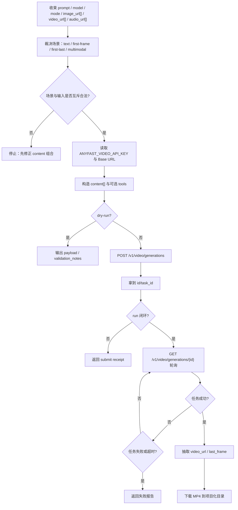
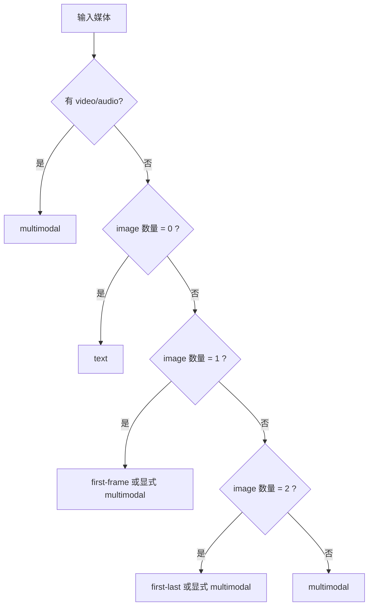

# Seedance 生视频技能

## Context Loading Contract

- 每次调用本技能时，必须同时加载同目录 `CONTEXT.md` 作为预加载上下文。
- 若同目录 `CONTEXT.md` 缺失，应先补齐最小知识库骨架，或向用户明确报告阻塞；不得在未检查该上下文的情况下执行技能。
- 冲突优先级：用户显式请求 > 仓库/全局 `AGENTS.md` > 本 `SKILL.md` > 同目录 `CONTEXT.md`。

## 1. 作用范围

- 本技能用于通过 AnyFast / FineAPI 风格的 `POST /v1/video/generations` 与 `GET /v1/video/generations/{id}` 提交、轮询并下载 Seedance 视频任务。
- 当前纳入技能合同的模型面：
  - `seedance`
  - `seedance-fast`
- 按 2026-04-17 官方 AnyFast 文档口径：
  - `seedance` = 当前最新质量优先别名，对应 `Seedance 2.0`
  - `seedance-fast` = 当前最新速度优先别名，对应 `Seedance 2.0 Fast`
- 覆盖动作：
  - `submit/create`：创建视频生成任务
  - `status`：查询任务状态
  - `download`：解析并下载视频成片
  - `run`：创建 -> 轮询 -> 下载
- 默认脚本入口：

```bash
python3 .agents/skills/api/video/seedance/scripts/seedance_video_generate.py ...
```

## 2. 已确认真源与模型别名说明

- 当前真源以上游官方文档为主，已沉到 `references/api.md`：
  - AnyFast 官方 `Seedance 2.0`
  - AnyFast 官方 `Seedance 2.0 Fast`
  - AnyFast 官方 `Seedance 任务查询`
- 已稳定确认：
  - 创建端点：`POST /v1/video/generations`
  - 查询端点：`GET /v1/video/generations/{id}`
  - 核心字段：`model / content / generate_audio / resolution / ratio / duration / tools`
  - 异步模式：先 create，再轮询，成功后拿到 `video_url`
- 已稳定确认的模型策略：
  - 默认模型治理统一回指父级 `../runbooks/default-model-policy.md` 的 `rolling-latest-quality-alias` 规则族。
  - 默认模型始终使用 `seedance`，因为这是 AnyFast 当前“最新质量优先”滚动别名。
  - `seedance-fast` 保留为“最新速度优先”滚动别名，适用于低时延或低成本试跑。
  - 若未来官方继续升级 2.x/3.x，只要 AnyFast 保持该别名语义，本技能默认值无需改成新的长模型号即可继续落在最高版本。

## 3. 必需输入

- `model`
  - 默认 `seedance`（当前最高质量版本别名）
  - 可选 `seedance-fast`
- 输入内容 `content[]`
  - 由 `prompt`、图片、视频、音频按规则组合而成
- API Key
  - 优先读取根目录 `.env` 中的 `ANYFAST_VIDEO_API_KEY`
  - 回退 `SEEDANCE_API_KEY`
  - 再回退 `ANYFAST_API_KEY`
  - 再回退 `FINEAPI_API_KEY`
  - 也可显式传 `--api-key`
- Base URL
  - 优先 `SEEDANCE_API_BASE_URL`
  - 回退 `ANYFAST_API_BASE_URL`
  - 再回退 `FINEAPI_API_BASE_URL`
  - 默认 `https://fw2afus.ent.acc.kurtisasia.com`

常用可选输入：

- `prompt`
- `mode`：`auto / text / first-frame / first-last / multimodal`
- `image-url`：可重复；支持公网 URL、`data:image/...`、`asset://...`、本地图片路径
- `video-url`：可重复；支持公网 URL 或 `asset://...`
- `audio-url`：可重复；支持公网 URL、`data:audio/...`、`asset://...`、本地音频路径
- `generate-audio`：默认 `true`
- `resolution`：默认 `720p`
- `ratio`：默认 `adaptive`
- `duration`：默认 `5`
- `web-search`
- `watermark`
- `project-name`
- `output-dir`
- `poll-interval`
- `max-wait-seconds`
- `filename-prefix`
- `report-json`
- `timeout`
- `dry-run`

## 4. 核心约束（Mandatory）

1. **场景互斥刚性**
   - 首帧图生视频、首尾帧图生视频、多模态参考生视频是三种互斥场景。
   - 不得把 `first_frame / last_frame` 与 `reference_image / reference_video / reference_audio` 混在同一个请求里。
2. **`web_search` 仅允许文本生视频**
   - 一旦开启 `tools=[{type:web_search}]`，请求中不得再带图片、视频或音频。
3. **音频不能单独输入**
   - `audio_url` 至少要与 1 个图片或视频参考同时存在。
4. **`mode=first-frame`**
   - 只能有 1 张图片。
   - 不得带视频或音频。
5. **`mode=first-last`**
   - 必须恰好 2 张图片。
   - 角色分别是 `first_frame / last_frame`。
   - 不得带视频或音频。
6. **`mode=multimodal`**
   - 图片角色一律为 `reference_image`
   - 视频角色一律为 `reference_video`
   - 音频角色一律为 `reference_audio`
   - 图片数量若存在则最多 `9`
   - 视频数量最多 `3`
   - 音频数量最多 `3`
7. **输入格式边界**
   - 图片支持 URL / `data:image/...` / `asset://...` / 本地图片路径转 Base64 Data URL
   - 音频支持 URL / `data:audio/...` / `asset://...` / 本地音频路径转 Base64 Data URL
   - 视频当前只接受公网 URL 或 `asset://...`，不自动把本地视频转 Base64
8. **输出边界**
   - 分辨率只接受 `480p / 720p`
   - 宽高比只接受 `16:9 / 4:3 / 1:1 / 3:4 / 9:16 / 21:9 / adaptive`
   - 时长只接受 `4-15` 的整数或 `-1`
9. **统一使用 `.env` 中的 `ANYFAST_VIDEO_API_KEY` 作为主事实源**
   - 技能文件、脚本输出、报告均不得回写明文 token。
10. **失败优先修源层**
    - 若出现模式混用、角色映射错误、字段兼容漂移、查询响应结构变化或下载 URL 抽取失败，优先修：
      - `scripts/seedance_video_generate.py`
      - `references/api.md`
      - 本 `SKILL.md`

## 5. Visual Maps (Mermaid)

### 5.1 主流程



### 5.2 场景分支



## 6. 统一字段主表（Mandatory）

| field_id | 输出位置/字段 | 内容要求 | 证据来源 | 默认责任 Step | 质量维度 | 失败码 |
| --- | --- | --- | --- | --- | --- | --- |
| `FIELD-SEEDANCE-01` | 输入解析结果：`prompt / mode / images / videos / audios / project_name` | 场景收束清楚，互斥关系成立 | 用户提供接口说明、CLI 参数 | Step 1 | 输入收束完整度 | `FAIL-SEEDANCE-INPUT` |
| `FIELD-SEEDANCE-02` | 参数裁决：`model / generate_audio / resolution / ratio / duration / tools` | 默认值稳定，枚举合法，别名语义明确 | AnyFast 官方模型/API 文档 | Step 2 | 参数与契约一致性 | `FAIL-SEEDANCE-PARAMS` |
| `FIELD-SEEDANCE-03` | 创建请求：`POST /v1/video/generations` JSON 请求体 | `content[]` 角色准确，工具字段只在合法场景发送 | 用户提供 create API | Step 3 | 请求体合法性 | `FAIL-SEEDANCE-CREATE` |
| `FIELD-SEEDANCE-04` | 查询结果：`GET /v1/video/generations/{id}` | 状态、进度、视频 URL、原始响应均被保留 | 用户提供 query API 与响应样例 | Step 4 | 异步状态机稳定性 | `FAIL-SEEDANCE-STATUS` |
| `FIELD-SEEDANCE-05` | 下载结果：MP4 与可选尾帧 | 视频地址被正确抽取并落盘 | 用户提供成功响应样例 | Step 5 | 输出闭环完整性 | `FAIL-SEEDANCE-DOWNLOAD` |

## 7. 思维导引与执行流程（Mandatory）

### 7.1 固定步骤

1. **Step 1 / 输入收束**
   - 读取 `prompt`、`mode`、`image-url[]`、`video-url[]`、`audio-url[]`
   - 将本地图片/音频按 Data URL 规则编码
   - 对本地视频直接报错，不伪装成已支持
2. **Step 2 / 参数与环境裁决**
   - 读取 `ANYFAST_VIDEO_API_KEY`
   - 读取 `SEEDANCE_API_BASE_URL / ANYFAST_API_BASE_URL / FINEAPI_API_BASE_URL`
   - 校验 `model / resolution / ratio / duration`
   - 显式保留模型别名语义：`seedance=最新质量优先`，`seedance-fast=最新速度优先`
3. **Step 3 / 创建任务**
   - 构造 `content[]`
   - 可选附加 `tools=[{type:web_search}]`
   - 向 `/v1/video/generations` 提交
4. **Step 4 / 轮询状态**
   - 查询 `/v1/video/generations/{id}`
   - 兼容 `QUEUED / IN_PROGRESS / RUNNING / SUCCESS / FAILED` 与内部小写状态
   - 保留原始响应
5. **Step 5 / 下载与落盘**
   - 优先从 `data.data.content.video_url` 提取视频
   - 再回退检查 `fail_reason` 是否异常承载 URL
   - 下载 MP4 到 `output/影片/[项目名]/5-API/video/seedance/`

### 7.2 思维导引表

| step_id | 聚焦字段(field_id) | 核心问题 | 生成动作 | 未达标信号 |
| --- | --- | --- | --- | --- |
| `Step 1` | `FIELD-SEEDANCE-01` | 当前到底是文本、首帧、首尾帧还是多模态？ | 统一场景并做输入归一 | 图片角色混乱、音频单独存在、模式不明 |
| `Step 2` | `FIELD-SEEDANCE-02` | 模型、分辨率、宽高比、时长和联网搜索是否合法？ | 裁决参数并写 validation notes | `web_search` 搭配媒体、duration 越界 |
| `Step 3` | `FIELD-SEEDANCE-03` | `content[]` 是否与当前场景严格匹配？ | 构造 JSON 并提交 | `first_frame` 和 `reference_image` 混用 |
| `Step 4` | `FIELD-SEEDANCE-04` | 状态机是否正确区分队列中、成功、失败？ | 轮询并归一响应 | HTTP 200 但业务状态没被识别 |
| `Step 5` | `FIELD-SEEDANCE-05` | 是否正确拿到成片并完成项目化落盘？ | 提取 URL、下载文件、写报告 | 任务成功但视频 URL 抽取失败 |

## 8. 标准调用

### 8.1 文生视频

```bash
python3 .agents/skills/api/video/seedance/scripts/seedance_video_generate.py run \
  --prompt "微距镜头对准树上鲜艳的花瓣，逐渐放大。" \
  --ratio 16:9 \
  --duration 11 \
  --project-name "测试"
```

### 8.2 首帧图生视频

```bash
python3 .agents/skills/api/video/seedance/scripts/seedance_video_generate.py run \
  --mode first-frame \
  --prompt "角色缓慢抬头，镜头轻推近，电影感自然光" \
  --image-url "https://example.com/frame0.jpg"
```

### 8.3 首尾帧图生视频

```bash
python3 .agents/skills/api/video/seedance/scripts/seedance_video_generate.py run \
  --mode first-last \
  --prompt "从首帧自然过渡到尾帧，动作连续，镜头稳定" \
  --image-url "https://example.com/frame0.jpg" \
  --image-url "https://example.com/frame1.jpg"
```

### 8.4 多模态参考

```bash
python3 .agents/skills/api/video/seedance/scripts/seedance_video_generate.py run \
  --mode multimodal \
  --prompt "延续参考视频和参考音频的节奏，完成新年一镜到底镜头。" \
  --image-url "https://example.com/ref-a.jpg" \
  --video-url "https://example.com/ref-video.mp4" \
  --audio-url "https://example.com/ref-audio.mp3" \
  --duration 11
```

### 8.5 联网搜索增强

```bash
python3 .agents/skills/api/video/seedance/scripts/seedance_video_generate.py submit \
  --prompt "生成一段关于今天旧金山天气的新闻播报短视频。" \
  --web-search \
  --duration 8 \
  --dry-run \
  --print-payload
```

## 9. 参数约定

| CLI 参数 | 创建字段 | 默认值 | 说明 |
| --- | --- | --- | --- |
| `--model` | `model` | `seedance` | 默认即 AnyFast 当前最高质量版本别名；可选 `seedance-fast` |
| `--prompt` | `content[].text` | 空 | 文本提示词 |
| `--mode` | 角色裁决 | `auto` | `text / first-frame / first-last / multimodal` |
| `--image-url` | `content[].image_url.url` | 可重复 | 图片 URL / data URL / `asset://` / 本地图片 |
| `--video-url` | `content[].video_url.url` | 可重复 | 视频 URL / `asset://` |
| `--audio-url` | `content[].audio_url.url` | 可重复 | 音频 URL / data URL / `asset://` / 本地音频 |
| `--resolution` | `resolution` | `720p` | `480p / 720p` |
| `--ratio` | `ratio` | `adaptive` | `16:9 / 4:3 / 1:1 / 3:4 / 9:16 / 21:9 / adaptive` |
| `--duration` | `duration` | `5` | `4-15` 或 `-1` |
| `--web-search` | `tools=[{type:web_search}]` | 关闭 | 仅文本生视频 |
| `--watermark` | `watermark` | 不发送 | 显式传 `true/false` 时才发送 |
| `--no-generate-audio` | `generate_audio=false` | `true` | 控制是否自动生成同步音频 |

## 10. Root-Cause Execution Contract

当用户反馈以下问题时，必须先修源层，再决定是否只改样例或局部参数：

- 官方模型别名语义与本地技能约定不一致
- 请求体中的 `role` 映射错了
- 查询成功但拿不到视频地址
- `web_search` 与媒体输入混用
- 本地图片/音频路径没有按 Data URL 正确编码

固定追溯链路：

`Symptom/Failure -> Direct Technical Cause -> Rule Source -> Meta Rule Source -> Fix Landing Points`

优先检查：

- 本 `SKILL.md` 的场景互斥合同
- `references/api.md` 的字段事实与模型别名说明
- `scripts/seedance_video_generate.py` 的内容构造与状态归一逻辑

用户闭环输出固定三段：

1. 根因位置
2. 立即修复
3. 系统预防修复
