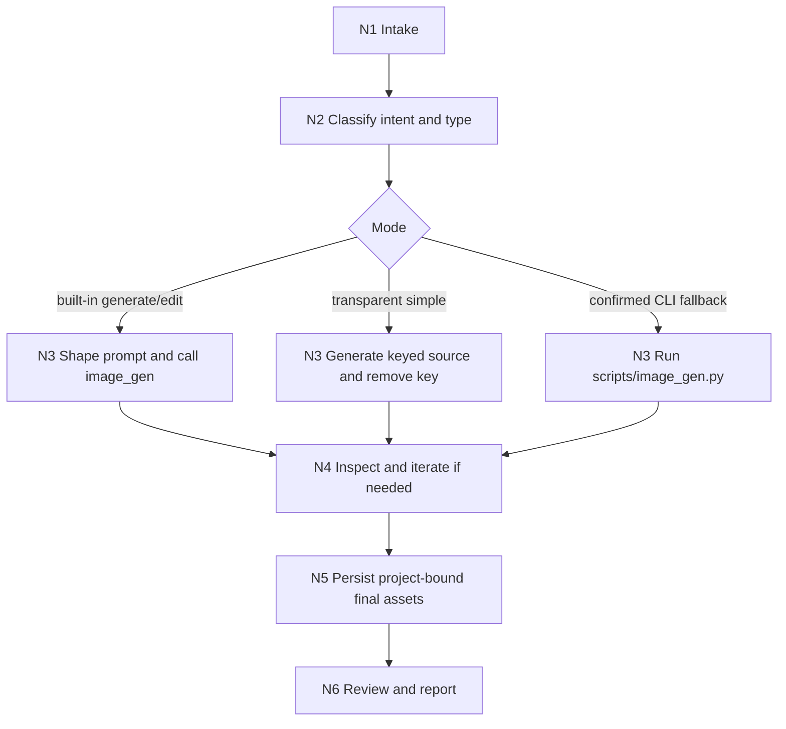

# Imagegen

`imagegen` is the Skill 2.0 entry for image generation and image editing. It routes image work to the built-in `image_gen` tool first, keeps CLI/API fallback opt-in, and ensures project-bound bitmap assets are persisted back into the active workspace.

Default resolution target: 2K. For built-in `image_gen`, express this as a prompt/delivery target because the built-in tool does not expose a hard size parameter. For CLI fallback with `gpt-image-2`, omitted `--size` resolves to `2048x1152`; non-`gpt-image-2` fallback models keep their own supported default.

## Context Loading Contract

- Every invocation must load this `SKILL.md` together with same-directory `CONTEXT.md`; 必须同时加载同目录 `CONTEXT.md`.
- Use this file to lock the input/output contract, mode route, quality gates, and dynamic reference map.
- Load `types/type-map.md` before choosing a generation/edit strategy when the request involves multiple asset types, transparent output, batches, text-heavy images, or reference images.
- Load `steps/execution-workflow.md` before executing; load `review/review-contract.md` before final delivery.
- Conflict priority: user request > repository `AGENTS.md` > this `SKILL.md` > `references/`, `steps/`, `types/`, `review/`, `templates/` > `agents/openai.yaml` > `CONTEXT.md` > `knowledge-base/`.

## Scope

Use this skill for:

- New raster images such as concept art, product shots, website hero assets, sprites, mockups, covers, infographics, or story illustrations.
- Image edits such as background replacement, object removal, compositing, style transfer, weather/lighting changes, cutouts, and text localization inside an image.
- Multiple image assets or variants when the final deliverables are bitmap files.

Do not use this skill for:

- Repo-native SVG/vector icon systems, deterministic diagrams, HTML/CSS/canvas-only visuals, or editable design-code assets that should remain code-native.
- Small edits to an existing native vector/code asset when direct file editing is the better source of truth.
- User requests that explicitly ask for non-image code or text artifacts only.

## Input Contract

- Accepted input: a natural-language image request, an edit request, one or more reference images, local image paths that can be inspected before editing, desired output location, or explicit CLI/API/model controls.
- Required input: the intended visual subject or edit target; for edits, the image role must be clear enough to distinguish edit target from reference/supporting images.
- Optional input: asset purpose, style, composition, aspect ratio, exact in-image text, constraints, avoid list, project destination, batch prompt set, mask path, CLI model/quality/size/output-format preferences. If no resolution is specified, use the 2K default target.
- Ask before proceeding when: the edit target cannot be identified, exact in-image text is missing but text accuracy is essential, true/native transparency is requested without explicit CLI confirmation, a local file needs built-in editing but has not been made visible in context, or the requested fallback requires `OPENAI_API_KEY`.
- Reject or reroute when: the task is better solved as SVG/vector/code-native output, the user asks to modify `scripts/image_gen.py`, or the request would overwrite an existing asset without explicit replacement intent.

## Mode Selection

| mode | trigger | execution route | required references |
| --- | --- | --- | --- |
| `built_in_generate` | New bitmap image request with no explicit CLI/API opt-in | Built-in `image_gen` | `references/mode-routing.md`, `references/prompting.md`, `types/type-map.md` |
| `built_in_edit` | Existing image should be modified and is visible in conversation context | Built-in `image_gen` edit flow | `references/mode-routing.md`, `steps/execution-workflow.md` |
| `transparent_chroma_key` | Simple transparent/cutout request | Built-in `image_gen` on flat key color, then local alpha removal | `references/transparent-background.md` |
| `cli_fallback` | User explicitly asks for CLI/API/model controls, or confirms true transparency fallback | `scripts/image_gen.py`; default `gpt-image-2` size is `2048x1152` | `references/cli.md`, `references/image-api.md`, `references/codex-network.md` |
| `batch_or_variants` | Multiple requested assets or variants | Repeated built-in calls by default; CLI `generate-batch` only after explicit CLI opt-in | `steps/execution-workflow.md`, `references/cli.md` when opted in |

Default route: use the built-in `image_gen` tool. Do not switch to CLI fallback for ordinary quality, size, output-path, or batch wording alone.

## Reference Loading Guide

| need | load |
| --- | --- |
| Mode boundaries, when to use/not use, built-in edit semantics | `references/mode-routing.md` |
| Prompt structure, specificity, invariants, text handling, use-case tips | `references/prompting.md` |
| Copy/paste prompt recipes | `references/sample-prompts.md` |
| Transparent background and alpha validation flow | `references/transparent-background.md` |
| Built-in save-path policy and workspace persistence | `references/output-persistence.md` |
| Fallback CLI usage and examples | `references/cli.md` |
| Fallback API/model parameter reference | `references/image-api.md` |
| Fallback network and sandbox guidance | `references/codex-network.md` |
| Request taxonomy, intent classification, shared prompt schema | `types/type-map.md` |
| Execution nodes, batch handling, handoff, and convergence | `steps/execution-workflow.md` |
| Final quality gate and reviewer fallback | `review/review-contract.md` |
| Reusable field lessons and failure patterns | `knowledge-base/imagegen-heuristics.md` and `CONTEXT.md` |
| Output report shape | `templates/output-template.md` |
| Product metadata and icons | `agents/openai.yaml` and `assets/` |
| Mechanical helpers | `scripts/image_gen.py`, `scripts/remove_chroma_key.py` |

## Execution Contract

1. Classify the request in `types/type-map.md`: generation vs edit, single vs batch, transparent vs opaque, preview-only vs project-bound, built-in vs CLI-confirmed.
2. Label every input image role before execution: edit target, reference image, or supporting compositing/style input.
3. Use built-in `image_gen` by default. If editing a local file with the built-in path, inspect it first so the image is visible in context.
4. If the user did not specify resolution, target 2K output. In built-in mode, include a concise 2K-quality/resolution intent in the prompt; in CLI `gpt-image-2` mode, omit `--size` or use `2048x1152` for landscape 2K unless a different aspect ratio is required.
5. For transparent output, follow `references/transparent-background.md`: chroma-key built-in first, and ask before true CLI transparency unless the user already opted in.
6. For CLI fallback, use `scripts/image_gen.py` directly and do not create one-off SDK runners.
7. Inspect generated output for subject, style, composition, text accuracy, invariants, transparency, resolution target, and avoid-list compliance.
8. Persist project-bound finals according to `references/output-persistence.md`; never leave a project-referenced asset only under `$CODEX_HOME/generated_images/...`.
9. Complete `review/review-contract.md` and report final mode, saved path(s), final prompt or prompt set, and any residual risk.

## Root-Cause Execution Contract

When imagegen behavior fails, trace:

`Symptom -> Direct Cause -> Owner Section -> Source Contract -> Meta Rule Source`

| symptom | likely owner | repair route |
| --- | --- | --- |
| CLI fallback used without explicit opt-in | `references/mode-routing.md` | Revert to built-in route or ask for confirmation |
| Transparent PNG has fringe, opaque corners, or no alpha | `references/transparent-background.md` | Re-run alpha helper with tuned edge settings or ask for true transparency fallback |
| Project asset remains only in `$CODEX_HOME/generated_images/...` | `references/output-persistence.md` | Copy/move selected final into workspace and update references |
| Prompt invents unrelated subjects, brand copy, or scene details | `references/prompting.md` | Rebuild prompt from user constraints and specificity policy |
| Output ignores the 2K default when no user resolution was specified | `types/type-map.md` and `references/cli.md` | Restore 2K prompt target or CLI `gpt-image-2` default size |
| Batch request collapses distinct assets into variants of one prompt | `steps/execution-workflow.md` | Split into one prompt/call per distinct asset |
| CLI model parameter is unsupported or requires downgraded path | `references/image-api.md` | Ask before changing model/path; do not silently drop required options |
| Quality gate is unclear | `review/review-contract.md` | Run final checklist and record pass/pass_with_todo/needs_rework |

## Field Mapping

| field_id | owner | must contain | fail code |
| --- | --- | --- | --- |
| `FIELD-IMG-01` | `SKILL.md` | Input Contract, mode routing, Reference Loading Guide, Output Contract | `FAIL-ENTRY` |
| `FIELD-IMG-02` | `CONTEXT.md` | Type Map, Repair Playbook, Reusable Heuristics | `FAIL-CONTEXT` |
| `FIELD-IMG-03` | `references/` | detailed mode, prompt, transparency, CLI/API, persistence rules | `FAIL-REFERENCE` |
| `FIELD-IMG-04` | `types/` | request taxonomy, intent profile, prompt schema | `FAIL-TYPE` |
| `FIELD-IMG-05` | `steps/` | thinking-action nodes, branch/merge, batch convergence | `FAIL-STEPS` |
| `FIELD-IMG-06` | `review/` | final image quality and delivery gate | `FAIL-REVIEW` |
| `FIELD-IMG-07` | `templates/` | output report template aligned to this Output Contract | `FAIL-TEMPLATE` |
| `FIELD-IMG-08` | `scripts/` | bundled mechanical CLI and chroma-key helpers | `FAIL-SCRIPT` |
| `FIELD-IMG-09` | `knowledge-base/` | stable imagegen heuristics and field lessons | `FAIL-KB` |
| `FIELD-IMG-10` | `agents/` | OpenAI/Codex metadata and product entry config | `FAIL-AGENT` |

## Output Contract

- Required output: the requested image asset(s), edit result(s), prompt plan, or fallback CLI dry-run/result, plus delivery notes that identify the execution mode.
- Output format: bitmap assets such as PNG/JPEG/WebP/GIF where appropriate; default resolution target is 2K unless the user specifies otherwise. For task reporting, include saved path(s), final prompt or prompt set, mode used, and review verdict using `templates/output-template.md`.
- Output path: preview-only built-in outputs may remain under `$CODEX_HOME/generated_images/...`; project-bound final assets must be copied or moved into the active workspace; CLI fallback final assets default to `output/imagegen/` unless the user names another destination.
- Naming convention: do not overwrite existing files unless explicitly requested; create descriptive, stable filenames or sibling versioned names such as `hero-v2.png`, `item-icon-edited.png`, or `cutout-alpha.png`.
- Completion gate: final asset(s) exist at the reported path, project-bound references do not point only to `$CODEX_HOME/*`, default 2K target was requested or an explicit user size was honored, transparent outputs have a valid alpha channel when requested, CLI fallback was explicitly selected when used, and `review/review-contract.md` records `pass` or `pass_with_todo`.
