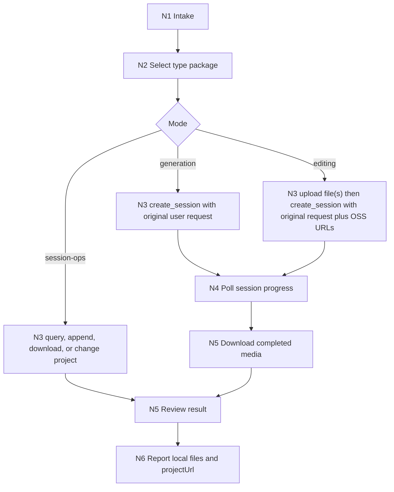

# LibTV

`libTV` is the Skill 2.0 wrapper for the LibLib.tv Agent-IM CLI skill from `libtv-labs/libtv-skills`. It lets an agent pass the user's original image or video request to LibTV, upload local references, poll session progress, and download generated media into local files.

The local Python scripts are mechanical bridges only. They must not replace creative authorship, rewrite prompts, split one user request into agent-invented subrequests, or make aesthetic/story decisions on the user's behalf.

## Context Loading Contract

- Every invocation must load this `SKILL.md` together with same-directory `CONTEXT.md`.
- 每次调用本技能时，必须同时加载同目录 `CONTEXT.md`。
- 每次调用本技能时，必须同时识别并加载同目录 `types/` 中选中的类型包（单选或多选）。
- Load `types/type-map.md` before selecting `generation`, `editing`, or `session-ops`.
- Load `steps/execution-workflow.md` before executing a LibTV task; load `review/review-contract.md` before final delivery.
- Conflict priority: user request > repository `AGENTS.md` > this `SKILL.md` > `references/`, `steps/`, `types/`, `review/`, `templates/` > `agents/openai.yaml` > `CONTEXT.md` > `knowledge-base/`.

## Multi-Subskill Continuous Workflow

When this skill is invoked for a complete LibTV task, complete the selected route without asking whether to continue after each internal step, as long as required inputs and safety gates are satisfied.

- 无序号同级子技能包默认全选并发执行，由所属父级汇总、裁决和写回唯一 canonical 输出。
- 数字序号子技能包或节点默认按数字升序串行执行，前一节点产物自动作为后一节点输入。
- 英文序号子技能包或路线默认按用户意图、父级路由或输入类型单选分流；只有用户明确要求对比、并跑或批量多路线时才多选。
- 卫星技能、旁路 reviewer、query/resume/review 类辅助入口不默认纳入主链连续调度；只有用户请求、阶段门禁或父级合同显式需要时才回接。
- Continuous dispatch must stop when `LIBTV_ACCESS_KEY` is missing, a local reference file cannot be found, the requested operation would overwrite downloaded output without explicit intent, or route ambiguity could send the wrong canonical request to LibTV.
- Every routed package or future subskill still loads its own `SKILL.md + CONTEXT.md`; scripts only perform upload, session, query, project-switch, and download operations.

## Input Contract

- Accepted input: a user image/video generation request, an edit request for one or more local images/videos, a LibTV `sessionId`, a `projectUuid`, local reference file paths, desired download directory, or a request to switch LibTV project context.
- Required input: `LIBTV_ACCESS_KEY` in the environment for live API calls; for new generation, the user's original natural-language request; for reference/edit routes, valid local image/video path(s) plus the user's instruction; for polling or downloading, a `sessionId`.
- Optional input: `OPENAPI_IM_BASE` or `IM_BASE_URL`, existing `sessionId`, `projectUuid`, output directory, output filename prefix, and explicit polling timeout.
- Ask before proceeding when: the user provides multiple local files but their roles are unclear, the output directory already contains likely-colliding filenames, or the request asks to alter the user's wording before sending to LibTV.
- Reject or defer when: the request requires API credentials that are unavailable, the source file is not an image or video, the file is over the upstream size expectation, or the task asks the local agent to fabricate prompts instead of passing the user's request through.

## Scope

Use this skill for LibTV / LibLib.tv Agent-IM operations:

- Text-to-image, text-to-video, image-to-video, video extension, and image/video editing through a LibTV session.
- Uploading local image or video references before session creation.
- Querying generation progress and downloading resulting media.
- Switching the LibTV project bound to the current access key.

Do not use this skill as a generic image-generation planner, local media editor, or prompt-expansion engine. For native bitmap generation without LibTV, route to the local `imagegen` skill instead.

## Reference Loading Guide

| need | load |
| --- | --- |
| Upstream source, environment variables, script inventory, and API shape | `references/upstream-libTV.md` |
| Execution route, polling, handoff, and result download flow | `steps/execution-workflow.md` |
| Request type selection and fixed context packages | `types/type-map.md` |
| Final quality, credential, prompt-pass-through, and file delivery checks | `review/review-contract.md` |
| Reusable operational lessons | `knowledge-base/libtv-heuristics.md` and `CONTEXT.md` |
| Output report shape | `templates/output-template.md` |
| Product metadata | `agents/openai.yaml` |
| Mechanical CLI bridge | `scripts/create_session.py`, `scripts/query_session.py`, `scripts/upload_file.py`, `scripts/download_results.py`, `scripts/change_project.py` |

## Mode Selection

| mode | trigger | action | required type package |
| --- | --- | --- | --- |
| `generation` | User asks LibTV to create an image, video, storyboard, short video, MV, ad, or related AIGC media | Send the user's original request through `create_session.py`, poll, then download results | `types/generation/generation.md` |
| `editing` | User provides one or more local images/videos and asks to modify, animate, restyle, replace, remove, extend, or use them as references | Upload each file, append numbered returned URLs to the user's original instruction, create session, poll, download | `types/editing/editing.md` |
| `session-ops` | User provides `sessionId`, asks to poll progress, download results, append a message, or switch project | Use query/download/create-session-with-session-id/change-project scripts as needed | `types/session-ops/session-ops.md` |

Default route: if the request mentions LibTV, LibLib.tv, or uses this skill explicitly and includes creative image/video intent, choose `generation` unless a local reference file makes `editing` more specific.

## Execution Contract

1. Verify `LIBTV_ACCESS_KEY` exists before any live API script call.
2. Select and load the matching package from `types/type-map.md`.
3. Preserve the user's creative wording. Do not expand, translate, stylize, or split it unless the user explicitly requests that transformation.
4. For local references, verify every path exists, upload each file with `scripts/upload_file.py`, and append the returned OSS URLs as numbered references to the original user message.
5. Create or append to a session with `scripts/create_session.py`. Capture `sessionId`, `projectUuid`, and `projectUrl`.
6. Poll with `scripts/query_session.py`, using `--after-seq` when continuing a session. Stop on completed result URLs, timeout, or repeated API failure.
7. Download generated media with `scripts/download_results.py`; choose a semantic prefix only for local filenames, not for altering the submitted prompt.
8. Run the review gate and report local file paths, result URLs if available, and the final `projectUrl` only when task delivery is complete.

## Root-Cause Execution Contract

Trace failures through:

`Symptom -> Direct Cause -> Section Owner -> Source Contract -> Meta Rule Source`

| symptom | likely owner | repair route |
| --- | --- | --- |
| Prompt was expanded or rewritten before sending | `SKILL.md` and `types/generation/` | Restore pass-through wording and rerun only with user approval |
| API call fails before help or validation | `scripts/` | Check credential loading and script import behavior |
| Reference upload succeeds but prompt omits URL | `steps/execution-workflow.md` | Rebuild the exact handoff message with the OSS URL |
| Generated media exists remotely but no local files are delivered | `scripts/download_results.py` and `review/` | Run download step or report why it could not complete |
| Route chooses generic imagegen despite explicit LibTV request | `types/type-map.md` | Reclassify request as LibTV route |

## Field Mapping

| field_id | owner | must contain | fail code |
| --- | --- | --- | --- |
| `FIELD-LIBTV-01` | `SKILL.md` | Input Contract, mode routing, Reference Loading Guide, Output Contract | `FAIL-ENTRY` |
| `FIELD-LIBTV-02` | `CONTEXT.md` | Type Map, Repair Playbook, Reusable Heuristics | `FAIL-CONTEXT` |
| `FIELD-LIBTV-03` | `references/` | upstream source, API assumptions, environment requirements | `FAIL-REFERENCE` |
| `FIELD-LIBTV-04` | `types/` | generation, editing, and session operation context | `FAIL-TYPE` |
| `FIELD-LIBTV-05` | `steps/` | upload, session, poll, download, and report nodes | `FAIL-STEPS` |
| `FIELD-LIBTV-06` | `review/` | credential, pass-through, result, and file delivery gates | `FAIL-REVIEW` |
| `FIELD-LIBTV-07` | `templates/` | final report template aligned to Output Contract | `FAIL-TEMPLATE` |
| `FIELD-LIBTV-08` | `scripts/` | upstream Python bridge scripts and usage notes | `FAIL-SCRIPT` |
| `FIELD-LIBTV-09` | `knowledge-base/` | stable operational heuristics | `FAIL-KB` |
| `FIELD-LIBTV-10` | `agents/` | product entry metadata | `FAIL-AGENT` |

## Output Contract

- Required output: completed LibTV operation evidence: session metadata, downloaded local media files when available, project canvas URL at completion, and any residual timeout or credential issue.
- Output format: concise task report following `templates/output-template.md`, with JSON command output summarized rather than pasted wholesale unless requested.
- Output path: skill package lives in `.agents/skills/cli/libTV/`; generated media should be downloaded to a user/project-appropriate local directory, defaulting to the script default when none is specified.
- Naming convention: preserve `libTV` as the skill directory and `$libTV` as the invocation name; downloaded files use descriptive lowercase prefixes such as `libtv`, `storyboard`, `character`, or a user-provided prefix.
- Completion gate: selected type package was loaded, no prompt overreach occurred, live calls had required credentials, result polling either found media or hit a reported timeout, downloads exist locally when available, and `review/review-contract.md` records `pass` or `pass_with_todo`.
