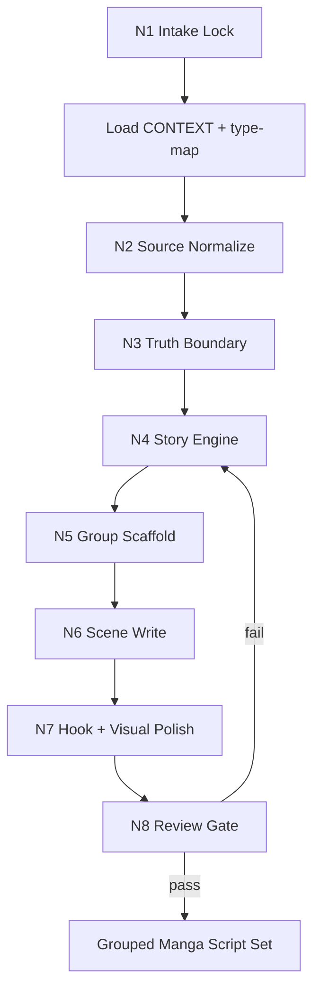

# 漫画剧本改编

## Context Loading Contract

- 每次调用本技能时，必须同时加载同目录 `CONTEXT.md` 作为预加载上下文。
- 每次调用本技能时，必须同时识别并加载同目录 `types/` 中选中的类型包。
- 每次调用本技能时，必须读取 `types/type-map.md`，识别并加载同目录 `types/` 中命中的类型包；类型包允许多选叠加。
- 若同目录 `CONTEXT.md` 或命中的类型包缺失，应先补齐最小知识库骨架，或向用户明确报告阻塞；不得在未检查上下文的情况下执行技能。
- 若当前任务已绑定 `projects/comic/<项目名>/`，优先继承 comic 根层已经锁定的 `type_stack_ref / type_pack_context`；若未给出，则按父技能合同调用 resolver 或由 LLM 先做类型包推断。
- 冲突优先级：用户显式请求 > 仓库/全局 `AGENTS.md` > comic 父级 `SKILL.md` > 本 `SKILL.md` > 已声明分区文件 > `agents/openai.yaml` > 项目上下文 > 本 `CONTEXT.md` > 命中类型包经验。

## Positioning

本技能把任意资料改编为可直接指导后续 `2-九刀流漫画提示词` 的漫画剧本真源。最终业务真源是按组落盘的 `第N组.md` 集合，而不是整篇 prose、桥接包、结构化 JSON 或并行主稿。

核心立场：

- 先做来源归一与事实边界判断，再做漫画剧本化改编。
- 对虚构来源默认采用 `comic-first`：保住人物关系核、情绪核、卖点核与关键代价，允许换序、并戏、前置炸点、延后解释和奇观化。
- 对新闻、热搜和纪实事件必须锁 `truth_boundary`，区分已知事实、公共情绪与虚构承载线。
- 正文必须场景化、可分页、可被九刀流逐组消费；每组具备 `开场抓停 -> 中段推进/阻力 -> 组末悬停`。
- 核心创作正文必须由 LLM 直接完成；脚本只做校验、统计、格式检查和机械辅助。

## Input Contract

### Required Input

- `source_material`: 原始素材本体，可以是文本、图片描述、视频内容摘要、新闻事件、热搜话题或多源集合。
- `adaptation_goal`: 若用户未给，默认为“改编为可直接指导九刀流漫画提示词的精彩漫画剧本”。

### Optional Input

- `project_name`
- `output_root`: 默认继承 comic 父技能，为 `projects/comic/<项目名>/1-漫画剧本改编/`
- `source_type`: `text | image | video | news_event | hot_search | mixed`
- `target_genre`
- `target_audience`
- `type_stack_ref`
- `type_pack_context`
- `length_target`: `short_burst | mini_serial | medium_arc`
- `truth_boundary`: `faithful | inspired_by | free_reimagining`
- `adaptation_posture`: `faithful-core | comic-first | spectacle-first`
- `narrative_reorder_policy`: `preserve | adaptive | aggressive`
- `hook_intensity`: `balanced | strong | relentless`
- `spectacle_priority`: `balanced | high | maximal`
- `pacing_drive`: `stable | punchy | relentless`
- `delivery_flavor`: `standard_comic | explainer_comic_compatible`
- `script_variant_preference`: `scene-script | narration-script | compare`
- `output_mode`: `reply_only | grouped_files`

### Reject Or Clarify When

- 用户要求逐段照抄受版权保护长文本并仅做表面换词。
- 用户要求把现实新闻改写成伪纪实，但没有声明虚构衍生边界。
- 只给“热点名词”却要求编出具体事实结论。
- 既要求严格保真又要求重写关键事实、人物责任或现实结论。
- 缺少素材到无法判断来源类型、事实边界或基本剧情发动机。

## Mode Selection

| mode | trigger | fixed type package |
| --- | --- | --- |
| `text_adaptation` | 小说、故事梗概、帖文、半成品剧本、虚构剧情源 | `types/source-types/text.md` |
| `visual_adaptation` | 图片、海报、角色图、视频摘要、镜头序列 | `types/source-types/visual.md` |
| `news_hotsearch_adaptation` | 新闻事件、网络热搜、社会议题、纪实类素材 | `types/source-types/news-hotsearch.md` |
| `mixed_source_adaptation` | 多图、多文、多源补充材料互相组合 | `types/source-types/mixed.md` |
| `directing_projection` | 来源含对白、旁白、音效、系统提示、规则文字或需要声画字段对齐 | `types/projection/directing-field-bridge.md` |
| `reply_only` | 用户只要求当前回复交付，不允许写盘 | `types/output-modes/reply-only.md` |
| `grouped_files` | 用户给出项目名或目标目录，允许按组落盘 | `types/output-modes/grouped-files.md` |

`adaptation_posture` 类型包按需叠加：

- `types/adaptation-postures/faithful-core.md`
- `types/adaptation-postures/comic-first.md`
- `types/adaptation-postures/spectacle-first.md`

## Reference Loading Guide

| 场景 | 读取文件 |
| --- | --- |
| 来源归一、模式选择、多源主锚点裁决 | `references/source-intake-and-mode-selection.md` |
| 漫画剧本成稿规格、格式裁决、字段纪律 | `references/comic-script-writing-spec.md` |
| 吸收 `2-编导` 的声画配对、字段纯度和场景锚点规范 | `references/directing-field-projection-bridge.md` |
| 画面冲击力、视觉奇观、大格/跨页/静默爆点 | `references/visual-spectacle-engine.md` |
| 节奏优化、钩子链、爽感、信息延后 | `references/pacing-hook-thrill-engine.md` |
| 中二感、命名势能、誓言与宿命强化 | `references/chunibyo-intensity-engine.md` |
| 章末钩子类型、避坑与示例 | `references/hook-ending-playbook.md` |
| 新闻/热搜事实边界与热点衍生方法 | `references/hotsearch-news-adaptation.md` |
| 思行节点细则与返工路由 | `steps/adaptation-workflow.md` |
| 质量评分、验收门与 provider 降级口径 | `review/review-contract.md` |
| 分组文件输出模板 | `templates/grouped-manga-script.template.md` |
| Output Contract 五字段映射模板 | `templates/output-template.md` |
| 分组文件结构与目录编号校验 | `scripts/validate_grouped_manga_script.py` |
| comic 根级类型包加载合同 | `../_shared/type-pack-loading-contract.md` |
| comic type-pack resolver | `../scripts/data_modules/comic_type_pack_resolver.py` |

## Execution Topology



## Core Workflow

1. 锁定 `source_material / adaptation_goal / output_mode`，读取 `CONTEXT.md` 与 `types/type-map.md`。
2. 选择并加载来源类型包、改编姿态包和输出模式包。
3. 归一来源，形成 `source_digest`：事实、画面、情绪、人物关系、未解点。
4. 锁定 `truth_boundary`，现实来源必须写明事实锚点与虚构许可。
5. 生成 `adaptation_brief`：主角、对手、欲望、代价、卖点核、保核边界与重排许可。
6. 生成分组方案：按约 `1000` 字一组，尊重场景、动作、冲突、钩子和 payoff 的自然边界。
7. 写成按组漫剧正文；每组必须可直接被 `2-九刀流漫画提示词` 当作一个九页处理单元。
8. 注入组末钩子、视觉锚点、场景锚点、声画配对提示、类型包 handoff 与必要的解说漫朗读纪律。
9. 按 `review/review-contract.md` 与 validator 验收；失败时回到对应节点返工。

## Output Contract

- Required output: `第1组.md`、`第2组.md`、`第3组.md` 等分组漫剧剧本；若 `output_mode=reply_only`，则在回复中按同样结构输出各组。
- Output format: Markdown；每组至少包含 frontmatter、`# 第N组`、`【本组跨度】`、`【边界判定】`、`【漫剧正文】`、`【组末钩子】`。
- Output path: 默认 `projects/comic/<项目名>/1-漫画剧本改编/`；用户显式指定目录时按指定目录执行并在交付中说明。
- Naming convention: 组文件严格命名为 `第N组.md`，从 `第1组.md` 连续递增；不得混用“第N集”或 `page_group_plan.json` 作为并行主真源。
- Completion gate: 每个组文件能通过 `python3 .agents/skills/comic/1-漫画剧本改编/scripts/validate_grouped_manga_script.py <path>`；目录交付时还需通过同脚本的目录级连续性检查；语义层还需通过 `review/review-contract.md` 的 `pass` 或 `pass_with_followups`。

## Grouped File Minimum Schema

```markdown
---
项目名: <项目名>
组号: 第<N>组
分组口径: 约1000字一组
估算原文字数: <positive integer>
尾组决议: <single_group|normal|merged_into_previous|standalone_tail>
source_type: <text|image|video|news_event|hot_search|mixed>
truth_boundary: <faithful|inspired_by|free_reimagining>
adaptation_posture: <faithful-core|comic-first|spectacle-first>
type_stack_summary: <<base> / <primary> / <secondary...>>
type_stack_active_packs: <_base|经典漫画叙事|...>
type_pack_projection_script_adaptation: <script adaptation stage projection summary>
type_pack_projection_nine_blade: <nine blade prompting stage projection summary>
---

# 第<N>组

【本组跨度】
<一句话说明本组覆盖的剧情推进、冲突跨度或起止状态>

【边界判定】
<说明为什么这一组在这里起止；若是尾组，必须写明决议与理由>

【漫剧正文】
<可直接被 2 号技能消费的场景化漫剧正文>

【组末钩子】
<下一组或下一轮九刀必须承接的悬停点、危险逼近点或关系反转点>
```

## Field Mapping

### Directory Ownership Table

| field_id | directory_or_file | owner_role | must_contain | fail_code |
| --- | --- | --- | --- | --- |
| `FIELD-COMIC-STAGE1-01` | `SKILL.md` | 入口与裁决层 | 触发、Input Contract、Mode Selection、动态引用、Output Contract | `FAIL-SKILL-ENTRY` |
| `FIELD-COMIC-STAGE1-02` | `CONTEXT.md` | 经验层 | Type Map、Repair Playbook、Reusable Heuristics | `FAIL-CONTEXT-BASELINE` |
| `FIELD-COMIC-STAGE1-03` | `references/` | 细则层 | 来源、格式、奇观、节奏、钩子、新闻事实边界 | `FAIL-REFERENCE-MISSING` |
| `FIELD-COMIC-STAGE1-04` | `steps/` | 思行网络层 | N1-N8 节点、证据门、返工路由 | `FAIL-STEPS-NETWORK` |
| `FIELD-COMIC-STAGE1-05` | `types/` | 类型包层 | 来源类型包、改编姿态包、输出模式包和 type-map | `FAIL-TYPE-PACKAGE` |
| `FIELD-COMIC-STAGE1-06` | `review/` | 质量门禁层 | 评分矩阵、pass table、provider 降级口径 | `FAIL-REVIEW-GATE` |
| `FIELD-COMIC-STAGE1-07` | `templates/` | 输出模板层 | 分组稿模板与 Output Contract Alignment | `FAIL-TEMPLATE-MISSING` |
| `FIELD-COMIC-STAGE1-08` | `scripts/` | 自动化辅助层 | 分组文件 validator；不得代写创作正文 | `FAIL-SCRIPT-BOUNDARY` |
| `FIELD-COMIC-STAGE1-09` | `agents/openai.yaml` | 入口元数据层 | display_name、short_description、default_prompt | `FAIL-AGENT-METADATA` |

### Node Handoff Table

| node_id | input | action | output | next_gate |
| --- | --- | --- | --- | --- |
| `N1-INTAKE` | 用户素材与目标 | 锁任务、输出模式、项目根 | `task_brief` | `N2-TYPES` |
| `N2-TYPES` | `task_brief`、`types/type-map.md` | 选择并加载类型包 | `type_profile` | `N3-SOURCE` |
| `N3-SOURCE` | 原始素材、类型包 | 来源归一、主锚点裁决 | `source_digest` | `N4-BOUNDARY` |
| `N4-BOUNDARY` | `source_digest` | 锁事实边界与改写许可 | `boundary_note` | `N5-ENGINE` |
| `N5-ENGINE` | `boundary_note`、类型投影 | 设计冲突、卖点、保核边界、刺激曲线 | `adaptation_brief` | `N6-GROUP` |
| `N6-GROUP` | `adaptation_brief` | 分组、写正文、补钩子与视觉锚点 | `第N组.md` 集合 | `N7-REVIEW` |
| `N7-REVIEW` | 组文件集合 | 结构 validator + 语义 review gate | `validation_result` | pass 或返工 |

### Failure Routing Table

| fail_code | symptom | rework_target |
| --- | --- | --- |
| `FAIL-COMIC-01` | 改编稿像摘要，不像可画剧本 | `steps/adaptation-workflow.md` 的 `N3-N6` |
| `FAIL-COMIC-02` | 新闻/热搜事实与虚构混淆 | `references/hotsearch-news-adaptation.md` 与 `types/source-types/news-hotsearch.md` |
| `FAIL-COMIC-03` | 虚构原著过度守序，前段平、后段挤 | `types/adaptation-postures/comic-first.md` |
| `FAIL-COMIC-04` | 画面很炸但角色动机断裂 | `references/visual-spectacle-engine.md` 与 `N5-ENGINE` |
| `FAIL-COMIC-05` | 分组机械截断或尾组决议不可审查 | `types/output-modes/grouped-files.md` 与 validator |
| `FAIL-COMIC-06` | 组文件无法被 2 号逐组消费 | `templates/grouped-manga-script.template.md` 与 `review/review-contract.md` |
| `FAIL-COMIC-07` | 仍残留整篇主稿、桥接包或 JSON 竞争真源 | 本 `Output Contract` |
| `FAIL-COMIC-08` | 声音、画面、心理和规则文字混写，导致下游无法拆成漫画格 | `references/directing-field-projection-bridge.md` |

## Root-Cause Execution Contract

遇到失败时必须沿以下链路追溯：

`Symptom -> Direct Technical Cause -> Section Owner -> Rule Source -> Meta Rule Source -> Fix Landing Points`

优先修复顺序：

1. 输入边界不清：回到本 `Input Contract` 与 `types/type-map.md`。
2. 来源归一失败：回到 `references/source-intake-and-mode-selection.md`。
3. 事实边界失败：回到 `references/hotsearch-news-adaptation.md`。
4. 场景化与节奏失败：回到 `steps/adaptation-workflow.md` 与 `references/pacing-hook-thrill-engine.md`。
5. 视觉冲击失败：回到 `references/visual-spectacle-engine.md`。
6. 声画字段、心理可视化或系统文字显影失败：回到 `references/directing-field-projection-bridge.md`。
7. 输出结构失败：回到 `templates/output-template.md`、`templates/grouped-manga-script.template.md` 与 validator。
8. 可复用经验：沉淀到 `CONTEXT.md`；外部资料或长知识材料才进入 `knowledge-base/`。

## Completion Criteria

- 已加载 `CONTEXT.md` 与命中的 `types/` 类型包。
- 已锁定来源类型、事实边界、改编姿态和输出模式。
- 已按约 `1000` 字默认口径完成分组，并处理尾组规则。
- 已按 `第N组.md` 命名并保证顺序连续。
- 每组都包含 `估算原文字数`、`尾组决议`、`【边界判定】`、`【漫剧正文】` 和 `【组末钩子】`。
- 每组都继承 `type_stack_active_packs / type_pack_projection_script_adaptation / type_pack_projection_nine_blade`。
- 最终交付只有按组漫剧剧本真源，无并行主稿竞争。
