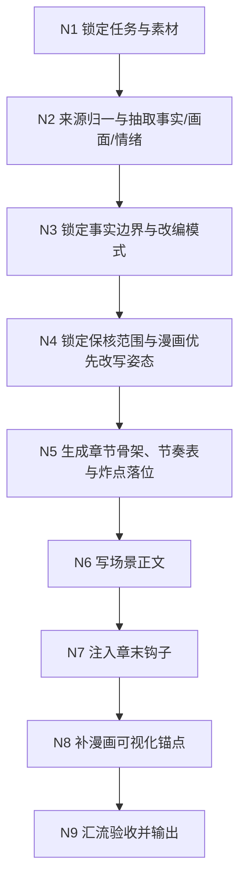
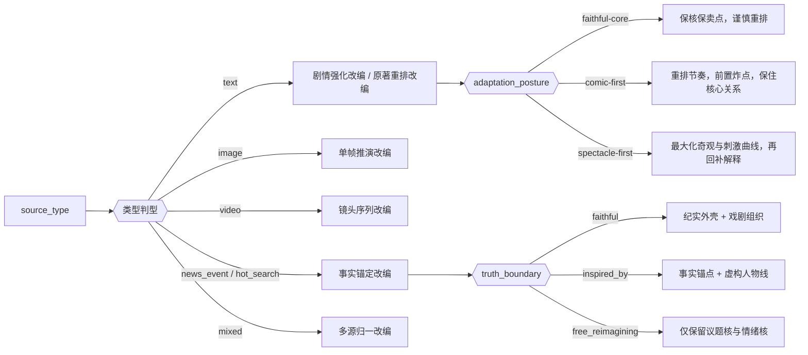
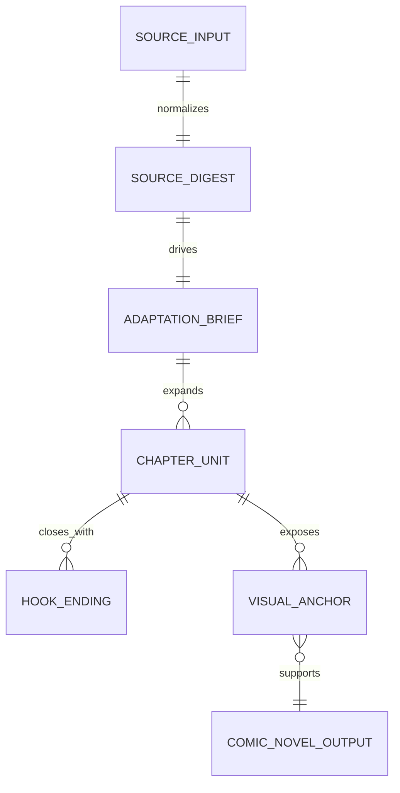

# 漫画剧本改编

## Context Loading Contract

- 每次调用本技能时，必须同时加载同目录 `CONTEXT.md` 作为预加载上下文。
- 若同目录 `CONTEXT.md` 缺失，应先补齐最小知识库骨架，或向用户明确报告阻塞；不得在未检查该上下文的情况下执行技能。
- 冲突优先级：用户显式请求 > 仓库/全局 `AGENTS.md` > 本 `SKILL.md` > 同目录 `CONTEXT.md`。

## 概述

本技能把任意资料改编为“可直接指导后续 `2-九刀流漫画提示词`”的漫画剧本真源，而不是只把原材料换一种说法复述。

核心目标有六个：

- 保住来源材料真正不能丢的核：事实核、情绪核、人物关系核与卖点核，而不是机械保留所有细节顺序。
- 把素材改造成场景化、剧本化、强钩子化、可分页感明确的漫画剧本。
- 允许为了后续漫画效果主动重排、并戏、拔高、夸张与制造奇观，只要不把核心卖点改没。
- 让成稿天然具备后续漫画分镜、角色立绘与画面提示词蒸馏所需的视觉锚点与结构化 handoff。
- 让氛围层、视觉冲击点与节奏刺激点在正文阶段就被预先设计，而不是写完后才被动补桥接。
- 在需要兼容解说漫时，让正文描述既能成为漫画画面母稿，也能成为可直接朗读的沉浸式旁白素材。

默认概念：

- 默认输入以文本为主，但允许图片、视频、新闻事件、网络热搜与多源混合输入。
- 默认输出不是“传统长篇纯文学”，而是“场景明确、对白/旁白纪律明确、可分页、可桥接九刀流”的漫画剧本。
- 默认最终真源是按组落盘的漫剧剧本集合：`第1组.md`、`第2组.md`、`第3组.md`……
- 默认输出聚焦“分组好的漫剧剧本”，不再额外挂出 `formatted_source_script.json`、桥接包或思行摘要作为并行主真源。
- 默认每个组都要为下游提供一个完整的九页节奏单元：有开场抓停、中段推进/阻力和组末悬停点。
- 对虚构原著、故事梗概、小说片段、网文与影视剧情类输入，默认采用 `comic-first` 立场：优先保住人物关系核、情绪核和名场面潜力，不把原叙事顺序与局部细节视为硬门槛。
- 对现实新闻、热搜、纪实事件类输入，继续受 `truth_boundary` 约束；允许戏剧组织，但不允许把虚构写成事实。

## Skill Execution Rule (Mandatory)

硬规则：

- 先做来源归一与事实边界判断，再做漫画剧本化改编。
- 先锁定“这是给 `2-九刀流漫画提示词` 继续消费的漫画剧本真源”，再决定格式、节奏与场景密度。
- 先做格式裁决，再写正文。原始输入必须先被裁决为 `scene-script / narration-script / compare` 之一。
- 先锁定高冲击画面候选与氛围压力场，再决定正文的展开顺序与停笔位置。
- 对虚构输入，默认先决定“哪里要炸、哪里要急停、哪里要留白”，再决定哪些信息前置、后置、并戏或删减。
- 若用户要求兼容解说漫，正文必须同时满足“可画”和“可念”：画面要清，旁白要顺，句子要短，声压要稳。
- 最终交付写成按组 Markdown；不得再并行维护第二份结构化主稿与桥接主稿互相竞争真源。
- 改编不是照抄。可以重组、压缩、扩写、补桥、换序、并戏、拔高、夸张，但不得把核心卖点改没。
- 当“信息解释完备”与“漫画页冲击力/节奏刺激性”冲突时，优先保住画面势能与翻页驱动力，再把必要信息拆散回补。
- 图片/视频输入不得直接写成空泛描述，必须先还原事件链、冲突链与视觉锚点。
- 新闻/热搜输入默认进入“事实锚定”模式：已知事实与虚构扩写必须可区分，不能把虚构段落冒充现实事实。
- 若用户未指定类型，优先按素材天然势能选择：悬疑、甜宠、复仇、玄幻、穿越重生、都市成长等最能放大原素材冲突的路由。

## Business Requirement Analysis Contract (Mandatory)

在真正下笔前，至少先锁定以下分析字段：

| analysis_field | 要回答的问题 | 默认要求 |
| --- | --- | --- |
| `business_goal` | 这篇稿子要服务什么后续动作 | 默认服务“`2-九刀流漫画提示词` 的直接上游分组漫剧剧本真源” |
| `business_object` | 原始输入到底是什么 | 文本 / 图片 / 视频 / 新闻热搜 / 多源混合 |
| `core_sell_point` | 最值得追更的卖点是什么 | 人物关系、反转、悬念、欲望、复仇、甜虐、奇观至少锁一个 |
| `format_goal` | 当前要写成哪种漫画剧本格式 | 默认裁决 `scene-script / narration-script / compare` |
| `constraint_profile` | 哪些边界不能越 | 事实边界、平台安全、角色年龄、暴力尺度、用户明示禁区 |
| `success_criteria` | 什么叫改编成功 | 分组清楚、读得下去、看得见、有钩子、每组都可直接进入九刀流 |
| `topology_fit` | 哪种思行网络最合适 | 单源走串行主干，多源与新闻热点走“归一 + 分支 + 汇流” |
| `step_strategy` | 本轮重点在哪 | 事实抽取、格式裁决、场景骨架、正文落地、钩子强化 |
| `adaptation_posture` | 本轮更偏保核重构还是高烈度奇观化 | 默认虚构输入取 `comic-first`，现实输入按 `truth_boundary` 收紧 |
| `fidelity_floor` | 哪些部分绝不能被改丢 | 默认锁定 `人物关系核 / 情绪核 / 卖点核 / 关键代价` |
| `type_stack_ref` | 当前项目激活了哪些漫画类型包 | 默认经 `comic_type_pack_resolver.py` 锁定 `base / primary / secondary / platform / audience` |
| `type_pack_projection` | 本段该继承什么类型化写法 | 默认读取 `type_pack_context.stage_projection.script_adaptation` |
| `manga_impact_profile` | 哪几处必须具备页级/格级冲击力 | 默认至少锁定 3 个高冲击画面候选 + 1 个翻页停笔点 |
| `spectacle_priority` | 视觉奇观要压到什么强度 | 默认给出 `balanced / high / maximal` 之一 |
| `voice_immersion_profile` | 如果要兼容解说漫，旁白读出来靠什么成立 | 默认锁定 旁白节奏、句长控制、声画同命题、冗余剔除 |
| `page_pacing_profile` | 当前剧本更适合什么页节奏 | 默认给出 `slow-burn / balanced / aggressive-turns` |
| `stimulus_curve` | 爽感、刺激性和钩子应该如何分布 | 默认锁定 `首段抓停 -> 中段抬升 -> 章末急停` |
| `panel_text_budget` | 当前剧本的文字负载上限是多少 | 默认给出 `dialogue / narration / sfx` 三类预算 |
| `continuity_lock_profile` | 哪些角色/场景/道具必须稳定回指 | 默认输出 `character_locks / scene_locks / prop_locks` |

## Context Preload (Mandatory)

- 每次调用本技能时，先读取同目录 `CONTEXT.md`。
- 冲突优先级：用户显式请求 > 仓库 `AGENTS.md` > 本 `SKILL.md` > `CONTEXT.md`。
- 新失败模式、可复用成功模式、来源类型适配经验与钩子写法增量都必须回写 `CONTEXT.md`。

## Reference Loading Guide (Mandatory)

主合同只保留骨架、门禁与字段真源。长细则下沉到 `references/`：

- [references/source-intake-and-mode-selection.md](references/source-intake-and-mode-selection.md)
  - 来源归一、模式选择、多源合并、类型判型，以及“原著保核但允许重排”的进入姿态。
- [references/comic-script-writing-spec.md](references/comic-script-writing-spec.md)
  - 漫画剧本成稿规格、格式裁决、结构化 handoff 字段、页节奏与文字负载纪律。
- [references/visual-spectacle-engine.md](references/visual-spectacle-engine.md)
  - 画面冲击力、视觉奇观、页级炸点、大格/跨页/静默爆点的设计方法。
- [references/pacing-hook-thrill-engine.md](references/pacing-hook-thrill-engine.md)
  - 节奏优化、钩子链、爽感、刺激性、信息延后与快节奏推进的设计方法。
- [references/chunibyo-intensity-engine.md](references/chunibyo-intensity-engine.md)
  - 中二感、命名势能、誓言感、宿命感、绝对化修辞与角色自我神话的强化方法。
- [references/thinking-action-node-design.md](references/thinking-action-node-design.md)
  - 本技能 `N1-N9` 思维·执行节点的细化门禁、返工信号、路由说明与节点级验收。
- [references/hook-ending-playbook.md](references/hook-ending-playbook.md)
  - 章末钩子公式、分类型示例、强化与避坑。
- [references/hotsearch-news-adaptation.md](references/hotsearch-news-adaptation.md)
  - 新闻/热搜改编的事实边界、热点选题公式与近期参考。
- [../_shared/type-pack-loading-contract.md](../_shared/type-pack-loading-contract.md)
  - comic 根级类型包加载合同；用于锁 `type_stack_ref / type_pack_context`。
- [../scripts/data_modules/comic_type_pack_resolver.py](../scripts/data_modules/comic_type_pack_resolver.py)
  - 根据 `genre / platform / target_audience / tone` 推断 active comic packs，并读取 `script_adaptation` 阶段投影。
- [templates/grouped-manga-script.template.md](templates/grouped-manga-script.template.md)
  - `第N组.md` 的 canonical 包装结构模板；用于稳定文件命名、组跨度说明与 `【漫剧正文】` 真源区块。
- [scripts/validate_grouped_manga_script.py](scripts/validate_grouped_manga_script.py)
  - `第N组.md` validator；用于校验单文件结构，以及目录级组集合的编号连续性、尾组决议与分组口径一致性。
- [.agents/skills/aigc/1-Planning/references/script-format-contract.md](../../aigc/1-Planning/references/script-format-contract.md)
  - 继承其“先判模、再整形、再写回 canonical 主稿”的格式裁决思路，并对齐其 `对白 / 内心独白 / 旁白 + 对应画面 + 动作画面 + 镜头语言预设` 的基础格式化纪律；本技能额外叠加漫画专属表现字段，不直接退化成纯规划剧本。
- [/Volumes/AIGC/AIGC-ZEN-VOID/.agents/skills/aigc2026/1-编剧/2-对白·独白·旁白/解说剧/SKILL.md](/Volumes/AIGC/AIGC-ZEN-VOID/.agents/skills/aigc2026/1-编剧/2-对白·独白·旁白/解说剧/SKILL.md)
  - 当用户要求“解说漫兼容 / 旁白可朗读”时，继承其“旁白主导、同命题声画配对、动作画面承载无台词推进”的约束，但本技能仍以分组漫剧剧本为主，不直接改写成格式化对白稿。

## Total Input Contract

### 必需输入

- `source_material`
  - 原始素材本体，可以是文本、图片描述、视频内容摘要、新闻事件或多源集合。
- `adaptation_goal`
  - 若用户未给，默认为“改编为可直接指导九刀流漫画提示词的精彩漫画剧本”。

### 可选输入

- `source_type`
  - `text | image | video | news_event | hot_search | mixed`
- `target_genre`
  - `青春恋爱 | 情感关系剧 | 推理悬疑 | 恐怖怪谈 | 少年战斗冒险 | 黑暗奇幻 | 喜剧 | 体育竞技 | 历史武侠 | 科幻机甲 | 日常治愈 | 社会职场`
- `type_stack_ref`
  - 若已由 comic 根层锁定，优先直接继承。
- `type_pack_context`
  - 包含 `active_packs / knowledge_refs / stage_projection.script_adaptation`。
- `target_audience`
- `length_target`
  - `short_burst | mini_serial | medium_arc`
- `chapter_count`
- `truth_boundary`
  - `faithful | inspired_by | free_reimagining`
- `adaptation_posture`
  - `faithful-core | comic-first | spectacle-first`
- `narrative_reorder_policy`
  - `preserve | adaptive | aggressive`
- `hook_intensity`
  - `balanced | strong | relentless`
- `spectacle_priority`
  - `balanced | high | maximal`
- `pacing_drive`
  - `stable | punchy | relentless`
- `delivery_flavor`
  - `standard_comic | explainer_comic_compatible`
- `narration_density`
  - `lean | standard | rich`
- `script_variant_preference`
  - `scene-script | narration-script | compare`
- `page_density_target`
  - `sparse | balanced | dense`
- `dialogue_mode`
  - `dialogue-led | balanced | narration-led`
- `output_mode`
  - `reply_only | full_package`

### 禁止输入

- 要求逐段照抄受版权保护长文本并仅做表面换词。
- 未声明为虚构衍生时，把现实新闻改写成伪纪实。
- 仅给“热点名词”却要求编出具体事实结论。

### 输入处理原则

1. 默认先识别来源类型；未声明时自动判型。
2. 图片/视频先抽“事件链 + 角色关系 + 视觉奇点”，再进入文学改编。
3. 新闻/热搜先抽“已知事实 + 公共情绪 + 未解问题”，再决定是纪实改编还是灵感衍生。
4. 多源输入必须先定权重与主锚点，避免一稿多主。
5. 若输入已经是半成品剧本或摘要，不得直接润色交差；仍需补齐漫画剧本格式字段与结构化 handoff。
6. 对虚构来源，若用户未强制要求保真，默认采用 `comic-first + adaptive`：允许重排叙事顺序、合并桥段、强化反转、前置炸点。
7. 对现实来源，即使启用强节奏与强视觉设计，也只能在叙事组织层夸张，不能改写已知事实本体。
8. 若上游或用户未显式给 `type_stack_ref`，默认调用 `comic_type_pack_resolver.py` 推断，并把结果写入结构化输出。

## Comic-First Adaptation Contract (Mandatory)

除非用户明确要求“尽量忠于原著/原顺序/原细节”，本技能对虚构来源默认采用 `comic-first` 改编立场。

硬规则：

- 优先保住 `人物关系核 / 情绪核 / 卖点核 / 关键代价`，不优先保住每一个原情节细节与原叙事顺序。
- 允许为了漫画传播效率主动执行：`换序 / 并戏 / 省略过桥信息 / 前置名场面 / 延后解释 / 放大情绪反差 / 提高视觉奇观密度`。
- 当“形式冲击力”与“内容解释完整度”冲突时，优先让读者停住、翻页、被炸到，再把解释拆回后续场景。
- 所谓“形式大于内容”在本技能内的具体含义，是：优先让页级冲击、钩子、节奏、构图势能成立，而不是堆更多说明句。
- 漫画化增强不等于失控胡改；若改写导致角色动机断裂、代价失真、主题核漂移，则视为失败。
- 现实新闻、热搜、纪实事件不适用“任意改写事实”这一许可；相关场景仍以 `truth_boundary` 为硬边界。

## Comic Script Format Arbitration Contract (Mandatory)

原始输入在进入正文写作前，必须先裁决为以下之一：

- `scene-script`
  - 适合动作、场景、对白都较明确的素材；主稿以场景推进为主。
- `narration-script`
  - 适合解说漫、概述型、情绪压场型素材；主稿允许旁白主导，但仍要给出可切页动作。
- `compare`
  - 输入模糊时内部比较两种格式，只保留一个 canonical 写回结果。

格式裁决后，必须同步写出以下两层字段：

A. 对齐 `2-格式` 的基础格式化字段：

- `source_format_variant`
- `script_variant`
- `dialogue_policy`
- `narration_policy`
- `inner_monologue_policy`
- `speaker_registry[]`
- `aligned_scene_script[]`
- `对白（主体）`
- `对白画面`
- `内心独白（主体）`
- `内心独白画面`
- `旁白（主体）`
- `旁白画面`
- `动作画面`
- `镜头语言预设`

B. 漫画专属扩展字段：

- `ordered_story_units[]`
- `scene_cards[]`
- `impact_beats[]`
- `page_turn_candidates[]`
- `panel_text_budget`
- `character_locks[]`
- `scene_locks[]`
- `prop_locks[]`
- `hook_pack[]`
- `panel_split_hints[]`
- `panel_focus_map[]`
- `spread_splash_hints[]`
- `balloon_load_plan[]`
- `sfx_cues[]`

## Formatting Alignment Contract (Mandatory)

本技能的格式化处理必须对齐 `.agents/skills/aigc/1-Planning/references/script-format-contract.md` 的基础文本-画面纪律，但漫画技能仍保持自己的下游消费目标。

硬规则：

1. `scene-script` 与 `narration-script` 都必须产出基础格式化层；两者差异只在 `dialogue / narration / inner_monologue` 的密度与主导权，不在于是否省略格式化槽位。
2. `对白（主体）`、`内心独白（主体）`、`旁白（主体）` 必须使用带主体的显式标题，不得写成无主体裸句。
3. 说话者主体必须按统一规范命名：同一角色在全文、`speaker_registry[]`、`character_locks[]`、`scene_cards[]` 与 `aligned_scene_script[]` 中只能保留一个 canonical 主体名，不得混用别名、代称、昵称或时而写“我”时而写角色名。
4. `旁白（主体）` 在 `narration-script` / `explainer_comic_compatible` 模式下默认统一为 `讲述者`；若用户指定其他旁白主体，必须全文一致。
5. 每条 `对白 / 内心独白 / 旁白` 都必须就近配对 `对白画面 / 内心独白画面 / 旁白画面`；纯动作推进必须落到 `动作画面`。
6. 引号内不得混入动作描写；动作、停顿、视线、转身、环境反应全部下沉到对应 `*画面` 或 `动作画面`。
7. `镜头语言预设` 仅可整理来源已有运镜信号，或为漫画拆页/视觉重心做最小必要的视角提示；不得借此长出导演腔长段落。
8. Markdown 组稿允许按场景聚合这些字段，但最终交付仍以 `第N组.md` 为唯一真源，不再要求并行 machine-readable 主稿。

## Comic Extension Contract (Mandatory)

在基础格式化层之上，漫画技能还必须追加下列漫画专属表现字段；这些字段是漫画适配层，不属于 `2-格式` 的共用基础层：

- `分格建议` (`panel_split_hints[]`)
- `视觉焦点` (`panel_focus_map[]`)
- `跨页/大格建议` (`spread_splash_hints[]`)
- `气泡负载建议` (`balloon_load_plan[]`)
- `SFX建议` (`sfx_cues[]`)
- `页末钩子` (`hook_pack[] / page_turn_candidates[]`)

硬规则：

1. 漫画专属字段只能建立在已对齐的基础格式化字段之上，不能跳过 `对白 / 旁白 / 画面` 层直接写抽象分镜建议。
2. `分格建议` 负责把文本切成格级节奏；`视觉焦点` 负责指出该格的主视觉；`跨页/大格建议` 负责声明哪些节点值得拉开版面。
3. `气泡负载建议` 必须与 `panel_text_budget` 保持一致；不得一边声明大格静默页，一边塞入高文字负载。
4. `SFX建议` 只写能直接进入漫画画面或字效层的声音提示，不写纯文学拟声。

## Visual Maps







## Topology Contract (Mandatory)

### Topology Fit

- 单一文本源：串行主干即可。
- 图片/视频源：需要在“来源归一”阶段增加视觉转事件分支。
- 新闻/热搜源：必须在“事实边界”处增加强门禁。
- 多源混合：采用“多源归一 -> 主锚点裁决 -> 统一骨架 -> 汇流验收”。
- 原著/长文本改编：在 `N4-N5` 之间必须显式决定是否换序、并戏、前置炸点与延后解释。

### Route Priority (Mandatory)

1. 先判定 `source_type`。
2. 再判定 `truth_boundary`。
3. 再判定 `adaptation_posture / narrative_reorder_policy / spectacle_priority / pacing_drive`。
4. 再判定 `target_genre` 与 `core_sell_point`。
5. 最后才决定章节长度、语言风格与钩子强度。

### Variable Register

| variable | 取值 | 作用 |
| --- | --- | --- |
| `source_type` | `text / image / video / news_event / hot_search / mixed` | 决定素材归一路由 |
| `truth_boundary` | `faithful / inspired_by / free_reimagining` | 决定事实与虚构的分界 |
| `adaptation_posture` | `faithful-core / comic-first / spectacle-first` | 决定本轮是否主动重排与夸张 |
| `narrative_reorder_policy` | `preserve / adaptive / aggressive` | 决定原顺序保留程度 |
| `length_target` | `short_burst / mini_serial / medium_arc` | 决定章节数与场景密度 |
| `hook_intensity` | `balanced / strong / relentless` | 决定每章结尾的悬停力度 |
| `impact_density` | `lean / standard / heavy` | 决定高冲击画面候选与大格镜头密度 |
| `spectacle_priority` | `balanced / high / maximal` | 决定视觉奇观和炸点密度 |
| `pacing_drive` | `stable / punchy / relentless` | 决定快节奏推进与刺激曲线 |
| `delivery_flavor` | `standard_comic / explainer_comic_compatible` | 决定正文是否兼容解说漫旁白朗读 |
| `narration_density` | `lean / standard / rich` | 决定旁白浓度与句长节奏 |
| `dialogue_policy` | `verbatim / lightly-shaped` | 决定对白保真与整理边界 |
| `narration_policy` | `minimal / guided / narration-led` | 决定旁白主导强度 |
| `inner_monologue_policy` | `forbid / selective / enabled` | 决定内心独白启用边界 |
| `output_mode` | `reply_only / grouped_files` | 决定是仅回复还是按组落盘 |

### Scenario Table

| 场景 | 默认路由 | 风险 |
| --- | --- | --- |
| 原文故事/帖文/梗概 | 剧情强化改编 / 原著重排改编 | 复述味过重、太守原顺序 |
| 一张图/海报/角色照 | 单帧推演改编 | 情节空心化 |
| 短视频/采访/直播片段 | 镜头序列改编 | 时间线混乱、炸点被埋没 |
| 新闻事件/网络热搜 | 事实锚定改编 | 虚构越界、立场漂移 |
| 多图 + 文本 + 热搜评论 | 多源归一改编 | 多主线互相污染 |

### Strategy Mapping Matrix

| source_type | 第一优先 | 第二优先 | 第三优先 |
| --- | --- | --- | --- |
| `text` | 冲突主线 | 重排潜力与炸点前置 | 章末钩子 |
| `image` | 画面奇点 | 事件前因后果 | 人物关系 |
| `video` | 场景序列 | 节奏切点 | 节点反转 |
| `news_event` | 事实边界 | 公共情绪 | 议题戏剧化 |
| `hot_search` | 爆点命名 | 社会讨论缺口 | 虚构承载角色 |
| `mixed` | 主锚点裁决 | 素材去重归一 | 风格统一与刺激曲线 |

## Thinking-Action Node Contract (Mandatory)

每个思行节点都必须回答 6 件事：

| 槽位 | 含义 |
| --- | --- |
| `must_lock` | 本节点必须锁住什么 |
| `actions` | 实际执行动作 |
| `outputs` | 产出什么中间结果 |
| `evidence` | 依据什么做判断 |
| `route_out` | 下一步去哪 |
| `rework_trigger` | 何时返工 |

详细节点细则、节点间返工路由与 comic-first 变体见：

- [references/thinking-action-node-design.md](references/thinking-action-node-design.md)

## Thinking-Action Node Network

| node_id | 状态 | 目标 |
| --- | --- | --- |
| `N1-INTAKE-LOCK` | intake | 锁定任务目标、素材范围与默认输出 |
| `N2-SOURCE-NORMALIZE` | normalize | 把不同来源压成统一素材摘要 |
| `N3-TRUTH-BOUNDARY` | guard | 锁定事实边界、改编模式与禁区 |
| `N4-STORY-ENGINE` | design | 生成人物关系、冲突核、卖点核与改写许可范围 |
| `N5-CHAPTER-SCAFFOLD` | structure | 生成章节骨架、节奏表、炸点与重排方案 |
| `N6-SCENE-WRITE` | draft | 写成漫画剧本正文 |
| `N7-HOOK-INJECT` | tension | 为每章收束钩子 |
| `N8-VISUAL-READY-POLISH` | bridge | 补足漫画生成所需的视觉锚点 |
| `N9-ACCEPTANCE-GATE` | converge | 验收、返工或交付 |

## Node Execution Playbook (Mandatory)

### Step 1. `N1-INTAKE-LOCK`

| 槽位 | 内容 |
| --- | --- |
| `must_lock` | `source_material`、`adaptation_goal`、是否需要落盘 |
| `actions` | 识别来源类型与用户显式限制 |
| `outputs` | `task_brief` |
| `evidence` | 用户原始请求与素材 |
| `route_out` | 完成后进入 `N2` |
| `rework_trigger` | 输入不完整到无法判断来源类型 |

### Step 2. `N2-SOURCE-NORMALIZE`

| 槽位 | 内容 |
| --- | --- |
| `must_lock` | 来源摘要必须统一为“事实/画面/情绪/关系/未解点” |
| `actions` | 文本抽情节；图片抽前后因；视频抽时间序列；新闻抽事实表 |
| `outputs` | `source_digest` |
| `evidence` | 原材料本体，不引用不存在的细节 |
| `route_out` | 单源直进 `N3`；多源先做主锚点裁决后进 `N3` |
| `rework_trigger` | 抽取结果只剩抽象评价、没有可写场景 |

### Step 3. `N3-TRUTH-BOUNDARY`

| 槽位 | 内容 |
| --- | --- |
| `must_lock` | `truth_boundary` 与禁区说明 |
| `actions` | 判断哪些内容可虚构、哪些只能保守转述 |
| `outputs` | `adaptation_mode`、`boundary_note` |
| `evidence` | 来源类型、题材风险、用户限制 |
| `route_out` | 进入 `N4` |
| `rework_trigger` | 把现实事实和虚构情节混成一个口径 |

### Step 4. `N4-STORY-ENGINE`

| 槽位 | 内容 |
| --- | --- |
| `must_lock` | 主角、对手、欲望、代价、反转潜力，以及“哪些可改、哪些不能改” |
| `actions` | 把来源摘要转成可连载的剧情发动机；显式决定 `adaptation_posture / fidelity_floor / narrative_reorder_policy`，并预锁高冲击画面候选、氛围压力场与旁白沉浸口径 |
| `outputs` | `adaptation_brief`、`impact_beats`、`voice_brief`、`adaptation_posture_note` |
| `evidence` | 卖点核、情绪核、关系核 |
| `route_out` | 进入 `N5` |
| `rework_trigger` | 只有设定没有冲突，或只有情节没有角色驱动，或仍执着原顺序导致节奏发平，或读完仍说不出哪几格应该炸开，或旁白读出来会拖、会虚、会绕 |

### Step 5. `N5-CHAPTER-SCAFFOLD`

| 槽位 | 内容 |
| --- | --- |
| `must_lock` | 章节目标、每章推进点、章末缺口 |
| `actions` | 按长度目标生成章节骨架、场景顺序、信息延后点、冲击镜头落位与页末急停链；必要时重排原叙事顺序、合并桥段或前置名场面 |
| `outputs` | `chapter_plan`、`impact_map`、`stimulus_curve` |
| `evidence` | 类型节奏、读者期待、后续漫画消费需求 |
| `route_out` | 进入 `N6` |
| `rework_trigger` | 章节互相重复，或章末没有未闭合问题，或高冲击画面全堆在同一区段，或前两场仍未给出足够抓停点 |

### Step 6. `N6-SCENE-WRITE`

| 槽位 | 内容 |
| --- | --- |
| `must_lock` | 正文必须是“可见场景”，不是纯摘要 |
| `actions` | 写对话、动作、环境、冲突升级与情绪推进；优先按页势能落笔，再回补必要信息；同步把正文整理为 `对白（主体）/内心独白（主体）/旁白（主体） + 对应画面 + 动作画面 + 镜头语言预设` 的基础格式化层，并让氛围层服务于可拆镜头的压迫感、翻页张力和旁白朗读时的沉浸声压 |
| `outputs` | `comic_novel_draft`、`aligned_scene_script` |
| `evidence` | `chapter_plan` 与写作规格 |
| `route_out` | 进入 `N7` |
| `rework_trigger` | 摘要味过重、解释多于场景、画面感不足，或氛围句无法转成可拍摄镜头，或句子朗读时明显啰嗦、泄气，或 `对白/内心独白/旁白` 缺主体、缺对应画面、主体命名漂移 |

### Step 7. `N7-HOOK-INJECT`

| 槽位 | 内容 |
| --- | --- |
| `must_lock` | 每章结尾必须有明确钩子类型 |
| `actions` | 根据题材匹配钩子，并保留缺口 |
| `outputs` | `hook_pack` |
| `evidence` | 章节冲突峰值与下章期待 |
| `route_out` | 进入 `N8` |
| `rework_trigger` | 把话说完、把真相抖尽、把情绪落死 |

### Step 8. `N8-VISUAL-READY-POLISH`

| 槽位 | 内容 |
| --- | --- |
| `must_lock` | 角色外观、场景奇点、动作节点、情绪镜头 |
| `actions` | 为后续漫画生成补充视觉桥接层，并明确大格候选、翻页点、冲击画面说明，以及 `分格建议 / 视觉焦点 / 跨页或大格建议 / 气泡负载建议 / SFX建议` |
| `outputs` | `visual_bridge`、`panel_split_hints`、`panel_focus_map`、`spread_splash_hints`、`balloon_load_plan`、`sfx_cues` |
| `evidence` | 正文场景与角色行动 |
| `route_out` | 进入 `N9` |
| `rework_trigger` | 读完正文仍无法拆成镜头或页级画面，或无法指出哪几处值得做大格/跨页 |

### Step 9. `N9-ACCEPTANCE-GATE`

| 槽位 | 内容 |
| --- | --- |
| `must_lock` | 是否达到“能追更、能分镜、能继续生成漫画” |
| `actions` | 按评分矩阵验收并给出返工入口 |
| `outputs` | 最终交付与验收结论 |
| `evidence` | Field Master + Pass Table |
| `route_out` | 通过则交付；失败则回到对应节点 |
| `rework_trigger` | 任一关键字段未过验收 |

## Mandatory Workflow

1. 先判型，不直接写。
2. 先归一来源，再做文学化。
3. 先锁定事实边界与改写许可，再放大戏剧性。
4. 先决定保核范围、重排姿态与刺激曲线，再排章节骨架。
5. 先锁高冲击画面候选与翻页停笔点，再细写正文。
6. 每章必须带钩子。
7. 交付前必须补视觉桥接层。

## Atmosphere And Manga Impact Contract (Mandatory)

- 氛围感不是抽象修辞加法，而是正文里的“情绪压力场”；必须能被翻译成光线、声场、距离、物件、湿度、留白和动作停顿。
- 每个核心章节或单章主稿，默认至少预锁以下内容：
  - `3` 处高冲击画面候选
  - `1` 处翻页停笔点
  - `1` 条贯穿性的氛围母题
- 当形式冲击力与解释完备度冲突时，优先保留“看见即停住”的页势能，再把解释拆散回填到后续格或后续章。
- 高冲击画面优先落在：异常首次显形、关系突然失衡、真相半揭、危险逼近、代价显影。
- 氛围句若只提升“文气”却不能帮助分镜、构图、明暗或页节奏，一律视为低增益句，必须删改。
- 对恐怖、悬疑、惊悚题材，优先用“声源不见、空间逼仄、物件失常、光线异常、动作迟滞”制造压迫，而不是堆砌抽象形容词。

视觉奇观细则真源见：

- [references/visual-spectacle-engine.md](references/visual-spectacle-engine.md)

## Explainer-Comic Compatibility Contract (Mandatory)

- 当 `delivery_flavor=explainer_comic_compatible` 或用户显式要求“解说漫兼容”时，正文必须满足双重消费：
  - 作为漫画母稿时，能稳定拆成镜头、页节奏和视觉冲击点；
  - 作为解说旁白素材时，读出来不拗口、不冗余、有沉浸感。
- 兼容模式不是把正文改成解说提纲，而是把叙述句训练成“可朗读的画面句”。
- 旁白友好最低要求：
  - 单句优先只做一件事。
  - 长句必须能自然断气，避免连续修饰链。
  - 每个关键段至少包含一个可入镜名词和一个推动动作或状态变化。
  - 少用抽象总结句，多用“声场、光线、距离、动作、物件异常”承载情绪。
  - 同一信息不得以“叙述 + 解释 + 感受总结”重复三遍。
- 解说漫兼容时，优先保留以下朗读手感：
  - `短句压迫`
  - `停顿留白`
  - `危险逼近时的节奏收紧`
  - `真相半揭时的半句停笔`
- 若一段文字适合看但不适合念，优先删冗余解释，再调整句长与停顿，而不是牺牲画面。

## Hook Contract (Mandatory)

章末钩子是本技能默认硬门槛。最低要求：

- 每章至少命中一种钩子类型。
- 钩子优先作用在“真相缺口、危险逼近、关系逆转、代价升级”。
- 同一篇稿子不得连续多章使用完全同型钩子而不变化。

钩子类型与例句真源见：

- [references/hook-ending-playbook.md](references/hook-ending-playbook.md)
- [references/pacing-hook-thrill-engine.md](references/pacing-hook-thrill-engine.md)
- [references/chunibyo-intensity-engine.md](references/chunibyo-intensity-engine.md)

## Grouping Contract (Mandatory)

本技能的 canonical output 是“按组落盘的漫剧剧本”，不是整篇主稿，也不是组外并行摘要包。

硬规则：

- 默认以“原文约 `1000` 字”为一组；一组就是后续 `2-九刀流漫画提示词` 处理的一个单元。
- 若全文总量不足 `1000` 字，仍按一组处理，不额外拆小。
- 长文切分后，最后一组若剩余 `300` 字以内，默认并入上一组。
- 长文切分后，最后一组若剩余 `700` 字以上，可单独成组。
- 长文切分后，最后一组若剩余 `301-699` 字，默认并入上一组；只有在存在明确场景闭合、钩子闭合或强节奏边界时才允许单独成组。
- 分组优先尊重场景、动作、冲突、钩子和 payoff 的自然边界，禁止机械按字数把同一动作截成两半。
- 每组都必须具备最小节奏闭环：`开场抓停 -> 中段推进/阻力 -> 组末悬停`。
- 文件命名统一为 `第1组.md`、`第2组.md`、`第3组.md`……；不使用“第N集”语义，也不引入 `page_group_plan.json` 之类并行真源。
- 每个组文件都必须携带最小边界证据：`估算原文字数`、`尾组决议` 与 `【边界判定】`；否则视为分组理由不可审查。
- 每个组文件都必须携带最小类型包 handoff：`type_stack_active_packs`、`type_pack_projection_script_adaptation`、`type_pack_projection_nine_blade`；不得只留给下游一个无法稳定解析的摘要句。

## Convergence Contract (Mandatory)

最终交付必须汇流成单一口径：

- 来源摘要只保留一份 `source_digest`
- 改编意图只保留一份 `adaptation_brief`
- 类型包只保留一份 `type_stack_ref + type_pack_context`
- 业务真源只保留一组 `第N组.md`
- 不再外挂 `formatted_source_script.json`、桥接包或思行摘要作为并行主稿

## One-Shot Output Contract (Mandatory)

### A. 分组漫剧剧本（Mandatory）

当任务允许写盘且用户给出目标目录时，canonical 落点默认：

`projects/comic/[项目名]/1-漫画剧本改编/第N组.md`

推荐采用以下稳定结构：

```markdown
---
项目名: <项目名>
组号: 第<N>组
分组口径: 约1000字一组
估算原文字数: <900-1100>
尾组决议: <single_group|normal|merged_into_previous|standalone_tail>
source_type: <text|image|video|news_event|hot_search|mixed>
truth_boundary: <faithful|inspired_by|free_reimagining>
adaptation_posture: <faithful-core|comic-first|spectacle-first>
type_stack_summary: <<base> / <primary> / <secondary...>>
type_stack_active_packs: <_base|经典漫画叙事|情感关系剧|...>
type_pack_projection_script_adaptation: <script adaptation stage projection summary>
type_pack_projection_nine_blade: <nine blade prompting stage projection summary>
---

# 第<N>组

【本组跨度】
<一句话说明本组覆盖的剧情推进、冲突跨度或起止状态>

【边界判定】
<说明为什么这一组在这里起止；若是尾组，必须写明是并入上一组还是独立成组，以及理由>

【漫剧正文】
<本组可直接被 2 号技能消费的场景化漫剧正文>

【组末钩子】
<下一组或下一轮九刀必须承接的悬停点、危险逼近点或关系反转点>
```

若用户只要求当前回复交付，则按同样结构直接输出各组正文。每个组文件最低内容要求：

1. 标题：`# 第N组`
2. 本组跨度：一句话说明本组覆盖的剧情推进或冲突跨度
3. 边界判定：写明本组为什么在这里切断，以及尾组是否并组
4. 场景化漫剧正文：聚焦可直接进入九刀流的正文，不外挂桥接层
5. 类型包 handoff：至少能让下游稳定读出 active packs 和 script/nine-blade 阶段投影
6. 组末钩子：明确下一组的抓停点、悬停点或危险逼近点

补充规则：

- 同一目录下的所有组文件按 `第1组.md -> 第2组.md -> 第3组.md` 顺序组成唯一业务真相。
- 组文件正文允许保留必要的对白、旁白、动作与画面提示，但必须服务正文本身，不再外置第二份结构化真源。
- 若启用 `explainer_comic_compatible`，兼容朗读的句式要求直接写进组正文，不额外拆旁白候选包。
- 若 `第N组.md` 使用 frontmatter 或包装区块，`【漫剧正文】` 后的正文区必须完整覆盖该组被采纳的业务内容，不得出现只写摘要、不写正文，或正文头尾被截断的情况。
- 组文件默认必须通过：

```bash
python3 .agents/skills/comic/1-漫画剧本改编/scripts/validate_grouped_manga_script.py path/to/第1组.md
python3 .agents/skills/comic/1-漫画剧本改编/scripts/validate_grouped_manga_script.py path/to/1-漫画剧本改编/
```

## Quality And Audit Contract

### 评分矩阵

| 维度 | 指标 | 分值 |
| --- | --- | --- |
| 维度0: 契约遵循 | 是否完成来源归一、事实边界、分组合同与钩子合同 | __/10 |
| 维度1 | 来源要点保真度 | __/10 |
| 维度2 | 类型卖点与冲突发动机强度 | __/10 |
| 维度3 | 章节节奏与追更欲 | __/10 |
| 维度4 | 章末钩子有效性 | __/10 |
| 维度5 | 分组边界稳定性 | __/10 |
| 维度6 | 组文件命名与顺序规范性 | __/10 |
| 维度7 | 漫画下游可消费性 | __/10 |
| 维度8 | 氛围压力场与高冲击画面前置设计 | __/10 |
| 维度9 | 旁白沉浸感与朗读质感 | __/10 |

## Field Master

| field_id | 输出位置/字段 | 内容要求 | 默认责任 Step | 质量维度 | 失败码 |
| --- | --- | --- | --- | --- | --- |
| `FIELD-COMIC-01` | `source_digest` | 把原始素材归一为事实、画面、情绪、关系、未解点 | `S1-S2` | 来源要点保真度 | `FAIL-COMIC-01` |
| `FIELD-COMIC-02` | `boundary_note / adaptation_mode` | 明确事实边界与虚构许可范围 | `S3` | 契约遵循 | `FAIL-COMIC-02` |
| `FIELD-COMIC-03` | `adaptation_brief` | 锁定类型、卖点、主角、对手、欲望与代价 | `S4` | 类型卖点与冲突强度 | `FAIL-COMIC-03` |
| `FIELD-COMIC-03A` | `adaptation_posture_note / fidelity_floor / stimulus_curve` | 明确本轮允许怎样重排、夸张、延后解释，以及哪些核心不能改丢 | `S4-S5` | 契约遵循 | `FAIL-COMIC-03A` |
| `FIELD-COMIC-03B` | `type_stack_active_packs / type_pack_projection_script_adaptation / type_pack_projection_nine_blade` | 锁定当前激活 pack 组合与 1->2 两段最小类型化投影，不让后续阶段回到默认猜测 | `S1-S4` | 契约遵循 | `FAIL-COMIC-03B` |
| `FIELD-COMIC-04` | `grouping_contract / 第N组.md.frontmatter / 【边界判定】` | 已按 `1000` 字口径完成分组，并遵守尾组并组规则，且边界理由可审查 | `S4-S6` | 分组边界稳定性 | `FAIL-COMIC-04` |
| `FIELD-COMIC-05` | `第N组.md` | 组文件命名、标题、顺序与编号连续，不混用“集”语义 | `S5-S6` | 命名规范性 | `FAIL-COMIC-05` |
| `FIELD-COMIC-06` | `第N组.md` 正文与组末钩子 | 每组推进清晰、正文场景化、组末留钩子 | `S5-S9` | 节奏与钩子有效性 | `FAIL-COMIC-06` |
| `FIELD-COMIC-07` | `第N组.md` 中的冲击画面与停笔设计 | 每组都能读出高冲击画面候选与翻页停笔点 | `S4-S8` | 氛围与画面冲击力 | `FAIL-COMIC-07` |
| `FIELD-COMIC-08` | `第N组.md` 朗读质感 | 若要求解说漫兼容，正文可直接朗读且不拖沓 | `S4-S8` | 旁白沉浸感 | `FAIL-COMIC-08` |
| `FIELD-COMIC-09` | `grouped_manga_script_set` | 组文件集合足以被 2 号技能逐组消费 | `S10` | 下游可消费性 | `FAIL-COMIC-09` |
| `FIELD-COMIC-10` | `final_delivery` | 最终交付只保留按组漫剧剧本真源，结构完整且无并行主稿 | `S11` | 交付完整性 | `FAIL-COMIC-10` |

## Thought Pass Map

| step_id | 聚焦字段 | 核心问题 | 生成动作 | 未达标信号 |
| --- | --- | --- | --- | --- |
| `S1` | `FIELD-COMIC-01` | 本轮到底在改编什么 | 锁定目标与素材 | 连素材类型都不清楚就开写 |
| `S2` | `FIELD-COMIC-01` | 来源如何统一成可写基座 | 生成 `source_digest` | 只有形容词，没有事件与关系 |
| `S3` | `FIELD-COMIC-02` | 哪些能虚构，哪些不能 | 写 `boundary_note` | 现实事实与虚构混淆 |
| `S4` | `FIELD-COMIC-03/03A` | 为什么这稿值得追更，且哪些地方允许为了漫画感重排 | 生成 `adaptation_brief` 与改写许可说明 | 卖点弱、冲突平、改写边界不清 |
| `S4A` | `FIELD-COMIC-03B` | 本轮类型包要求什么漫画语法 | 锁 `type_stack_ref` 并吸收 `script_adaptation` 投影 | pack 已声明但正文仍像默认稿 |
| `S5` | `FIELD-COMIC-04` | 当前内容该如何切成稳定组单元 | 生成分组草案、边界理由与尾组决议 | 只按字数机械硬切或没有边界理由 |
| `S6` | `FIELD-COMIC-05` | 组文件命名和顺序是否规范 | 固定 `第N组.md` 命名并校连续性 | 组号跳号或混入“第N集” |
| `S7` | `FIELD-COMIC-07` | 哪几处必须先被设计成炸点画面与页末急停 | 生成 `impact_map` 与漫画专属表现层 | 全文读完没有大格候选或刺激曲线过平 |
| `S8` | `FIELD-COMIC-08` | 正文是否同时具备场景感与朗读感 | 写正文场景、压实朗读节奏与文字负载 | 画面有了但念出来拖沓 |
| `S9` | `FIELD-COMIC-06` | 结尾有没有把缺口留住 | 注入 `hook_pack` | 章节收得太满 |
| `S10` | `FIELD-COMIC-09` | 下游能否直接逐组继续做九刀流 | 校验每组是否能独立承接 9 页节奏 | 组内只有解释没有动作驱动 |
| `S11` | `FIELD-COMIC-10` | 当前交付是否达到闭环 | 验收并决定返工 | 仍残留并行主稿或多余产物 |

## Pass Table

| field_id | Pass Standard | Fail Code | Rework Entry |
| --- | --- | --- | --- |
| `FIELD-COMIC-01` | `source_digest` 同时覆盖事实、画面、情绪、关系、未解点 | `FAIL-COMIC-01` | `S1-S2` |
| `FIELD-COMIC-02` | 事实边界明确，现实事实不被伪造 | `FAIL-COMIC-02` | `S3` |
| `FIELD-COMIC-03` | 改编摘要能说明类型、卖点、冲突与代价 | `FAIL-COMIC-03` | `S4` |
| `FIELD-COMIC-03A` | 已明确 `comic-first / spectacle-first` 的适用范围，且保核边界可追溯 | `FAIL-COMIC-03A` | `S4-S5` |
| `FIELD-COMIC-03B` | 已明确 active packs，且 `script_adaptation / nine_blade` 两段投影被写入组文件 frontmatter | `FAIL-COMIC-03B` | `S1-S4A` |
| `FIELD-COMIC-04` | 分组遵守 `1000` 字默认口径与尾组并组规则，不机械截断 scene / hook / payoff，且 `【边界判定】` 可解释起止理由 | `FAIL-COMIC-04` | `S5` |
| `FIELD-COMIC-05` | 组文件严格按 `第N组.md` 命名，标题与 frontmatter 组号一致且顺序连续 | `FAIL-COMIC-05` | `S6` |
| `FIELD-COMIC-06` | 章节推进清楚、正文场景化、章末有钩子 | `FAIL-COMIC-06` | `S8-S9` |
| `FIELD-COMIC-07` | 预锁的冲击画面、氛围母题、分格与翻页点足够明确 | `FAIL-COMIC-07` | `S4-S7` |
| `FIELD-COMIC-08` | 正文可抽出精炼旁白段，朗读时不啰嗦不泄气，文字负载可控 | `FAIL-COMIC-08` | `S4-S8` |
| `FIELD-COMIC-09` | 每个组文件都可被 2 号技能当作独立处理单元 | `FAIL-COMIC-09` | `S10` |
| `FIELD-COMIC-10` | 最终交付只保留 `第N组.md` 真源集合，无并行主稿竞争 | `FAIL-COMIC-10` | `S11` |

## Root-Cause Execution Contract (Mandatory)

当出现以下症状时，必须先修源层合同，再决定是否只改局部文案：

- 文本改编仍像摘要，不像漫画剧本。
- 1 号技能已经按组落稿，但 2 号技能仍要从整篇 prose 重新猜切组。
- 图片/视频改编后没有形成冲突链。
- 新闻/热搜改编把虚构写成事实。
- 章节结尾把话说完，没有钩子。
- 正文能读但不能拆成后续漫画场景。
- 氛围层写得很满，但没有提前服务漫画页级冲击。
- 正文画面很强，但旁白念出来发虚、发绕、发满。
- `对白（主体）/内心独白（主体）/旁白（主体）` 漂移成自由 prose，或说话者主体命名不一致。
- 文本条目与 `*画面`、`动作画面`、`镜头语言预设` 失配，导致无法复用 `2-格式` 的格式化理解。

必经链路：

`Symptom -> Direct Technical Cause -> Rule Source -> Meta Rule Source -> Fix Landing Points`

优先检查：

- `Rule Source`
  - `.agents/skills/comic/1-漫画剧本改编/SKILL.md`
  - `.agents/skills/comic/1-漫画剧本改编/CONTEXT.md`
  - `.agents/skills/comic/1-漫画剧本改编/references/source-intake-and-mode-selection.md`
  - `.agents/skills/comic/1-漫画剧本改编/references/visual-spectacle-engine.md`
  - `.agents/skills/comic/1-漫画剧本改编/references/pacing-hook-thrill-engine.md`
  - `.agents/skills/comic/1-漫画剧本改编/references/chunibyo-intensity-engine.md`
  - `.agents/skills/comic/1-漫画剧本改编/references/thinking-action-node-design.md`
  - `.agents/skills/comic/_shared/type-pack-loading-contract.md`
  - `.agents/skills/comic/scripts/data_modules/comic_type_pack_resolver.py`
  - `.agents/skills/comic/1-漫画剧本改编/references/hook-ending-playbook.md`
  - `.agents/skills/comic/1-漫画剧本改编/references/hotsearch-news-adaptation.md`
- `Meta Rule Source`
  - `/Volumes/AIGC/AIGC-DREAM-MAKER/AGENTS.md`
  - `/Users/vincentlee/.codex/skills/meta/构建/技能/skill-知行合一/SKILL.md`

用户闭环输出固定三段：

1. 根因位置
2. 立即修复
3. 系统预防修复

## SKILL / CONTEXT 分工（Mandatory）

- `SKILL.md` 负责：触发条件、来源判型、思行网络、字段真源、输出合同与验收门。
- `CONTEXT.md` 负责：来源类型坑点、钩子强化经验、热门题材 heuristics、失败修复与成功抽象。

## Completion Criteria

满足以下条件才算完成：

- 已锁定来源类型与事实边界。
- 已把素材改造成按组落盘、场景化、强钩子化的漫剧剧本集合。
- 已按 `1000` 字默认口径完成分组，并处理最后一组的并组规则。
- 已按 `第N组.md` 规范完成命名与顺序校验。
- 已写明 `估算原文字数`、`尾组决议` 与 `【边界判定】`，确保分组理由可追溯。
- 若采用包装结构，已保证 `【漫剧正文】` 区块完整覆盖该组正文真源。
- 每个组都可被 2 号技能直接视为一个九页处理单元。
