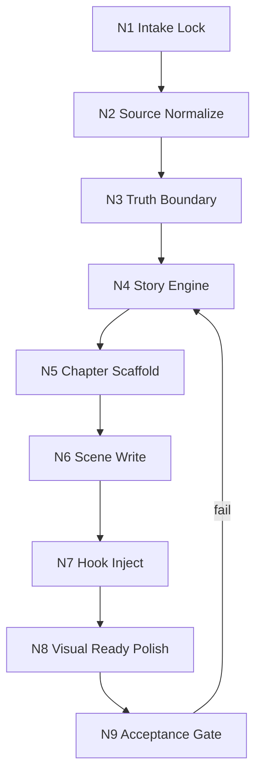
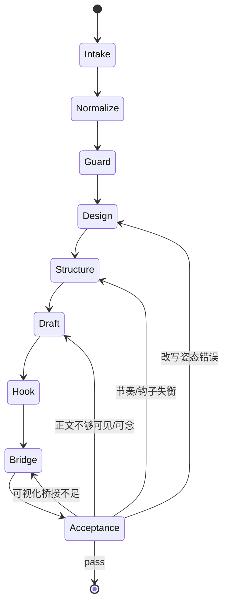

# 思维·执行节点设计

本文件细化 `漫画剧本改编` 的 `N1-N9` 思行节点设计，不与主 `SKILL.md` 竞争真源。

## 1. 节点总览

## 2. 节点细则

### N1 `INTAKE-LOCK`

- `must_lock`
  - 本轮素材范围、目标输出、是否允许写盘。
- `actions`
  - 判断来源类型。
  - 判断是否命中现实事实高风险。
  - 判断用户是否要求高保真。
- `outputs`
  - `task_brief`
- `route_out`
  - 输入明确后进入 `N2`
- `rework_trigger`
  - 仍无法判断素材属于虚构还是现实。

### N2 `SOURCE-NORMALIZE`

- `must_lock`
  - `source_digest` 必须同时回答：发生了什么、谁卷入其中、最值得被放大的异常是什么。
- `actions`
  - 文本提冲突链。
  - 图片提前后因。
  - 视频提节奏切点。
  - 新闻提事实表。
- `outputs`
  - `source_digest`
- `route_out`
  - 单源直入 `N3`；多源先裁主锚点再入 `N3`
- `rework_trigger`
  - 只有描述氛围，没有事件发动机。

### N3 `TRUTH-BOUNDARY`

- `must_lock`
  - `truth_boundary`
  - 禁止越界项
- `actions`
  - 现实来源决定哪些不可改写。
  - 虚构来源决定允许多大程度重排。
- `outputs`
  - `boundary_note`
- `route_out`
  - 进入 `N4`
- `rework_trigger`
  - 事实与虚构口径混在一起。

### N4 `STORY-ENGINE`

- `must_lock`
  - 主角、对手、欲望、代价、卖点核、改写许可范围。
- `actions`
  - 锁 `adaptation_posture`
  - 锁 `fidelity_floor`
  - 锁第一波高冲击画面候选
- `outputs`
  - `adaptation_brief`
  - `adaptation_posture_note`
  - `impact_beats`
- `route_out`
  - 进入 `N5`
- `rework_trigger`
  - 还在顺着原文走，而不是为漫画页势能服务。

### N5 `CHAPTER-SCAFFOLD`

- `must_lock`
  - `chapter_plan`
  - `stimulus_curve`
  - `impact_map`
- `actions`
  - 决定哪些桥段前置、哪些解释后移、哪些桥段并戏。
  - 设计“抓停 -> 抬升 -> 急停”的波形。
- `outputs`
  - `chapter_plan`
  - `stimulus_curve`
  - `impact_map`
- `route_out`
  - 进入 `N6`
- `rework_trigger`
  - 前段没有抓停点，或高能量全挤在结尾。

### N6 `SCENE-WRITE`

- `must_lock`
  - 场景必须可见、可切、可读。
- `actions`
  - 先按页势能落笔，再回补必要说明。
  - 同步写基础格式化字段。
  - 控制句长、停顿与文字负载。
- `outputs`
  - `comic_novel_draft`
  - `aligned_scene_script[]`
- `route_out`
  - 进入 `N7`
- `rework_trigger`
  - 读着像摘要，念着像说明书，看着又不够炸。

### N7 `HOOK-INJECT`

- `must_lock`
  - 每章至少一种钩子。
- `actions`
  - 选择最贵的瞬间断开。
  - 避免同型钩子连用。
- `outputs`
  - `hook_pack`
- `route_out`
  - 进入 `N8`
- `rework_trigger`
  - 章节结尾像总结，不像急停。

### N8 `VISUAL-READY-POLISH`

- `must_lock`
  - 角色、场景、动作、道具、视觉焦点、跨页候选。
- `actions`
  - 补 `panel_split_hints[]`
  - 补 `panel_focus_map[]`
  - 补 `spread_splash_hints[]`
  - 补 `balloon_load_plan[]`
  - 补 `sfx_cues[]`
- `outputs`
  - `visual_bridge`
- `route_out`
  - 进入 `N9`
- `rework_trigger`
  - 仍说不清哪一页最该大、哪一格最该静。

### N9 `ACCEPTANCE-GATE`

- `must_lock`
  - 是否达到“能追更、能分镜、能继续做漫画”的最低标准。
- `actions`
  - 对照 `Field Master / Pass Table` 验收。
  - 若失败，返回对应节点，不做表面润色式交付。
- `outputs`
  - `final_delivery`
  - `validation_summary`
- `route_out`
  - pass 则交付
- `rework_trigger`
  - 任一关键字段未达标。

## 3. 节点级返工总则

## 4. 节点使用提醒

- `N4` 和 `N5` 决定了这稿到底像不像“漫画改编”，不要把它们偷换成普通大纲步骤。
- 如果 `N6` 写得很顺却不够炸，通常不是文笔问题，而是 `N4-N5` 没有先锁刺激曲线。
- 如果 `N8` 只能事后补词，通常说明正文里就没有真正的页势能。
