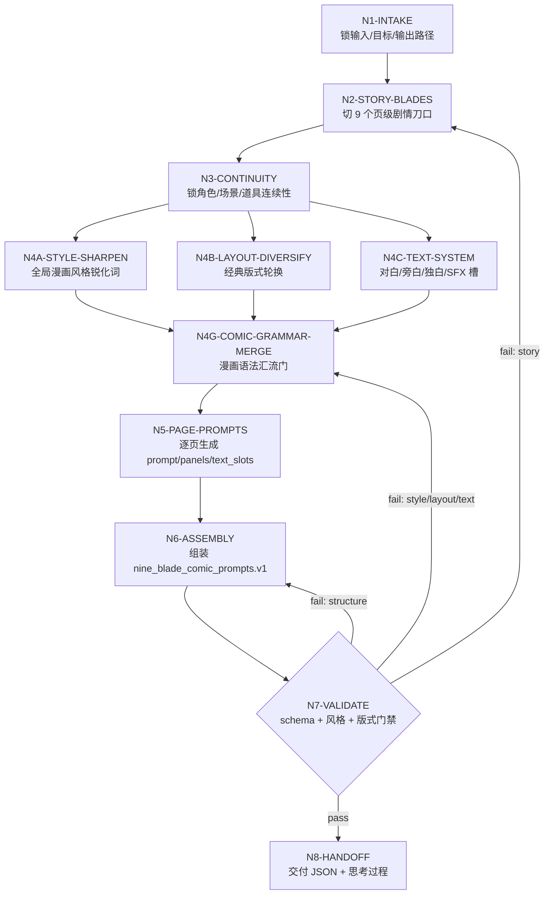
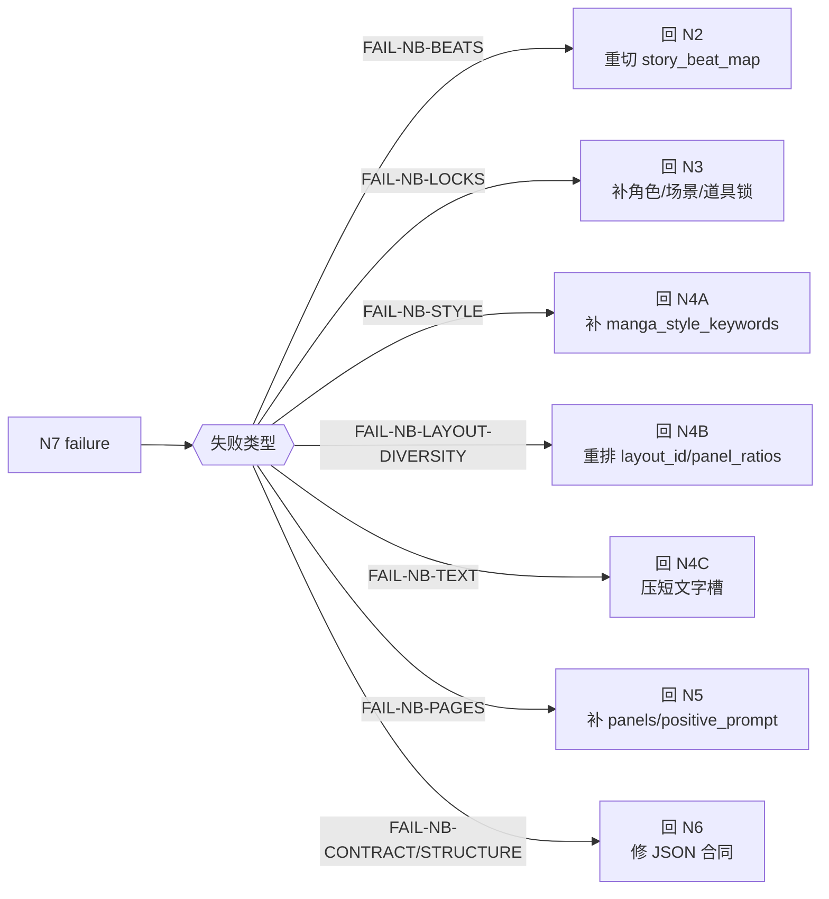
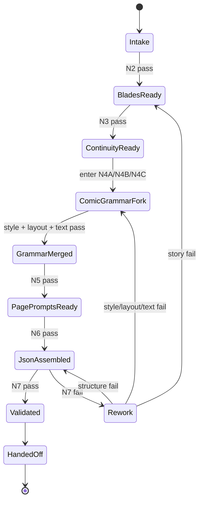
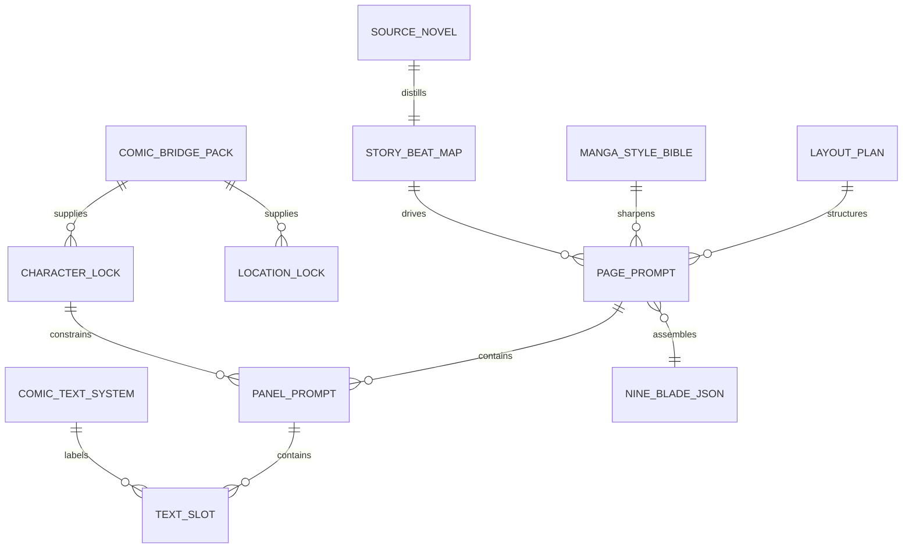
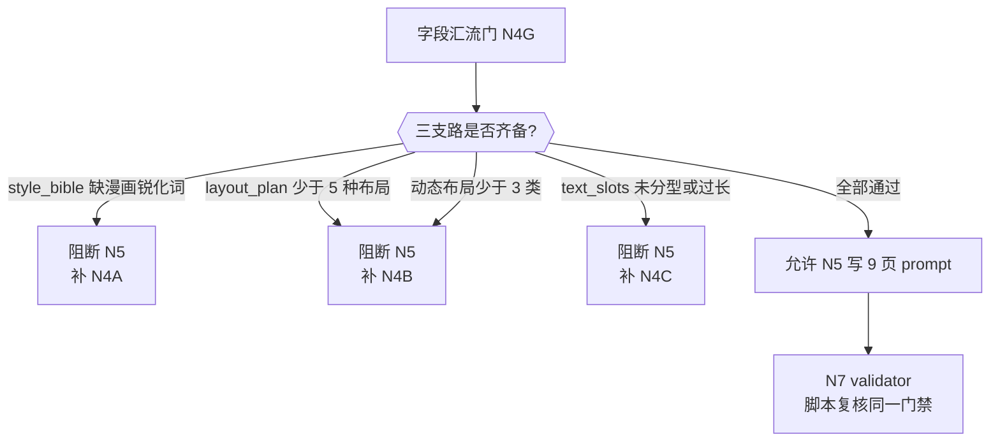

# 九刀流漫画提示词

## Context Loading Contract

- 每次调用本技能时，必须同时加载同目录 `CONTEXT.md` 作为预加载上下文。
- 若同目录 `CONTEXT.md` 缺失，应先补齐最小知识库骨架，或向用户明确报告阻塞；不得在未检查该上下文的情况下执行技能。
- 冲突优先级：用户显式请求 > 仓库/全局 `AGENTS.md` > 本 `SKILL.md` > 同目录 `CONTEXT.md`。

## 1. 定位

本技能把上游 `1-漫画小说改编` 的小说底稿、漫画桥接包，或用户直接提供的任意小说片段，转成可被下游 `3-漫画生成` 消费的 `nine_blade_comic_prompts.v1` JSON。

核心目标不是写 9 个互不相关的文生图 prompt，而是生成一份**单次 Seedream 连续多图请求**可理解的九页漫画提示词包：

- 一次固定 9 张图。
- 每张图是一页竖版 9:16 漫画页。
- 每页内部必须是 2-5 个 panels，默认 3 panels。
- 禁止把某一页退化成单幅海报、单镜头插画或无分格整页图；即使使用 splash 主格，也必须保留至少一个辅助格形成“多格漫画页”。
- 九页之间是连续连环画画面，不是同一画面九个版本。
- 最终 JSON 必须足够让 `3-漫画生成` 合成一个单请求 master prompt。

## 2. 业务需求分析合同

| analysis_field | 必须锁定的问题 | 默认策略 |
| --- | --- | --- |
| `business_goal` | 输出服务什么动作 | 服务 Seedream 一次生成 9 张连续漫画页 |
| `business_object` | 输入是什么 | 上游漫画小说 / 用户小说 / 片段摘要 / 漫画桥接包 |
| `success_criteria` | 什么叫成功 | 9 页连续、群像角色可区分且一致、场景锚点稳定、每页漫画感强、右下角带纯数字页码、可被下游脚本校验 |
| `constraint_profile` | 哪些约束不可破 | 禁止九宫格拼图；禁止同一图九变体；固定 9:16；固定 9 页 |
| `topology_fit` | 最佳思行结构 | 先抽剧情九刀，再并行锁角色/风格/文字系统，最后汇流为 JSON |
| `step_strategy` | 重点在哪 | 页级剧情切分、犀利全局漫画风格、经典漫画版式轮换、跨页一致性、Seedream 单请求兼容 |

## 3. Context Preload

- 每次使用先读取同目录 `CONTEXT.md`。
- 复杂提示词结构细则读取 [references/nine-blade-prompt-contract.md](references/nine-blade-prompt-contract.md)。
- 输出 JSON 必须遵守 [templates/nine-blade-comic-prompts.schema.json](templates/nine-blade-comic-prompts.schema.json)。
- 可从 [templates/nine-blade-template.json](templates/nine-blade-template.json) 复制骨架后填充。

## 4. 总输入合同

### 必需输入

- `source_novel`
  - 上游漫画小说正文、用户指定小说、或足够完整的情节片段。

### 可选输入

- `comic_bridge_pack`
  - 上游输出的角色、场景、道具、冲击画面候选、旁白密度等桥接信息。
- `style_profile`
  - 默认 `cinematic_comic_realism`，可指定国风连环画、美漫电影感、韩漫、暗黑写实等。
- `text_language`
  - 默认 `zh-CN`。
- `page_count`
  - 固定为 `9`，不得因内容少而减少。
- `page_aspect_ratio`
  - 固定为 `9:16`。
- `output_path`
  - 若用户未指定，默认写到 `projects/comic/[项目名]/2-九刀流漫画提示词/nine_blade_comic_prompts.json`。

## 5. 思行网络

本技能采用“串行剧情主干 + 三支路漫画语法并行 + 汇流校验”的思行网络。剧情切页先锁住 9 页叙事功能；角色连续性完成后，风格锐化、版式轮换、文字系统三条支路可并行设计，但必须在 `N4G-COMIC-GRAMMAR-MERGE` 汇流后才允许写 page prompts。











## 6. 思行节点表

| node_id | objective | inputs | actions | evidence | route_out | gate |
| --- | --- | --- | --- | --- | --- | --- |
| `N1-INTAKE` | 锁定输入、目标、风格、输出路径 | `source_novel`、`comic_bridge_pack`、用户风格要求 | 读取小说与桥接包；标记主角、主冲突、高潮点、输出路径 | 输入摘要、项目名、输出路径、风格约束 | pass -> `N2`；输入不足 -> 要求补源或进入改编段 | 输入足够形成 9 页 |
| `N2-STORY-BLADES` | 切出 9 个页级剧情刀口 | 小说段落、视觉锚点、章节钩子 | 生成 `story_beat_map[9]`，每页有动作、情绪、悬念和不同叙事功能 | `story_beat_map`、每页 `page_role` | pass -> `N3`；情节不足 -> 扩写过渡页；过密 -> 合并解释保留动作 | 9 页不重复、不跳戏 |
| `N3-CONTINUITY` | 锁角色、场景、道具和世界观一致性 | `story_beat_map`、桥接包角色/场景/道具 | 先确定唯一 `main_character_lock`，再写具名 `character_locks`、`scene_continuity_bible.scene_locks` 与每页 `active_character_ids / scene_id`，提炼跨页复用短语 | 主角锚定锁、群像角色锁、场景锁、道具锁 | pass -> `N4A/N4B/N4C`；漂移风险高 -> 回桥接包补锁 | 主角外观、配角识别物与场景地标都可逐页复用 |
| `N4A-STYLE-SHARPEN` | 锁全局犀利漫画风格 | 题材、目标画风、连续性锁 | 写 `style_bible.manga_style_keywords / layout_directive / genre_style_keywords`，避免只有泛影视词 | `style_bible` 中的漫画语法词 | pass -> `N4G`；风格泛化 -> 补 reference 风格词库 | 至少命中漫画页、ink/line、gutter/panel/SFX 等风格语法 |
| `N4B-LAYOUT-DIVERSIFY` | 锁 9 页经典漫画版式轮换 | `story_beat_map`、冲击页、解释页、过渡页 | 为每页分配 `layout_id / panel_count / panel_ratios`，轮换 splash、inset、diagonal、split、border-breaking、zigzag 等 | `layout_plan`、每页 layout | pass -> `N4G`；平整化 -> 重排高冲击页和过渡页 | 至少 5 个 layout_id，动态布局不少于 3 类 |
| `N4C-TEXT-SYSTEM` | 锁文字槽位与漫画文字表现 | 剧情信息量、对白/旁白/SFX 需求 | 把解释压进 caption，把动作声压进 SFX，把对白压短并绑定气泡类型 | `comic_text_system`、每页 text slot 策略 | pass -> `N4G`；文字过长 -> 压缩/转旁白 | 每个文字槽类型明确，中文短句可读 |
| `N4G-COMIC-GRAMMAR-MERGE` | 汇流漫画语法三支路 | `style_bible`、`layout_plan`、`comic_text_system` | 检查三支路是否齐备，阻断缺失支路，形成 page prompt 写作策略 | 汇流摘要、风险清单 | pass -> `N5`；fail -> 对应回 `N4A/N4B/N4C` | 风格、版式、文字三个门禁同时通过 |
| `N5-PAGE-PROMPTS` | 写 9 个完整页 prompt | `story_beat_map`、主角锚定锁、群像角色锁、场景锁、风格词、layout plan、文字系统、页码覆盖层 | 为每页写 `positive_prompt / panels / text_slots`，prompt 先写版式，再固定注入 `main_character_lock.anchor_prompt`、当前页 `active_character_ids` 对应角色锁、`scene_id` 对应场景锁、右下角纯数字页码要求，最后写角色动作 | 9 个 page objects | pass -> `N6`；缺页或缺 panel -> 回本节点 | 每页含 9:16、独立页、非拼图约束、漫画版式、主角锚定语句、群像可区分语句、场景锚定语句、右下角数字页码 |
| `N6-ASSEMBLY` | 汇流为 `nine_blade_comic_prompts.v1` JSON | 9 个 page objects、schema、模板 | 按 schema 填充顶层合同、style、locks、pages、negative prompt | JSON 文件 | pass -> `N7`；结构缺失 -> 本节点修复 | JSON 可解析且字段齐 |
| `N7-VALIDATE` | 脚本与人工双门验收 | JSON 文件、validator、reference 门禁 | 运行 validator；检查 9 页、风格词、layout 多样性、文字系统、负向提示词 | validator 输出、人工风险摘要 | pass -> `N8`；fail -> 按失败码回对应节点 | 可被 3 号技能消费 |
| `N8-HANDOFF` | 交付下游生成所需真源 | 已验证 JSON、思考过程摘要、输出路径 | 写入 `projects/comic/[项目名]/2-九刀流漫画提示词/nine_blade_comic_prompts.json`，附切页/版式/风险摘要 | 最终 JSON、思考过程 | 完成或交给 3 号技能 | 只有一个 canonical JSON |

## 7. 输出合同

最终输出为一个 JSON 对象，禁止只输出散文式 prompt。推荐文件名：

```text
nine_blade_comic_prompts.json
```

最小结构：

```json
{
  "schema_version": "nine_blade_comic_prompts.v1",
  "generation_contract": {
    "provider": "seedream",
    "call_mode": "single_request_sequential",
    "image_count": 9,
    "page_aspect_ratio": "9:16"
  },
  "main_character_lock": {},
  "scene_continuity_bible": {},
  "style_bible": {},
  "character_locks": [],
  "comic_text_system": {},
  "pages": [],
  "global_negative_prompt": ""
}
```

输出同时附 `思考过程`，只说明切页理由、版式策略和关键风险，不输出冗长推理草稿。

## 8. 版式与文字硬规则

- 页面级：每个 `page.positive_prompt` 必须写明 `vertical 9:16 comic page`。
- 分格级：每一页必须明确要求 `multiple comic panels`，且 `layout.panel_count >= 2`；禁止任何单格整页输出。
- 主角锚定级：顶层必须存在唯一 `main_character_lock`。它不是普通角色表，而是九页连续生成的第一视觉锚点。即使是群像戏，也必须先选一个当前段落的主要角色作为锚点，其余角色继续放入 `character_locks`。
- `main_character_lock.anchor_prompt` 推荐直接采用高密度英文锚定句，参考格式：

```text
Character locked across all panels: Sun Wukong, a muscular monkey demon, covered in golden fur, a pronounced thunder-god mouth, sunken eyes with bright golden pupils, no eyebrows, sharp fangs visible, wearing a tattered grey-brown Daoist novice robe, realistic fur and muscle anatomy, consistent face, costume, silhouette and color palette in every panel and every page.
```

- `main_character_lock.anchor_prompt` 必须同时包含：角色名、物种/身份、体型或轮廓、脸部识别特征、服装、关键材质/色彩、以及 `consistent face / costume / silhouette / color palette` 一类稳定语义。不得只写“主角保持一致”这种空泛话。
- 群像协同级：`character_locks` 不能再只是松散角色表。每个 recurring character 必须具备 `character_id / name / anchor_prompt`，并在对应页通过 `pages[].active_character_ids` 显式声明出场。若某页出现两名及以上 recurring characters，`page.positive_prompt` 必须点名这些角色，并要求他们 `visually consistent and clearly distinguishable`，避免模型把多人页压成主角 + 模糊路人。
- 场景锚定级：顶层必须存在 `scene_continuity_bible`，其中 `scene_locks[]` 至少包含 `scene_id / name / anchor_prompt`。每页必须通过 `pages[].scene_id` 绑定一个场景锁，并在 `page.positive_prompt` 中显式注入该场景名与稳定语义，例如 `consistent architecture / landmark props / lighting / spatial geography`。不得只写抽象的“保持场景一致”。
- 连续性级：每个 `page.positive_prompt` 必须在版式说明之后、具体动作之前，固定写入“保持角色和场景一致性”的等价语义。英文推荐短语为 `keep character and scene consistency across all pages`，可按语境改写为 `consistent character appearance and consistent scene/location continuity across all pages`，但不得只依赖 `character_locks` 或 `location_locks` 字段隐含表达。
- 页码级：每页必须存在 `page_number_overlay`，且 `text` 必须等于该页页码的纯数字字符串，取值严格为 `"1"` 到 `"9"`。位置固定 `bottom-right`，并在 `page.positive_prompt` 中显式写入 `place page number "N" in the bottom-right corner, digits only` 或等价语义。页码不得写中文、不得加 `Page` 前缀、不得放在其他角落。
- 注入顺序级：每个 `page.positive_prompt` 的推荐固定顺序为：`vertical 9:16 comic page` -> `layout grammar` -> `main_character_lock.anchor_prompt` -> `active character anchors / clearly distinguishable ensemble rule` -> `scene lock anchor` -> `page_number_overlay rule` -> `keep character and scene consistency across all pages` -> `panel actions / text slots / overall mood`。主角锚定句不得被挪到 prompt 末尾。
- 全局风格级：`style_bible` 必须包含能显著推动漫画感的锐化词组，优先写入 `manga_style_keywords` 或等价字段，例如：`dynamic manga paneling`、`dramatic inked line art`、`screentone shadows`、`high contrast black gutters`、`oversized SFX`、`cinematic page composition`。
- 版式级：9 页必须轮换经典漫画布局，不得全部采用从上到下的平整条带；默认至少 5 个不同 `layout_id`，并至少包含 3 类动态布局：`splash-with-insets`、`diagonal-cut-action`、`split-diopter-page`、`border-breaking-cliffhanger`、`vertical-cascade`、`impact-sfx-page` 等。
- 每页 `positive_prompt` 必须先说明页面版式，再写角色/动作；禁止只写“cinematic shot”而缺少 panel grammar。
- 单次生成级：顶层 `generation_contract.hard_constraints` 必须包含：
  - `Generate exactly 9 separate images/pages.`
  - `Do not create a nine-grid collage.`
  - `Do not create nine variations of the same scene.`
  - `Every page must contain multiple comic panels, never a single full-page illustration.`
  - `Keep character and scene consistency across all pages.`
  - `Place a small page number in the bottom-right corner of every page, using digits 1-9 only.`
- 文字系统：
  - 对白：`speech bubble`，短句，放角色附近。
  - 旁白：`rectangular caption box`，放页边或 panel 边缘。
  - 内心独白：`thought bubble` 或 `inner monologue caption`，与对白区分。
  - 音效：`large hand-lettered SFX`，作为画面元素，不替代对白。
- 中文文字必须使用 `clear legible Chinese text`，每个气泡不宜超过 18 个汉字。

## 9. 字段映射

| field_id | 输出位置/字段 | 内容要求 | 失败码 |
| --- | --- | --- | --- |
| `FIELD-NB-01` | `generation_contract` | 固定 9 张、9:16、single_request_sequential | `FAIL-NB-CONTRACT` |
| `FIELD-NB-02` | `story_beat_map` | 9 个连续页级剧情刀口 | `FAIL-NB-BEATS` |
| `FIELD-NB-03` | `main_character_lock` | 唯一主要角色锚定对象，含 `name` 与高密度 `anchor_prompt` | `FAIL-NB-MAIN-LOCK` |
| `FIELD-NB-04` | `scene_continuity_bible` | 具名场景锁完整，含 `scene_locks[]` 与稳定地标/光线/空间语义 | `FAIL-NB-SCENE-LOCK` |
| `FIELD-NB-05` | `character_locks` | 其他跨页角色外观、服装、关键识别物稳定，且具名可回指 | `FAIL-NB-LOCKS` |
| `FIELD-NB-06` | `comic_text_system` | 对白/旁白/独白/SFX 表现形式固定 | `FAIL-NB-TEXT` |
| `FIELD-NB-07` | `pages[]` | 恰好 9 页；每页含 panel 布局、prompt、文本槽、`active_character_ids`、`scene_id`、`page_number_overlay`，且 `positive_prompt` 显式包含主角锚定语句、群像区分语义、场景锚定语义与右下角数字页码语义 | `FAIL-NB-PAGES` |
| `FIELD-NB-08` | `global_negative_prompt` | 禁止拼图、变体、文字错误、错手、logo、水印 | `FAIL-NB-NEGATIVE` |
| `FIELD-NB-09` | `style_bible` | 全局漫画风格锐化词明确，不能只有泛影视词 | `FAIL-NB-STYLE` |
| `FIELD-NB-10` | `pages[].layout` | 9 页 layout_id 足够多样，动态版式不少于 3 类 | `FAIL-NB-LAYOUT-DIVERSITY` |

## 10. 验证

```bash
python3 .agents/skills/comic/2-九刀流漫画提示词/scripts/validate_nine_blade_prompt_json.py \
  path/to/nine_blade_comic_prompts.json
```

## 11. Root-Cause 合同

若下游生成出九宫格拼图、九张近似变体、角色漂移、文本槽混乱或 JSON 无法被 3 号技能读取，必须按以下链路上溯：

`Symptom -> Direct Cause -> Rule Source -> Meta Rule Source -> Fix Landing Points`

- `Rule Source`：本 `SKILL.md`、`references/nine-blade-prompt-contract.md`、schema、验证脚本。
- `Meta Rule Source`：仓库 `AGENTS.md` 与 `skill-知行合一` 的单技能思行网络 / skeleton-first 合同。
- 优先修模板、schema 或验证脚本，再修单次内容。
