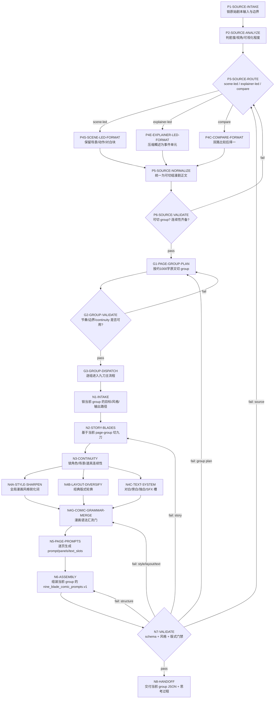
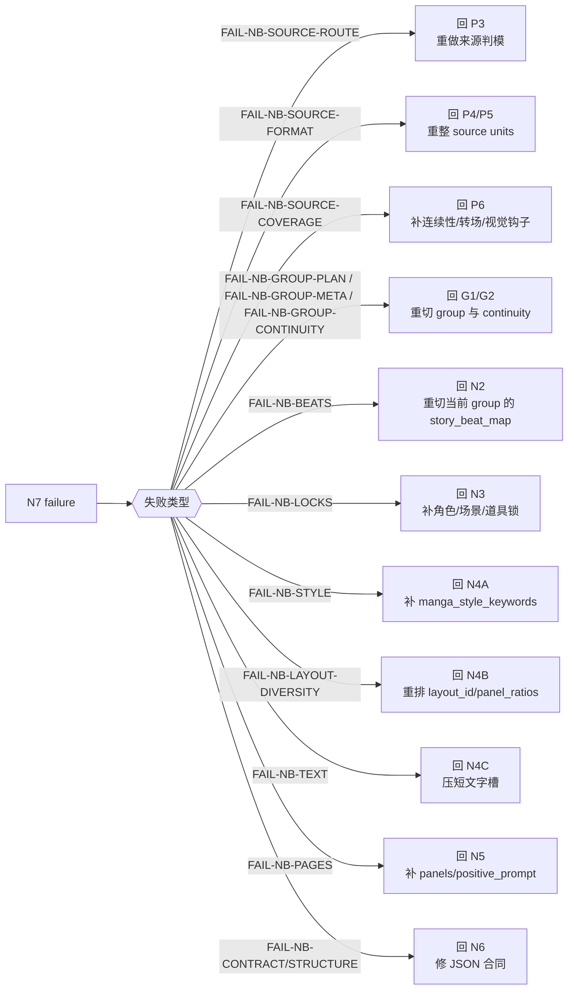
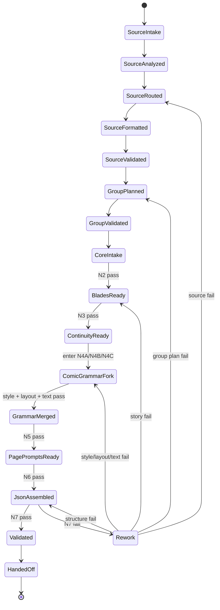
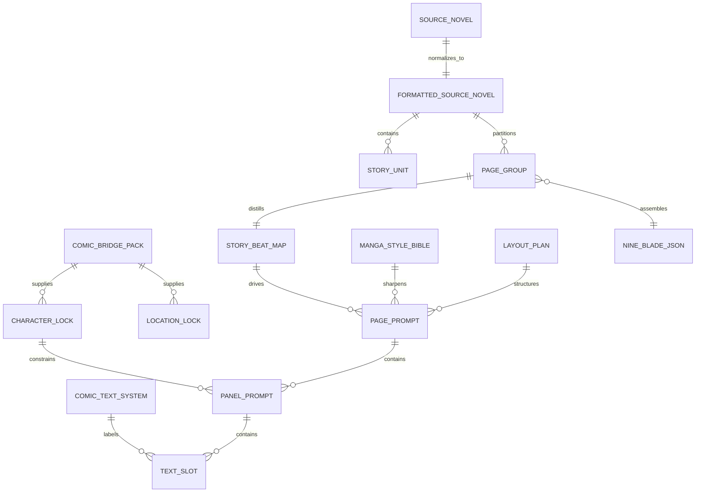
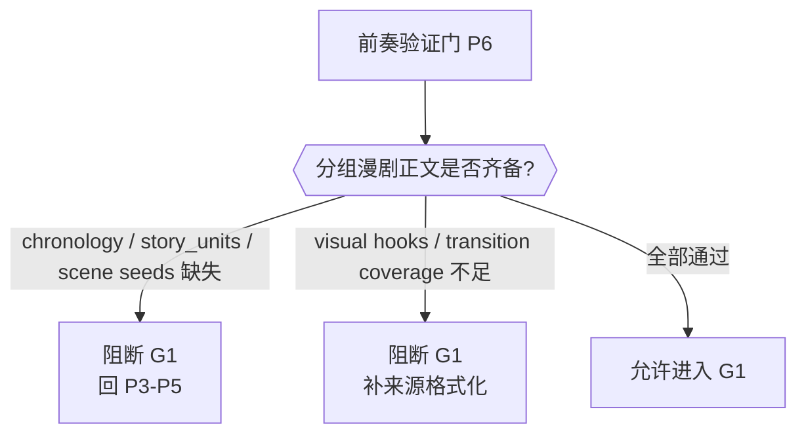
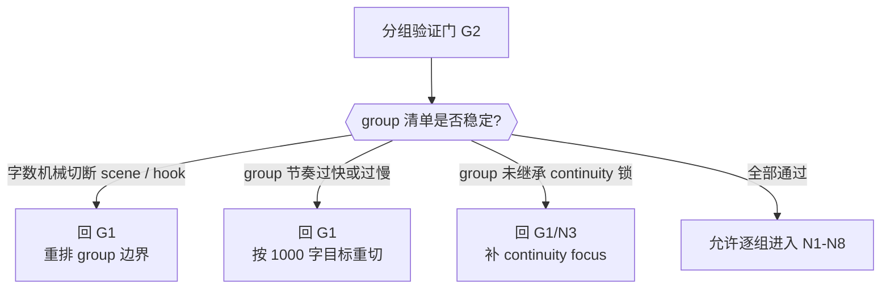
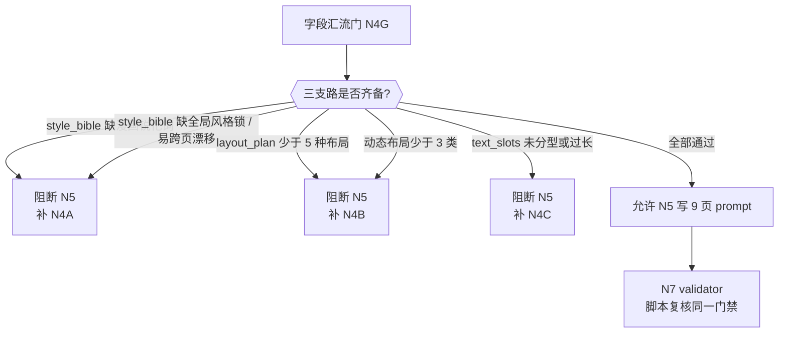

# 九刀流漫画提示词

## Context Loading Contract

- 每次调用本技能时，必须同时加载同目录 `CONTEXT.md` 作为预加载上下文。
- 若同目录 `CONTEXT.md` 缺失，应先补齐最小知识库骨架，或向用户明确报告阻塞；不得在未检查该上下文的情况下执行技能。
- 冲突优先级：用户显式请求 > 仓库/全局 `AGENTS.md` > 本 `SKILL.md` > 同目录 `CONTEXT.md`。

## 1. 定位

本技能把上游 `1-漫画剧本改编` 产出的 `第N组.md` 漫剧剧本，或用户直接提供的任意剧本片段，整理成逐组进入九刀流的输入，再把每个组分别转成可被下游 `3-漫画生成` 消费的 `nine_blade_comic_prompts.v1` JSON。

同一份组级 JSON 也是 `4-动画生成` 的上游结构真源：4 号阶段默认应消费 LLM 已直出的 `comic_page_animation_prompts.v1`；若项目仍处在 legacy 兼容窗口，4 号脚本才允许显式读取这里的 `positive_prompt / panels / layout / active_character_ids / scene_id / continuity_context`，临时投影为对应的 `man-tui sora` 图生视频 prompt。

核心目标不是把整份上游剧本粗暴压成 9 页，也不是写 9 个互不相关的文生图 prompt，而是生成一组组**单次 Seedream 连续多图请求**可理解的九页漫画提示词包：

- 每个 `page-group` 固定对应一次 9 张图请求。
- 每张图是一页竖版 9:16 漫画页。
- 每页内部必须是 2-5 个 panels，默认 3 panels。
- 禁止把某一页退化成单幅海报、单镜头插画或无分格整页图；即使使用 splash 主格，也必须保留至少一个辅助格形成“多格漫画页”。
- 每个组内的九页之间是连续连环画画面，不是同一画面九个版本。
- 组与组之间必须继承同一套角色、风格、场景世界观与叙事推进，不能每组像不同作品。
- 最终输出是“每个 page-group 一份 JSON”，每份 JSON 都足够让 `3-漫画生成` 合成一个单请求 master prompt。

## 2. 业务需求分析合同

| analysis_field | 必须锁定的问题 | 默认策略 |
| --- | --- | --- |
| `business_goal` | 输出服务什么动作 | 服务 Seedream 一次生成 9 张连续漫画页 |
| `business_object` | 输入是什么 | 上游 `第N组.md` / 用户剧本 / 片段摘要 |
| `source_format_profile` | 原始剧本源属于哪种叙事密度 | 先判定 `scene-led / explainer-led / compare`，再决定格式化路径 |
| `success_criteria` | 什么叫成功 | 先按节奏切出合理 `page-group`，每组 9 页连续、群像角色可区分且一致、场景锚点稳定、每页漫画感强、右下角带纯数字页码、可被下游脚本校验 |
| `constraint_profile` | 哪些约束不可破 | 禁止九宫格拼图；禁止同一图九变体；固定 9:16；固定 9 页 |
| `topology_fit` | 最佳思行结构 | 优先直接消费 `第N组.md`，必要时再对 raw source 做临时整形与切组，然后以组为单位切剧情九刀，并行锁角色/风格/文字系统，最后逐组汇流为 JSON |
| `step_strategy` | 重点在哪 | 优先读取分组漫剧剧本、按组进入九刀、组内页级剧情切分、组间 continuity 继承、犀利全局漫画风格、经典漫画版式轮换、Seedream 单请求兼容 |

## 3. Context Preload

- 每次使用先读取同目录 `CONTEXT.md`。
- 先读取 [../_shared/type-pack-loading-contract.md](../_shared/type-pack-loading-contract.md)，确认当前 comic 类型包装载合同。
- 若需要推断或解释 active packs，读取 [../scripts/data_modules/comic_type_pack_resolver.py](../scripts/data_modules/comic_type_pack_resolver.py)。
- 复杂提示词结构细则读取 [references/nine-blade-prompt-contract.md](references/nine-blade-prompt-contract.md)。
- 输出 JSON 必须遵守 [templates/nine-blade-comic-prompts.schema.json](templates/nine-blade-comic-prompts.schema.json)。
- 可从 [templates/nine-blade-template.json](templates/nine-blade-template.json) 复制骨架后填充。

## 4. 总输入合同

### 必需输入

- `source_script`
  - 上游 `第N组.md` 正文、用户指定剧本、或足够完整的情节片段。

### 可选输入

- `grouped_script_files`
  - 上游 `1-漫画剧本改编/第N组.md` 文件集合；若存在，默认视为唯一文本真源。
- `legacy_formatted_source_script`
  - 仅用于兼容旧项目；若命中，只作为迁移期回退，不再视为新口径 canonical output。
- `type_stack_ref`
  - 若 1 号已锁定，优先直接继承。
- `type_pack_context`
  - 应至少包含 `active_packs / knowledge_refs / stage_projection.nine_blade_prompting`。
- `style_profile`
  - 默认 `cinematic_comic_realism`，可指定国风连环画、美漫电影感、韩漫、暗黑写实等。
- `text_language`
  - 默认 `zh-CN`。
- `page_count`
  - 固定为 `9`，不得因内容少而减少。
- `page_aspect_ratio`
  - 固定为 `9:16`。
- `page_group_target_chars`
  - 默认 `1000`。
  - 表示以“原文约 1000 字”为一个 9 pages 的默认节奏单元。
  - 不满 `1000` 字时也按一组处理；一次长文切分后，最后一组 `300` 字以内并入上一组，`700` 字以上可自成一组，`301-699` 字默认并入上一组，除非存在明确场景或钩子闭合边界。
- `output_path`
  - 若用户未指定且当前任务是单集/单回项目，默认按组写到 `projects/comic/[项目名]/2-九刀流漫画提示词/page-group-01-nine_blade_comic_prompts.json`、`page-group-02-nine_blade_comic_prompts.json` 等。
  - 若用户未指定且当前项目已明确进入多集执行（例如用户说“第2集 / 第3集”或阶段目录里已存在其他集产物），必须启用集级防覆盖命名，默认写到 `projects/comic/[项目名]/2-九刀流漫画提示词/第N集-page-group-01-nine_blade_comic_prompts.json`、`第N集-page-group-02-nine_blade_comic_prompts.json` 等。
  - 同轮产出的思考摘要应使用同一集级前缀：`第N集-思考过程摘要.md`。

### 上游真源优先级

优先读取顺序固定为：

1. `projects/comic/[项目名]/1-漫画剧本改编/第*.组.md`
2. 用户直接提供的 `source_script`
3. legacy 项目的 `projects/comic/[项目名]/1-漫画剧本改编/formatted_source_script.json`

若第 1 项存在，默认把它视为唯一文本真源；不得忽略分组文件再从整篇 Markdown prose 二次自由猜结构。

### 派生中间真源

- `grouped_source_script_set`
  - 这是本技能的新口径上游文本真源，由 `第N组.md` 文件集合组成。
  - 若 `1-漫画剧本改编` 已提供分组文件，默认直接消费，不重复产出第二份组计划。
  - 若用户只给 raw source，才允许本技能在本轮内部做临时切组；临时切组必须遵守与 1 号阶段相同的 `1000` 字规则，但不额外挂出 `page_group_plan.json` 竞争真源。
  - 若 `第N组.md` 采用 frontmatter + 包装区块结构，默认只把 `【漫剧正文】` 视为业务正文真源；`【本组跨度】` 与 `【组末钩子】` 作为切页辅证消费。
  - `估算原文字数`、`尾组决议` 与 `【边界判定】` 作为 group 边界辅证消费，用于稳定 `page_group.estimated_source_chars` 与切页理由，不反向覆盖正文。
  - `type_stack_active_packs`、`type_pack_projection_script_adaptation` 与 `type_pack_projection_nine_blade` 作为最小类型包 handoff 消费，用于避免 2 号从 prose 或外部上下文重猜 pack 语法。

### 剧本来源格式化前奏合同

硬规则：

1. 任意 `source_script` 都不得直接进入 `N2-STORY-BLADES`。
2. 若未提供 `第N组.md`，必须先经过最小整形前奏，把原始文本归一为可切组的漫剧正文。
3. 前奏处理机制参照 `.agents/skills/aigc/1-Planning/references/script-format-contract.md` 的思路：先 intake，再 business analyze，再 route，再整形，再 normalize，再 validate。
4. 前奏只服务“把原始剧本或原始素材变成可切九刀的标准化输入”，不输出第二份 canonical 成品，不与最终 JSON 竞争真源。
5. 若原始剧本是章节正文、对话体、梗概、简介、剧情摘要或混合文本，必须先判定为：
   - `scene-led`：场景动作充足，优先保留戏剧性切块。
   - `explainer-led`：概述/解说密度高，优先压成可视化事件单元。
   - `compare`：无法稳定判断时，内部比较两种整形路径后只保留一份 canonical handoff。
6. 只有分组漫剧正文或兼容回退源通过验证后，当前九刀配置才允许开始。

### Page-Group 划分前奏合同

硬规则：

1. `第N组.md` 不得被重新拼回整篇唯一 JSON 再统一处理。
2. 必须以组为单位进入九刀主流程；只有 raw source 直入时，才允许在本轮内部先完成兼容切组。
3. 分组默认以“原文约 1000 字”为一个 9 pages 节奏单元；不满 `1000` 字的一组直出，尾组 `300` 字以内并入上一组，`700` 字以上可独立成组，`301-699` 字默认并入上一组，除非存在硬边界。
4. 分组优先遵守 `【漫剧正文】 / 【边界判定】 / 【组末钩子】` 所暴露出的自然边界，禁止机械按字数硬切。
5. 每个 group 必须具备完整的开场、推进、阻力、钩子或余波节奏，不能只截一半动作或只留解释段。
6. 每个 group 必须继承同一套 `main_character_lock / style_bible / character_locks / scene_continuity_bible` 的 continuity 规则；组间只允许剧情推进变化，不允许角色视觉 DNA 或风格媒介断层变化。
7. 新口径下，`2-九刀流漫画提示词` 的 canonical 交付物是“组级 JSON 集合”，不是“整集唯一 JSON”。
8. 若上游已带 `type_stack_active_packs / type_pack_projection_nine_blade`，每个 group JSON 必须原样透传为本段的最小类型包 handoff，并据此追加版式、文字、风格与钩子偏置。

## 5. 思行网络

本技能采用“优先读取 `第N组.md` + 必要时最小兼容切组 + 组内九刀主干 + 三支路漫画语法并行 + 逐组汇流校验”的思行网络。原始剧本若未分组，才在本轮先完成兼容切组；一旦分组成立，就直接以组为单位进入 9 页九刀流程，而 continuity 锁始终由跨组共享真源维持。















## 6. 思行节点表

| node_id | objective | inputs | actions | evidence | route_out | gate |
| --- | --- | --- | --- | --- | --- | --- |
| `P1-SOURCE-INTAKE` | 锁定原始剧本输入与边界 | `source_script`、`grouped_script_files`、`legacy_formatted_source_script`、用户要求 | 优先读取上游 `第N组.md`；若不存在再读取原始剧本；识别来源类型、长度、组边界与可复用 continuity 信息 | 输入摘要、来源类型、原始边界说明 | pass -> `P2`；输入不足 -> 要求补源 | 原始输入可被归类 |
| `P2-SOURCE-ANALYZE` | 完成来源格式化前的业务分析 | `P1` 输出 | 提炼叙事密度、对白占比、概述占比、视角稳定性、时间线清晰度、可视化程度 | source brief、风险卡 | pass -> `P3` | 已明确该用哪种格式化路径 |
| `P3-SOURCE-ROUTE` | 做来源格式化判模 | `P2` 输出 | 裁决 `scene-led / explainer-led / compare`，默认优先 `scene-led`，信息过密或摘要化文本才切 `explainer-led` | `source_format_variant`、route evidence | `scene-led -> P4S`；`explainer-led -> P4E`；`compare -> P4C` | 只允许一个 canonical handoff |
| `P4S-SCENE-LED-FORMAT` | 整形场景驱动剧本源 | 原始章节、对白、动作、已有 continuity 信息 | 保留场景动作与对白块，压缩赘述，抽出可切页的事件单元与视觉钩子 | scene-led source units | pass -> `P5` | 场景/动作可被九刀复用 |
| `P4E-EXPLAINER-LED-FORMAT` | 整形概述驱动剧本源 | 梗概、简介、摘要、旁白化文本 | 将摘要压成顺时序事件单元，补齐人物、场景、转场与视觉化动作，不把长段概述直接丢进九刀 | explainer-led source units | pass -> `P5` | 事件单元足够 sceneable |
| `P4C-COMPARE-FORMAT` | 在歧义输入上内部比较双路格式化 | 原始文本、已有 continuity 信息 | 同时试跑两路整形，比较哪一路更利于九刀切页与连续性；只保留一份 canonical handoff | compare verdict、selected packet | pass -> `P5` | 不产生双 canonical 真源 |
| `P5-SOURCE-NORMALIZE` | 统一归一为可切组漫剧正文 | `P4S/P4E/P4C` 输出 | 把原始剧本压成便于切组的场景化漫剧正文，并补齐必要 continuity 信息 | normalized source | pass -> `P6` | 正文顺序稳定且可切组 |
| `P6-SOURCE-VALIDATE` | 验证正文是否可切 group | 分组正文或 raw source fallback | 检查时间线、角色出场链、场景回指、视觉钩子、转场覆盖、高潮可切性；必要时回退补齐 | source validation verdict | pass -> `G1`；fail -> `P3/P4/P5` | 只有通过后才允许进入分组前奏 |
| `G1-PAGE-GROUP-PLAN` | 读取或生成组清单 | `第N组.md` 或 raw source fallback | 若已存在 `第N组.md`，直接按文件顺序建立组清单；若无，则按约 1000 字规则临时切出多个 group | group dispatch plan | pass -> `G2` | 每组都能独立承载一次 9 页节奏 |
| `G2-GROUP-VALIDATE` | 验证 group 节奏与 continuity | group dispatch plan、上游正文、`【边界判定】`、`【组末钩子】` | 检查是否机械按字数硬切、是否丢场景/高潮、是否具备 continuity focus、是否存在过快/过慢 group | group validation verdict | pass -> `G3`；fail -> `G1` | 组边界稳定可执行 |
| `G3-GROUP-DISPATCH` | 逐组调度九刀主流程 | 分组文件或临时 group 列表 | 以 group 为单位顺序执行 `N1-N8`，统一继承 continuity 锁；不把全部 group 混成一个 JSON | dispatch 清单 | pass -> `N1` | 当前轮只处理有效 group |
| `N1-INTAKE` | 锁定当前 group 的目标、风格、输出路径 | `page_group`、当前 `第N组.md`、用户风格要求 | 读取当前组的 `【漫剧正文】 / 【本组跨度】 / 【边界判定】 / 【组末钩子】` 与类型包 frontmatter，锁项目名、group 输出路径、风格边界，并显式生成 `group_source_extract` | intake 摘要、项目名、group 输出路径、风格约束、`group_source_extract` | pass -> `N2` | 进入组内主流程时不再读取整篇 raw source 作为主真源 |
| `N2-STORY-BLADES` | 切出当前 group 的 9 个页级剧情刀口 | `group_source_extract.scene_flow / impact_candidates / page_turn_hooks / boundary_reason / ending_hook / character_mentions / scene_mentions` | 从当前组正文提取可切页的动作、情绪、悬念和视觉钩子，生成当前组的 `story_beat_map[9]` 与每页 `page_role`；不得假设上游已提供现成 `scene_cards[]` 或 `story_unit_ids[]` | `story_beat_map`、每页 `page_role`、提取摘要 | pass -> `N3`；情节不足 -> 扩写过渡页；过密 -> 合并解释保留动作 | 当前组的 9 页不重复、不跳戏 |
| `N3-CONTINUITY` | 锁角色、场景、道具和世界观一致性 | `story_beat_map`、`group_source_extract.character_mentions / scene_mentions / prop_mentions`、前序 group continuity、类型包 handoff | 先确定唯一 `main_character_lock`，再写具名 `character_locks`、`scene_continuity_bible.scene_locks` 与每页 `active_character_ids / scene_id`，并补 `continuity_context` 说明如何继承前组/全局锁 | 主角锚定锁、群像角色锁、场景锁、道具锁、组间 continuity 摘要 | pass -> `N4A/N4B/N4C`；漂移风险高 -> 回上游组正文补锁 | 主角外观、配角识别物与场景地标都可逐页、逐组复用 |
| `N4A-STYLE-SHARPEN` | 锁全局犀利漫画风格 | 题材、目标画风、连续性锁 | 写 `style_bible.manga_style_keywords / layout_directive / genre_style_keywords`，并额外锁定同一轮 9 页共享的 `global style anchor`：同一渲染媒介、线条体系、明暗体系、上色策略、lettering 质感、panel border 质感与角色年龄比例；同时写明 `forbidden style shifts`，避免只有泛影视词 | `style_bible` 中的漫画语法词 + 风格锁定语句 + 禁止漂移清单 | pass -> `N4G`；风格泛化或存在页间/组间漂移风险 -> 补 reference 风格词库与风格锁 | 至少命中漫画页、ink/line、gutter/panel/SFX 等风格语法，且能明确阻止跨页跨组切换成儿童绘本、Q 版、影视概念图或不同渲染媒介 |
| `N4B-LAYOUT-DIVERSIFY` | 锁 9 页经典漫画版式轮换 | `story_beat_map`、冲击页、解释页、过渡页 | 为每页分配 `layout_id / panel_count / panel_ratios`，轮换 splash、inset、diagonal、split、border-breaking、zigzag 等 | `layout_plan`、每页 layout | pass -> `N4G`；平整化 -> 重排高冲击页和过渡页 | 至少 5 个 layout_id，动态布局不少于 3 类 |
| `N4C-TEXT-SYSTEM` | 锁文字槽位与漫画文字表现 | 剧情信息量、对白/旁白/SFX 需求 | 把解释压进 caption，把动作声压进 SFX，把对白压短并绑定气泡类型 | `comic_text_system`、每页 text slot 策略 | pass -> `N4G`；文字过长 -> 压缩/转旁白 | 每个文字槽类型明确，中文短句可读 |
| `N4G-COMIC-GRAMMAR-MERGE` | 汇流漫画语法三支路 | `style_bible`、`layout_plan`、`comic_text_system`、`continuity_context` | 检查三支路是否齐备，阻断缺失支路，形成 page prompt 写作策略；额外做一次“页间/组间风格漂移预判”：确认 9 页只允许布局和情绪变化，不允许渲染媒介、线稿密度、角色年龄比例、色彩系统发生断层式切换 | 汇流摘要、风险清单、style drift 预判结论 | pass -> `N5`；fail -> 对应回 `N4A/N4B/N4C` | 风格、版式、文字三个门禁同时通过，且页间组间风格锁稳定 |
| `N5-PAGE-PROMPTS` | 写 9 个完整页 prompt | `story_beat_map`、主角锚定锁、群像角色锁、场景锁、风格词、layout plan、文字系统、页码覆盖层 | 为每页写 `positive_prompt / panels / text_slots`，prompt 固定顺序必须为：`版式 -> 全局 style anchor -> 主角锚定 -> 群像锚定 -> 场景锚定 -> 页码 -> 一致性语义 -> panel 动作 -> 文字可读性/字型规则 -> overall mood`。每页都必须重复同一套全局 style anchor，禁止把风格锁只放在顶层 `style_bible` 里隐含表达 | 9 个 page objects | pass -> `N6`；缺页、缺 panel 或风格锁未逐页注入 -> 回本节点 | 每页含 9:16、独立页、非拼图约束、漫画版式、全局风格锁、主角锚定语句、群像可区分语句、场景锚定语句、右下角数字页码 |
| `N6-ASSEMBLY` | 汇流为当前 group 的 `nine_blade_comic_prompts.v1` JSON | 9 个 page objects、schema、模板、当前组 metadata | 按 schema 填充顶层合同、`page_group`、`continuity_context`、style、locks、pages、negative prompt | 当前 group JSON 文件 | pass -> `N7`；结构缺失 -> 本节点修复 | JSON 可解析且组身份明确 |
| `N7-VALIDATE` | 脚本与人工双门验收 | JSON 文件、validator、reference 门禁 | 运行 validator；检查 9 页、分组 metadata、风格词、layout 多样性、文字系统、负向提示词 | validator 输出、人工风险摘要 | pass -> `N8`；fail -> 按失败码回对应节点 | 可被 3 号技能消费 |
| `N8-HANDOFF` | 交付下游生成所需真源 | 已验证当前 group JSON、思考过程摘要、输出路径 | 单集项目按组写入 `projects/comic/[项目名]/2-九刀流漫画提示词/page-group-01-nine_blade_comic_prompts.json`、`page-group-02-nine_blade_comic_prompts.json` 等；多集项目默认写入 `projects/comic/[项目名]/2-九刀流漫画提示词/第N集-page-group-01-nine_blade_comic_prompts.json`、`第N集-page-group-02-nine_blade_comic_prompts.json` 等；同一组 JSON 后续同时交给 3 号技能生图、交给 4 号技能逐页提炼 video prompt | 组级 JSON 集合、思考过程 | 完成或交给 3/4 号技能 | 当前 episode/group canonical 输出明确且不互相覆盖 |

## 7. 输出合同

最终输出不再默认是整集唯一 JSON，而是“每个 page-group 一个 JSON 对象”；禁止只输出散文式 prompt。推荐文件名：

```text
page-group-01-nine_blade_comic_prompts.json
page-group-02-nine_blade_comic_prompts.json
```

若项目已进入多集模式，推荐文件名自动升级为：

```text
第N集-page-group-01-nine_blade_comic_prompts.json
第N集-page-group-02-nine_blade_comic_prompts.json
```

单个 group JSON 的最小结构：

```json
{
  "schema_version": "nine_blade_comic_prompts.v1",
  "page_group": {},
  "continuity_context": {},
  "generation_contract": {
    "provider": "seedream",
    "call_mode": "single_request_sequential",
    "image_count": 9,
    "page_aspect_ratio": "9:16"
  },
  "main_character_lock": {},
  "scene_continuity_bible": {},
  "style_bible": {},
  "character_locks": [],
  "comic_text_system": {},
  "pages": [],
  "global_negative_prompt": ""
}
```

输出同时附 `思考过程`，只说明该组的切组理由、切页理由、版式策略、continuity 继承和关键风险，不输出冗长推理草稿。

### 动画交接补充

- `4-动画生成` 默认把每页 `panels[]` 视为 `one panel -> one shot` 的多分镜输入。
- 因此 `pages[].positive_prompt` 不得只写单幅插画描述；必须保留版式、panel 动作、角色锁、场景锁与文字系统语义。
- `pages[].page_number_overlay`、`active_character_ids`、`scene_id` 和 `continuity_context` 不是仅供 3 号技能使用；它们也是 4 号动画 prompt 真源必须保留的结构锚点。若处于 legacy 兼容模式，4 号脚本也只能基于这些字段做受控投影，而不是另写第二套故事事实。

## 8. 版式与文字硬规则

- 页面级：每个 `page.positive_prompt` 必须写明 `vertical 9:16 comic page`。
- 分格级：每一页必须明确要求 `multiple comic panels`，且 `layout.panel_count >= 2`；禁止任何单格整页输出。
- 主角锚定级：顶层必须存在唯一 `main_character_lock`。它不是普通角色表，而是九页连续生成的第一视觉锚点。即使是群像戏，也必须先选一个当前段落的主要角色作为锚点，其余角色继续放入 `character_locks`。
- `main_character_lock.anchor_prompt` 推荐直接采用高密度英文锚定句，参考格式：

```text
Character locked across all panels: Sun Wukong, a muscular monkey demon, covered in golden fur, a pronounced thunder-god mouth, sunken eyes with bright golden pupils, no eyebrows, sharp fangs visible, wearing a tattered grey-brown Daoist novice robe, realistic fur and muscle anatomy, consistent face, costume, silhouette and color palette in every panel and every page.
```

- `main_character_lock.anchor_prompt` 必须同时包含：角色名、物种/身份、体型或轮廓、脸部识别特征、服装、关键材质/色彩、以及 `consistent face / costume / silhouette / color palette` 一类稳定语义。不得只写“主角保持一致”这种空泛话。
- 群像协同级：`character_locks` 不能再只是松散角色表。每个 recurring character 必须具备 `character_id / name / anchor_prompt`，并在对应页通过 `pages[].active_character_ids` 显式声明出场。若某页出现两名及以上 recurring characters，`page.positive_prompt` 必须点名这些角色，并要求他们 `visually consistent and clearly distinguishable`，避免模型把多人页压成主角 + 模糊路人。
- 场景锚定级：顶层必须存在 `scene_continuity_bible`，其中 `scene_locks[]` 至少包含 `scene_id / name / anchor_prompt`。每页必须通过 `pages[].scene_id` 绑定一个场景锁，并在 `page.positive_prompt` 中显式注入该场景名与稳定语义，例如 `consistent architecture / landmark props / lighting / spatial geography`。不得只写抽象的“保持场景一致”。
- 连续性级：每个 `page.positive_prompt` 必须在版式说明之后、具体动作之前，固定写入“保持角色和场景一致性”的等价语义。英文推荐短语为 `keep character and scene consistency across all pages`，可按语境改写为 `consistent character appearance and consistent scene/location continuity across all pages`，但不得只依赖 `character_locks` 或 `location_locks` 字段隐含表达。
- 页码级：每页必须存在 `page_number_overlay`，且 `text` 必须等于该页页码的纯数字字符串，取值严格为 `"1"` 到 `"9"`。位置固定 `bottom-right`，并在 `page.positive_prompt` 中显式写入 `place page number "N" in the bottom-right corner, digits only` 或等价语义。页码不得写中文、不得加 `Page` 前缀、不得放在其他角落。
- 注入顺序级：每个 `page.positive_prompt` 的推荐固定顺序为：`vertical 9:16 comic page` -> `layout grammar` -> `global style anchor / forbidden style shifts` -> `main_character_lock.anchor_prompt` -> `active character anchors / clearly distinguishable ensemble rule` -> `scene lock anchor` -> `page_number_overlay rule` -> `keep character and scene consistency across all pages` -> `panel actions / text slots / overall mood`。全局风格锁与主角锚定句都不得被挪到 prompt 末尾。
- 全局风格级：`style_bible` 必须包含能显著推动漫画感的锐化词组，优先写入 `manga_style_keywords` 或等价字段，例如：`dynamic manga paneling`、`dramatic inked line art`、`screentone shadows`、`high contrast black gutters`、`oversized SFX`、`cinematic page composition`。
- 全局风格锁定级：除 `manga_style_keywords` 外，`style_bible` 还应明确写出一条不可跨页漂移的 `style anchor`，至少锁住：
  - 同一套渲染媒介与完成度，例如“重墨线稿 + screentone + 有限上色”或“轻水墨线描 + 低饱和铺色”，而不是有时黑白港漫、有时儿童彩图、有时影视概念图。
  - 同一套线条粗细与明暗方法，例如 `heavy ink contour + black shadow masses` 或 `clean brush contour + airy negative space`。
  - 同一套角色年龄比例和造型语法，避免一页少年写实、一页 Q 版、一页卡通幼态。
  - 同一套 lettering 和 panel border 质感，避免页面之间像不同作品拼盘。
  - 一条 `forbidden style shifts` 语句，明确禁止 `chibi / SD / children picture-book / painterly concept art / 3D render / live-action storyboard / random full-color realism` 这类断层切换。
- 风格稳定性级：9 页允许变化的是剧情功能、构图、镜头远近、情绪强弱与版式；不允许变化的是全局视觉 DNA。本规则优先级高于“某页看起来更华丽”。
- 版式级：9 页必须轮换经典漫画布局，不得全部采用从上到下的平整条带；默认至少 5 个不同 `layout_id`，并至少包含 3 类动态布局：`splash-with-insets`、`diagonal-cut-action`、`split-diopter-page`、`border-breaking-cliffhanger`、`vertical-cascade`、`impact-sfx-page` 等。
- 每页 `positive_prompt` 必须先说明页面版式，再写角色/动作；禁止只写“cinematic shot”而缺少 panel grammar。
- 单次生成级：顶层 `generation_contract.hard_constraints` 必须包含：
  - `Generate exactly 9 separate images/pages.`
  - `Do not create a nine-grid collage.`
  - `Do not create nine variations of the same scene.`
  - `Every page must contain multiple comic panels, never a single full-page illustration.`
  - `Keep character and scene consistency across all pages.`
  - `Place a small page number in the bottom-right corner of every page, using digits 1-9 only.`
- 文字系统：
  - 顶层 `comic_text_system` 必须完整声明 `dialogue / narration / inner_monologue / sfx` 四类文字系统。
  - 每个文字系统对象至少包含：`visual_form / placement_rule / legibility_rule / max_chars`。
  - 推荐固定上限：`dialogue.max_chars = 18`、`narration.max_chars = 24`、`inner_monologue.max_chars = 20`、`sfx.max_chars = 6`。
  - 九页整体默认必须覆盖四类文字槽至少各一次，不得退化成只有旁白、没有对白/独白/SFX 的说明文式输出。
  - 每个 `text_slot` 至少包含：`type / text / placement / bubble_style / inside_panel`。
  - `dialogue` 与 `inner_monologue` 额外必须包含 `speaker_id`，且 `speaker_id` 必须属于当前页 `active_character_ids`。
  - 对白：`speech bubble`，短句，放角色附近。
  - 旁白：`rectangular caption box`，放页边或 panel 边缘。
  - 内心独白：`thought bubble` 或 `inner monologue caption`，与对白区分。
  - 音效：`large hand-lettered SFX`，作为画面元素，不替代对白。
- 中文文字必须使用 `clear legible Chinese text`，每个气泡不宜超过 18 个汉字。
- 每页 `positive_prompt` 必须显式注入文字可读性与文字形态语义；当该页含 `dialogue / narration / inner_monologue / sfx` 时，prompt 中必须能读到对应的 `speech bubble / caption box / thought bubble or inner caption / integrated hand-lettered SFX` 约束，而不是只把这些信息留在结构字段里。

## 9. 字段映射

| field_id | 输出位置/字段 | 内容要求 | 失败码 |
| --- | --- | --- | --- |
| `FIELD-NB-01` | `source_route` | 原始剧本已被裁决为 `scene-led / explainer-led / compare -> selected` 之一，或已直接命中 `第N组.md` | `FAIL-NB-SOURCE-ROUTE` |
| `FIELD-NB-02` | `grouped_source_script_set` | 已命中 `第N组.md` 集合，或兼容切组后的正文足以直接服务九刀切页 | `FAIL-NB-SOURCE-FORMAT` |
| `FIELD-NB-03` | `第N组.md` 正文覆盖度 | 时间线、转场、视觉钩子、高潮与余波覆盖充分 | `FAIL-NB-SOURCE-COVERAGE` |
| `FIELD-NB-04` | `group dispatch plan` | 组清单遵守 `1000` 字规则与尾组并组规则，且边界不机械、不丢戏 | `FAIL-NB-GROUP-PLAN` |
| `FIELD-NB-05` | `page_group` | 当前 JSON 明确标识 `group_id / group_index / total_groups / estimated_source_chars / source_span_summary` | `FAIL-NB-GROUP-META` |
| `FIELD-NB-06` | `continuity_context` | 明确写出从前组/全局继承的角色、风格、场景 continuity 规则 | `FAIL-NB-GROUP-CONTINUITY` |
| `FIELD-NB-07` | `generation_contract` | 固定 9 张、9:16、single_request_sequential | `FAIL-NB-CONTRACT` |
| `FIELD-NB-08` | `story_beat_map` | 当前 group 的 9 个连续页级剧情刀口 | `FAIL-NB-BEATS` |
| `FIELD-NB-09` | `main_character_lock` | 唯一主要角色锚定对象，含 `name` 与高密度 `anchor_prompt` | `FAIL-NB-MAIN-LOCK` |
| `FIELD-NB-10` | `scene_continuity_bible` | 具名场景锁完整，含 `scene_locks[]` 与稳定地标/光线/空间语义 | `FAIL-NB-SCENE-LOCK` |
| `FIELD-NB-11` | `character_locks` | 其他跨页角色外观、服装、关键识别物稳定，且具名可回指 | `FAIL-NB-LOCKS` |
| `FIELD-NB-11A` | `type_stack_active_packs / type_pack_projection_nine_blade` | active packs 与 `nine_blade` 阶段投影从 1 号 frontmatter 被完整透传，不依赖临场重猜 | `FAIL-NB-TYPE-PACK` |
| `FIELD-NB-12` | `comic_text_system` | 四类文字系统齐备；每类含 `visual_form / placement_rule / legibility_rule / max_chars`；九页整体至少覆盖一次 | `FAIL-NB-TEXT` |
| `FIELD-NB-13` | `pages[]` | 恰好 9 页；每页含 panel 布局、prompt、文本槽、`active_character_ids`、`scene_id`、`page_number_overlay`，且 `positive_prompt` 显式包含主角锚定语句、群像区分语义、场景锚定语义与右下角数字页码语义 | `FAIL-NB-PAGES` |
| `FIELD-NB-14` | `global_negative_prompt` | 禁止拼图、变体、文字错误、错手、logo、水印 | `FAIL-NB-NEGATIVE` |
| `FIELD-NB-15` | `style_bible` | 全局漫画风格锐化词明确，不能只有泛影视词 | `FAIL-NB-STYLE` |
| `FIELD-NB-16` | `pages[].layout` | 9 页 layout_id 足够多样，动态版式不少于 3 类 | `FAIL-NB-LAYOUT-DIVERSITY` |
| `FIELD-NB-17` | `style_bible + pages[].positive_prompt` | 9 页共享同一套全局视觉 DNA；每页都显式重复 style anchor，禁止跨页切换成儿童绘本、Q 版、影视概念图或不同渲染媒介 | `FAIL-NB-STYLE-DRIFT` |

## 10. 验证

```bash
python3 .agents/skills/comic/2-九刀流漫画提示词/scripts/validate_nine_blade_prompt_json.py \
  path/to/page-group-01-nine_blade_comic_prompts.json
```

提交前还必须做前奏侧人工验证：

- `第N组.md` 是否已覆盖开场、触发、阻力、代价、迁移、危机、生死瞬间、反击、余波等可切页节点。
- `group_source_extract` 是否已从 `【漫剧正文】` 中稳定提取 scene flow、impact candidates、page-turn hooks 和角色/场景线索，而不是依赖隐式旧结构。
- 是否仍有关键角色、关键场景或高潮因原始文本松散而在整形前奏中丢失。
- 当前 group 清单是否以约 1000 字原文为目标，但没有机械切断 scene / hook / payoff。
- 组与组之间是否继承同一套角色、风格、场景 continuity，而不是每组像不同作品。

## 11. Root-Cause 合同

若下游生成出九宫格拼图、九张近似变体、角色漂移、文本槽混乱或 JSON 无法被 3 号技能读取，必须按以下链路上溯：

`Symptom -> Direct Cause -> Rule Source -> Meta Rule Source -> Fix Landing Points`

- `Rule Source`：本 `SKILL.md`、`references/nine-blade-prompt-contract.md`、来源格式化前奏合同、page-group 划分前奏合同、schema、验证脚本。
- `Meta Rule Source`：仓库 `AGENTS.md` 与 `skill-知行合一` 的单技能思行网络 / skeleton-first 合同。
- 优先修来源格式化前奏、page-group 真源、模板、schema 或验证脚本，再修单次内容。
