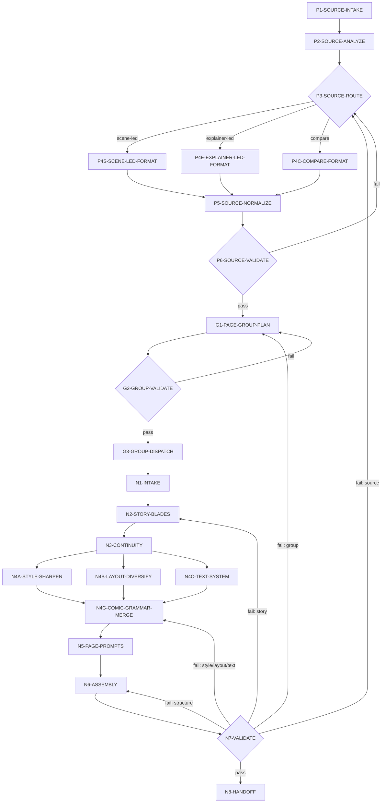

# 九刀流漫画提示词思行网络

本文件承载 `comic-nine-blade-prompts` 的执行拓扑。`SKILL.md` 负责入口、路由和输出合同；本文件负责判断、动作、证据、回退和汇流。

## Workflow Overview

## Node Table

| node_id | objective | inputs | actions | evidence | route_out | gate |
| --- | --- | --- | --- | --- | --- | --- |
| `P1-SOURCE-INTAKE` | 锁原始输入和边界 | `source_script`、`grouped_script_files`、legacy source、用户要求 | 优先读取 `第N组.md`；识别来源类型、长度、组边界、continuity 证据 | 输入摘要、来源类型、边界说明 | pass -> `P2`；不足 -> 补源 | 原始输入可归类 |
| `P2-SOURCE-ANALYZE` | 完成前奏业务分析 | `P1` 输出 | 提炼叙事密度、对白占比、概述占比、视角稳定性、时间线清晰度、可视化程度 | source brief、风险卡 | pass -> `P3` | 已明确格式化路径 |
| `P3-SOURCE-ROUTE` | 来源判模 | `P2` 输出 | 裁决 `scene-led / explainer-led / compare`；compare 只保留一份 canonical handoff | `source_format_variant`、route evidence | scene-led -> `P4S`；explainer-led -> `P4E`；compare -> `P4C` | 只允许一个 canonical handoff |
| `P4S-SCENE-LED-FORMAT` | 整形场景驱动源 | 原始章节、对白、动作、continuity | 保留场景动作和对白块，压缩赘述，抽出事件单元与视觉钩子 | scene-led units | pass -> `P5` | 场景/动作可被九刀复用 |
| `P4E-EXPLAINER-LED-FORMAT` | 整形概述驱动源 | 梗概、简介、摘要、旁白化文本 | 将摘要压成顺时序事件单元，补人物、场景、转场、视觉动作 | explainer-led units | pass -> `P5` | 事件单元足够 sceneable |
| `P4C-COMPARE-FORMAT` | 歧义输入双路比较 | 原始文本、continuity | 比较两路整形，选择更利于九刀和连续性的版本 | compare verdict | pass -> `P5` | 不产生双真源 |
| `P5-SOURCE-NORMALIZE` | 归一为可切组漫剧正文 | `P4S/P4E/P4C` | 输出场景化漫剧正文，补必要 continuity 信息 | normalized source | pass -> `P6` | 正文顺序稳定且可切组 |
| `P6-SOURCE-VALIDATE` | 验证正文可切 group | 分组正文或 raw fallback | 检查时间线、角色链、场景回指、视觉钩子、转场、高潮可切性 | source verdict | pass -> `G1`；fail -> `P3/P4/P5` | 通过后才可分组 |
| `G1-PAGE-GROUP-PLAN` | 读取或生成组清单 | `第N组.md` 或 raw fallback | 有 `第N组.md` 则按文件顺序执行；无则按约 1000 字规则临时切组 | group dispatch plan | pass -> `G2` | 每组能承载一次 9 页节奏 |
| `G2-GROUP-VALIDATE` | 验证 group 节奏和 continuity | group plan、正文、边界判定、组末钩子 | 检查机械切断、过快/过慢、丢高潮、continuity focus 缺失 | group verdict | pass -> `G3`；fail -> `G1` | 组边界稳定可执行 |
| `G3-GROUP-DISPATCH` | 逐组调度九刀主流程 | 分组文件或临时 group | 以 group 顺序执行 `N1-N8`，统一继承 continuity 锁 | dispatch 清单 | pass -> `N1` | 当前轮只处理有效 group |
| `N1-INTAKE` | 锁当前 group 目标、风格、路径 | 当前组正文、类型包、用户风格 | 读取 `【漫剧正文】 / 【本组跨度】 / 【边界判定】 / 【组末钩子】`，生成 `group_source_extract` | intake 摘要、输出路径、风格约束 | pass -> `N2` | 不再回整篇 raw source 猜真源 |
| `N2-STORY-BLADES` | 切当前 group 9 个页级刀口 | `group_source_extract` | 生成 `story_beat_map[9]` 与 `page_role`；9 页必须连续、不重复、不跳戏 | story beat map | pass -> `N3`；不足 -> 扩写过渡页；过密 -> 合并解释保留动作 | 9 页剧情功能各异 |
| `N3-CONTINUITY` | 锁角色、场景、道具、世界观 | `story_beat_map`、角色/场景/道具 mentions、前组 continuity | 先确定唯一 `main_character_lock`，再写 `character_locks`、`scene_continuity_bible`、每页 `active_character_ids / scene_id` | 主角锚、群像锁、场景锁、组间 continuity | pass -> `N4A/N4B/N4C` | 主角、配角、场景可逐页复用 |
| `N4A-STYLE-SHARPEN` | 锁全局犀利漫画风格 | 题材、风格要求、continuity | 写漫画语法词、`global style anchor`、`forbidden style shifts` | `style_bible` | pass -> `N4G` | 明确阻止跨页风格断层 |
| `N4B-LAYOUT-DIVERSIFY` | 锁 9 页版式轮换 | `story_beat_map`、冲击页、解释页 | 为每页分配 `layout_id / panel_count / panel_ratios` | layout plan | pass -> `N4G` | 至少 5 个 layout_id，3 类动态版式 |
| `N4C-TEXT-SYSTEM` | 锁文字槽位 | 剧情信息量、对白/旁白/SFX 需求 | 把解释压进 caption，动作声进 SFX，对白压短并绑定气泡 | text system plan | pass -> `N4G` | 四类文字槽可读可回指 |
| `N4G-COMIC-GRAMMAR-MERGE` | 汇流风格/版式/文字 | `style_bible`、layout plan、text system、continuity | 阻断缺失支路，确认只变布局和情绪，不变视觉 DNA | 汇流摘要、风险清单 | pass -> `N5`；fail -> 对应回 `N4A/N4B/N4C` | 三支路同时通过 |
| `N5-PAGE-PROMPTS` | 写 9 个完整页 prompt | story、locks、style、layout、text、页码 | 按固定顺序写 `positive_prompt / panels / text_slots`，每页重复全局风格锁、主角锚、场景锚、页码 | 9 page objects | pass -> `N6` | 每页含 9:16、多格、锚定、页码、可读中文 |
| `N6-ASSEMBLY` | 汇流 JSON | 9 page objects、schema、模板、group metadata | 填顶层合同、group、continuity、style、locks、pages、negative prompt | group JSON | pass -> `N7` | JSON 可解析且组身份明确 |
| `N7-VALIDATE` | 脚本与人工双门验收 | JSON、validator、review gate | 运行校验脚本，人工检查语义门 | validator 输出、人工风险摘要 | pass -> `N8`；fail -> 按失败码回源节点 | 可被 3/4 号技能消费 |
| `N8-HANDOFF` | 交付下游真源 | 已验证 JSON、摘要、路径 | 写入单集或多集命名路径，同步交给 3 号生图和 4 号剧集海报 | group JSON、思考摘要 | complete | canonical 输出明确 |

## Failure Routing

| failure_code | route_back | repair focus |
| --- | --- | --- |
| `FAIL-NB-SOURCE-ROUTE` | `P3` | 重新判定 scene-led / explainer-led / compare |
| `FAIL-NB-SOURCE-FORMAT` | `P4/P5` | 补场景化正文、转场、视觉钩子 |
| `FAIL-NB-SOURCE-COVERAGE` | `P6` | 补角色链、场景回指、高潮覆盖 |
| `FAIL-NB-GROUP-PLAN` | `G1/G2` | 重排 group 边界，不机械切断 scene/hook |
| `FAIL-NB-BEATS` | `N2` | 重切 9 个页级剧情刀口 |
| `FAIL-NB-LOCKS` | `N3` | 补主角锚、群像锁、场景锁 |
| `FAIL-NB-STYLE` | `N4A` | 补漫画风格锐化词和 global style anchor |
| `FAIL-NB-LAYOUT-DIVERSITY` | `N4B` | 重排 layout_id、panel_ratios、动态版式 |
| `FAIL-NB-TEXT` | `N4C` | 压缩文字槽，补 speaker_id/placement/bubble_style |
| `FAIL-NB-PAGES` | `N5` | 补页级 prompt、panels、页码与锚定注入 |
| `FAIL-NB-CONTRACT` | `N6` | 修 JSON 结构、schema 字段和输出路径 |
