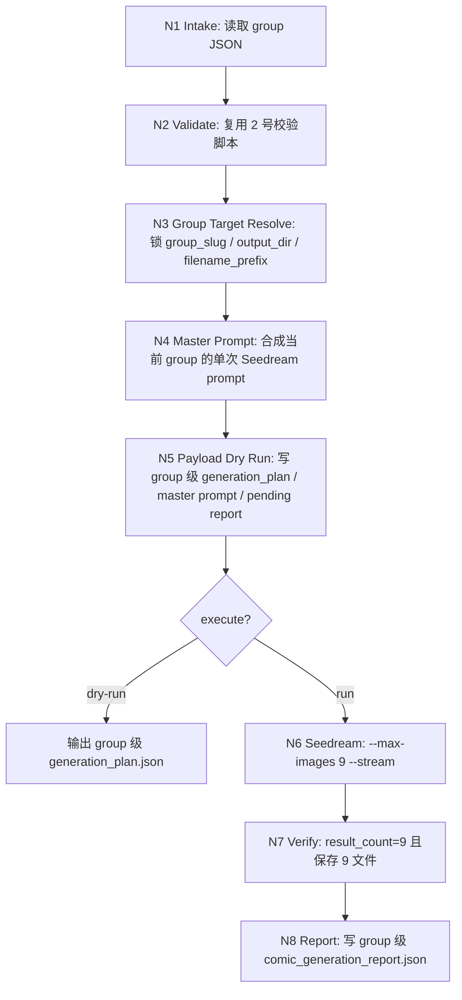
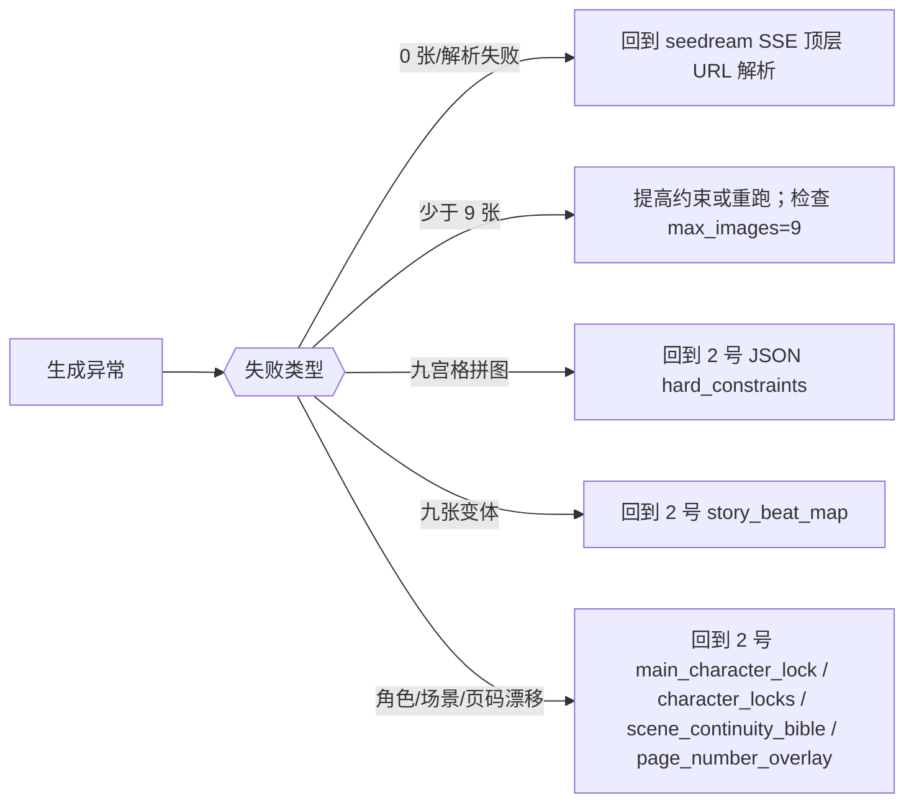
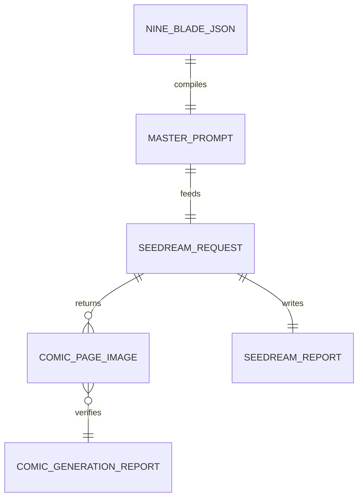

# 漫画生成

## Context Loading Contract

- 每次调用本技能时，必须同时加载同目录 `CONTEXT.md` 作为预加载上下文。
- 若同目录 `CONTEXT.md` 缺失，应先补齐最小知识库骨架，或向用户明确报告阻塞；不得在未检查该上下文的情况下执行技能。
- 冲突优先级：用户显式请求 > 仓库/全局 `AGENTS.md` > 本 `SKILL.md` > 同目录 `CONTEXT.md`。

## 1. 定位

本技能消费 `2-九刀流漫画提示词` 输出的某个 `page-group` 级 `nine_blade_comic_prompts.v1` JSON，并调用 `.agents/skills/api/anyfast/image/seedream` 执行生图。

硬目标：

- 每次固定生成 9 张。
- 每张图是一页完整竖版 9:16 漫画页。
- 一次 Seedream 连续多图请求完成，不拆成 9 次单图请求。
- 明确禁止九宫格拼图、contact sheet、同一画面九个版本。
- 每张图右下角必须带对应页码，严格使用数字 `1-9`。
- 默认把图片命名稳定为 `page01..page09`，供 `4-动画生成` 直接按页匹配 video prompt。
- 保留 Seedream 报告与本技能生成摘要，便于追溯。
- 多组执行时，不同 group 的计划、master prompt、报告和图片不得互相覆盖。

## 2. 已验证上下文

本仓库已通过一次真实 Seedream/Ark API 验证：

- 单个 prompt + `sequential_image_generation=auto` + `max_images=9` + `--stream` 可返回 9 张独立图片。
- 流式事件形态为 9 个 `image_generation.partial_succeeded` + 1 个 `image_generation.completed`。
- 图片 URL 是同一任务基底 ID 后缀 `_0` 到 `_8`，不是先生成九宫格再裁切。

因此本技能默认使用**单请求连续生成**，不是批量循环 9 次。

## 3. Context Preload

- 每次使用先读取同目录 `CONTEXT.md`。
- 先读取 [../_shared/type-pack-loading-contract.md](../_shared/type-pack-loading-contract.md)，确认当前 comic 类型包装载合同。
- Seedream 调用细则继承 [.agents/skills/api/anyfast/image/seedream/SKILL.md](../../api/anyfast/image/seedream/SKILL.md)。
- 2 号 JSON 合同继承 [../2-九刀流漫画提示词/SKILL.md](../2-九刀流漫画提示词/SKILL.md)。
- 执行细则读取 [references/seedream-nine-page-generation.md](references/seedream-nine-page-generation.md)。

## 4. 总输入合同

### 必需输入

- `prompt_json`
  - 符合 `nine_blade_comic_prompts.v1` 的单个 group JSON 文件路径。
  - 新口径下优先使用 `page-group-01-nine_blade_comic_prompts.json`、`第N集-page-group-01-nine_blade_comic_prompts.json` 这类组级文件；legacy 单文件仍可兼容读取。
  - 该 JSON 现在必须携带 `type_stack_ref / type_pack_context`，供 3/4/5 段继续继承。

### 可选输入

- `output_dir`
  - 默认：`projects/comic/[项目名]/3-漫画生成/`。
  - 若 JSON 已位于 `projects/comic/[项目名]/2-九刀流漫画提示词/`，自动推断同一项目名。
  - 若 JSON 已位于 `projects/aigc/[项目名]/5-Image/漫画/2-九刀流漫画提示词/`，自动推断到同项目的 `projects/aigc/[项目名]/5-Image/漫画/3-漫画生成/`，避免漂移到 `projects/comic/`。
- `project_name`
  - 当 JSON 不在 `projects/comic/[项目名]/` 下时，用于指定输出项目名。
- `filename_prefix`
  - 默认：短页码命名，最终落盘为 `page01.ext ... page09.ext`。
  - 若显式传入自定义 prefix，则保留自定义前缀命名。
  - 若当前输入是多组 episode 中的某一组，推荐显式包含 group 前缀，例如 `g01-page`。
- `size`
  - 默认：`2K`。页面比例由 prompt 固定为 9:16。
- `stream`
  - 默认启用。
- `dry_run`
  - 只生成 master prompt 和 Seedream 命令，不调用 API。

### Group Execution Rule

- 若当前 episode 被 `2-九刀流漫画提示词` 切成多个 `page-group` JSON，本技能默认“一次只消费一个 group JSON”。
- 多组执行时，应按 `group_index` 顺序逐组调用本技能，而不是把多个 group JSON 拼成一次超长 master prompt。
- 若用户未显式指定 `output_dir`，默认把当前 group 的执行产物落到 `projects/comic/[项目名]/3-漫画生成/<group_id>/` 或对应 `aigc` 项目的同级 `3-漫画生成/<group_id>/`，避免多组覆盖。
- 上述 group 子目录下的 `page01..page09` 是 4 号动画阶段的默认首帧真源；4 号应按页码直接消费，而不是重新猜测哪张图对应哪页。

## 5. 思行网络







## 6. 思行节点表

| node_id | objective | actions | evidence | route_out | gate |
| --- | --- | --- | --- | --- | --- |
| `N1-INTAKE` | 读取并锁定 group JSON | 解析 JSON、读取 `page_group / continuity_context`，识别当前 group 身份 | JSON 路径、group metadata | N2 | JSON 可读且 group 可识别 |
| `N2-VALIDATE` | 确保可消费 | 调用 2 号 validator；检查 9 页、9:16、hard constraints、group metadata | validator 输出 | N3 或退回 2 号技能 | 零错误 |
| `N3-GROUP-TARGET-RESOLVE` | 锁定当前 group 的执行目标 | 解析 `group_slug`、默认输出目录、默认文件名前缀；若未指定 `output_dir` 则落到 group 子目录 | `group_slug`、目标目录、命名方案 | N4 | 多组执行时不会覆盖 |
| `N4-COMPILE` | 合成当前 group 的单次 master prompt | 把 `page_group / continuity_context / type_stack_ref / type_pack_context`、顶层合同、风格、角色锁、9 页 prompt、负向提示词汇总为一个 prompt | JSON 字段 | N5 | prompt 含 group 上下文、type pack 上下文与 9 separate pages |
| `N5-PLAN` | 形成 group 级执行计划 | 写当前 group 的 `generation_plan.json`、master prompt、pending report；dry-run 打印命令 | plan 文件、pending report | dry-run 结束或 N6 | 命令含 `--max-images 9 --stream` |
| `N6-SEEDREAM` | 执行单请求生图 | 调用 seedream 脚本 | seedream report | N7 | 请求成功 |
| `N7-VERIFY` | 校验 9 张独立页 | 读取 report；检查 `result_count=9` 与保存文件数；必要时按当前 group 重命名文件 | seedream report、文件列表 | N8 或返工 | 9 张文件且命名不覆盖其他组 |
| `N8-REPORT` | 交付当前 group 结果 | 写当前 group 的漫画生成报告，列出图片路径和风险 | 计划、报告、文件 | 完成 | 可追溯 |

## 7. 标准调用

### Dry Run

```bash
python3 .agents/skills/comic/3-漫画生成/scripts/run_seedream_comic_generation.py \
  path/to/page-group-01-nine_blade_comic_prompts.json \
  --dry-run
```

### 执行生图

```bash
python3 .agents/skills/comic/3-漫画生成/scripts/run_seedream_comic_generation.py \
  path/to/page-group-01-nine_blade_comic_prompts.json \
  --execute
```

脚本会调用：

```bash
python3 .agents/skills/api/anyfast/image/seedream/scripts/seedream_generate.py \
  --prompt "<compiled master prompt>" \
  --max-images 9 \
  --size 2K \
  --stream \
  --output-dir "<output_dir>" \
  --filename-prefix "<prefix>"
```

## 8. Master Prompt 强约束

合成后的 prompt 必须以执行合同开头：

```text
Generate exactly 9 separate images. Each image is one complete vertical 9:16 comic page. Do not create a nine-grid collage, contact sheet, or one image containing all pages. Do not create nine variations of the same scene. The nine images are consecutive comic pages from the same story. Place a small page number in the bottom-right corner of every page, using digits 1-9 only.
```

## 9. 动画交接

- `4-动画生成` 默认读取当前 group 子目录下的 `page01..page09` 作为对应页的首帧参考图。
- 若用户显式让多个 group 共用同一个 `output_dir`，本技能会自动升级为 `group_slug-page01..page09` 命名；4 号技能应先按 `group_slug` 再按页码解析。
- 3 号技能不负责视频化处理；若出现 motion、camera、shot plan 问题，优先回到 4 号技能，而不是在 3 号脚本里拼接视频 prompt。

## 10. 字段映射

| field_id | 输出位置/字段 | 内容要求 | 失败码 |
| --- | --- | --- | --- |
| `FIELD-CG-01` | `input_json` | `nine_blade_comic_prompts.v1` 可解析且 9 页有效 | `FAIL-CG-INPUT` |
| `FIELD-CG-02` | `page_group / group_slug` | 当前执行目标明确，group 身份可被报告与文件命名复用 | `FAIL-CG-GROUP-TARGET` |
| `FIELD-CG-02A` | `type_stack_ref / type_pack_context` | 当前 group 仍能回指 active packs 与 `image_generation` 阶段投影 | `FAIL-CG-TYPE-PACK` |
| `FIELD-CG-03` | `master_prompt` | 含 group 上下文、单请求 9 图、9:16、非拼图、非变体、群像/场景连续性和右下角数字页码约束 | `FAIL-CG-PROMPT` |
| `FIELD-CG-04` | `seedream_command` | `--max-images 9 --stream --size 2K` 默认齐备 | `FAIL-CG-CMD` |
| `FIELD-CG-05` | `seedream_report` | `ok=true result_count=9` | `FAIL-CG-SEEDREAM` |
| `FIELD-CG-06` | `saved_files` | 9 个独立图片文件，且不会覆盖其他 group 结果 | `FAIL-CG-FILES` |
| `FIELD-CG-07` | `comic_generation_report.json` | 汇总 group plan、seedream report、文件列表、风险 | `FAIL-CG-REPORT` |

默认命名约束：

- 若用户未显式指定 `filename_prefix`，且使用默认 group 子目录，最终图片文件名标准化为 `page01.ext` 到 `page09.ext`。
- 若用户显式把多个 group 共用一个 `output_dir`，默认命名应自动升级为带 group 前缀的 `group-slug-page01.ext` 到 `group-slug-page09.ext`，避免覆盖。
- 不再默认把上游 JSON 文件名 stem 传播为最终图片前缀，避免出现 `nine_blade_comic_prompts_01.jpeg` 这类冗长落盘名。

## 11. Root-Cause 合同

若生成失败或结果不符合预期，按以下链路上溯：

`Symptom -> Direct Cause -> Rule Source -> Meta Rule Source -> Fix Landing Points`

- 0 张或流式事件未提取：优先检查 Seedream 脚本顶层 `url / b64_json` 解析。
- 少于 9 张：检查 `max_images=9`、prompt 约束和服务端报告。
- 九宫格拼图：回到 2 号 JSON 的 `hard_constraints` 和 `master_prompt` 编译器。
- 九张变体：回到 2 号的 `story_beat_map / pages[]`。
- 角色漂移、场景漂移或页码缺失：回到 2 号的 `main_character_lock / character_locks / scene_continuity_bible / pages[].page_number_overlay`。

规则源：本 `SKILL.md`、`references/seedream-nine-page-generation.md`、`scripts/run_seedream_comic_generation.py`、`comic/_shared/type-pack-loading-contract.md`、Seedream 技能合同。
