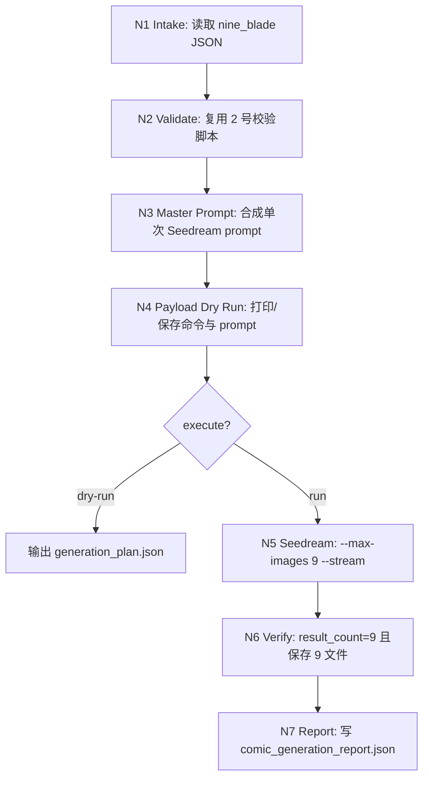
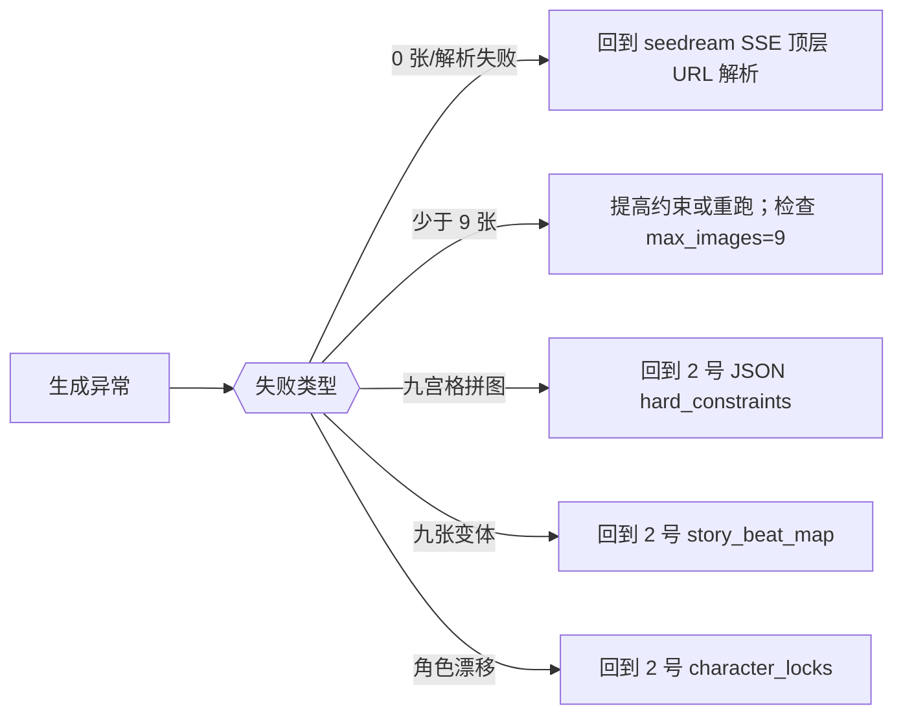
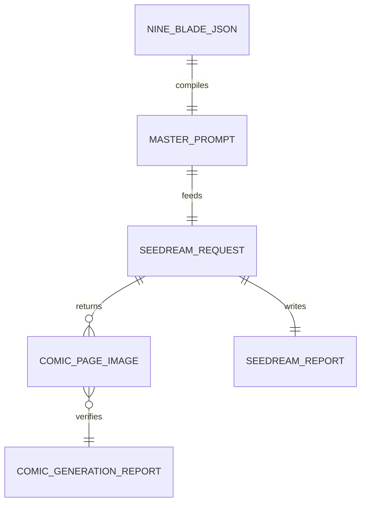

# 漫画生成

## 1. 定位

本技能消费 `2-九刀流漫画提示词` 输出的 `nine_blade_comic_prompts.v1` JSON，并调用 `.agents/skills/api/image/seedream` 执行生图。

硬目标：

- 每次固定生成 9 张。
- 每张图是一页完整竖版 9:16 漫画页。
- 一次 Seedream 连续多图请求完成，不拆成 9 次单图请求。
- 明确禁止九宫格拼图、contact sheet、同一画面九个版本。
- 保留 Seedream 报告与本技能生成摘要，便于追溯。

## 2. 已验证上下文

本仓库已通过一次真实 Seedream/Ark API 验证：

- 单个 prompt + `sequential_image_generation=auto` + `max_images=9` + `--stream` 可返回 9 张独立图片。
- 流式事件形态为 9 个 `image_generation.partial_succeeded` + 1 个 `image_generation.completed`。
- 图片 URL 是同一任务基底 ID 后缀 `_0` 到 `_8`，不是先生成九宫格再裁切。

因此本技能默认使用**单请求连续生成**，不是批量循环 9 次。

## 3. Context Preload

- 每次使用先读取同目录 `CONTEXT.md`。
- Seedream 调用细则继承 [.agents/skills/api/image/seedream/SKILL.md](../../api/image/seedream/SKILL.md)。
- 2 号 JSON 合同继承 [../2-九刀流漫画提示词/SKILL.md](../2-九刀流漫画提示词/SKILL.md)。
- 执行细则读取 [references/seedream-nine-page-generation.md](references/seedream-nine-page-generation.md)。

## 4. 总输入合同

### 必需输入

- `prompt_json`
  - 符合 `nine_blade_comic_prompts.v1` 的 JSON 文件路径。

### 可选输入

- `output_dir`
  - 默认：`projects/comic/[项目名]/3-漫画生成/`。若 JSON 已位于 `projects/comic/[项目名]/2-九刀流漫画提示词/`，自动推断同一项目名。
- `project_name`
  - 当 JSON 不在 `projects/comic/[项目名]/` 下时，用于指定输出项目名。
- `filename_prefix`
  - 默认：JSON 文件名 stem。
- `size`
  - 默认：`2K`。页面比例由 prompt 固定为 9:16。
- `stream`
  - 默认启用。
- `dry_run`
  - 只生成 master prompt 和 Seedream 命令，不调用 API。

## 5. 思行网络







## 6. 思行节点表

| node_id | objective | actions | evidence | route_out | gate |
| --- | --- | --- | --- | --- | --- |
| `N1-INTAKE` | 读取并锁定 JSON | 解析 JSON、确定输出目录 | JSON 路径与内容 | N2 | JSON 可读 |
| `N2-VALIDATE` | 确保可消费 | 调用 2 号 validator；检查 9 页、9:16、hard constraints | validator 输出 | N3 或退回 2 号技能 | 零错误 |
| `N3-COMPILE` | 合成单次 master prompt | 把顶层合同、风格、角色锁、9 页 prompt、负向提示词汇总为一个 prompt | JSON 字段 | N4 | prompt 含 9 separate pages |
| `N4-PLAN` | 形成执行计划 | 写 `generation_plan.json`，dry-run 打印命令 | plan 文件 | dry-run 结束或 N5 | 命令含 `--max-images 9 --stream` |
| `N5-SEEDREAM` | 执行单请求生图 | 调用 seedream 脚本 | seedream report | N6 | 请求成功 |
| `N6-VERIFY` | 校验 9 张独立页 | 读取 report；检查 `result_count=9` 与保存文件数 | seedream report、文件列表 | N7 或返工 | 9 张文件 |
| `N7-REPORT` | 交付结果 | 写漫画生成报告，列出图片路径和风险 | 计划、报告、文件 | 完成 | 可追溯 |

## 7. 标准调用

### Dry Run

```bash
python3 .agents/skills/comic/3-漫画生成/scripts/run_seedream_comic_generation.py \
  path/to/nine_blade_comic_prompts.json \
  --dry-run
```

### 执行生图

```bash
python3 .agents/skills/comic/3-漫画生成/scripts/run_seedream_comic_generation.py \
  path/to/nine_blade_comic_prompts.json \
  --execute
```

脚本会调用：

```bash
python3 .agents/skills/api/image/seedream/scripts/seedream_generate.py \
  --prompt "<compiled master prompt>" \
  --max-images 9 \
  --size 2K \
  --stream \
  --output-dir "<output_dir>" \
  --filename-prefix "<prefix>"
```

## 8. Master Prompt 强约束

合成后的 prompt 必须以执行合同开头：

```text
Generate exactly 9 separate images. Each image is one complete vertical 9:16 comic page. Do not create a nine-grid collage, contact sheet, or one image containing all pages. Do not create nine variations of the same scene. The nine images are consecutive comic pages from the same story.
```

## 9. 字段映射

| field_id | 输出位置/字段 | 内容要求 | 失败码 |
| --- | --- | --- | --- |
| `FIELD-CG-01` | `input_json` | `nine_blade_comic_prompts.v1` 可解析且 9 页有效 | `FAIL-CG-INPUT` |
| `FIELD-CG-02` | `master_prompt` | 含单请求 9 图、9:16、非拼图、非变体约束 | `FAIL-CG-PROMPT` |
| `FIELD-CG-03` | `seedream_command` | `--max-images 9 --stream --size 2K` 默认齐备 | `FAIL-CG-CMD` |
| `FIELD-CG-04` | `seedream_report` | `ok=true result_count=9` | `FAIL-CG-SEEDREAM` |
| `FIELD-CG-05` | `saved_files` | 9 个独立图片文件 | `FAIL-CG-FILES` |
| `FIELD-CG-06` | `comic_generation_report.json` | 汇总 plan、seedream report、文件列表、风险 | `FAIL-CG-REPORT` |

## 10. Root-Cause 合同

若生成失败或结果不符合预期，按以下链路上溯：

`Symptom -> Direct Cause -> Rule Source -> Meta Rule Source -> Fix Landing Points`

- 0 张或流式事件未提取：优先检查 Seedream 脚本顶层 `url / b64_json` 解析。
- 少于 9 张：检查 `max_images=9`、prompt 约束和服务端报告。
- 九宫格拼图：回到 2 号 JSON 的 `hard_constraints` 和 `master_prompt` 编译器。
- 九张变体：回到 2 号的 `story_beat_map / pages[]`。
- 角色漂移：回到 2 号的 `character_locks`。

规则源：本 `SKILL.md`、`references/seedream-nine-page-generation.md`、`scripts/run_seedream_comic_generation.py`、Seedream 技能合同。
