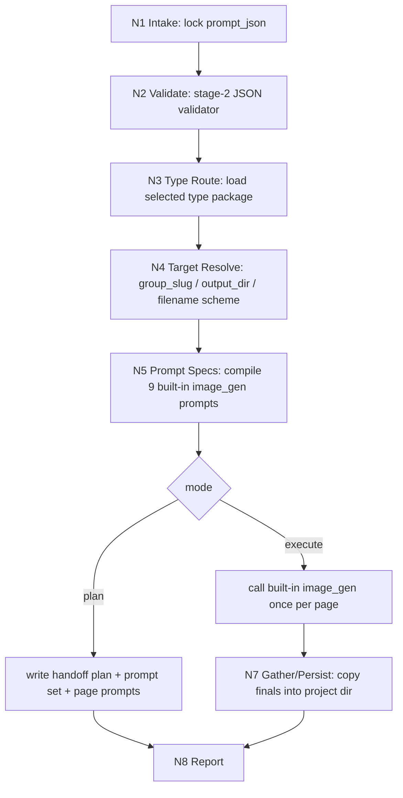

# 漫画生成

本技能消费 `2-九刀流漫画提示词` 输出的单个 `page-group` 级 `nine_blade_comic_prompts.v1` JSON，默认通过 `.agents/skills/cli/imagegen` 的内置 `image_gen` 路径生成 9 张连续竖版漫画页。

当前 `imagegen` 真源已经收束为 built-in `image_gen` only：本技能不得默认调用 `.agents/skills/cli/imagegen/scripts/image_gen.py`、Image API、`generate-batch`、`OPENAI_API_KEY` 或硬模型参数。旧 CLI runner 仅保留为用户显式点名的 external legacy 路径。

## Context Loading Contract

- 每次调用本技能时，必须同时加载同目录 `CONTEXT.md`。
- 每次调用本技能时，必须读取 `types/type-map.md`，识别并加载当前任务命中的类型包。
- 若当前任务绑定具体项目根，还必须按仓库根 `AGENTS.md` 加载项目级 `MEMORY.md` 与相关 `CONTEXT/`。
- 若进入 built-in imagegen 执行路径，必须同时遵循 `.agents/skills/cli/imagegen/SKILL.md + CONTEXT.md`，并读取其 `references/mode-routing.md`、`steps/execution-workflow.md`、`references/output-persistence.md` 与 `review/review-contract.md`。
- 冲突优先级：用户显式请求 > 仓库根 `AGENTS.md` > 本 `SKILL.md` > `.agents/skills/cli/imagegen/SKILL.md` > 本技能分区文件 > `agents/openai.yaml` > 项目级记忆/上下文 > 同目录 `CONTEXT.md`。

## Scope

使用本技能：

- 已有单个 `page-group` JSON，需要生成该组 9 张竖版漫画页。
- 需要先输出 built-in imagegen handoff 计划、逐页 prompt、prompt set 和生成报告。
- 需要把漫画页稳定命名为 `page01.png..page09.png`，供 `4-剧集海报` 作为造型与风格参考。

不使用本技能：

- 编写或重切剧情、分镜、角色设定、场景设定。这些应回到 `1-漫画剧本改编` 或 `2-九刀流漫画提示词`。
- 生成视频、运动镜头或动画 prompt。当前 comic 主链不把动画作为默认第 4 段。
- 默认调用 Seedream、Dreamina、AnyFast、Image API 或 CLI `scripts/image_gen.py`。这些只作为用户显式指定的 legacy/external 路径。

## Input Contract

- Accepted input: 单个 `nine_blade_comic_prompts.v1` group JSON 路径、可选项目名、可选输出目录、可选 `resolution_target`、dry-run/plan 或 execute 指令。
- Required input: `prompt_json`，且必须包含 `pages[1..9].positive_prompt`、`page_group`、`generation_contract`、`type_stack_ref / type_pack_context`。
- Optional input: `output_dir`、`project_name`、`filename_prefix`、`resolution_target`、`resolution_value`、`output_format`、`dry_run`、`execute`、`force`。
- Ask before proceeding when: JSON 路径无法定位、用户要求覆盖既有图片但未给出明确替换意图、输入不是单个 group 级 JSON、或 exact in-image text/页码要求存在冲突。
- Reject or reroute when: JSON validator 失败、用户要求在 3 号阶段临场改写剧情或重设角色、用户要求 CLI/API/model 参数控制但未明确进入 external legacy workflow。

## Mode Selection

| mode | trigger | route | required context |
| --- | --- | --- | --- |
| `built_in_plan` | 用户未明确要求真实生图，或要求先看计划 | 写 handoff plan、prompt set、逐页 prompt、pending report，不调用生图工具 | `types/type-map.md`、`steps/execution-workflow.md`、`templates/output-template.md` |
| `built_in_execute` | 用户明确要求生成/执行/渲染漫画页 | 每页一个 built-in `image_gen` prompt，默认 subagents 并发 fan-out，父任务汇总复制到项目目录 | `references/imagegen-nine-page-generation.md`、`.agents/skills/cli/imagegen/references/mode-routing.md`、`.agents/skills/cli/imagegen/references/output-persistence.md`、`review/review-contract.md` |
| `legacy_cli_external` | 用户显式要求 CLI/API、`scripts/image_gen.py`、`generate-batch`、`gpt-image-2` 硬参数或 API key 路径 | 只能走 `scripts/run_legacy_imagegen_cli_comic_generation.py`，且必须标记 legacy | `.agents/skills/cli/imagegen/references/cli.md` + user explicit opt-in |
| `legacy_provider` | 用户显式要求 Seedream/AnyFast/Dreamina | 调对应 legacy runner | legacy reference + user explicit opt-in |

默认模式是 `built_in_plan`；真实生图可在用户或上游批处理明确要求 `execute/render/generate images` 时进入 `built_in_execute`。无论哪种 built-in 模式，都不得调用 CLI/API fallback。

## Reference Loading Guide

| 场景 | 读取文件 |
| --- | --- |
| 任务类型判定、built-in 批量执行画像 | `types/type-map.md` |
| 主执行拓扑、节点、失败回路 | `steps/execution-workflow.md` |
| built-in imagegen 九页生成细则 | `references/imagegen-nine-page-generation.md` |
| legacy Seedream/API 追溯 | `references/seedream-nine-page-generation.md` |
| 质量门禁、降级检查、验收 verdict | `review/review-contract.md` |
| 输出文件与报告模板 | `templates/output-template.md` |
| 稳定经验与可检索故障模式 | `knowledge-base/comic-generation-heuristics.md` |
| built-in imagegen 根合同 | `.agents/skills/cli/imagegen/SKILL.md`、`.agents/skills/cli/imagegen/references/mode-routing.md`、`.agents/skills/cli/imagegen/references/output-persistence.md` |
| 2 号 JSON 合同与 validator | `../2-九刀流漫画提示词/SKILL.md`、`../2-九刀流漫画提示词/scripts/validate_nine_blade_prompt_json.py` |

## Execution Contract

执行主干：

1. 读取 `prompt_json` 并运行 2 号 validator。
2. 从 `types/type-map.md` 选择并加载 `built-in-imagegen-nine-page`、`dry-run-plan`、`execute-built-in` 或 legacy 类型包。
3. 推断 `group_slug`、输出目录和文件名前缀。默认输出到当前 group 的 `built-in-imagegen/` 子目录。
4. 编译 9 个单页 prompt。脚本只能拼接和投影上游 JSON 中已有真源，不得重写剧情。
5. 写入 `imagegen_handoff_plan.json`、`imagegen_prompt_set.json`、`page01-imagegen_prompt.txt..page09-imagegen_prompt.txt`。
6. 若执行，按 `.agents/skills/cli/imagegen` 的 `batch_or_variants` 规则创建 9 个独立 asset task：默认 subagents parallel fan-out，最大并发 10；用户显式要求主线程串行时才串行。
7. 父任务收集每页 built-in `image_gen` 结果，把最终 PNG 复制或移动到 `output_dir`，命名为 `page01.png..page09.png` 或 group 前缀命名。
8. 验证 9 个 PNG 存在，写 `comic_generation_report.json`。

## Runtime Policy

- 默认生图工具：`.agents/skills/cli/imagegen` 的 built-in `image_gen` 路径。
- 默认执行形态：9 个不同 prompt，每页一次 built-in `image_gen` 调用；不得用单 prompt 生成 9 个变体。
- 默认批量拓扑：subagents parallel fan-out，最大并发 10；9 页漫画通常 worker_count=9。
- 默认分辨率目标：继承上游 `generation_contract.imagegen.resolution_target/resolution_value`；若缺失，按 imagegen 技能默认 2K prompt target。
- 默认输出格式：`png`。
- 默认输出目录：`projects/comic/[项目名]/3-漫画生成/<group_slug>/built-in-imagegen/`；`projects/aigc/[项目名]/5-Image/漫画/` 路径则回推到同级 `3-漫画生成/<group_slug>/built-in-imagegen/`。
- 不默认使用 CLI/API、`OPENAI_API_KEY`、`gpt-image-2` 硬模型参数、Seedream、Dreamina 或 AnyFast。

## Field Mapping

| field_id | owner | must contain | fail code |
| --- | --- | --- | --- |
| `FIELD-CG-01` | `SKILL.md` | 输入合同、模式路由、built-in runtime policy、Output Contract | `FAIL-CG-ENTRY` |
| `FIELD-CG-02` | `CONTEXT.md` | Type Map、Repair Playbook、Reusable Heuristics | `FAIL-CG-CONTEXT` |
| `FIELD-CG-03` | `types/` | built-in/dry-run/legacy 类型包选择与加载规则 | `FAIL-CG-TYPE` |
| `FIELD-CG-04` | `steps/` | 9 页生成节点、证据、失败回路 | `FAIL-CG-STEPS` |
| `FIELD-CG-05` | `references/` | built-in imagegen 细则与 legacy provider 边界 | `FAIL-CG-REFERENCE` |
| `FIELD-CG-06` | `review/` | 文件数、命名、runtime、视觉风险门禁 | `FAIL-CG-REVIEW` |
| `FIELD-CG-07` | `templates/` | 与 Output Contract 字段对齐的输出模板 | `FAIL-CG-TEMPLATE` |
| `FIELD-CG-08` | `scripts/` | mechanical handoff planner、self-test、legacy runner boundary | `FAIL-CG-SCRIPT` |
| `FIELD-CG-09` | `agents/openai.yaml` | 产品侧入口摘要，显式提到 `$comic-generation` | `FAIL-CG-AGENT` |

## Root-Cause Execution Contract

失败时沿链路上溯：

`Symptom -> Direct Cause -> Section Owner -> Source Contract -> Meta Rule Source`

| symptom | repair route |
| --- | --- |
| 仍默认调用 CLI/API、`scripts/image_gen.py` 或要求 `OPENAI_API_KEY` | 修 `SKILL.md Runtime Policy`、`types/type-map.md`、`steps/`、runner 和父级路由 |
| 9 页被合成单张合集或九宫格 | 回到 `references/imagegen-nine-page-generation.md` 的单页 prompt/asset 规则 |
| 九张像同图变体 | 回到 2 号 `story_beat_map / pages[]`，3 号不临场改写 |
| 输出仍留在 `$CODEX_HOME/generated_images` 或 subagent 路径 | 回到 imagegen `references/output-persistence.md`，父任务汇总复制到项目目录 |
| 输出覆盖其他 group | 修 `N4 Target Resolve` 与命名策略 |
| 4 号剧集海报找不到可参考图片 | 修 Output Contract、report manifest 和 `page01..page09` 命名 |

Meta Rule Source：仓库 `AGENTS.md` 的 Skill 2.0 runtime-spine、LLM-first creative authorship、复合型技能输出治理与源层自动迭代规则。

## Output Contract

- Required output: 当前 group 的 built-in imagegen handoff plan、prompt set、逐页 prompt 文件、`comic_generation_report.json`，execute 模式下还必须包含 9 张漫画页 PNG。
- Output format: JSON、TXT、PNG；报告字段遵循 `templates/output-template.md`。
- Output path: 默认 `projects/comic/[项目名]/3-漫画生成/<group_slug>/built-in-imagegen/`；AIGC 漫画路径默认 `projects/aigc/[项目名]/5-Image/漫画/3-漫画生成/<group_slug>/built-in-imagegen/`。
- Naming convention: 默认图片为 `page01.png..page09.png`；若用户显式共用一个输出目录，自动升级为 `<group_slug>-page01.png..<group_slug>-page09.png`。
- Completion gate: plan 模式必须产出 9 个 prompt specs 与报告；execute 模式必须通过 JSON validator、9 个 built-in `image_gen` 输出已汇总到项目目录、9 个 PNG 存在且 report 记录 `provider=built-in-imagegen`、`runtime.mode=built_in_image_gen`、`batch_execution=subagents_parallel_default` 或显式用户串行。
