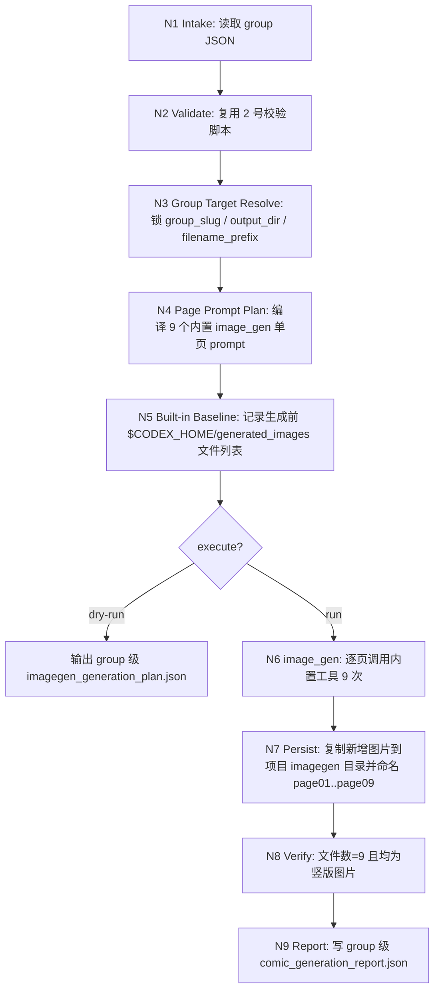
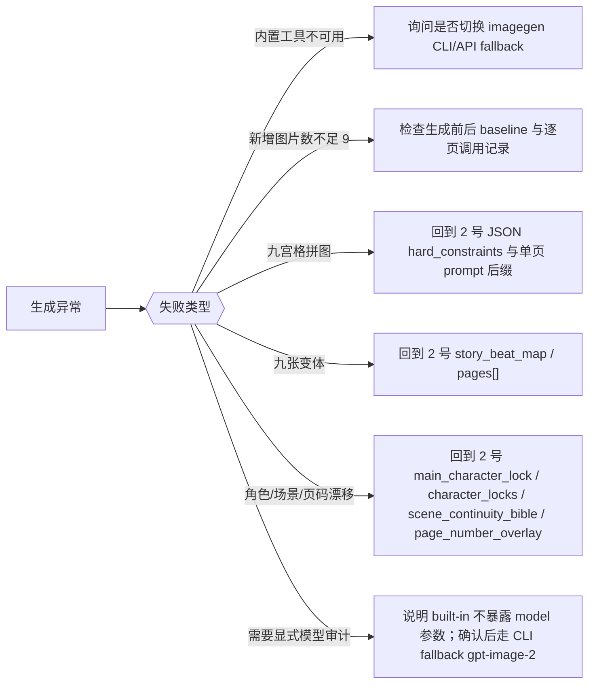

# 漫画生成

## Context Loading Contract

- 每次调用本技能时，必须同时加载同目录 `CONTEXT.md` 作为预加载上下文。
- 若同目录 `CONTEXT.md` 缺失，应先补齐最小知识库骨架，或向用户明确报告阻塞；不得在未检查该上下文的情况下执行技能。
- 若当前任务绑定具体项目根，还应按仓库根 `AGENTS.md` 加载项目级 `MEMORY.md` 与相关 `CONTEXT/`。
- 冲突优先级：用户显式请求 > 仓库/全局 `AGENTS.md` > 本 `SKILL.md` > `references/` 细则 > 同目录 `CONTEXT.md`。

## 1. 定位

本技能消费 `2-九刀流漫画提示词` 输出的某个 `page-group` 级 `nine_blade_comic_prompts.v1` JSON，并默认使用 Codex 内置 [$imagegen](/Users/vincentlee/.codex/skills/.system/imagegen/SKILL.md) 的 built-in `image_gen` 工具执行漫画生图。

默认模型口径：

- `model_policy = GPT-IMAGE-2-default`
- 默认生成路径必须优先使用内置 `image_gen`，不要求 `OPENAI_API_KEY`，不调用 Seedream / Dreamina / AnyFast / Replicate 等外部 API。
- 当前内置 `image_gen` 工具不暴露可传入的 `model` 参数；因此不得伪造不存在的工具参数。若用户要求“可审计地显式传 `model=gpt-image-2`”，必须先说明这需要切换到 `imagegen` CLI fallback / API 路径并取得用户确认。

硬目标：

- 每个 group 固定交付 9 张图片。
- 每张图是一页完整竖版 9:16 漫画页。
- 默认每页调用一次内置 `image_gen`，共 9 次；不得把 9 页合成一张九宫格、contact sheet 或单张长图。
- 明确禁止同一画面的 9 个版本；9 张必须是连续故事页。
- 每张图右下角必须带对应页码，严格使用数字 `1-9`。
- 默认把图片命名稳定为 `page01..page09`，供 `4-动画生成` 直接按页匹配 video prompt。
- 内置生成后必须把新增图片从 `$CODEX_HOME/generated_images/...` 复制或移动到项目工作区；不得让项目资产只停留在 Codex 默认生成目录。
- 多组执行时，不同 group 的计划、prompt、报告和图片不得互相覆盖。

## 2. 已验证上下文

本仓库已通过一次真实 Codex built-in `image_gen` 验证：

- 对 `projects/comic/笑傲江湖4之风云再再起/2-九刀流漫画提示词/第1集-page-group-01-nine_blade_comic_prompts.json`，逐页调用内置 `image_gen` 可生成 9 张独立竖版漫画页。
- 生成结果保存到 `$CODEX_HOME/generated_images/...` 后，可复制到 `projects/comic/<项目名>/3-漫画生成/<group_id>/imagegen/` 并稳定命名。
- 实测输出为竖版 RGB PNG，漫画页效果优于当前外部 API 默认路径。

因此本技能默认使用**内置 image_gen 逐页生成**，而不是 API 单请求 9 图，也不是脚本批量提交外部 provider。

## 3. Reference Loading Guide

| 场景 | 读取文件 |
| --- | --- |
| 本技能经验层、失败模式 | `CONTEXT.md` |
| comic 类型包装载合同 | `../_shared/type-pack-loading-contract.md` |
| 2 号 JSON 合同 | `../2-九刀流漫画提示词/SKILL.md` |
| 内置 image_gen 执行细则 | `references/imagegen-nine-page-generation.md` |
| legacy Seedream/API 追溯 | `references/seedream-nine-page-generation.md` |
| Codex 内置 imagegen 总合同 | `/Users/vincentlee/.codex/skills/.system/imagegen/SKILL.md` |

## 4. 总输入合同

### 必需输入

- `prompt_json`
  - 符合 `nine_blade_comic_prompts.v1` 的单个 group JSON 文件路径。
  - 优先使用 `page-group-01-nine_blade_comic_prompts.json`、`第N集-page-group-01-nine_blade_comic_prompts.json` 这类组级文件；legacy 单文件仅作兼容读取。
  - 该 JSON 必须携带 `pages[1..9].positive_prompt`、`page_group`、`generation_contract`、`type_stack_ref / type_pack_context`，供 3/4/5 段继续继承。

### 可选输入

- `output_dir`
  - 默认：`projects/comic/[项目名]/3-漫画生成/<group_id>/imagegen/`。
  - 若 JSON 已位于 `projects/comic/[项目名]/2-九刀流漫画提示词/`，自动推断同一项目名。
  - 若 JSON 已位于 `projects/aigc/[项目名]/5-Image/漫画/2-九刀流漫画提示词/`，自动推断到同项目的 `projects/aigc/[项目名]/5-Image/漫画/3-漫画生成/<group_id>/imagegen/`，避免漂移到 `projects/comic/`。
- `project_name`
  - 当 JSON 不在标准项目路径下时，用于指定输出项目名。
- `filename_prefix`
  - 默认：短页码命名，最终落盘为 `page01.png ... page09.png`。
  - 若显式传入自定义 prefix，则保留自定义前缀命名。
  - 若当前输入是多组 episode 中的某一组，推荐显式包含 group 前缀，例如 `page-group-01-page`。
- `dry_run`
  - 只生成逐页 prompt plan，不调用内置 `image_gen`。

### Group Execution Rule

- 若当前 episode 被 `2-九刀流漫画提示词` 切成多个 `page-group` JSON，本技能默认“一次只消费一个 group JSON”。
- 多组执行时，应按 `group_index` 顺序逐组调用本技能，而不是把多个 group JSON 拼成一次超长 prompt。
- 若用户未显式指定 `output_dir`，默认把当前 group 的执行产物落到 `projects/comic/[项目名]/3-漫画生成/<group_id>/imagegen/` 或对应 `aigc` 项目的同级 `3-漫画生成/<group_id>/imagegen/`，避免多组覆盖。
- 上述 group 子目录下的 `page01..page09` 是 `4-动画生成` 的默认首帧真源；4 号应按页码直接消费，而不是重新猜测哪张图对应哪页。

## 5. 思行网络





## 6. 思行节点表

| node_id | objective | actions | evidence | route_out | gate |
| --- | --- | --- | --- | --- | --- |
| `N1-INTAKE` | 读取并锁定 group JSON | 解析 JSON、读取 `page_group / continuity_context`，识别当前 group 身份 | JSON 路径、group metadata | N2 | JSON 可读且 group 可识别 |
| `N2-VALIDATE` | 确保可消费 | 调用 2 号 validator；检查 9 页、9:16、hard constraints、group metadata | validator 输出 | N3 或退回 2 号技能 | 零错误 |
| `N3-GROUP-TARGET-RESOLVE` | 锁定当前 group 的执行目标 | 解析 `group_slug`、默认输出目录、默认文件名前缀；若未指定 `output_dir` 则落到 group/imagegen 子目录 | `group_slug`、目标目录、命名方案 | N4 | 多组执行时不会覆盖 |
| `N4-PAGE-PROMPT-PLAN` | 形成 9 个单页 prompt | 读取 `pages[].positive_prompt`，追加“本次只生成当前页、不得生成整组/九宫格/变体”的单页约束 | `imagegen_generation_plan.json` | N5 | 9 个 prompt 与页码一一对应 |
| `N5-BASELINE` | 锁定内置生成目录基线 | 记录 `$CODEX_HOME/generated_images/**/*.png` 生成前列表 | baseline 文件或报告字段 | N6 | 后续能识别新增图片 |
| `N6-IMAGEGEN` | 执行内置生图 | 对 9 个 prompt 逐页调用 built-in `image_gen`，默认 `model_policy=GPT-IMAGE-2-default` | 工具调用记录、新增图片 | N7 | 9 次调用完成 |
| `N7-PERSIST` | 项目落盘 | 将新增图片复制到 `output_dir`，命名为 `page01.png..page09.png` 或显式 prefix | saved_files | N8 | 项目目录拥有 9 张图片 |
| `N8-VERIFY` | 校验 9 张独立页 | 检查文件数、文件可打开、宽高为竖版；抽查非九宫格/非单页海报风险 | 文件列表、尺寸 | N9 或返工 | 9 张竖版文件且命名不覆盖其他组 |
| `N9-REPORT` | 交付当前 group 结果 | 写当前 group 的漫画生成报告，列出图片路径、prompt plan、模型口径和风险 | 计划、报告、文件 | 完成 | 可追溯 |

## 7. 标准执行方式

### Dry Run / Prompt Plan

Dry run 只做输入校验、目标目录推断与 9 个单页 prompt plan，不调用任何外部 API。

建议输出：

```text
projects/comic/[项目名]/3-漫画生成/<group_id>/imagegen/
  imagegen_generation_plan.json
  page01-imagegen_prompt.txt
  ...
  page09-imagegen_prompt.txt
```

### 执行生图

默认执行必须由 agent 使用 built-in `image_gen` 工具完成：

1. 读取并校验 `prompt_json`。
2. 记录 `$CODEX_HOME/generated_images/**/*.png` baseline。
3. 从 `pages[0].positive_prompt` 到 `pages[8].positive_prompt` 逐页调用内置 `image_gen`。
4. 每次 prompt 末尾追加：

   ```text
   Execution for this single built-in image_gen call: generate only this one page, not the full 9-page set. Preserve vertical 9:16 comic-page feeling, multiple panels, readable page number overlay.
   ```

5. 生成完成后，把新增图片复制到项目 `imagegen/` 目录，保留 Codex 默认生成目录原件。
6. 写 `comic_generation_report.json` 与 manifest。

不得默认调用：

- `.agents/skills/api/anyfast/image/seedream`
- Dreamina CLI
- Replicate / AnyFast / AI666 / 其他外部图像 API

除非用户明确要求切换 provider，或 built-in `image_gen` 不可用且用户确认 fallback。

## 8. 单页 Prompt 强约束

每个单页 prompt 必须保留原 `pages[].positive_prompt`，并在末尾追加以下执行合同：

```text
Execution for this single built-in image_gen call: generate only this one page, not the full 9-page set. Preserve vertical 9:16 comic-page feeling, multiple panels, readable page number overlay.
Hard constraints from project contract: Do not create a nine-grid collage, contact sheet, or one image containing all pages. Do not create nine variations of the same scene. Every page must contain multiple comic panels, never a single full-page illustration. Keep character and scene consistency across all pages. Place a small page number in the bottom-right corner of every page, using digits 1-9 only.
```

若顶层 `generation_contract.hard_constraints` 或 `global_negative_prompt` 存在，应逐页拼入 prompt，而不是只写进报告。

## 9. 动画交接

- `4-动画生成` 默认读取当前 group 的 `imagegen/page01..page09` 作为对应页的首帧参考图。
- 若用户显式让多个 group 共用同一个 `output_dir`，本技能会自动升级为 `group_slug-page01..page09` 命名；4 号技能应先按 `group_slug` 再按页码解析。
- 3 号技能不负责视频化处理；若出现 motion、camera、shot plan 问题，优先回到 4 号技能，而不是在 3 号执行层拼接视频 prompt。

## 10. 字段映射

| field_id | 输出位置/字段 | 内容要求 | 失败码 |
| --- | --- | --- | --- |
| `FIELD-CG-01` | `input_json` | `nine_blade_comic_prompts.v1` 可解析且 9 页有效 | `FAIL-CG-INPUT` |
| `FIELD-CG-02` | `page_group / group_slug` | 当前执行目标明确，group 身份可被报告与文件命名复用 | `FAIL-CG-GROUP-TARGET` |
| `FIELD-CG-02A` | `type_stack_ref / type_pack_context` | 当前 group 仍能回指 active packs 与 `image_generation` 阶段投影 | `FAIL-CG-TYPE-PACK` |
| `FIELD-CG-03` | `page_prompts[]` | 9 个单页 prompt 均含 9:16、非拼图、非变体、连续性和右下角数字页码约束 | `FAIL-CG-PROMPT` |
| `FIELD-CG-04` | `imagegen_runtime` | 默认 `provider=built-in-image_gen`，`model_policy=GPT-IMAGE-2-default`，不调用外部 API | `FAIL-CG-RUNTIME` |
| `FIELD-CG-05` | `baseline/new_files` | 能从 `$CODEX_HOME/generated_images` 识别本轮新增图片 | `FAIL-CG-BASELINE` |
| `FIELD-CG-06` | `saved_files` | 9 个独立图片文件，且不会覆盖其他 group 结果 | `FAIL-CG-FILES` |
| `FIELD-CG-07` | `comic_generation_report.json` | 汇总 group plan、imagegen runtime、文件列表、风险 | `FAIL-CG-REPORT` |

默认命名约束：

- 若用户未显式指定 `filename_prefix`，且使用默认 group 子目录，最终图片文件名标准化为 `page01.png` 到 `page09.png`。
- 若用户显式把多个 group 共用一个 `output_dir`，默认命名应自动升级为带 group 前缀的 `group-slug-page01.png` 到 `group-slug-page09.png`，避免覆盖。
- 不再默认把上游 JSON 文件名 stem 传播为最终图片前缀，避免出现 `nine_blade_comic_prompts_01.jpeg` 这类冗长落盘名。

## 11. Root-Cause 合同

若生成失败或结果不符合预期，按以下链路上溯：

`Symptom -> Direct Cause -> Rule Source -> Meta Rule Source -> Fix Landing Points`

- 内置工具不可用：检查当前会话是否具备 `image_gen` 工具；若无，询问是否走 CLI/API fallback。
- 生成数量少于 9：检查 baseline、新增图片识别、9 次工具调用是否完整。
- 生成结果留在 `$CODEX_HOME`：修本技能持久化节点，不得要求下游直接引用 Codex 默认目录。
- 九宫格拼图：回到 2 号 JSON 的 `hard_constraints`、本技能单页 prompt 后缀与 `references/imagegen-nine-page-generation.md`。
- 九张变体：回到 2 号的 `story_beat_map / pages[]`。
- 角色漂移、场景漂移或页码缺失：回到 2 号的 `main_character_lock / character_locks / scene_continuity_bible / pages[].page_number_overlay`。
- 需要可审计模型参数：说明 built-in `image_gen` 不暴露 model 参数；如用户确认，转入 `imagegen` CLI fallback 并显式使用 `gpt-image-2`。

规则源：本 `SKILL.md`、`references/imagegen-nine-page-generation.md`、`/Users/vincentlee/.codex/skills/.system/imagegen/SKILL.md`、`comic/_shared/type-pack-loading-contract.md`、根 `AGENTS.md`。
