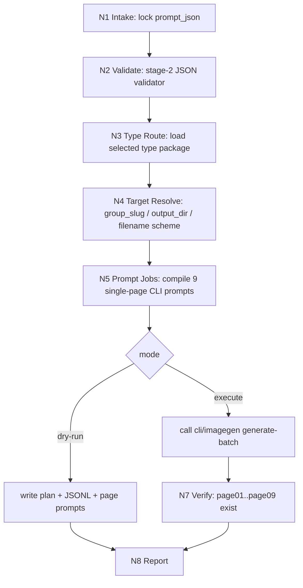

# 漫画生成

本技能消费 `2-九刀流漫画提示词` 输出的单个 `page-group` 级 `nine_blade_comic_prompts.v1` JSON，默认调用仓库内 `.agents/skills/cli/imagegen` 的 CLI 生图能力完成 9 张连续竖版漫画页。

## Context Loading Contract

- 每次调用本技能时，必须同时加载同目录 `CONTEXT.md`。
- 每次调用本技能时，必须读取 `types/type-map.md`，识别并加载当前任务命中的类型包。
- 若当前任务绑定具体项目根，还必须按仓库根 `AGENTS.md` 加载项目级 `MEMORY.md` 与相关 `CONTEXT/`。
- 若进入 CLI imagegen 执行路径，必须同时遵循 `.agents/skills/cli/imagegen/SKILL.md + CONTEXT.md`，并按其 `references/cli.md` 使用 `scripts/image_gen.py`。
- 冲突优先级：用户显式请求 > 仓库根 `AGENTS.md` > 本 `SKILL.md` > `.agents/skills/cli/imagegen/SKILL.md` > 本技能分区文件 > `agents/openai.yaml` > 项目级记忆/上下文 > 同目录 `CONTEXT.md`。

## Scope

使用本技能：

- 已有单个 `page-group` JSON，需要生成该组 9 张竖版漫画页。
- 需要先输出 CLI imagegen dry-run 计划、JSONL prompt jobs、逐页 prompt 文本和生成报告。
- 需要把漫画页稳定命名为 `page01.png..page09.png`，供 `4-剧集海报` 作为造型与风格参考。

不使用本技能：

- 编写或重切剧情、分镜、角色设定、场景设定。这些应回到 `1-漫画剧本改编` 或 `2-九刀流漫画提示词`。
- 生成视频、运动镜头或动画 prompt。当前 comic 主链不把动画作为默认第 4 段。
- 默认调用 Seedream、Dreamina、AnyFast 或 Codex built-in `image_gen`。这些只作为明确指定的 fallback/legacy 路径。

## Input Contract

- Accepted input: 单个 `nine_blade_comic_prompts.v1` group JSON 路径、可选项目名、可选输出目录、可选 CLI imagegen 参数、dry-run 或 execute 指令。
- Required input: `prompt_json`，且必须包含 `pages[1..9].positive_prompt`、`page_group`、`generation_contract`、`type_stack_ref / type_pack_context`。
- Optional input: `output_dir`、`project_name`、`filename_prefix`、`model`、`size`、`quality`、`concurrency`、`dry_run`、`execute`、`force`。
- Ask before proceeding when: JSON 路径无法定位、用户要求覆盖既有图片但未给出 `--force`、执行模式既非 dry-run 也非 execute、执行模式需要真实 API 但环境缺少 `OPENAI_API_KEY`。
- Reject or reroute when: 输入不是 group 级 JSON、JSON validator 失败、用户要求在 3 号阶段临场改写剧情或重设角色。

## Mode Selection

| mode | trigger | route | required context |
| --- | --- | --- | --- |
| `cli_imagegen_dry_run` | 用户未明确执行，或要求先看计划 | 写 prompt plan、JSONL jobs、命令预览，不调用 API | `types/type-map.md`、`steps/execution-workflow.md`、`templates/output-template.md` |
| `cli_imagegen_execute` | 用户明确要求生图执行 | 调 `.agents/skills/cli/imagegen/scripts/image_gen.py generate-batch` | `references/imagegen-nine-page-generation.md`、`.agents/skills/cli/imagegen/references/cli.md`、`review/review-contract.md` |
| `legacy_seedream` | 用户显式要求 Seedream/AnyFast | 只读 `references/seedream-nine-page-generation.md` 并调用 legacy runner | legacy reference + user confirmation |
| `legacy_dreamina` | 用户显式要求 Dreamina CLI | 调 legacy Dreamina runner | legacy runner docs + user confirmation |

默认模式是 `cli_imagegen_dry_run`；真实生图必须由用户、上游批处理或命令行显式选择 `--execute`。

## Reference Loading Guide

| 场景 | 读取文件 |
| --- | --- |
| 任务类型判定、CLI 参数画像 | `types/type-map.md` |
| 主执行拓扑、节点、失败回路 | `steps/execution-workflow.md` |
| CLI imagegen 九页生成细则 | `references/imagegen-nine-page-generation.md` |
| legacy Seedream/API 追溯 | `references/seedream-nine-page-generation.md` |
| 质量门禁、降级检查、验收 verdict | `review/review-contract.md` |
| 输出文件与报告模板 | `templates/output-template.md` |
| 稳定经验与可检索故障模式 | `knowledge-base/comic-generation-heuristics.md` |
| CLI imagegen 根合同 | `.agents/skills/cli/imagegen/SKILL.md`、`.agents/skills/cli/imagegen/references/cli.md` |
| 2 号 JSON 合同与 validator | `../2-九刀流漫画提示词/SKILL.md`、`../2-九刀流漫画提示词/scripts/validate_nine_blade_prompt_json.py` |

## Execution Contract



执行主干：

1. 读取 `prompt_json` 并运行 2 号 validator。
2. 从 `types/type-map.md` 选择并加载 `cli-imagegen-nine-page`、`dry-run-plan` 或 legacy 类型包。
3. 推断 `group_slug`、输出目录和文件名前缀。默认输出到当前 group 的 `imagegen-cli/` 子目录。
4. 编译 9 个单页 prompt。脚本只能拼接和投影上游 JSON 中已有真源，不得重写剧情。
5. 写入 `imagegen_generation_plan.json`、`imagegen_jobs.jsonl`、`page01-imagegen_prompt.txt..page09-imagegen_prompt.txt`。
6. 若执行，调用：

   ```bash
   python3 .agents/skills/cli/imagegen/scripts/image_gen.py generate-batch \
     --input <output_dir>/imagegen_jobs.jsonl \
     --out-dir <output_dir> \
     --model gpt-image-2 \
     --size 1152x2048 \
     --quality medium \
     --output-format png \
     --concurrency 3 \
     --no-augment
   ```

7. 验证 `page01.png..page09.png` 或带 group 前缀的 9 个 PNG 存在，写 `comic_generation_report.json`。

## Runtime Policy

- 默认生图工具：`.agents/skills/cli/imagegen`。
- 默认 CLI 脚本：`.agents/skills/cli/imagegen/scripts/image_gen.py`。
- 默认 CLI 子命令：`generate-batch`，每页一个 JSONL job。
- 默认模型：`gpt-image-2`。
- 默认尺寸：`1152x2048`，服务竖版 9:16 漫画页。
- 默认质量：`medium`；正式精修可显式传 `--quality high`。
- 默认输出格式：`png`。
- 默认输出目录：`projects/comic/[项目名]/3-漫画生成/<group_slug>/imagegen-cli/`；`projects/aigc/[项目名]/5-Image/漫画/` 路径则回推到同级 `3-漫画生成/<group_slug>/imagegen-cli/`。
- 不默认使用 Codex built-in `image_gen`，不默认调用 Seedream / Dreamina / AnyFast。

## Field Mapping

| field_id | owner | must contain | fail code |
| --- | --- | --- | --- |
| `FIELD-CG-01` | `SKILL.md` | 输入合同、模式路由、CLI runtime policy、Output Contract | `FAIL-CG-ENTRY` |
| `FIELD-CG-02` | `CONTEXT.md` | Type Map、Repair Playbook、Reusable Heuristics | `FAIL-CG-CONTEXT` |
| `FIELD-CG-03` | `types/` | CLI/dry-run/legacy 类型包选择与加载规则 | `FAIL-CG-TYPE` |
| `FIELD-CG-04` | `steps/` | 9 页生成节点、证据、失败回路 | `FAIL-CG-STEPS` |
| `FIELD-CG-05` | `references/` | CLI imagegen 细则与 legacy provider 边界 | `FAIL-CG-REFERENCE` |
| `FIELD-CG-06` | `review/` | 文件数、命名、runtime、视觉风险门禁 | `FAIL-CG-REVIEW` |
| `FIELD-CG-07` | `templates/` | 与 Output Contract 五字段对齐的输出模板 | `FAIL-CG-TEMPLATE` |
| `FIELD-CG-08` | `scripts/` | mechanical runner、self-test、dry-run/execute | `FAIL-CG-SCRIPT` |
| `FIELD-CG-09` | `agents/openai.yaml` | 产品侧入口摘要，显式提到 `$comic-generation` | `FAIL-CG-AGENT` |

## Root-Cause Execution Contract

失败时沿链路上溯：

`Symptom -> Direct Cause -> Section Owner -> Source Contract -> Meta Rule Source`

| symptom | repair route |
| --- | --- |
| 仍默认 Seedream / Dreamina / built-in `image_gen` | 修 `SKILL.md Runtime Policy`、`agents/openai.yaml`、registry routes |
| CLI 执行缺少 API key | 报告环境缺口；保留 dry-run 计划，不静默切 provider |
| 9 页被合成单张合集或九宫格 | 回到 `references/imagegen-nine-page-generation.md` 的单页 job 规则 |
| 九张像同图变体 | 回到 2 号 `story_beat_map / pages[]`，3 号不临场改写 |
| 输出覆盖其他 group | 修 `N4 Target Resolve` 与命名策略 |
| 4 号剧集海报找不到可参考图片 | 修 Output Contract、report manifest 和 `page01..page09` 命名 |

## Output Contract

- Required output: 当前 group 的 CLI prompt plan、JSONL jobs、逐页 prompt 文件、`comic_generation_report.json`，执行模式下还必须包含 9 张漫画页 PNG。
- Output format: JSON、JSONL、TXT、PNG；报告字段遵循 `templates/output-template.md`。
- Output path: 默认 `projects/comic/[项目名]/3-漫画生成/<group_slug>/imagegen-cli/`；AIGC 漫画路径默认 `projects/aigc/[项目名]/5-Image/漫画/3-漫画生成/<group_slug>/imagegen-cli/`。
- Naming convention: 默认图片为 `page01.png..page09.png`；若用户显式共用一个输出目录，自动升级为 `<group_slug>-page01.png..<group_slug>-page09.png`。
- Completion gate: dry-run 模式必须产出 9 个 prompt jobs 与报告；execute 模式必须通过 JSON validator、CLI exit code 为 0、9 个 PNG 存在且 report 记录 `provider=cli-imagegen`、`model=gpt-image-2`、`size=1152x2048`。
