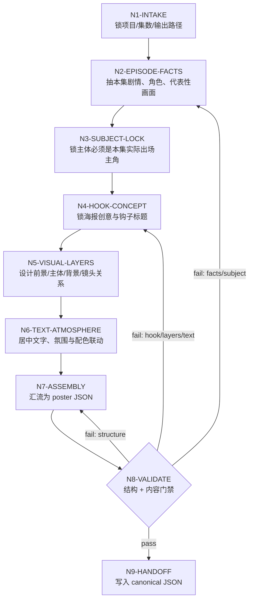
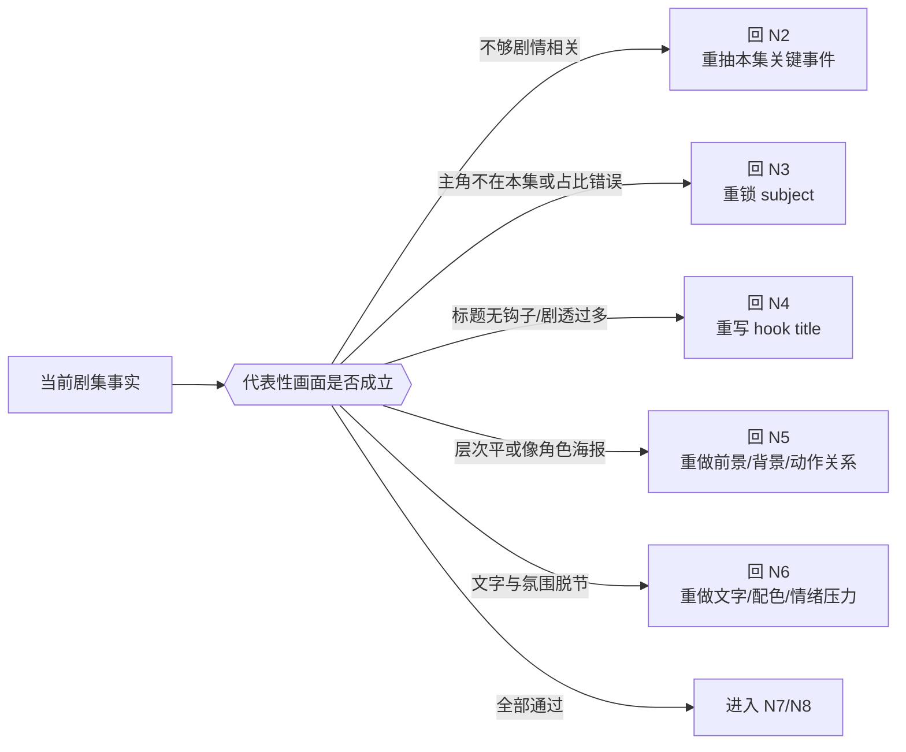
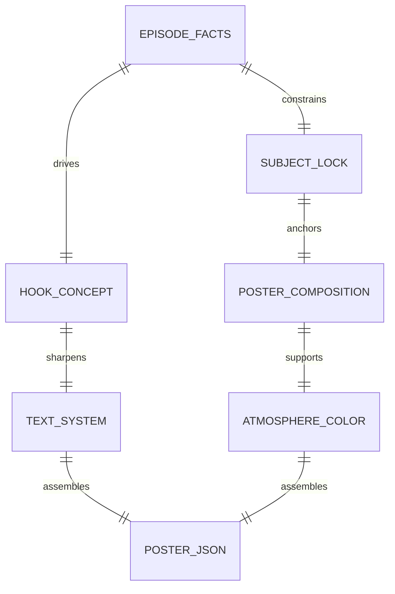

# 剧集海报

## Context Loading Contract

- 每次调用本技能时，必须同时加载同目录 `CONTEXT.md` 作为预加载上下文。
- 若同目录 `CONTEXT.md` 缺失，应先补齐最小知识库骨架，或向用户明确报告阻塞；不得在未检查该上下文的情况下执行技能。
- 冲突优先级：用户显式请求 > 仓库/全局 `AGENTS.md` > 本 `SKILL.md` > 同目录 `CONTEXT.md`。

## 1. 定位

本技能是 `.agents/skills/comic/` 系列的第 4 段，也是最后一步。

它不直接生图，而是把当前剧集的剧情钩子、实际出场主角、代表性画面、前景/背景/文字/氛围/配色等设计，汇流为一个可校验、可继续生图或交给设计师的 `comic_episode_poster_design.v1` JSON。

默认目标：

- 海报必须和当前剧集剧情有强绑定，而不是通用角色拼贴。
- 海报不得脱离 `projects/comic/[项目名]/` 已有上游输出物单独脑补，至少要回读 `1-漫画小说改编` 与 `2-九刀流漫画提示词` 真源。
- 主体人物必须与当前剧集中实际出现的主角吻合，不得偷换未出场角色。
- 文案系统默认水平+垂直双居中：
  - `第N集` 字号略小。
  - 钩子标题更醒目，默认中文；若用户显式提供标题文字，优先采用用户标题，再在必要时做最小压缩或排版化处理，但不能脱离本集事实。
- 海报风格必须继承上游风格锚点，尤其是角色阶段、场景连续性、世界观气质与已形成的漫画风格 DNA。
- 海报必须显式执行“剧情高光点发现机制”：先列候选高光点，再选择最适合海报的一处，而不是随手抓一个漂亮镜头。
- 最终只交付 JSON 真源；如后续需要生图，应以该 JSON 为唯一设计合同。

## 2. Business Requirement Analysis Contract

| analysis_field | 必须锁定的问题 | 默认策略 |
| --- | --- | --- |
| `business_goal` | 本 JSON 服务什么动作 | 服务当前剧集海报的设计、评审与后续生图 |
| `business_object` | 当前海报对应哪一集 | 优先显式 episode number；缺失时从标题或上游文件推断，默认 `1` |
| `success_criteria` | 什么叫海报设计成功 | 一眼可读、剧情相关、主角正确、标题有钩子、构图可落地 |
| `constraint_profile` | 哪些边界不可破 | 不得引入本集未实际出场角色；不得只做通用角色立绘；不得把文字系统写散；不得脱离上游风格锚点 |
| `topology_fit` | 最佳思行结构 | 先加载上游真源，再锁剧集事实、风格继承和高光点候选，之后才锁主体与钩子并汇流成 JSON |
| `step_strategy` | 本轮最值钱的思路 | 上游真源回读 + 剧情高光点筛选 + 风格连续 + 双轴居中文字层级 + 氛围配色联动 |

## 3. Context Preload

- 每次使用先读取同目录 `CONTEXT.md`。
- 海报字段细则读取 [references/episode-poster-design-contract.md](references/episode-poster-design-contract.md)。
- 输出 JSON 优先遵守 [templates/episode-poster-design.schema.json](templates/episode-poster-design.schema.json)。
- 需要起草骨架时，可从 [templates/episode-poster-design.template.json](templates/episode-poster-design.template.json) 复制后填充。

## 3.1 Project Upstream Loading Contract (Mandatory)

进入 `4-剧集海报` 时，不得把海报当作独立创作物处理。必须优先回读同项目的上游输出物：

### 必读真源

- `projects/comic/[项目名]/1-漫画小说改编/漫画桥接包.md`
- `projects/comic/[项目名]/2-九刀流漫画提示词/nine_blade_comic_prompts.json`
  - 单集/单回项目使用该路径。
  - 多集项目必须优先读取 `projects/comic/[项目名]/2-九刀流漫画提示词/第N集-nine_blade_comic_prompts.json`，不得回退覆盖或误读其他集。

### 强建议同时读取

- `projects/comic/[项目名]/1-漫画小说改编/漫画小说主稿.md`
- `projects/comic/[项目名]/1-漫画小说改编/思行裁决摘要.md`
- `projects/comic/[项目名]/2-九刀流漫画提示词/思考过程摘要.md`
  - 多集项目优先读取 `第N集-思考过程摘要.md`。
- `projects/comic/[项目名]/3-漫画生成/` 下已存在的生成图或报告，若存在则只作造型与风格参考，不夺走业务真相所有权

### 继承要求

- 主体阶段继承：优先继承 `1-漫画小说改编` 的角色阶段描述与 `2-九刀流` 的 `main_character_lock / character_locks`
- 场景继承：优先继承 `scene_continuity_bible` 与桥接包中的场景锚点
- 风格继承：优先继承 `style_bible` 的漫画风格词、线条/明暗/媒介气质，不得另起一套断层风格
- 高光点发现：必须先在上游中列出 `3-5` 个本集高光候选，再按“剧情命题价值 + 视觉冲击力 + 海报传播性 + 风格承接度”选择最终海报核心场面

## 4. 总输入合同

### 必需输入

- `project_name`
  - 漫画项目名。
- `episode_source`
  - 当前剧集的真实上游素材，至少满足以下之一：
    - `projects/comic/[项目名]/1-漫画小说改编/漫画小说主稿.md`
    - `projects/comic/[项目名]/1-漫画小说改编/漫画桥接包.md`
    - `projects/comic/[项目名]/2-九刀流漫画提示词/nine_blade_comic_prompts.json`
    - 多集项目应改为 `projects/comic/[项目名]/2-九刀流漫画提示词/第N集-nine_blade_comic_prompts.json`
- `upstream_artifacts`
  - 至少要在执行时实际读取：
    - `1-漫画小说改编/漫画桥接包.md`
    - `2-九刀流漫画提示词/nine_blade_comic_prompts.json`
    - 多集项目优先读取 `第N集-nine_blade_comic_prompts.json`

### 可选输入

- `episode_number`
  - 默认从上游标题、文件名或项目名推断；缺失时默认 `1`。
- `generated_pages_dir`
  - `projects/comic/[项目名]/3-漫画生成/`。若存在，作为代表性画面和造型连续性的参考，但不作为唯一事实源。
- `poster_aspect_ratio`
  - 默认 `3:4`；可选 `9:16` 或 `2:3`。
- `title_language`
  - 默认 `zh-CN`。
- `user_title_text`
  - 用户显式提供的标题文字。若非空，优先作为 `text_system.hook_title.text` 的来源；仅在为空、明显不成标题或需要极小幅度压缩以适配海报排版时才做最小处理。
- `output_path`
  - 默认：`projects/comic/[项目名]/4-剧集海报/第N集-剧集海报.json`

## 5. 思行网络







## 6. 思行节点表

| node_id | objective | inputs | actions | evidence | route_out | gate |
| --- | --- | --- | --- | --- | --- | --- |
| `N1-INTAKE` | 锁项目、集数、输出路径 | `project_name`、上游路径、用户要求 | 确认 `projects/comic/[项目名]/4-剧集海报/第N集-剧集海报.json`，并检查上游目录是否存在 | 项目名、集数、路径、上游路径清单 | `N2` | 输出根唯一，且上游真源可读 |
| `N2-UPSTREAM-LOAD` | 强制加载项目上游真源 | 桥接包、九刀流 JSON、主稿、可选 3 号输出 | 记录已加载 artifact，抽取角色、场景、风格与剧情证据 | `upstream_context.loaded_artifacts`、风格锚点摘要 | `N3` | 至少实际读取桥接包和九刀流 JSON |
| `N3-EPISODE-FACTS` | 抽取本集剧情事实与高光候选 | 小说主稿、桥接包、九刀流 JSON、可选生成页 | 提炼本集故事钩子、实际出场角色、代表性场面、禁止越界元素，并列出 `3-5` 个剧情高光候选 | `episode_logline`、`actual_character_ids`、`highlight_discovery.candidate_highlights` | `N4` | 至少 3 个高光候选和 1 个主矛盾 |
| `N4-STYLE-HIGHLIGHT-LOCK` | 锁风格继承与最终高光点 | 上游风格词、角色锁、场景锁、高光候选 | 选定最终高光点，归纳角色阶段、场景连续性、漫画风格与情绪基调 | `upstream_context.style_inheritance`、`highlight_discovery.selected_highlight` | `N5` | 风格锚点来自上游，不另起炉灶 |
| `N5-SUBJECT-LOCK` | 锁海报主体与角色边界 | `actual_character_ids`、角色描述、选中的高光点 | 选海报主体、次主体、排除未出场角色；写出主体关系张力 | `subject_lock` | `N6` | 主体全部出自当前剧集 |
| `N6-HOOK-CONCEPT` | 锁创意与钩子标题 | 本集悬念、冲突、视觉奇点、选中的高光点、可选用户标题 | 优先吸收用户提供标题；未提供时再写传播钩子、标题文案、剧透级别与核心创意句 | `creative_core`、`hook_title` | `N7` | 有吸引力但不脱离本集 |
| `N7-VISUAL-LAYERS` | 锁前景/主体/背景构图 | 主体锁、代表性场面、场景锚点、风格继承 | 设计镜头、动作、前景物、背景环境、空间层次，并保留风格连续性说明 | `composition`、`foreground`、`background` | `N8` | 不退化成平面拼贴 |
| `N8-TEXT-ATMOSPHERE` | 锁文字系统、氛围与配色 | 钩子标题、创意句、构图、风格继承 | 固定水平+垂直双居中文字层级、`第N集` 小标题、氛围词、色彩脚本 | `text_system`、`mood`、`color_script` | `N9` | 文字和氛围服务同一钩子 |
| `N9-ASSEMBLY` | 组装 JSON 真源 | 全部设计字段、模板、schema | 组装 `comic_episode_poster_design.v1` JSON 与 prompt package | JSON 文件 | `N10` | 字段完整 |
| `N10-VALIDATE` | 结构与内容门禁 | JSON、validator | 检查上游加载、风格继承、高光点筛选、标题层级、主体边界、构图字段 | validator 输出 | `N11` 或回退 | 通过全部硬规则 |
| `N11-HANDOFF` | 交付最终真源 | 已验证 JSON | 写入 stage-4 canonical output | 最终 JSON | 完成 | 只有一个 canonical JSON |

## 7. 输出合同

最终输出必须是一个 JSON 文件，而不是散文式海报说明。推荐文件名：

```text
projects/comic/[项目名]/4-剧集海报/第N集-剧集海报.json
```

最小结构：

```json
{
  "schema_version": "comic_episode_poster_design.v1",
  "project_name": "项目名",
  "episode": {
    "number": 1,
    "display_text": "第1集"
  },
  "upstream_context": {},
  "thinking_process": {},
  "creative_direction": {},
  "subject_lock": {},
  "composition": {},
  "text_system": {},
  "atmosphere_color": {},
  "prompt_package": {}
}
```

输出中的 `thinking_process` 必须是精简结构化思考过程，只保留：

- 为什么选这个钩子
- 为什么是这些主体
- 为什么这张代表性画面最能带出本集
- 为什么这个高光点胜过其他候选高光点
- 为什么当前海报风格能和项目上游保持连续
- 为什么文字和氛围这样组织

## 8. 硬规则

- 上游加载级：必须在 `upstream_context.loaded_artifacts` 中显式记录已读取的项目上游真源，且至少包含桥接包与九刀流 JSON。
- 风格继承级：必须在 `upstream_context.style_inheritance` 中显式写出从上游继承的角色阶段、场景连续性和风格锚点。
- 高光点发现级：必须在 `upstream_context.highlight_discovery` 中先列候选，再给出选中项和筛选理由。
- 角色边界级：`subject_lock.primary_subjects` 中所有角色必须属于当前剧集实际出场角色。
- 剧情绑定级：`creative_direction.representative_scene` 必须能回指到当前集真实事件、情绪或冲突。
- 传播钩子级：`text_system.hook_title.text` 允许更偏传播，但不得伪造本集不存在的核心反转。
- 用户标题优先级：若用户显式提供 `user_title_text`，`text_system.hook_title.text` 必须优先复用该标题文本；仅允许做最小必要的压缩、断句或排版化处理，不得擅自改写核心语义。
- 文字层级级：默认水平+垂直双居中；`episode.display_text` 必须是 `第N集` 且字号层级小于钩子标题。
- 文字位置级：`text_system.horizontal_alignment` 与 `text_system.vertical_alignment` 默认都必须为 `center`；`episode_label.position` 与 `hook_title.position` 都必须显式声明双轴居中，而不是只写一个笼统的 `center`。
- 画面层次级：必须同时具备 `foreground / subjects / background` 三层描述，防止变成空背景角色海报。
- 氛围配色级：`atmosphere_color` 必须同时给出情绪、主色、强调色、光线策略。
- 可生图级：`prompt_package.positive_prompt` 必须能直接指导后续生图，不得只有名词清单。

## 9. 字段映射

| field_id | 输出位置/字段 | 内容要求 | 失败码 |
| --- | --- | --- | --- |
| `FIELD-CEP-01` | `episode.display_text` | 严格为 `第N集` | `FAIL-CEP-EPISODE-LABEL` |
| `FIELD-CEP-02` | `upstream_context.loaded_artifacts` | 至少实际加载桥接包与九刀流 JSON | `FAIL-CEP-UPSTREAM` |
| `FIELD-CEP-03` | `upstream_context.style_inheritance` | 角色阶段、场景连续、风格锚点齐备 | `FAIL-CEP-STYLE-INHERIT` |
| `FIELD-CEP-04` | `upstream_context.highlight_discovery` | 候选高光点、选中高光点、筛选理由齐备 | `FAIL-CEP-HIGHLIGHT` |
| `FIELD-CEP-05` | `thinking_process` | 有精简思考过程，不是空对象 | `FAIL-CEP-THINKING` |
| `FIELD-CEP-06` | `creative_direction.creative_core` | 一句话讲清本海报卖点 | `FAIL-CEP-CREATIVE` |
| `FIELD-CEP-07` | `creative_direction.representative_scene` | 必须绑定本集真实代表性场面 | `FAIL-CEP-SCENE` |
| `FIELD-CEP-08` | `subject_lock.primary_subjects` | 只允许本集实际出场主角/核心角色 | `FAIL-CEP-SUBJECT` |
| `FIELD-CEP-09` | `composition.foreground / subjects / background` | 三层画面关系齐备 | `FAIL-CEP-LAYERS` |
| `FIELD-CEP-10` | `text_system` | 默认水平+垂直双居中，`第N集` 小、标题大、标题默认中文 | `FAIL-CEP-TEXT` |
| `FIELD-CEP-11` | `atmosphere_color` | 情绪、主色、强调色、光线策略齐备 | `FAIL-CEP-ATMOSPHERE` |
| `FIELD-CEP-12` | `prompt_package.positive_prompt` | 可直接用于后续海报生图，且要体现上游风格连续性 | `FAIL-CEP-PROMPT` |

## 10. 验证

标准校验命令：

```bash
python3 .agents/skills/comic/4-剧集海报/scripts/validate_episode_poster_json.py path/to/poster.json
```

通过标准：

- schema version 正确
- 上游真源加载记录完整
- 风格继承与高光点发现机制完整
- `第N集` 文案正确
- 钩子标题存在且与 episode label 不同
- 标题系统为水平+垂直双居中
- 主体不为空
- 三层构图齐备
- prompt package 含正向 prompt

## 11. Root-Cause 合同

若海报设计出现“主角不对、像通用角色海报、标题无钩子、文字层级乱、只剩情绪没有剧情绑定、脱离上游风格或抓错剧情高光点”等问题，按以下链路上溯：

`Symptom -> Direct Cause -> Rule Source -> Meta Rule Source -> Fix Landing Points`

- `Rule Source`：本 `SKILL.md`、`references/episode-poster-design-contract.md`、模板、validator、comic 父技能路由合同。
- `Meta Rule Source`：仓库 `AGENTS.md` 的 Root-Cause First、Canonical Source Governance，以及 `skill-知行合一` 的单一输出真源合同。
- 优先修本集事实抽取、主体锁与文字层级真源，再修局部 prompt 文案。
