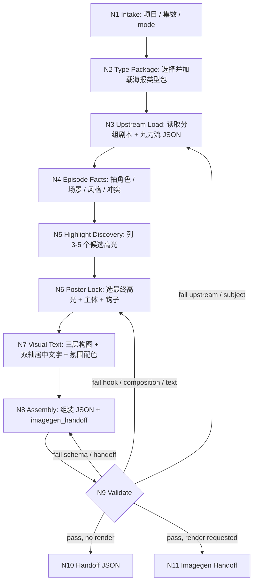

# 剧集海报思行工作流

本文件承载 `comic-episode-poster` 的执行拓扑。入口、输出路径和最终裁决仍以同目录 `SKILL.md` 为准。

## Workflow Map

## Node Table

| node_id | objective | actions | evidence | route_out | gate |
| --- | --- | --- | --- | --- | --- |
| `N1-INTAKE` | 锁定项目、集数、mode 和输出路径 | 解析 `project_name`、`episode_number`、`render_image`、`user_title_text`；确认 `projects/comic/<项目名>/4-剧集海报/第N集-剧集海报.json` | 项目名、集数、mode、路径 | `N2` | 输出根唯一，不落回旧 `5-剧集海报` |
| `N2-TYPE-PACKAGE` | 加载本轮固定类型上下文 | 按 `types/type-map.md` 选择 `story-bound-poster`、`user-title-locked`、`render-ready-handoff` 等类型包 | `loaded_type_packages` | `N3` | 至少一个类型包被记录 |
| `N3-UPSTREAM-LOAD` | 强制回读项目真源 | 读取分组剧本、九刀流 JSON、可选 3 号图片/报告；多集项目按 `第N集-` 前缀优先 | `upstream_context.loaded_artifacts` | `N4` | 分组剧本和九刀流 JSON 都实际读取 |
| `N4-EPISODE-FACTS` | 抽取本集事实和边界 | 提炼本集 logline、出场角色、场景锚点、风格锚点、禁止越界元素 | `actual_character_ids`、`style_inheritance` | `N5` | 主矛盾、角色边界、风格继承齐备 |
| `N5-HIGHLIGHT-DISCOVERY` | 发现剧情高光点 | 列出 `3-5` 个候选，并按命题价值、视觉冲击、传播性、风格承接筛选 | `candidate_highlights`、评分或筛选理由 | `N6` | 不少于 3 个候选 |
| `N6-POSTER-LOCK` | 锁定最终海报卖点 | 选择最终高光、主体、代表性画面、钩子标题；用户标题优先 | `selected_highlight`、`subject_lock`、`hook_title` | `N7` | 主体全部为本集出场角色，标题可回指事实 |
| `N7-VISUAL-TEXT` | 完成画面与文字系统 | 设计 foreground / subjects / background、比例、镜头、双轴居中文字、氛围和色彩 | `composition`、`text_system`、`atmosphere_color` | `N8` | 不退化为平面角色拼贴 |
| `N8-ASSEMBLY` | 汇流 JSON 与 imagegen 交接 | 组装 schema 字段，写入 `imagegen_handoff.tool_skill_path = ".agents/skills/cli/imagegen"` | JSON 草稿 | `N9` | 字段完整 |
| `N9-VALIDATE` | 执行结构与语义门禁 | 运行 validator；按 `review/review-contract.md` 做语义检查 | validator 输出、review verdict | `N10` / `N11` / 回退 | pass 或明确返工 owner |
| `N10-HANDOFF-JSON` | 交付设计真源 | 写入 canonical JSON，报告路径与残余风险 | JSON 文件 | done | 文件存在且通过校验 |
| `N11-IMAGEGEN-HANDOFF` | 将设计交给生图技能 | 加载 `.agents/skills/cli/imagegen/SKILL.md + CONTEXT.md`，以已校验 JSON 的 prompt 为唯一生图输入 | imagegen 执行记录、图片路径 | done | 图片落到项目目录，不只留在临时目录 |

## Failure Routing

| fail_code | symptom | rework target |
| --- | --- | --- |
| `FAIL-CEP-UPSTREAM` | 未记录分组剧本或九刀流 JSON | `N3-UPSTREAM-LOAD` |
| `FAIL-CEP-HIGHLIGHT` | 未列候选高光或选中理由不足 | `N5-HIGHLIGHT-DISCOVERY` |
| `FAIL-CEP-SUBJECT` | 主体不属于本集实际出场角色 | `N4-EPISODE-FACTS` / `N6-POSTER-LOCK` |
| `FAIL-CEP-TEXT` | 标题层级或双轴居中不成立 | `N7-VISUAL-TEXT` |
| `FAIL-CEP-PROMPT` | prompt 不可直接生图 | `N8-ASSEMBLY` + `render-ready-handoff` 类型包 |
| `FAIL-CEP-IMAGEGEN-HANDOFF` | 未指向 `.agents/skills/cli/imagegen` | `N8-ASSEMBLY` |
