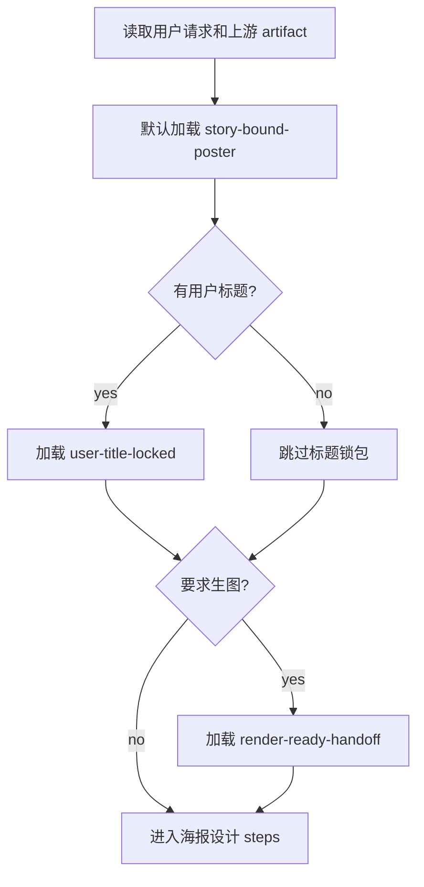

# 剧集海报类型包地图

## Package Index

| package_id | trigger | context file | compatible_with | review gates |
| --- | --- | --- | --- | --- |
| `story-bound-poster` | 默认；需要从本集事实生成海报 JSON | `types/story-bound-poster.md` | `user-title-locked`, `render-ready-handoff`, `batch-episode-posters` | `G2`-`G9` |
| `user-title-locked` | 用户显式给出标题文字 | `types/user-title-locked.md` | `story-bound-poster`, `render-ready-handoff` | `G6`, `G8` |
| `render-ready-handoff` | 用户要求继续生成海报图、生图、渲染或导出封面图 | `types/render-ready-handoff.md` | `story-bound-poster`, `user-title-locked` | `G9`, `G10` |
| `batch-episode-posters` | 多集批量设计海报 | `types/batch-episode-posters.md` | `story-bound-poster` | `G1`-`G10` |

## Default Package Rule

- 未指定时，默认加载 `story-bound-poster`。
- 若用户提供 `user_title_text`，必须额外加载 `user-title-locked`。
- 若用户要求“生图 / 生成海报图 / 渲染 / 封面图”，必须额外加载 `render-ready-handoff`。
- 若一次处理多集，加载 `batch-episode-posters`，但每集仍独立套用 `story-bound-poster`。

## Loading Flow



## Type Profile Shape

```json
{
  "selected_packages": ["story-bound-poster"],
  "title_policy": "generate_from_episode_facts",
  "render_policy": "json_only",
  "must_load": ["types/story-bound-poster.md"],
  "review_gates": ["G1-SCHEMA", "G2-UPSTREAM", "G10-IMAGEGEN"]
}
```
