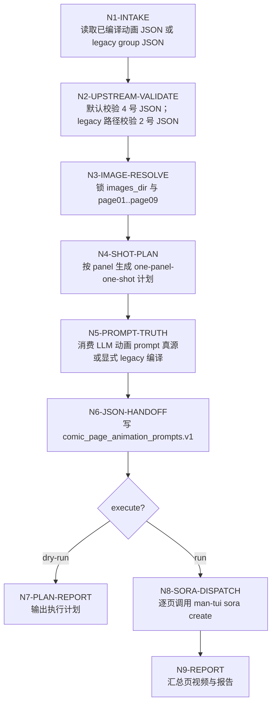
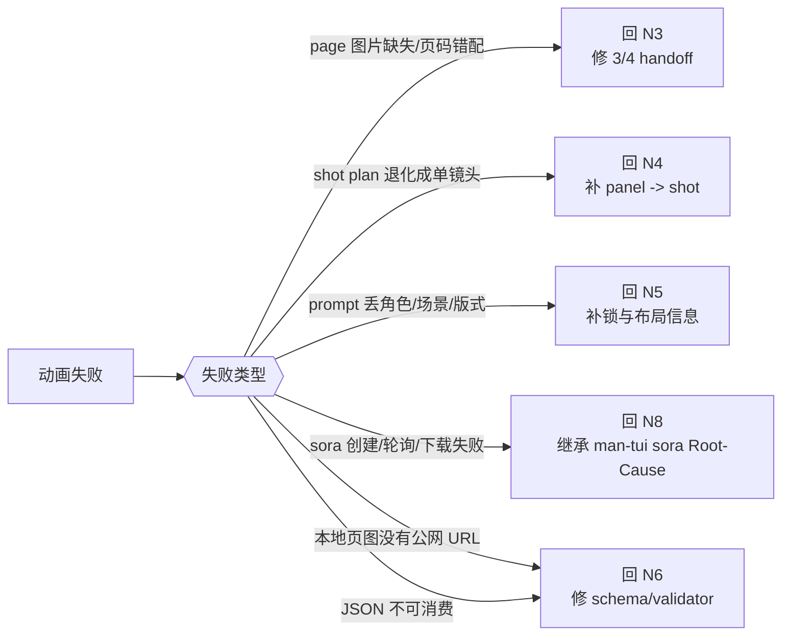
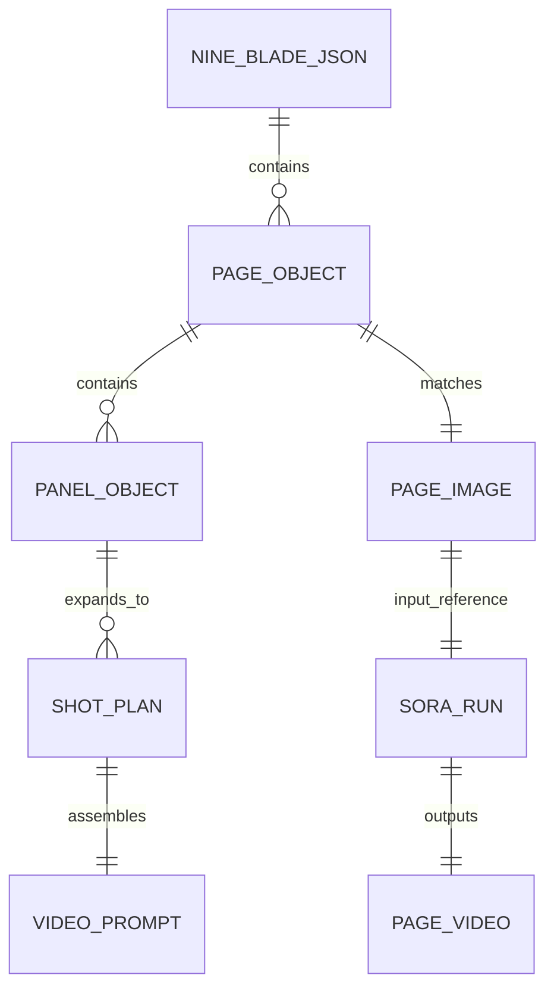

# 动画生成

## Context Loading Contract

- 每次调用本技能时，必须同时加载同目录 `CONTEXT.md` 作为预加载上下文。
- 若同目录 `CONTEXT.md` 缺失，应先补齐最小知识库骨架，或向用户明确报告阻塞；不得在未检查该上下文的情况下执行技能。
- 冲突优先级：用户显式请求 > 仓库/全局 `AGENTS.md` > 本 `SKILL.md` > 同目录 `CONTEXT.md`。

## LLM-First Creative Authorship Contract (Mandatory)

- `4-动画生成` 的页级 `video_prompt` 正文属于内容创作型输出，必须由 LLM 直接完成。
- `scripts/run_comic_animation.py` 的默认职责仅限：读取上游 JSON、校验 schema、补齐首帧 URL 映射、生成执行计划、调用 provider、写报告。
- 当输入已经是 LLM 直出的 `comic_page_animation_prompts.v1` 时，脚本可正常承担上述机械职责。
- 当输入只是 `nine_blade_comic_prompts.v1`，而脚本还要继续代写页级 `video_prompt` 时，该路径视为 legacy script authorship；默认禁止，只有显式传入 `--allow-legacy-script-authorship` 才可临时兼容执行。
- 不得再把“脚本从 2 号 JSON 编译出 4 号 video prompt”表述为默认主链。

## 1. 定位

本技能是 `.agents/skills/comic/` 系列的第 4 段。

它负责消费页级动画 prompt 真源 `comic_page_animation_prompts.v1`，并把 `3-漫画生成` 的对应页图作为单张首帧参考，调用 `.agents/skills/api/man-tui/video/sora` 逐页完成图生视频。若上游仍停留在 legacy `nine_blade_comic_prompts.v1 -> 脚本编译 4 号 prompt` 路径，只可在显式兼容模式下临时运行。

硬目标：

- 每个 `page-group` 固定交付一份组级动画 prompt JSON；该 JSON 的创作正文默认由 LLM 直出，脚本只负责校验、投影与执行辅助。
- 每页视频 prompt 必须以固定前缀开头：

```text
Animate this vertical comic strip into a seamless, continuous cinematic video. Chronological sequence from right to left, top to bottom panels. Advanced camera movement transitioning smoothly between scenes. High-fidelity motion physics, 4K resolution, masterpiece quality.
```

- 每页默认遵循 `一个格子一个分镜`；若页面有 3 个 panel，默认编成 3 个 shot。
- 必须保留原页的角色身份、服装、场景地标、布局、文字系统、页码和风格 DNA，不得把漫画页改写成新故事。
- 默认用 `sora-2` 做图生视频，默认参数为 `10s + 720x1280 + 9:16`。
- `man-tui sora` 的图生视频参考图只接受公网 URL；本地 `page01..page09` 仍是业务真源，但真实执行前必须补齐每页的 `input_reference_url` 映射。
- 动画阶段只做 prompt 提炼与视频执行，不重写剧情真相；剧情问题回到 2 号技能，页图问题回到 3 号技能。

## 2. Business Requirement Analysis Contract

| analysis_field | 必须锁定的问题 | 默认策略 |
| --- | --- | --- |
| `business_goal` | 当前输出服务什么动作 | 服务 `man-tui sora` 图生视频逐页执行 |
| `business_object` | 当前输入是什么 | 单个 `page-group` 级 `nine_blade_comic_prompts.v1` JSON + 对应 `page01..page09` 图片 |
| `success_criteria` | 什么叫成功 | 先输出可校验的组级动画 prompt JSON，再让 9 页图片逐页匹配对应 prompt；dry-run 稳定给出执行计划，execute 仅在 9 页都补齐公网 `input_reference_url` 时提交 `sora-2` 任务 |
| `constraint_profile` | 哪些边界不可破 | prompt 固定前缀不可改；按页匹配图片；默认一个格子一个分镜；不得新增角色/场景/剧情；默认 10 秒、720x1280、9:16；真实执行必须有公网参考图 URL |
| `topology_fit` | 最佳思行结构 | 默认先校验 LLM 已直出的 4 号 JSON，再定位 3 号页图，补齐执行所需映射并逐页执行；若命中 legacy 输入，再显式进入兼容编译路径 |
| `step_strategy` | 当前最值钱的思路 | 保留页级动画 prompt 真源、把 panel 粒度转成 shot plan 辅助执行、稳定匹配 page 图片、将本地页图与公网 `input_reference_url` 映射后逐页调用 `man-tui/video/sora` |

## 3. Context Preload

- 每次使用先读取同目录 `CONTEXT.md`。
- 先读取 [../_shared/type-pack-loading-contract.md](../_shared/type-pack-loading-contract.md)，确认当前 comic 类型包装载合同。
- 动画 prompt 细则读取 [references/comic-animation-contract.md](references/comic-animation-contract.md)。
- 输出 JSON 默认遵守 [templates/comic-animation-prompts.schema.json](templates/comic-animation-prompts.schema.json)。
- 需要骨架时，可从 [templates/comic-animation-prompts.template.json](templates/comic-animation-prompts.template.json) 复制。
- `man-tui sora` 调用边界继承 [../../api/man-tui/video/sora/SKILL.md](../../api/man-tui/video/sora/SKILL.md)。
- `2-九刀流漫画提示词` 结构真源继承 [../2-九刀流漫画提示词/SKILL.md](../2-九刀流漫画提示词/SKILL.md)。
- `3-漫画生成` 的首帧命名和 group 路径继承 [../3-漫画生成/SKILL.md](../3-漫画生成/SKILL.md)。

## 4. 总输入合同

### 必需输入

- `prompt_json`
  - 单个 `page-group` 对应的 `nine_blade_comic_prompts.v1` JSON，或已生成好的 `comic_page_animation_prompts.v1` JSON。
  - 若输入为 2 号 JSON，必须带 `type_stack_ref / type_pack_context`；编译后的 4 号 JSON 必须继续透传。

### 可选输入

- `images_dir`
  - 默认从同项目 `3-漫画生成/<group_slug>/` 推断。
  - 若当前项目直接把 `page01..page09` 落在 `3-漫画生成/` 根目录，也必须自动回退命中。
  - 若 3 号阶段使用显式共享目录，则允许外部传入。
- `output_dir`
  - 默认：`projects/comic/[项目名]/4-动画生成/`。
  - 若当前输入位于 `projects/aigc/[项目名]/5-Image/漫画/`，则默认输出到同级 `4-动画生成/`。
- `project_name`
  - 当输入不在标准项目路径下时，用于补项目名。
- `model`
  - 默认：`sora-2`。
- `seconds`
  - 默认：`10`，允许 `10 / 15`。
- `size`
  - 默认：`720x1280`，允许 `720x1280 / 1280x720`。
- `reference_url_map`
  - 可选 JSON 文件，用于把 `page01` / `<group_slug>-page01` / 源图片路径映射为公网 `input_reference_url`。
  - 若执行时缺失该映射且上游 JSON 内也没有每页 `input_reference_url`，4 号阶段必须阻断 execute，只允许 dry-run。
- `dry_run`
  - 只编译 JSON 和逐页执行计划，不提交 Sora。

### 首帧匹配规则

- 默认先找 `page01..page09`。
- 若未命中，再找 `group_slug-page01..group_slug-page09`。
- 页图与页 prompt 的匹配只允许按 `page_number` 和 `group_slug` 推断，不允许重新按内容猜图。

## 5. 思行网络







## 6. 思行节点表

| node_id | objective | inputs | actions | evidence | route_out | gate |
| --- | --- | --- | --- | --- | --- | --- |
| `N1-INTAKE` | 锁输入类型与 group 身份 | `prompt_json` | 判断当前输入是 `nine_blade_comic_prompts.v1` 还是 `comic_page_animation_prompts.v1`，并锁 `group_slug / project_root / output_dir` | 输入摘要、group 元数据 | `N2` | group 身份唯一 |
| `N2-UPSTREAM-VALIDATE` | 保证上游 JSON 可消费 | 2 号 JSON 或 4 号 JSON | 若是 2 号 JSON，先跑 2 号 validator；若是 4 号 JSON，跑 4 号 validator | validator 输出 | `N3` | 零错误 |
| `N3-IMAGE-RESOLVE` | 逐页锁定首帧图片 | `images_dir`、`group_slug`、`page_number` | 解析 `page01..page09` 或 `group_slug-page01..09`，形成 `page_number -> source_image` 映射 | 图片路径表 | `N4` | 9 页都命中 |
| `N4-SHOT-PLAN` | 把漫画格转成视频分镜 | `pages[].panels[]`、`layout`、`page_role` | 默认一个 panel 一个 shot，按右到左、上到下顺序写 `shot_plan` | 每页 `shot_plan[]` | `N5` | 至少 1 shot，默认等于 panel 数 |
| `N5-PROMPT-TRUTH` | 锁逐页 video prompt 真源 | LLM 直出的 `pages[].video_prompt`，或显式 legacy 编译输入 | 默认直接消费 LLM 已写好的页级动画 prompt；只有显式兼容模式才允许把固定前缀、`positive_prompt`、布局、角色/场景 continuity、`type_pack_context.stage_projection.animation_generation`、shot plan 组装成每页 `video_prompt` | `pages[].video_prompt` | `N6` | 默认不允许脚本偷偷代写创作正文 |
| `N6-JSON-HANDOFF` | 写组级动画 prompt 真源 | 当前 group 元数据、9 页动画 prompt | 输出 `comic_page_animation_prompts.v1` JSON、逐页 prompt txt、动画计划，并在可用时写入每页 `input_reference_url` | 动画 prompt JSON、计划文件 | `N7/N8` | JSON 可被 4 号 validator 消费 |
| `N7-PLAN-REPORT` | Dry-run 交付 | 计划和 JSON | 写 `animation_generation_report.json` 为 `planned` | 计划报告 | 完成 | 可追溯 |
| `N8-SORA-DISPATCH` | 逐页执行图生视频 | 每页 `video_prompt + input_reference_url` | 调用 `sora_video.py create --input-reference <public_url> --prompt ... --seconds 10 --size 720x1280 --wait --download-on-complete` | Sora 页级报告 | `N9` | 每页都有 run 报告 |
| `N9-REPORT` | 汇总当前 group 结果 | 计划、页级 Sora 报告、视频路径 | 写组级动画生成报告，列出成功/失败页、视频路径和回溯入口 | `animation_generation_report.json` | 完成 | 可追溯 |

## 7. 输出合同

推荐目录：

```text
projects/comic/[项目名]/4-动画生成/
  <group_slug>-comic_page_animation_prompts.json
  <group_slug>-animation_plan.json
  <group_slug>-animation_generation_report.json
  <group_slug>-page01/
    <group_slug>-page01-video_prompt.txt
    <group_slug>-page01-sora_create_report.json
    <group_slug>-page01.mp4
  ...
  <group_slug>-page09/
```

组级 JSON 最小结构：

```json
{
  "schema_version": "comic_page_animation_prompts.v1",
  "source_nine_blade_json": "path/to/page-group-01-nine_blade_comic_prompts.json",
  "type_stack_ref": {},
  "type_pack_context": {},
  "prompt_prefix": "Animate this vertical comic strip into a seamless, continuous cinematic video. Chronological sequence from right to left, top to bottom panels. Advanced camera movement transitioning smoothly between scenes. High-fidelity motion physics, 4K resolution, masterpiece quality.",
  "page_group": {},
  "continuity_context": {},
  "video_generation_contract": {
    "provider": "man-tui",
    "mode": "image_to_video",
    "model": "sora-2",
    "seconds": 10,
    "size": "720x1280",
    "input_reference_mode": "public_url_required",
    "aspect_ratio": "9:16"
  },
  "pages": []
}
```

## 8. Prompt 硬规则

- 每页 `video_prompt` 必须以固定前缀原文开头，不得改写、删词或挪位。
- 每页 `video_prompt` 必须保留：
  - 当前页 `page_role`
  - 原页 `positive_prompt`
  - `type_stack_ref / type_pack_context.stage_projection.animation_generation`
  - `layout`
  - `active_character_ids`
  - `scene_id`
  - `page_number_overlay`
  - `shot_plan`
- 每页 `video_prompt` 必须显式声明：
  - 保持原页构图与风格不变
  - 保持角色和场景连续性
  - 默认一个格子一个分镜
  - 保持中文文字与页码稳定，不可扭曲
  - 不新增 panel、不新增角色、不改剧情
- 每页 `shot_plan` 默认长度等于 `panels[]` 长度；若面板缺失，视为结构错误，而不是退化成单镜头。
- 每页真实 execute 前必须具备公网 `input_reference_url`；本地 `source_image` 只作为业务真源与追溯证据。

## 9. 标准调用

### Dry Run

```bash
python3 .agents/skills/comic/4-动画生成/scripts/run_comic_animation.py \
  path/to/page-group-01-comic_page_animation_prompts.json \
  --dry-run
```

### 执行动画

```bash
python3 .agents/skills/comic/4-动画生成/scripts/run_comic_animation.py \
  path/to/page-group-01-comic_page_animation_prompts.json \
  --reference-url-map path/to/page-reference-urls.json \
  --execute
```

### Legacy 兼容编译

只有在临时兼容旧项目、且明确接受“脚本代写 video prompt”风险时，才允许：

```bash
python3 .agents/skills/comic/4-动画生成/scripts/run_comic_animation.py \
  path/to/page-group-01-nine_blade_comic_prompts.json \
  --allow-legacy-script-authorship \
  --dry-run
```

`reference_url_map` 示例：

```json
{
  "page01": "https://example.com/page01.png",
  "page02": "https://example.com/page02.png",
  "page03": "https://example.com/page03.png"
}
```

### 校验已编译动画 JSON

```bash
python3 .agents/skills/comic/4-动画生成/scripts/validate_comic_animation_prompt_json.py \
  path/to/page-group-01-comic_page_animation_prompts.json
```

## 10. Root-Cause 合同

若动画阶段出现 prompt 前缀不一致、panel 没被展开成 shot、图片页码错配、视频参数漂移、缺少公网参考图 URL 或 Sora 运行失败，按以下链路上溯：

`Symptom -> Direct Cause -> Rule Source -> Meta Rule Source -> Fix Landing Points`

- `Rule Source`：本 `SKILL.md`、`references/comic-animation-contract.md`、模板、validator、`scripts/run_comic_animation.py`、`comic/_shared/type-pack-loading-contract.md`。
- `Meta Rule Source`：仓库 `AGENTS.md` 与 `skill-知行合一` 的单技能思行网络 / 一次性输出真源合同。
- 若问题在剧情或页面结构，优先回到 2 号技能。
- 若问题在页图命名或 group 目录，优先回到 3 号技能。
- 若问题在创建/轮询/下载，优先回到 `man-tui-sora-video` 技能脚本与合同。
