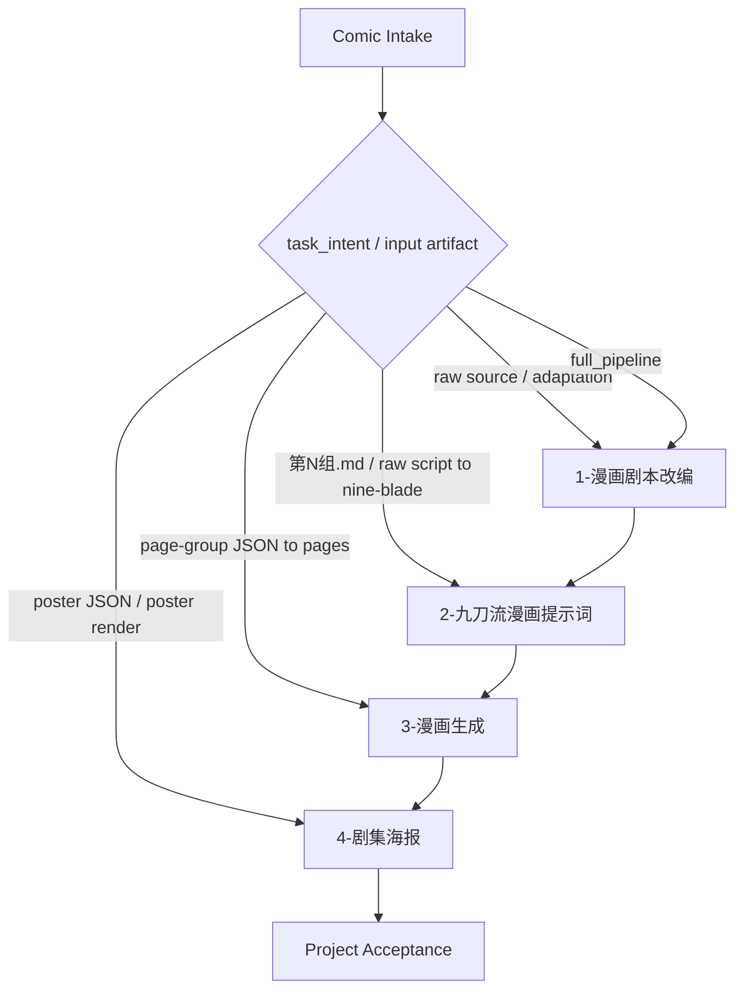

# Comic 漫画总入口

本技能是 `.agents/skills/comic/` 的导引式父级入口。它只负责项目根、阶段路由、共享类型包、handoff 边界和总验收；不直接改写剧本正文、不生成九刀 JSON、不调用生图、不设计海报。

## Context Loading Contract

- 每次调用本技能时，必须同时加载同目录 `CONTEXT.md` 作为预加载上下文。
- 若进入任一子技能，必须再按该子技能合同加载它自己的 `SKILL.md + CONTEXT.md + types/` 命中包。
- 若当前任务绑定 `projects/comic/<项目名>/`，根层只负责定位项目根与上游 artifact；项目内创作记忆或运行上下文由具体子技能按需消费。
- 冲突优先级：用户显式请求 > 仓库/全局 `AGENTS.md` > 本 `SKILL.md` > 子技能 `SKILL.md` > shared contracts / resolver / templates / scripts > 本 `CONTEXT.md`。

## Parent Guide Scope

### Owns

- `projects/comic/<项目名>/` 项目根和四段目录拓扑。
- 1/2/3/4 阶段路由、交接真源、回退方向和项目级验收口径。
- comic 类型包的共享加载口径与跨阶段透传要求。
- 子技能之间的 canonical truth 边界。

### Does Not Own

- 1 号分组漫剧正文写作。
- 2 号九刀流切页、角色/场景/风格锁和页级 prompt 创作。
- 3 号 built-in imagegen prompt handoff 与真实生图执行。
- 4 号剧集海报 JSON 创意设计或 imagegen 生图执行。

## Input Contract

### Required input

- `project_name`：漫画项目名；若用户未给，先从素材标题、已有项目路径或文件名推断，无法可靠推断时询问。
- `task_intent`：用户目标，归一为 `adapt_script | make_prompts | generate_images | design_poster | render_poster | full_pipeline | full_pipeline_with_poster | inspect`。

### Optional input

- `source_material`：原始文本、图片/视频摘要、新闻/热搜、已有 `第N组.md`、已有 `page-group` JSON、或已有漫画页目录。
- `episode_number`：多集项目用于锁定 `第N集-` 命名与当前集 artifact。
- `type_stack_request`：显式 `base / primary / secondary[] / platform[] / audience[]`，或 `genre / platform / target_audience / tone`。
- `output_root`：默认固定为 `projects/comic/<项目名>/`。
- `render_image`：用户是否明确要求海报或漫画页继续生图。

### Reject or reroute when

- 用户要求根技能直接产出子技能 canonical artifact；应路由到对应子技能。
- 下游阶段缺少必需上游 artifact；应回退到上一阶段补齐。
- 用户要求脚本替代核心创作判断；应遵循仓库 `LLM-first creative authorship`。

## Reference Loading Guide

| 场景 | 读取文件 |
| --- | --- |
| 漫画类型包加载、题材包根、runtime/meta 关系 | `_shared/type-pack-loading-contract.md` |
| 类型包动态推断与 `type_pack_context` 生成 | `scripts/data_modules/comic_type_pack_resolver.py` |
| 1 号来源改编与分组剧本 | `1-漫画剧本改编/SKILL.md` |
| 2 号九刀流 group JSON | `2-九刀流漫画提示词/SKILL.md` |
| 3 号 built-in imagegen 漫画页生成 | `3-漫画生成/SKILL.md` |
| 4 号剧集海报 JSON 与 imagegen handoff | `4-剧集海报/SKILL.md` |
| 题材类型包真源 | `2-九刀流漫画提示词/types/漫画/<题材>/` |
| 跨阶段默认栈配置 | `type-packs/runtime.yaml` |

## Child Skill Index

| stage | child skill | canonical input | canonical output | output root |
| --- | --- | --- | --- | --- |
| 1 | [1-漫画剧本改编](1-漫画剧本改编/SKILL.md) | 任意文本、图像/视频摘要、新闻/热搜、多源素材 | `第1组.md`、`第2组.md`... 分组漫剧剧本 | `projects/comic/<项目名>/1-漫画剧本改编/` |
| 2 | [2-九刀流漫画提示词](2-九刀流漫画提示词/SKILL.md) | `第N组.md` 或 raw source fallback | 每组一份 `page-group-XX-nine_blade_comic_prompts.json`，多集用 `第N集-` 前缀 | `projects/comic/<项目名>/2-九刀流漫画提示词/` |
| 3 | [3-漫画生成](3-漫画生成/SKILL.md) | 单个 `nine_blade_comic_prompts.v1` group JSON | built-in imagegen handoff plan、prompt set、逐页 prompt、报告；execute 模式下 9 张 PNG | `projects/comic/<项目名>/3-漫画生成/<group_slug>/built-in-imagegen/` |
| 4 | [4-剧集海报](4-剧集海报/SKILL.md) | 当前集分组剧本、九刀流 JSON、可选 3 号漫画页 | `comic_episode_poster_design.v1` JSON；用户要求时交给 `.agents/skills/cli/imagegen` 生图 | `projects/comic/<项目名>/4-剧集海报/` |

## Routing Contract

默认路由：

- 用户只说“做漫画 / 做成漫画”：走 `full_pipeline`，默认 1 -> 2 -> 3。
- 用户说“完整漫画项目 / 还要海报”：走 `full_pipeline_with_poster`，默认 1 -> 2 -> 3 -> 4。
- 用户给 `第N组.md` 或剧本并要 9 页提示词：走 2。
- 用户给 `page-group` JSON 并要生成漫画页：走 3。
- 用户要“剧集海报 / 海报 JSON / poster / 海报生图”：走 4；若要生图，4 号先产 JSON，再交 `.agents/skills/cli/imagegen`。
- 用户只问状态、路径、已有产物：走 `inspect`，不改写 artifact。

## Type-Pack Handoff

- comic 的题材类型包真源已经收束到 `2-九刀流漫画提示词/types/漫画/`。
- `type-packs/runtime.yaml` 只保留跨阶段默认栈配置：`method_kernel / base / primary / platform / audience`。
- 1 号首次锁定 `type_stack_ref / type_pack_context`；2/3/4 必须透传，不得静默丢失。
- 若用户显式给出 `type_stack_request`，优先采用显式组合；否则由 `comic_type_pack_resolver.py` 动态扫描 `runtime.yaml + types/漫画/<题材>/meta.yaml` 推断。

## Handoff Contract

| from | to | required artifact | gate |
| --- | --- | --- | --- |
| root | 1 | `source_material`、项目根、可选 type stack | 来源可归类，事实边界可判断 |
| 1 | 2 | `第N组.md` 集合 | 组文件结构可被 2 号逐组消费 |
| 2 | 3 | 单个 group JSON | 通过 2 号 `validate_nine_blade_prompt_json.py` |
| 2/3 | 4 | 当前集 group JSON、可选 3 号生成图/报告 | 海报主体和代表性画面来自当前集事实 |
| 4 | imagegen | 已校验 poster JSON | `imagegen_handoff.tool_skill_path = .agents/skills/cli/imagegen` |

## Output Contract

### Required output

- 根技能自身只输出路由决策、阶段计划、项目根说明、handoff 检查或总验收摘要。
- 子技能 artifact 必须由对应子技能生成并落盘。

### Output format

- 导引回复、任务计划、验收表或路径清单。
- 不在根层伪造 `第N组.md`、`nine_blade` JSON、imagegen job 或海报 JSON。

### Output path

- 项目根：`projects/comic/<项目名>/`
- 阶段根：`1-漫画剧本改编/`、`2-九刀流漫画提示词/`、`3-漫画生成/`、`4-剧集海报/`

### Naming convention

- 多集项目沿用子技能的 `第N集-` 前缀。
- 2 号 group 使用 `page-group-XX-nine_blade_comic_prompts.json`。
- 3 号 group 输出以 `group_slug` 分目录或前缀隔离。
- 4 号海报 JSON 使用 `第N集-剧集海报.json`。

### Completion gate

- 目标阶段 artifact 已落到 `projects/comic/<项目名>/<阶段>/`。
- handoff 链上 `type_stack_ref / type_pack_context` 可追溯。
- 3 号默认 provider 为 `.agents/skills/cli/imagegen` built-in `image_gen`，不是旧 CLI/API、Seedream/Dreamina 路径。
- 4 号如需生图，必须由已校验 poster JSON 交接 `.agents/skills/cli/imagegen`。

## Root-Cause Execution Contract

失败时按以下链路上溯：

`Symptom -> Direct Cause -> Owner Stage -> Rule Source -> Meta Rule Source -> Fix Landing Point`

| symptom | likely owner | repair route |
| --- | --- | --- |
| 阶段路由错、目录编号错 | root | 修本 `Child Skill Index` 与 registry/routes |
| 没有 `第N组.md` 就进入 2 号 | 1/root handoff | 回 1 号补分组剧本或让 2 号按 raw fallback |
| 3 号没有合格 group JSON | 2/root handoff | 回 2 号 JSON 与 validator |
| 3 号仍默认 CLI/API、Seedream/Dreamina | 3 | 修 3 号 Runtime Policy、planner 与 legacy runner 边界 |
| 4 号输出到旧 `5-剧集海报` | 4/root route | 改回 `4-剧集海报/` 并同步引用 |
| 海报脱离当前集事实 | 4 | 回 4 号上游回读与高光候选 |
| 类型包只在某一段生效 | root + child handoff | 检查 `type_stack_ref / type_pack_context` 透传 |

Meta Rule Source：仓库 `AGENTS.md` 的 Skill 2.0、LLM-first creative authorship、项目根 canonical runtime 与重命名引用同步规则。
