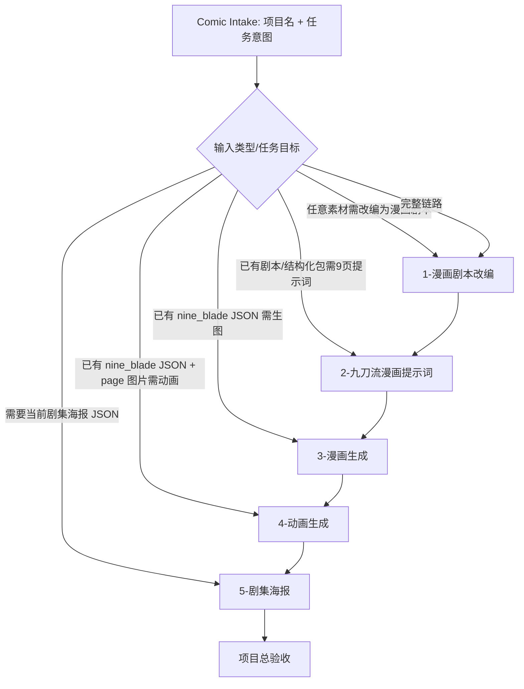
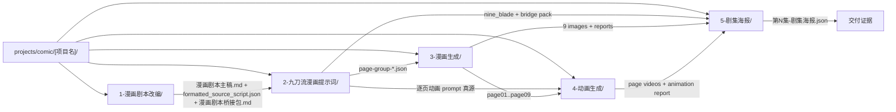
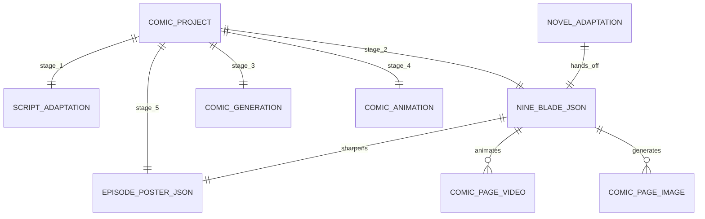

# Comic 漫画总入口

## Context Loading Contract

- 每次调用本技能时，必须同时加载同目录 `CONTEXT.md` 作为预加载上下文。
- 若同目录 `CONTEXT.md` 缺失，应先补齐最小知识库骨架，或向用户明确报告阻塞；不得在未检查该上下文的情况下执行技能。
- 冲突优先级：用户显式请求 > 仓库/全局 `AGENTS.md` > 本 `SKILL.md` > 同目录 `CONTEXT.md`。

## 1. 定位

本技能是 `.agents/skills/comic/` 的父级总入口，负责把漫画项目路由到五段受治理子技能，并统一项目落点：

```text
projects/comic/[项目名]/
  1-漫画剧本改编/
  2-九刀流漫画提示词/
  3-漫画生成/
  4-动画生成/
  5-剧集海报/
```

父技能只拥有路由、项目根、交接真源与验收总口径，不直接替代子技能写正文、写 JSON 或调用 Seedream。

## 2. 总输入合同

### 必需输入

- `project_name`
  - 漫画项目名。若用户未给，先从标题、源材料名或 JSON 文件名推断；无法可靠推断时询问。
- `task_intent`
  - `adapt_script | make_prompts | generate_images | generate_videos | design_posters | full_pipeline | full_pipeline_with_animation | full_pipeline_with_poster | full_pipeline_with_video_and_poster | inspect`

### 可选输入

- `source_material`
  - 原始素材、漫画剧本主稿、`formatted_source_script.json`、漫画剧本桥接包或已生成的 `nine_blade_comic_prompts.v1` JSON。
- `style_profile`
- `output_root`
  - 默认固定为 `projects/comic/[项目名]/`。

## 3. 路由拓扑







## 4. 子技能边界

| stage | 子技能 | 输入 | 输出 | 默认落点 |
| --- | --- | --- | --- | --- |
| 1 | [1-漫画剧本改编](1-漫画剧本改编/SKILL.md) | 任意素材、热搜、图片/视频摘要 | `漫画剧本主稿.md`、`formatted_source_script.json`、`漫画剧本桥接包.md`、`思行裁决摘要.md` | `projects/comic/[项目名]/1-漫画剧本改编/` |
| 2 | [2-九刀流漫画提示词](2-九刀流漫画提示词/SKILL.md) | 漫画剧本主稿、`formatted_source_script.json`、桥接包或用户原始剧本 | 先按约 500 字原文切 `page-group`，再输出 `page-group-01-nine_blade_comic_prompts.json`、`第N集-page-group-01-nine_blade_comic_prompts.json` 等组级 JSON | `projects/comic/[项目名]/2-九刀流漫画提示词/` |
| 3 | [3-漫画生成](3-漫画生成/SKILL.md) | 单个 `page-group` 对应的 `nine_blade_comic_prompts.v1` JSON | 该组的 9 张漫画页、Seedream 报告、生成报告 | `projects/comic/[项目名]/3-漫画生成/` |
| 4 | [4-动画生成](4-动画生成/SKILL.md) | 单个 `page-group` 对应的 `nine_blade_comic_prompts.v1` JSON + 对应 `page01..page09` 图片 | 组级 `comic_page_animation_prompts.v1` JSON、9 个页视频、动画执行报告 | `projects/comic/[项目名]/4-动画生成/` |
| 5 | [5-剧集海报](5-剧集海报/SKILL.md) | 当前集剧本/结构化包/桥接包/九刀流 JSON，及可选生成页/页视频 | `第N集-剧集海报.json` | `projects/comic/[项目名]/5-剧集海报/` |

## 5. 思行节点

| node_id | objective | actions | evidence | route_out | gate |
| --- | --- | --- | --- | --- | --- |
| `N1-PROJECT-LOCK` | 锁定项目名与项目根 | 建立或确认 `projects/comic/[项目名]/` | 用户请求、已有路径 | N2 | 项目根明确 |
| `N2-ROUTE` | 判断进入哪一段 | 按输入类型和任务目标路由 1/2/3/4/5 | 输入文件/文本类型 | 对应子技能 | 路由唯一 |
| `N3-HANDOFF` | 维护交接真源 | 确认上游输出是否满足下游输入 | 文件路径与 schema | 下一段或返工 | 不跳过必需 artifact |
| `N4-ACCEPTANCE` | 项目级验收 | 检查目标阶段产物是否落到项目根 | 子技能报告 | 完成或返工 | 路径和数量正确 |

## 6. 默认执行策略

- 用户只给素材并要求“做漫画”：默认 `full_pipeline`，依次走 1 -> 2 -> 3。
- 用户要求“做漫画动画 / 漫画页变视频”：走 `full_pipeline_with_animation`，依次走 1 -> 2 -> 3 -> 4。
- 用户要求“做完整漫画项目”或明确要海报：走 `full_pipeline_with_poster`，依次走 1 -> 2 -> 3 -> 5。
- 用户要求“完整链路含动画和海报”：走 `full_pipeline_with_video_and_poster`，依次走 1 -> 2 -> 3 -> 4 -> 5。
- 用户给剧本并要求“出 9 张图提示词”：走 2。
- 用户给某个 `page-group` JSON（或 legacy `nine_blade_comic_prompts.json`）并要求“生成漫画”：走 3。
- 用户给某个 `page-group` JSON 和对应页图并要求“做动画 / 图生视频”：走 4。
- 用户要求“给这集做海报 / 海报 JSON / 剧集 poster”：走 5。
- 用户只问状态或路径：走 `inspect`，不改写内容。

## 7. 路径硬规则

- 项目根固定为 `projects/comic/[项目名]/`。
- 五段输出必须落到同名阶段目录：
  - `1-漫画剧本改编/`
  - `2-九刀流漫画提示词/`
  - `3-漫画生成/`
  - `4-动画生成/`
  - `5-剧集海报/`
- 若项目进入多集执行，阶段目录内默认使用 `第N集-` 前缀文件名，除非该子技能已经定义了更强的集级子目录合同。
- 下游不得把图片或报告回写到上游目录。
- 4 号技能默认消费 3 号的 `page01..page09`，不得重画页面或改写剧情。
- 5 号技能只产 JSON，不直接回写图片。
- 若用户显式指定其他输出根，必须在交付中说明偏离原因。

## 8. Root-Cause 合同

若出现路由错段、输出落到 `output/comic`、找不到上游 artifact、九页 JSON 与图片目录脱节、页图与动画 prompt/page 编号错配，或剧集海报脱离当前集事实，按以下链路上溯：

`Symptom -> Direct Cause -> Rule Source -> Meta Rule Source -> Fix Landing Points`

- `Rule Source`：本父级 `SKILL.md`、对应子技能 `SKILL.md`、registry/routes。
- `Meta Rule Source`：仓库 `AGENTS.md` 的 Canonical Source Governance、`skill-知行合一` 的父子技能与一次性输出合同。
- 优先修父级路径/路由真源，再修子技能局部文案或脚本默认值。
