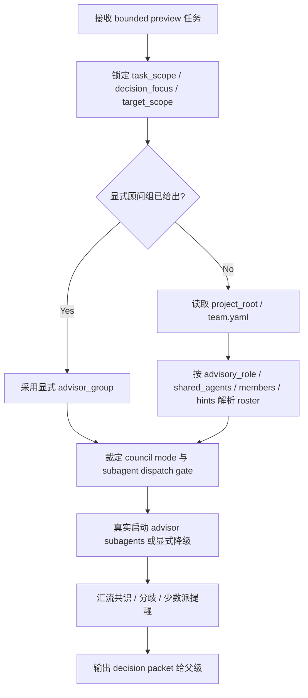

# Command Subagent Preview

技能包 ID: `commands-subagent-preview`

本技能是 `.agents/skills/commands/subagetns/preview/` 的目录级真源。它服务于“执行前顾问团预演”这一类 bounded council 任务：父级 skill 先锁定目标与待决问题，再由本技能解析顾问来源、真实启动顾问 subagents，并把结果压成可执行的 `decision packet` 返还给父级。

它不是：

- `review` 型事后审计技能
- 业务 canonical 的最终写回 owner
- 会从对话里自动猜测“最后一个输出文件”的目标定位器

## Context Loading Contract

- 每次调用本技能时，必须同时加载同目录 `CONTEXT.md` 作为预加载上下文。
- 每次调用本技能时，必须同时加载本文件与同目录 `CONTEXT.md`。
- 若同目录 `CONTEXT.md` 缺失，应先补齐最小知识库骨架，或向调用方显式报告阻塞；不得跳过该上下文直接执行。
- 冲突优先级固定为：用户显式请求 > 根 `AGENTS.md` / 元规则 > 本 `SKILL.md` > 同目录 `CONTEXT.md`。

## Scope And Truth Ownership

| owns | not-owned |
| --- | --- |
| 对 bounded task 做执行前 council preview、解析顾问 roster、给出共识/分歧/建议方案 | 父级任务的最终 canonical 写回 |
| 显式报告本轮是否真实使用 subagent runtime，以及若降级时的原因 | 把本地顺序模拟伪装成正常顾问团路径 |
| 输出 `decision packet`、`advisor_source_trace`、`recommended_execution_plan` | 越权替代父级 skill 的业务语义与最终裁决 |
| 把显式顾问组、`team.yaml`、安全补选三类来源压成单一 roster 解析链 | 把 `source_skill_refs` 误当 reviewer/顾问授权字段 |

固定边界：

1. 本技能默认是 `preview-only` 顾问团预演子智能体，不直接拥有最终 patch 权。
2. 父级 orchestrator 或主 agent 负责真正执行、结果汇流与最终落盘。
3. 本技能可以返回建议采用方案与拒绝理由，但不得把自己描述成 canonical owner。

## Stage Position

- 目录位置：`.agents/skills/commands/subagetns/preview/`
- 角色定位：`advisory-council -> subagent`
- owner office：`menxia`
- truth role：命令树内部执行前顾问团预演
- 默认回接：未来命令型 orchestrator、阶段父 skill 的 pre-execution council gate、或任何显式 dispatch 到本技能的父级流程

说明：

- 路径中的 `subagetns` 为当前仓库既有目录命名，暂按现状保留。
- 未完成全仓 `rename + reference sync` 前，不得擅自改写为 `subagents/`。
- 旧的 `.agents/skills/commands/master-check/` 与 `.agents/skills/commands/master-check-team/` 已退场；执行前顾问团预演统一收束到本技能。

## When To Use

- 父级 skill 在正式执行前，需要先让若干“角色视角 / 大师视角 / team 成员 skill”做一次 bounded 参谋与决议。
- 用户显式给出了顾问组 skill，或任务已绑定到某个项目根并希望默认从 `team.yaml` 解析顾问团。
- 需要在进入正式写作、设计、分镜、生成、重构之前，先收束：
  - 共识方案
  - 关键分歧
  - 建议采用路径
  - 少数派高价值提醒
- 需要明确本轮是否真实启用了 subagents，以及如果没有启用，阻断发生在哪一层。

## When Not To Use

- 目标已经产出完成，当前需要的是 findings-first 审计；此时应进入 `.agents/skills/commands/subagetns/review/`。
- 任务只是单一路径机械执行，不存在需要顾问团帮助裁决的关键分叉。
- 父级希望直接 patch 现有产物，而不是先做执行前预演。
- 顾问来源既不显式、也无 `team.yaml`、且目标任务类型不足以支持安全补选时；此时应阻塞并让父级补齐线索。

## Input Contract

调用方至少应提供：

- `task_scope`
  - 一段 bounded 任务说明，而不是整仓开放式探索
- `task_goal`
  - 本轮希望达成的执行目标
- `decision_focus`
  - 需要顾问团帮助裁决的关键问题，例如 `方案取舍`、`风格定锚`、`执行顺序`、`风险优先级`
- `target_scope`
  - 目标文件、目标目录、目标阶段或目标工件集合
- `runtime_context`
  - 当前是否要求真实 subagents、是否存在上层阻断、父级是否只需要 advisory packet

可选输入：

- `advisor_group`
  - 显式给出的顾问技能路径列表
- `advisory_role`
  - `planning | supervision | review | custom`
- `project_root`
  - 若任务绑定到项目根，应显式传入；未传时允许父级从 `target_scope` 推断
- `target_type`
  - `skill-contract` / `story-text` / `design-system` / `aigc-stage` / `generation-plan` / `runtime-governance`
- `mode_hint`
  - `parallel-council | serial-refine | independent-only`
- `decision_need`
  - `must-resolve | advisory-only`

## Advisor Resolution Contract

顾问来源优先级固定如下：

1. `advisor_group`
   - 用户或父级显式传入的角色视角 skill
2. `project_root/team.yaml`
   - 当任务绑定项目根且未显式给出顾问组时，读取项目真源
3. `roles.<role>.members`
   - 按 `advisory_role` 选择对应角色
4. `team_setup.shared_agents`
   - 作为共享顾问池补充
5. `roles.<role>.source_skill_refs`
   - 只可作为领域提示；仅当条目本身已位于 `.agents/skills/team/**/SKILL.md` 下时，才允许作为最后兜底候选
6. 基于 `target_type + focus` 的安全补选
   - 只补足必要问题域，不拉起整棵 team 技能树

角色选择规则：

- 若显式给出 `advisory_role`，优先按该角色解析。
- 若未显式给出，但任务明显属于执行前创作/起草定锚，优先视为 `planning`。
- 若任务绑定 `2-Global / 3-Detail / 4-Design` 一类执行中阶段收束，优先视为 `supervision`。
- 若任务本质是终稿闸门或 validation 前后裁定，优先视为 `review`。
- 若以上都无法稳定判断，先看 `team_setup.shared_agents`；仍不稳定则阻塞，而不是臆造 roster。

硬规则：

1. 显式顾问组永远优先于 `team.yaml`。
2. `source_skill_refs` 默认不是顾问授权字段，只是领域提示。
3. 当 `team.yaml.enabled == false` 但用户或父级显式调用本技能时，可把 `team.yaml` 当 roster 线索源使用，但必须说明这是手工 override，而不是常驻运行时。
4. 若 roster 无法稳定解析，必须显式报告缺口，而不是伪造“已完成顾问团决议”。

## Subagent Runtime Contract (Mandatory)

本技能的默认语义是“真实顾问团 subagent runtime”，不是“主 agent 顺序扮演多个顾问”。

硬规则：

1. 当父级显式 dispatch 到本技能，且已稳定解析出 `1-4` 个顾问 skill 时，默认应真实启动 subagents。
2. 一个顾问 skill 对应一个 subagent。
3. 若 `mode_hint` 未明确：
   - `2-4` 个顾问，默认 `parallel-council`
   - 需要链式 refinement 时，允许 `serial-refine`
   - 仅需保留独立意见且不要求汇流比较时，允许 `independent-only`
4. 仅在以下情况允许降级：
   - 更高优先级 `system / developer / tool` 政策阻断真实 dispatch
   - 当前环境无法真实使用 subagents
   - 用户显式要求不要启用 subagents
5. 降级时只能表述为：
   - `degraded-local-council`
   - 并写明 `blocking_layer + expected_path + actual_path + missing_runtime`
6. 不得把降级执行表述成正常 `parallel-council / serial-refine / independent-only` 主路径。

## Decision Packet Discipline

本技能默认输出 `decision packet`，而不是 review findings 或平行总稿。结果至少包含：

- `advisor_source`
  - `explicit-advisor-group | team-role-members | team-shared-agents | team-hinted-fallback | safe-inferred-fallback`
- `resolved_advisors`
- `runtime_mode`
- `used_subagent_runtime`
- `consensus`
- `key_divergences`
- `recommended_action`
- `rejected_options`
- `minority_alerts`
- `open_questions`
- `recommended_execution_plan`
- `advisor_source_trace`

如果顾问团未形成稳定结论，也必须明确输出：

- `consensus: []`
- `decision_state: blocked|needs-owner-choice`
- `blocking_reason`
- `owner_decision_needed`

## Workflow



执行步骤：

1. 先锁定边界，避免把预演扩成整仓开放咨询。
2. 先看是否存在显式顾问组；有则直接使用，不回退覆盖。
3. 若没有显式顾问组且任务已绑定项目根，读取 `team.yaml`。
4. 根据 `advisory_role` 与 `target_type` 先读 `roles.<role>.members`，再读 `team_setup.shared_agents`，最后才把 `source_skill_refs` 当提示或做安全补选；无法稳定解析时阻塞。
5. 判断本轮应并行、串行还是独立预演。
6. 只要 roster 已稳定且无上层阻断，就真实启动顾问 subagents。
7. 主 agent 或父级 orchestrator 只汇流 `decision packet`，不把顾问草稿直接写成业务真源。

## Output Contract

```yaml
command_subagent_preview_result:
  task_scope: []
  task_goal: ""
  decision_focus: []
  target_scope: []
  advisor_source: "explicit-advisor-group|team-role-members|team-shared-agents|team-hinted-fallback|safe-inferred-fallback"
  resolved_advisory_role: "planning|supervision|review|custom"
  resolved_advisors: []
  runtime_mode: "parallel-council|serial-refine|independent-only|degraded-local-council"
  used_subagent_runtime: true
  blocking_layer: null
  decision_state: "resolved|needs-owner-choice|blocked"
  consensus: []
  key_divergences: []
  recommended_action: ""
  rejected_options: []
  minority_alerts: []
  open_questions: []
  recommended_execution_plan: []
  advisor_source_trace: []
```

## Root-Cause Execution Contract

当本技能出现以下问题时，必须先修源层，再谈单次结果：

- 明明给了显式顾问组，却仍被 `team.yaml` 覆盖
- `source_skill_refs` 被误当成顾问授权字段
- 实际没有真实 subagent runtime，却把结果写成正常 council
- 结果只有泛意见，没有可执行 `decision packet`
- 任务本应执行前预演，却与 `review` 的事后审计边界混层

必经链路：

`Symptom -> Direct Technical Cause -> Rule Source -> Meta Rule Source -> Fix Landing Points`

优先检查：

- `Rule Source`
  - 本 `SKILL.md`
  - 同目录 `CONTEXT.md`
  - 父级 orchestrator skill
  - `projects/aigc/<项目名>/team.yaml`
  - `.agents/skills/aigc/_shared/council-runtime/module-spec.md`
- `Meta Rule Source`
  - 根 `AGENTS.md`
  - `HARNESS.md`

## Reuse Hooks

- 若父级已经知道具体顾问 skill，可直接把它们作为 `advisor_group` 传入，本技能只负责 council runtime 与汇流。
- 若父级只知道项目根和目标阶段，本技能可回退到 `team.yaml` 做顾问解析。
- 若任务最终产出已经存在、下一步是审计而不是预演，应回切到 `.agents/skills/commands/subagetns/review/`。
