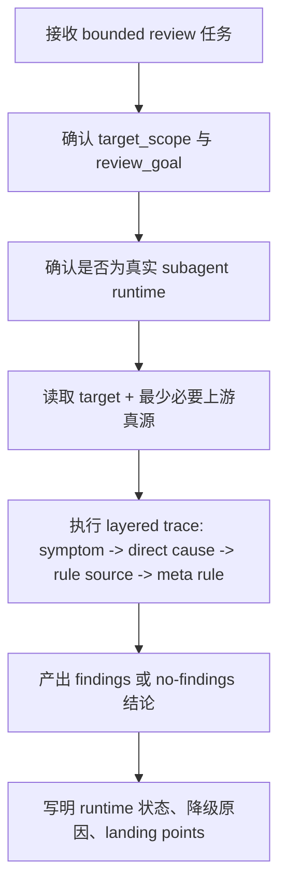

# Command Subagent Review

技能包 ID: `commands-subagent-review`

本技能是 `.agents/skills/commands/subagetns/review/` 的目录级真源。它的职责是作为一个被父级显式分发的 `single-reviewer` 子智能体，对边界清晰的目标做高质量审计，并把结论压成可汇流的 findings。

## Context Loading Contract

- 每次调用本技能时，必须同时加载同目录 `CONTEXT.md` 作为预加载上下文。
- 每次调用本技能时，必须同时加载本文件与同目录 `CONTEXT.md`。
- 若同目录 `CONTEXT.md` 缺失，应先补齐最小知识库骨架，或向调用方显式报告阻塞；不得跳过该上下文直接执行。
- 冲突优先级固定为：用户显式请求 > 根 `AGENTS.md` / 元规则 > 本 `SKILL.md` > 同目录 `CONTEXT.md`。

## Scope And Truth Ownership

| owns | not-owned |
| --- | --- |
| 对目标做 bounded review、输出 findings、记录 evidence path、说明风险与建议动作 | 最终 patch、最终 verdict 宣布、跨 reviewer 汇流裁决 |
| 明确自己是否作为真实 subagent 运行，以及若降级时的原因 | 把本地顺序模拟伪装成正常 subagent 路径 |
| 对 skill / route / registry / shared contract 的源层问题做 layered trace | 越权改写父级 command 的业务语义 |

固定边界：

1. 本技能默认是 `review-only` reviewer subagent，不直接拥有最终写回权。
2. 父级 orchestrator 或主 agent 负责 reviewer 选择、结果汇流与最终落盘。
3. 本技能可以建议 patch landing points，但不得把自己描述成 canonical owner。

## Upstream Truth Reuse

本技能必须复用，而不是重写，下列上游真源：

- `subagetns/preview`
  - roster 解析结果与 council dispatch 上游输入
- 父级 orchestrator / stage runtime
  - 多 reviewer 编排、team 解析与 synthesis 边界
- `门下省`
  - `code-reviewer` findings discipline

若本技能开始承担 reviewer 选择、team 解析、或 council 汇流，视为越权。

## Stage Position

- 目录位置：`.agents/skills/commands/subagetns/review/`
- 角色定位：`reviewer -> subagent`
- owner office：`menxia`
- truth role：命令树内部审计 reviewer
- 默认回接：`subagetns/preview` 后的父级 orchestrator、阶段父 skill 的 council runtime、或任何显式 dispatch 到本技能的父级流程

说明：

- 路径中的 `subagetns` 为当前仓库既有目录命名，暂按现状保留。
- 未完成全仓 `rename + reference sync` 前，不得擅自改写为 `subagents/`。

## When To Use

- 命令技能树需要一个真实 reviewer subagent，对单一目标文件、单一 skill 目录、或一小组紧邻治理文件做审计。
- 父级已经明确 review scope，希望得到 findings，而不是直接 patch。
- 需要把 `severity + dimension + evidence path + impact + recommended action + confidence` 压成标准化输出。
- 需要明确报告本轮是否真实使用了 subagent runtime，若没有则给出降级来源与替代路径。

## When Not To Use

- 需要多 reviewer 并行会诊时，优先回父级 orchestrator 或阶段 council runtime 做编排；必要时先用 `subagetns/preview` 完成 roster 解析。
- 需要直接生成或修改业务产物时，不应把本技能当作执行器。
- 需要查询项目事实、恢复中断运行、或做 stage 续跑时，应进入对应 `query/`、`resume/` 或阶段根技能。

## Non-Goals

- 不自动发现 review target。
- 不解析 `team.yaml` 选择 reviewer。
- 不发起第二层 council。
- 不把 findings 自动落盘成最终 patch。

## Input Contract

调用方至少应提供：

- `target_scope`
  - 单文件、单 skill 目录、或有明确边界的一组文件
- `review_goal`
  - 例如：合同完整性、subagents dispatch gate、registry/routes/HARNESS 同步、质量回归风险
- `output_mode`
  - 固定默认 `review-only`
- `runtime_context`
  - 当前是否为真实 subagent、是否存在上层阻断、是否需要父级回收 findings

可选输入：

- `target_type`
  - `skill-contract` / `shared-contract` / `route-registry` / `runtime-audit`
- `related_sources`
  - 允许调用方给出最少必要上游真源

## Target Bundle Resolution

review target 只允许三种形态：

1. 单文件
2. 单 skill 目录
3. 一组紧邻治理文件

禁止：

- 把整个仓库作为默认 review target
- 因为发现了相邻问题就无限扩边
- 把历史 changelog 或聊天记录当业务真源

若目标越界或不清晰，应停止并要求父级重新给出 `target_scope`。

## Subagent Runtime Contract (Mandatory)

本技能的默认语义是“真实 reviewer subagent”，不是“主 agent 顺序扮演 reviewer”。

硬规则：

1. 当父级以 reviewer 身份显式 dispatch 到本技能时，默认视为应真实启动本技能对应的 subagent。
2. 若更高优先级 `system / developer / tool` 政策阻断真实 dispatch，必须显式报告降级来源。
3. 若用户显式要求不要启用 subagents，必须显式报告这是 `user` 层阻断。
4. 降级时只能表述为：
   - `degraded-local-review`
   - 并写明 `blocking_layer + expected_path + actual_path + missing_runtime`
5. 不得把降级执行表述成正常 `single-reviewer` 路径。

## Mode Arbitration

本技能自身默认只有两种运行状态：

- `single-reviewer`
  - 真实以 reviewer subagent 运行
- `degraded-local-review`
  - 被上层阻断后，在本地顺序执行同一份 bounded review

本技能不负责发起：

- `parallel-council`
- `serial-refine`
- `independent-only`

这些 mode 由父级 orchestrator 决定；本技能只消费已经裁决好的 reviewer packet。

## Review Findings Discipline

本技能默认输出 findings-first 结果。每条 finding 至少包含：

- `severity`
  - `P0 | P1 | P2 | P3`
- `dimension`
  - 例如：`contract-completeness`、`runtime-dispatch`、`registry-sync`、`route-drift`、`auditability`
- `evidence_path`
  - 绝对路径或仓库内可定位路径
- `impact`
  - 说明为何这会阻断或降低质量
- `recommended_action`
  - 直接修复动作或 landing point
- `confidence`
  - `0-1`

如果没有发现问题，也必须明确输出：

- `findings: []`
- `residual_risks`
- `verification_gaps`

## Workflow



执行步骤：

1. 先锁定目标边界，避免扩成整仓泛扫。
2. 先确认本轮是否真实以 subagent 运行。
3. 只读取与本轮结论直接相关的最少必要真源。
4. 按根因优先原则做 layered trace，不停在表层 symptom。
5. 输出 findings-first 结果。
6. 若涉及技能树合同调整，明确指出：
   - 立即修复落点
   - 系统预防修复落点
   - 哪些文件必须同步

## Output Contract

```yaml
command_subagent_review_result:
  target_scope: []
  review_goal: ""
  verdict: "pass|needs-fix|blocked"
  runtime_mode: "single-reviewer|degraded-local-review"
  used_subagent_runtime: true
  blocking_layer: null
  fallback_reason: null
  findings:
    - severity: "P1"
      dimension: "contract-completeness"
      evidence_path: "/abs/path/or/repo/path"
      impact: ""
      recommended_action: ""
      confidence: 0.0
  residual_risks: []
  verification_gaps: []
  layered_trace_summary: []
  suggested_landing_points: []
  patch_plan: []
```

## Root-Cause Execution Contract

当本技能出现以下问题时，必须先修源层，再谈单次结果：

- findings 空泛、只给意见不指 landing point
- 把本地顺序模拟误写成正常 subagent 执行
- 发现 registry / routes / HARNESS 漂移却没有指出同步缺口
- 审计范围无边界扩张，导致 reviewer 结果失焦

必经链路：

`Symptom -> Direct Technical Cause -> Rule Source -> Meta Rule Source -> Fix Landing Points`

优先检查：

- `Rule Source`
  - 本 `SKILL.md`
  - 同目录 `CONTEXT.md`
  - 父级 orchestrator 或阶段 council runtime
  - `.codex/registry/skills.yaml`
  - `.codex/registry/routes.yaml`
- `Meta Rule Source`
  - 根 `AGENTS.md`
  - `HARNESS.md`

## Reuse Hooks

- 若父级需要多个 reviewer，会由父级编排多个 reviewer subagents；本技能只负责单 reviewer 结果。
- 若目标是技能树合同，默认优先检查：
  - `SKILL.md + CONTEXT.md`
  - registry / routes
  - HARNESS 同步
  - 是否存在真实 subagent runtime 合同与降级口径
- 旧的 `master-check*` 命令已被移除；多 reviewer council 现在由阶段父 skill 或其他上游 orchestrator 直接组合 `preview + review`。

## Verification Checklist

- `SKILL.md + CONTEXT.md` 均存在且可被 skill audit 发现
- `Context Loading Contract` 含有仓库要求的固定短语
- findings-first 输出字段完整
- `runtime_mode / used_subagent_runtime / blocking_layer / fallback_reason` 可追溯
- registry 已登记本技能
- routes 已登记本技能入口
- 若本轮改了 registry / routes，`HARNESS.md` 已同步
