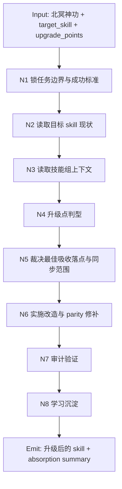
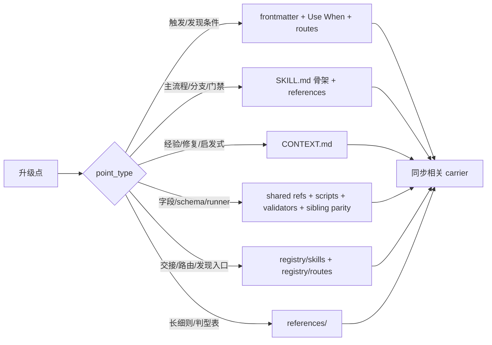
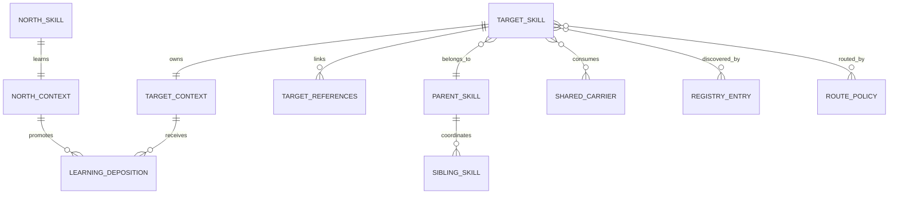

# 北冥神功

## Context Loading Contract

- 每次调用本技能时，必须同时加载同目录 `CONTEXT.md` 作为预加载上下文。
- 每次执行 `北冥神功 + [待升级skill] + [升级点]` 时，必须先加载目标 skill 的 `SKILL.md + CONTEXT.md`，再加载其父级/同级技能组中与当前升级点相关的共享合同、sibling skill、shared carrier、registry/routes。
- 若目标 skill 属于 `aigc` 或 `story` 项目型技能树，且当前任务已绑定项目根，还必须补载对应项目根 `MEMORY.md` 与相关 `CONTEXT/`。
- 冲突优先级：用户显式请求 > 仓库 `AGENTS.md` / 元规则 > 本 `SKILL.md` > 本目录 `CONTEXT.md`。

## 定位

`北冥神功` 是 `.agents/skills/learn/` 下的 skills-update 自学习吸收技能。它不把“升级点”粗暴拼接进目标 skill，而是先判断该知识点的真实形态、最佳落点、同步范围与防回归需求，再完成有机融合。

它默认处理三类难题：

- 升级点是散的，只知道“该加强”，但不知道应改 `SKILL.md`、`CONTEXT.md`、`references/`、`scripts/`、`templates/`、`registry` 还是 `routes`
- 目标 skill 不是孤立存在，升级点可能牵动父级 skill、同级 siblings、shared carrier 或下游 handoff
- 本轮升级不应只修一次，而应形成可复用的自学习闭环，供后续 skills-update 持续复用

## Companion Contract

- 设计与骨架收束时，默认采用 `skill-知行合一` 的思行合一口径。
- 执行与验证时，默认采用 `skill-编排优化` 的 RED -> GREEN -> REFACTOR 心法：先确认现状缺口，再写合同与载体，最后做防绕过收束。
- 当本轮升级触及共享 carrier、脚本/validator、registry/routes、或 sibling parity 风险时，必须加开一次 `code-reviewer` 视角的审计；若上层策略不允许真实 reviewer dispatch，则退化为本地 reviewer checklist，不得省略该 gate。

## 何时使用

- 需要升级一个现有 skill，但外部知识点尚未明确该落在哪个部分。
- 需要把一个零散经验、失败模式、外部规则、方法论或新工作流吸收到目标 skill。
- 需要确保升级目标不仅在目标 skill 本身成立，也与所在技能组的父级、同级和 shared carrier 对齐。
- 需要把一次 skill 升级变成“以后还能继续学”的机制，而不是单次补丁。

## 何时不要直接使用

- 只是修一个明确拼写错误、坏链接或单行路径，且不涉及吸收裁决。
- 用户明确要求只做最小一次性文案补丁，不要求建立学习闭环。
- 目标并不是 skill 包，而是普通业务文件或项目内容。

## 总输入合同

### 必需输入

- `target_skill`
  - 待升级 skill 的路径、技能包根目录，或足够锁定该 skill 的指向信息。
- `upgrade_points`
  - 一条或多条待吸收的升级点。可以是规则、知识、方法、缺陷信号、外部最佳实践或用户新增要求。

### 可选输入

- `upgrade_goal`
  - 用户对“升级后应更强在哪里”的明确期待。
- `preserve_constraints`
  - 需要保留的现有结构、命名、风格、路径或兼容模式。
- `explicit_denied_surfaces`
  - 明确不希望触碰的载体，例如“不改脚本，只改文档”。
- `review_depth`
  - `light | standard | deep`，默认 `standard`。

### 禁止输入

- 只给升级点，不读目标 skill 当前配置就开始补丁。
- 只改目标 skill 自己，不看父级/同级/共享 carrier 就宣布完成。
- 把所有升级点一律塞进 `SKILL.md`，不做落点判型。

## Visual Maps

## 思行节点

| node_id | objective | actions | evidence | route_out | gate |
| --- | --- | --- | --- | --- | --- |
| `N1-MISSION-LOCK` | 锁定本轮升级任务 | 解析 `target_skill`、`upgrade_points`、成功标准、边界与禁区 | 用户请求、目标路径、升级点列表 | `N2` | 升级任务口径唯一 |
| `N2-TARGET-STATE-SCAN` | 读清目标 skill 当前配置 | 读取目标 `SKILL.md + CONTEXT.md + references/ + scripts/ + templates/ + CHANGELOG.md`，找已有结构与缺口 | 当前 skill 载体清单、缺口摘要 | `N3` | 不再把目标 skill 当黑盒 |
| `N3-GROUP-CONTEXT-SCAN` | 建立宏观上下文 | 读取父级 skill、相关 siblings、shared carrier、registry/routes、必要时项目 `MEMORY/CONTEXT` | skill-group 关系图、共享载体清单 | `N4` | 已知道升级点可能牵动哪些面 |
| `N4-POINT-TYPING` | 判定升级点真实类型 | 将升级点归入触发、流程、经验、字段、脚本、路由、验证、兼容等类型 | `point_type -> landing_candidate[]` | `N5` | 升级点不再处于“模糊要求”状态 |
| `N5-LANDING-DECISION` | 裁决最佳吸收落点 | 依据 [references/upgrade-point-absorption-map.md](references/upgrade-point-absorption-map.md) 选择最窄且有效的 landing set，并定义同步范围 | `landing_set`、`sync_scope`、`parity_targets` | `N6` | 落点与同步范围可解释 |
| `N6-PATCH-AND-PARITY` | 实施有机融合 | 修改目标载体，并同步 shared carrier、sibling parity、registry/routes 或 validator | diff、路径列表 | `N7` | 不留下半升级状态 |
| `N7-REVIEW-AND-VALIDATE` | 做质量门与 reviewer gate | 本地验证路径、结构、链接、路由与必要审计；高风险时应用 `code-reviewer` 口径 | 检查结果、review findings 或通过结论 | `N8` | 新合同既可发现也可执行 |
| `N8-LEARNING-DEPOSITION` | 建立自学习闭环 | 把目标 skill 的局部经验写回目标 `CONTEXT.md`；把跨 skill 的吸收模式写回本技能 `CONTEXT.md`；时间序改动写入 `CHANGELOG.md` | learning deposition summary | 完成 | 本轮升级可复用、可追踪 |

## 执行硬规则

1. 先读目标，再读技能组，最后才做落点裁决；顺序不得反。
2. 任何升级点都必须先判型，再决定落在 `SKILL.md`、`CONTEXT.md`、`references/`、`scripts/`、`templates/`、`registry` 或 `routes`。
3. 若升级点本质是稳定硬规则、主流程、门禁或输出合同，优先升入 `SKILL.md`；若本质是经验、失败模式、启发式或 repair 经验，优先写入 `CONTEXT.md`。
4. 若升级点需要长表、复杂判型或细则，优先下沉到 `references/`，并由 `SKILL.md` 显式回链。
5. 若升级点影响技能发现方式、触发语义、入口路由或 canonical 路径，必须同步检查 `.codex/registry/skills.yaml` 与 `.codex/registry/routes.yaml`。
6. 若升级点触及共享 schema、runner、validator、模板或 shared carrier，必须做 sibling parity 检查；不得只修单链。
7. 若目标 skill 缺失 `CONTEXT.md`、`CHANGELOG.md` 或必要 shared carrier，而本轮升级又需要它们，优先补齐最小可治理骨架。
8. 若任务只停留在“解释升级点应该放哪”，没有真正把结果吸收进载体，也没有建立 learning deposition，则视为未完成。

## Skills-Update Self-Learning Contract

`北冥神功` 的核心不是“会升级”，而是“升级一次后，下次更会升级”。

固定闭环：

1. `target_scan`
   - 把目标 skill 当前状态结构化记录为 baseline。
2. `group_scan`
   - 记录该 skill 在技能组中的父子兄弟关系、shared carrier 与路由位置。
3. `absorption_decision`
   - 形成本轮 `upgrade_point -> landing_set -> sync_scope -> validation_gate`。
4. `patch_execution`
   - 只把升级点写进真正该去的载体。
5. `double_learning`
   - 目标 skill `CONTEXT.md` 收局部经验。
   - 本技能 `CONTEXT.md` 收跨 skill 可复用吸收模式。
6. `future_reuse`
   - 下次同类升级直接复用 `point_type / landing_set / parity_scope` 经验，而不是重新拍脑袋。

## 字段中心映射（Tier-Full）

### 表 1：任务锁定字段

| field_id | meaning | required | source | write_target |
| --- | --- | --- | --- | --- |
| `target_skill_ref` | 待升级 skill 的唯一定位 | yes | 用户输入 / 本地路径 | 思考过程 + absorption summary |
| `upgrade_points[]` | 待吸收升级点列表 | yes | 用户输入 / 外部知识点 | 思考过程 + absorption summary |
| `upgrade_goal` | 本轮强化目标 | no | 用户输入 / 执行推断 | absorption summary |
| `preserve_constraints[]` | 需保留约束 | no | 用户输入 | 思考过程 |
| `explicit_denied_surfaces[]` | 禁止触碰的载体 | no | 用户输入 | 思考过程 |

### 表 2：吸收裁决字段

| field_id | meaning | required | source | write_target |
| --- | --- | --- | --- | --- |
| `point_type` | 升级点真实类型 | yes | `N4-POINT-TYPING` | absorption summary |
| `landing_set[]` | 最佳吸收落点集合 | yes | `N5-LANDING-DECISION` | 实际改动 |
| `sync_scope[]` | 需要同步的父级/同级/shared/registry 面 | yes | group scan | 实际改动 |
| `parity_targets[]` | 需要横向校验的 sibling/runner | no | group scan | review/validation |
| `promotion_scope` | 局部经验还是跨 skill 经验 | yes | learning deposition | target CONTEXT / 本技能 CONTEXT |

### 表 3：验证与沉淀字段

| field_id | meaning | required | source | write_target |
| --- | --- | --- | --- | --- |
| `validation_checks[]` | 本轮执行的验证动作 | yes | `N7` | final summary |
| `review_gate` | 是否触发 reviewer 审计 | yes | `N7` | final summary |
| `learning_writebacks[]` | 写回的学习载体 | yes | `N8` | target CONTEXT / 本技能 CONTEXT / CHANGELOG |
| `residual_risks[]` | 尚未收束的风险 | no | `N7` | final summary |

## 输出合同

完成本技能时，必须同时交付：

- 升级后的目标 skill 载体改动
- 一份可复核的 `absorption summary`
  - `upgrade_points`
  - `point_type`
  - `landing_set`
  - `sync_scope`
  - `validation_checks`
  - `learning_writebacks`
- 一份简短 `思考过程`
  - 说明为什么升级点要落在这些载体，而不是其他载体

## Root-Cause 执行合同

当出现“升级点加进去了，但 skill 还是不会用”“只改了目标 skill，本组其他相关 skill 继续漂移”“registry 没同步导致技能难以发现”“把经验写成了硬规则”这类问题时，固定按以下链路上溯：

`Symptom -> Direct Cause -> Rule Source -> Group Source -> Meta Rule Source -> Fix Landing Points`

- `Rule Source`
  - 目标 skill 的 `SKILL.md / CONTEXT.md / references / scripts / templates`
- `Group Source`
  - 父级 skill、相关 sibling、shared carrier、`.codex/registry/skills.yaml`、`.codex/registry/routes.yaml`
- `Meta Rule Source`
  - 根 `AGENTS.md`、本技能 `SKILL.md`、`skill-知行合一`、`skill-编排优化`

优先修“吸收落点错了 / 同步范围漏了 / parity 未补”的源层问题，而不是只在最终总结里解释。

## Reference Loading Guide

- 进行吸收落点裁决前，先读 [references/upgrade-point-absorption-map.md](references/upgrade-point-absorption-map.md)。
- 若升级点明显改变技能发现方式或入口语义，必须回读 `.codex/registry/skills.yaml` 与 `.codex/registry/routes.yaml`。
- 若升级点牵动 shared schema、模板、脚本或 validator，必须补做 sibling parity 检查。
