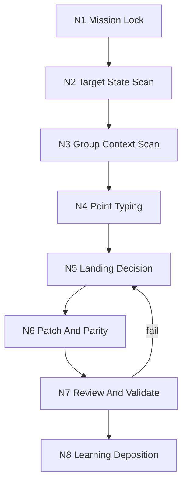

# 北冥神功

技能包 ID: `beiming-skill-learning`

`北冥神功` 是 `.agents/skills/learn/` 下的 skills-update 自学习吸收技能。它负责把外部升级点有机融合进目标 skill，而不是把新规则粗暴拼接到 `SKILL.md`。本技能的 canonical runtime 是“目标扫描 -> 技能组扫描 -> 升级点判型 -> 落点裁决 -> 改造与同步 -> 验证 -> 双重学习沉淀”。

## Context Loading Contract

- 每次调用本技能时，必须同时加载同目录 `CONTEXT.md` 作为预加载上下文。
- 每次调用本技能时，必须同时识别并加载同目录 `types/` 中选中的类型包（单选或多选）。
- 每次执行 `北冥神功 + target_skill + upgrade_points` 时，必须先加载目标 skill 的 `SKILL.md + CONTEXT.md`，再加载其父级、同级、shared carrier、registry/routes 中与当前升级点相关的上下文。
- 若目标 skill 属于 `.agents/skills/aigc/` 或 `.agents/skills/story/`，且当前任务已绑定项目根，还必须先加载项目根 `MEMORY.md` 与项目根 `CONTEXT/` 中相关材料。
- 冲突优先级：用户显式请求 > 仓库 `AGENTS.md` / meta 规则 > 本 `SKILL.md` > `references/`、`steps/`、`review/`、`types/`、`templates/`、`scripts/`、`knowledge-base/` > 本目录 `CONTEXT.md` > `agents/openai.yaml`。

## Input Contract

- Accepted input: 升级已有 skill、吸收外部规则/经验/失败模式、修复 skills-update 同步漂移、审计某个升级点应该落在哪些载体。
- Required input:
  - `target_skill`: 目标 skill 路径、技能包根目录或足够锁定该 skill 的指向信息。
  - `upgrade_points`: 一条或多条待吸收升级点，可以是规则、知识、方法、缺陷信号、外部最佳实践或用户新增要求。
- Optional input:
  - `upgrade_goal`: 升级后希望增强的能力。
  - `preserve_constraints`: 需要保留的结构、路径、命名、风格或兼容模式。
  - `explicit_denied_surfaces`: 明确不允许触碰的载体，如“不改脚本，只改文档”。
  - `review_depth`: `light | standard | deep`，默认 `standard`。
- Reject or clarify when: 无法定位 `target_skill`；只给“优化一下”但没有可判型升级点；用户要求静默丢弃旧语义；用户要求把所有升级点无差别塞进单一 `SKILL.md`。

## Mode Selection

| mode | 触发信号 | 主动作 |
| --- | --- | --- |
| `absorb` | 有明确目标 skill 与升级点 | 完成目标扫描、判型、落点裁决、改造、同步、学习沉淀 |
| `repair` | 既有升级后出现断链、路由漂移或 parity 缺口 | 回溯落点与同步范围，修复源层载体 |
| `migration` | 目标 skill 需要 Skill 2.0 化或结构拆分 | 借助 `skill-工作车间` 合同拆分 owner，并保留吸收语义 |
| `review` | 用户只要求判断升级点应落哪里 | 输出吸收建议和风险，不改文件 |

## Reference Loading Guide

| 场景 | 读取文件 |
| --- | --- |
| 升级点判型、landing set、sync scope | `references/upgrade-point-absorption-map.md` 与 `types/upgrade-point-type-map.md` |
| 执行完整 skills-update 闭环 | `steps/skills-update-absorption-workflow.md` |
| 触发 reviewer、质量门禁或降级审计 | `review/review-contract.md` |
| 复用稳定吸收经验 | `knowledge-base/skills-update-heuristics.md` |
| 生成最终 summary | `templates/output-template.md` 与 `templates/absorption-summary.template.md` |
| 需要机械辅助或新增脚本 | `scripts/README.md`，脚本不得替代 LLM 的落点裁决 |
| 产品侧入口元数据 | `agents/openai.yaml` |

## Execution Topology

## Execution Contract

1. `N1-MISSION-LOCK`: 锁定 `target_skill`、`upgrade_points`、成功标准、边界与禁区。
2. `N2-TARGET-STATE-SCAN`: 读取目标 `SKILL.md + CONTEXT.md`、现有 `references/`、`scripts/`、`templates/`、`CHANGELOG.md` 与关键运行载体。
3. `N3-GROUP-CONTEXT-SCAN`: 读取父级 skill、相关 siblings、shared carrier、`.codex/registry/skills.yaml`、`.codex/registry/routes.yaml` 中与升级点相关的部分。
4. `N4-POINT-TYPING`: 依据 `types/upgrade-point-type-map.md` 和吸收矩阵生成 `point_type`。
5. `N5-LANDING-DECISION`: 依据最窄有效原则裁决 `landing_set`、`sync_scope`、`parity_targets` 与验证门。
6. `N6-PATCH-AND-PARITY`: 修改真正拥有该升级点的载体，并同步必要 registry/routes、shared carrier、sibling parity 或模板/脚本。
7. `N7-REVIEW-AND-VALIDATE`: 运行本地检查、结构审计、引用审计和 reviewer gate；若上层策略阻断真实 reviewer/subagent，则降级为本地 checklist 并显式报告。
8. `N8-LEARNING-DEPOSITION`: 目标 skill `CONTEXT.md` 收局部经验；本技能 `CONTEXT.md` 或 `knowledge-base/` 收跨 skill 可复用模式；`CHANGELOG.md` 收时间序变更。

## Critical Gates

- 不得在未读取目标 skill 当前配置前直接补丁。
- 不得在未做技能组上下文扫描前宣布“无同步范围”。
- 不得把经验型升级点直接晋升为硬规则，除非它已经稳定且具备源层依据。
- 不得让 `scripts/` 生成核心创作、策略判断、落点裁决或审美/叙事内容。
- 升级触及 shared carrier、validator、template、registry/routes 或 2 个以上载体类型时，必须执行 `review/` 门禁。

## Field Mapping

### 任务锁定字段

| field_id | meaning | required | source | write_target |
| --- | --- | --- | --- | --- |
| `target_skill_ref` | 待升级 skill 的唯一定位 | yes | 用户输入 / 本地路径 | absorption summary |
| `upgrade_points[]` | 待吸收升级点列表 | yes | 用户输入 / 外部知识点 | absorption summary |
| `upgrade_goal` | 本轮强化目标 | no | 用户输入 / 执行推断 | absorption summary |
| `preserve_constraints[]` | 需保留约束 | no | 用户输入 | 执行边界 |
| `explicit_denied_surfaces[]` | 禁止触碰载体 | no | 用户输入 | 执行边界 |

### 吸收裁决字段

| field_id | meaning | required | source | write_target |
| --- | --- | --- | --- | --- |
| `point_type` | 升级点真实类型 | yes | `N4-POINT-TYPING` | absorption summary |
| `landing_set[]` | 最佳吸收落点 | yes | `N5-LANDING-DECISION` | 实际改动 |
| `sync_scope[]` | 需要同步的父级/同级/shared/registry 面 | yes | group scan | 实际改动 |
| `parity_targets[]` | 横向校验对象 | no | group scan | review/validation |
| `promotion_scope` | 局部经验还是跨 skill 经验 | yes | learning deposition | `CONTEXT.md` / `knowledge-base/` |

### 验证与沉淀字段

| field_id | meaning | required | source | write_target |
| --- | --- | --- | --- | --- |
| `validation_checks[]` | 本轮执行的验证动作 | yes | `N7` | final summary |
| `review_gate` | reviewer 或本地审计状态 | yes | `N7` | final summary |
| `learning_writebacks[]` | 写回的学习载体 | yes | `N8` | target / self context |
| `residual_risks[]` | 尚未收束的风险 | no | `N7` | final summary |

## Root-Cause Execution Contract

当出现“升级点加进去了但 skill 仍不会用”“只改目标 leaf 导致 sibling 漂移”“registry 未同步导致无法发现”“经验写成硬规则”这类问题，固定按以下链路上溯：

`Symptom -> Direct Cause -> Rule Source -> Group Source -> Meta Rule Source -> Fix Landing Points`

- `Rule Source`: 目标 skill 的 `SKILL.md`、`CONTEXT.md`、`references/`、`steps/`、`review/`、`types/`、`templates/`、`scripts/`。
- `Group Source`: 父级 skill、相关 sibling、shared carrier、`.codex/registry/skills.yaml`、`.codex/registry/routes.yaml`。
- `Meta Rule Source`: 根 `AGENTS.md`、本技能合同、`skill-工作车间`、相关 meta skill。
- 修复优先级：先修吸收落点和同步范围，再修文案；先修源层载体，再修最终总结。

## Output Contract

- Required output: 升级后的目标 skill 载体改动，以及可复核的 absorption summary，包含 `upgrade_points`、`point_type`、`landing_set`、`sync_scope`、`validation_checks`、`review_gate`、`learning_writebacks`、`residual_risks`。
- Output format: 目标文件 patch、必要的 registry/routes/shared carrier 同步、最终中文摘要；用户要求报告时可按 `templates/output-template.md` 渲染为 Markdown。
- Output path: 默认原地修改 `target_skill` 所在目录；必要同步面落在对应父级/sibling/shared/registry 路径；报告类派生产物按用户要求写入 `reports/`。
- Naming convention: 技能包目录沿用仓库 canonical 路径；新增 Skill 2.0 文件使用固定名称，如 `README.md`、`agents/openai.yaml`、`templates/output-template.md`；任务 ID 与脚本参数保持 ASCII 安全字符。
- Completion gate: 完成目标改造后，至少通过结构/引用检查和 `review/review-contract.md` 的本地 gate；若目标本身是 Skill 2.0 包，还应运行对应 validator；若真实 reviewer/subagent 被上层策略阻断，必须报告降级来源、原计划路径与实际本地审计路径。
