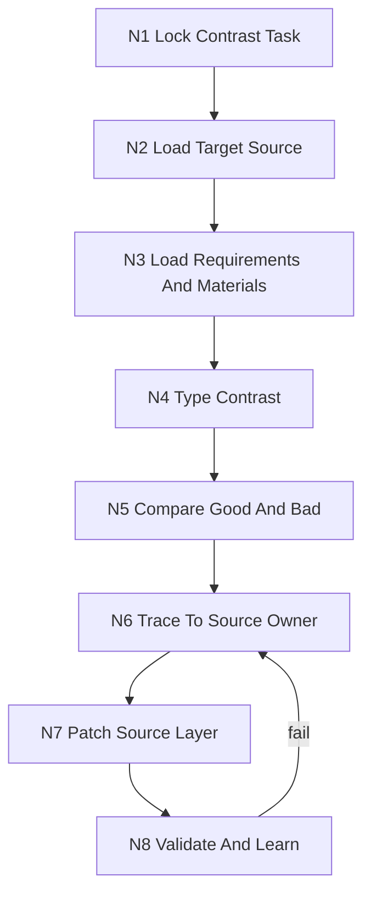

# 好好坏坏

技能包 ID: `haohao-huaihuai`

`好好坏坏` 是 `.agents/skills/learn/` 下的源层对照学习技能。它消费用户给出的目标技能包某个任务环节输出中的好示例与坏示例，读取目标 skill 当前配置、任务要求和资料来源，比较现有输出差异，再把“好在哪里、坏在哪里”上溯到真正拥有规则的源层载体并完成调优。

## Context Loading Contract

- 每次调用本技能时，必须同时加载同目录 `CONTEXT.md` 作为预加载上下文。
- 每次调用本技能时，必须同时识别并加载同目录 `types/` 中选中的类型包（单选或多选）；先读取 `types/type-map.md` 再加载命中包。
- 每次执行 `好好坏坏 + target_skill + good_examples + bad_examples` 时，必须先加载目标 skill 的 `SKILL.md + CONTEXT.md`，再按当前环节读取其相关 `references/`、`steps/`、`review/`、`types/`、`templates/`、`scripts/`、shared carrier、registry/routes 与项目上下文。
- 若目标 skill 属于 `.agents/skills/aigc/` 或 `.agents/skills/story/`，且当前任务绑定具体项目根，必须在进入源层诊断前加载项目根 `MEMORY.md` 与项目根 `CONTEXT/` 中相关材料。
- 冲突优先级：用户显式请求 > 仓库 `AGENTS.md` / meta 规则 > 本 `SKILL.md` > 目标 skill `SKILL.md` > 本技能分区文件 > 目标 skill 分区文件 > 项目级 `MEMORY.md` / `CONTEXT/` > 本目录 `CONTEXT.md` > `agents/openai.yaml`。

## Input Contract

- Accepted input: 目标 skill 某任务环节的好/坏输出样例对照、基于样例的源层规则调优、对既有输出的质量差异诊断、修复“同一技能产物有时好有时坏”的源层漂移。
- Required input:
  - `target_skill_ref`: 目标 skill 路径、技能名或足够唯一定位该技能包的信息。
  - `task_stage_or_output`: 被比较的具体任务环节、输出物、字段、模板片段或生成阶段。
  - `good_examples`: 一个或多个用户认可的好示例，必须能定位到具体输出片段或文件。
  - `bad_examples`: 一个或多个用户认为不合格的坏示例，必须能定位到具体输出片段或文件。
- Optional input:
  - `task_requirements`: 本轮任务原始要求、验收标准、prompt、issue、PRD 或阶段合同。
  - `source_materials`: 当前任务涉及的资料来源、参考文本、项目上下文、证据包或输入数据。
  - `current_outputs`: 需要复核的现有输出全集或中间产物。
  - `tuning_scope`: 允许修改的源层载体范围，如只改 skill 文档、不改脚本、不动 registry。
  - `review_depth`: `light | standard | deep`，默认 `standard`。
- Reject or clarify when: 无法定位目标 skill；好/坏示例缺失任一侧；示例无法对应到同一任务环节；用户要求直接“按好示例重写结果”但不允许源层分析；缺少源材料会导致无法判断事实正确性且用户不允许补充资料。

## Multi-Subskill Continuous Workflow

- 整体调用本技能时，在必需输入齐全且安全门通过后，自动完成诊断、源层定位、调优、验证和学习沉淀，不额外追问是否继续下一步。
- 无序号同级子技能包默认全选并发执行，由本技能汇总、裁决和写回唯一 canonical 结果。
- 数字序号子技能包或节点默认按数字升序串行执行，前一节点产物自动作为后一节点输入。
- 英文序号子技能包或路线默认按用户意图、父级路由或输入类型单选分流；只有用户明确要求对比、并跑或批量多路线时才多选。
- 卫星技能、query/resume/review 类辅助入口默认不纳入主链；只有用户请求、阶段门禁或父级合同显式需要时才回接。
- 缺少必需输入、破坏性操作未授权、目标源层归属不清或路线歧义会导致错误 canonical 写回时，必须先阻断并给出最小澄清或阻断报告。
- 被调度的目标子技能包仍必须加载自身 `SKILL.md + CONTEXT.md`；脚本只能承担读取、抽取、diff、校验和格式化等机械辅助，不得替代 LLM 的源层诊断、审美判断、叙事判断或调优裁决。

## Mode Selection

| mode | 触发信号 | 主动作 |
| --- | --- | --- |
| `diagnose-and-tune` | 用户要求根据好/坏示例完善目标 skill | 对照分析、源层定位、补丁调优、同步验证和学习沉淀 |
| `diagnose-only` | 用户只要求说明好坏差异和源层原因 | 输出诊断矩阵与调优建议，不修改文件 |
| `repair-learning` | 既有调优后仍复发、漏同步或误落点 | 回溯源层落点、修复同步范围、补 review gate |
| `review` | 用户要求审查某个源层调优是否合理 | 执行质量门禁，输出 findings 和 verdict |

## Reference Loading Guide

| 场景 | 读取文件 |
| --- | --- |
| 好/坏样例对比、源层归因、调优落点裁决 | `references/good-bad-source-diagnosis.md` |
| 执行完整诊断到调优闭环 | `steps/good-bad-learning-workflow.md` |
| 选择当前对比问题类型 | `types/type-map.md` 与命中的类型包 |
| 执行验收、过拟合检查和 reviewer 降级审计 | `review/review-contract.md` |
| 复用稳定诊断经验 | `knowledge-base/good-bad-heuristics.md` |
| 生成诊断与调优摘要 | `templates/output-template.md` |
| 需要机械辅助读取、diff、统计或校验 | `scripts/README.md` |
| 产品侧入口元数据 | `agents/openai.yaml` |

## Execution Topology

## Execution Contract

1. `N1-LOCK-CONTRAST-TASK`: 锁定目标 skill、任务环节、好/坏示例、任务要求、资料来源、允许修改范围和完成标准。
2. `N2-LOAD-TARGET-SOURCE`: 读取目标 skill 的 `SKILL.md + CONTEXT.md`，再按任务环节读取相关分区、shared carrier、registry/routes 和 sibling parity 面。
3. `N3-LOAD-REQUIREMENTS-AND-MATERIALS`: 收集任务原始要求、资料来源、输入数据、当前输出和验收门，区分事实证据、审美偏好和格式约束。
4. `N4-TYPE-CONTRAST`: 按 `types/type-map.md` 选择输出质量、资料忠实、流程路由、模板结构或 review gate 等类型包。
5. `N5-COMPARE-GOOD-AND-BAD`: 逐项回答好在哪里、坏在哪里、差异是否来自任务理解、资料使用、步骤顺序、模板/schema、review 门禁或脚本投影。
6. `N6-TRACE-TO-SOURCE-OWNER`: 把每个差异信号上溯到最窄有效源层 owner，形成 `source_patch_plan`、`sync_scope`、`parity_targets` 和 `validation_checks`。
7. `N7-PATCH-SOURCE-LAYER`: 修改真正拥有规则的目标载体，并同步必要父级、sibling、shared carrier、templates、scripts、registry/routes 或 review gate；不得把所有结论堆进单一 `SKILL.md`。
8. `N8-VALIDATE-AND-LEARN`: 运行结构/引用/语义检查，对比好/坏样例是否能被新规则解释和预防；目标 skill `CONTEXT.md` 收局部经验，本技能 `CONTEXT.md` 或 `knowledge-base/` 收跨 skill 可复用模式。

## Critical Gates

- 不得在未读取目标 skill 当前配置和同目录 `CONTEXT.md` 前直接调优。
- 不得只依据“坏示例不好看”修文案；必须回到任务要求、资料来源和源层规则找直接原因。
- 不得把一次性偏好直接晋升为硬规则；稳定经验先写入目标 `CONTEXT.md`，高置信规则再晋升到目标 `SKILL.md` 或对应分区。
- 不得让脚本生成、压缩或扩写核心创作/判断正文；脚本只做机械辅助。
- 若调优触及 shared carrier、validator、template、registry/routes 或 2 个以上载体类型，必须执行 `review/` 门禁。
- 若好/坏差异来自资料事实，必须保留可复核来源；无法确认资料时输出阻断或残余风险。

## Field Mapping

### 任务锁定字段

| field_id | meaning | required | source | write_target |
| --- | --- | --- | --- | --- |
| `target_skill_ref` | 待调优 skill 的唯一定位 | yes | 用户输入 / 本地路径 | contrast summary |
| `task_stage_or_output` | 被比较的环节或输出面 | yes | 用户输入 / 任务文件 | contrast summary |
| `good_examples[]` | 好示例集合 | yes | 用户输入 / 文件 | diagnosis matrix |
| `bad_examples[]` | 坏示例集合 | yes | 用户输入 / 文件 | diagnosis matrix |
| `task_requirements` | 原始任务要求和验收标准 | no | 用户输入 / issue / prompt / 阶段合同 | evidence package |
| `source_materials[]` | 资料来源和输入证据 | no | 用户输入 / 项目文件 | evidence package |

### 源层裁决字段

| field_id | meaning | required | source | write_target |
| --- | --- | --- | --- | --- |
| `contrast_type` | 当前好/坏差异类型 | yes | `N4-TYPE-CONTRAST` | type profile |
| `good_signals[]` | 好示例可复用信号 | yes | `N5` | diagnosis matrix |
| `bad_signals[]` | 坏示例失败信号 | yes | `N5` | diagnosis matrix |
| `source_owner[]` | 规则真实归属载体 | yes | `N6` | source patch plan |
| `patch_surface[]` | 实际修改文件或分区 | yes in tune mode | `N6/N7` | actual patch |
| `sync_scope[]` | 父级、sibling、shared、registry 同步范围 | yes | group scan | actual patch / final summary |

### 验证与沉淀字段

| field_id | meaning | required | source | write_target |
| --- | --- | --- | --- | --- |
| `validation_checks[]` | 执行的检查 | yes | `N8` | final summary |
| `review_gate` | review verdict 或降级状态 | yes | `N8` | final summary |
| `learning_writebacks[]` | 经验写回载体 | yes | `N8` | target / self context |
| `residual_risks[]` | 尚未收束风险 | no | `N8` | final summary |

## Root-Cause Execution Contract

当出现“好示例规则无法复用”“坏示例持续复发”“调优只改输出但源层没变”“目标 skill 读了资料却没用对”这类问题，固定按以下链路上溯：

`Symptom -> Contrast Signal -> Task Requirement / Source Material -> Direct Output Cause -> Target Skill Source Owner -> Patch Surface -> Validation Gate -> Meta Rule Source`

- `Contrast Signal`: 好/坏样例中可观察的差异字段、文本、结构、证据使用或路由行为。
- `Direct Output Cause`: 任务理解、资料选择、类型判定、步骤顺序、模板/schema、review 缺口、脚本投影或上下文遗漏。
- `Target Skill Source Owner`: 目标 `SKILL.md`、`CONTEXT.md`、`references/`、`steps/`、`types/`、`review/`、`templates/`、`scripts/`、shared carrier、registry/routes。
- `Meta Rule Source`: 根 `AGENTS.md`、本技能合同、`skill-工作车间`、目标技能所属父级合同。
- 修复优先级：先修最窄有效源层 owner，再同步发现/路由/模板/review 面，最后写最终摘要。

## Output Contract

- Required output: 源层调优后的目标 skill 改动，以及可复核的 good/bad contrast summary，包含 `target_skill_ref`、`task_stage_or_output`、`good_signals`、`bad_signals`、`source_owner`、`patch_surface`、`sync_scope`、`validation_checks`、`review_gate`、`learning_writebacks`、`residual_risks`。
- Output format: 目标文件 patch、必要的 registry/routes/shared carrier 同步、最终中文摘要；用户要求报告时按 `templates/output-template.md` 渲染为 Markdown。
- Output path: 默认原地修改 `target_skill_ref` 所在目录；必要同步面落到对应父级、sibling、shared carrier、template、script、registry/routes 路径；报告类派生产物按用户要求写入 `reports/`。
- Naming convention: 技能包目录沿用仓库 canonical 路径；新增文件使用 Skill 2.0 固定名称；报告使用 `好好坏坏-YYYYMMDD.md`；任务 ID、脚本参数和机器可读键保持 ASCII 安全字符。
- Completion gate: 目标源层修改完成后，至少通过结构/引用检查、样例解释检查、过拟合检查和 `review/review-contract.md` 本地 gate；若真实 subagent/reviewer 被上层策略阻断，必须报告阻断来源、原计划路径、实际降级路径和未真实启动的 reviewer。
