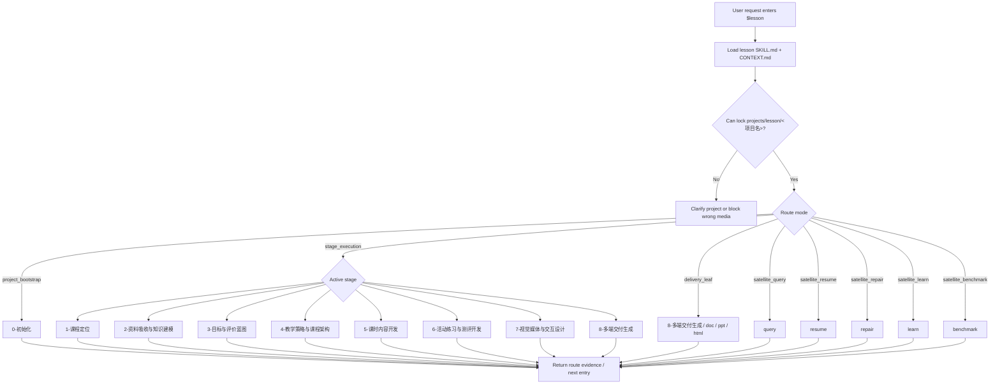

# lesson

`lesson` 是课程课件开发工作流的系统级根入口。它只拥有项目根、阶段路由、卫星技能边界、共享内容模型边界和最终回接裁决；具体课程定位、知识建模、学习目标、课程架构、课时正文、练习测评、视觉交互和 DOC/PPT/HTML 生成由命中的阶段或叶子技能负责。

## Context Loading Contract

- 每次调用本技能时，必须同时加载同目录 `CONTEXT.md`。
- 每次调用 `$lesson` 时，必须同时加载同目录 `CONTEXT.md`。
- 根入口不拥有本级 `types/` 类型包；类型判定必须在路由到目标阶段、叶子或卫星后，由目标技能自行加载其授权模块。
- 若任务绑定 `projects/lesson/<项目名>/`，必须先加载项目根 `MEMORY.md`，再加载项目根 `CONTEXT/` 中与本轮任务直接相关的文件；若任一项目级载体缺失，先报告基线缺口或路由到 `0-初始化`/`resume` 修复。
- 项目 runtime 唯一真源固定为 `projects/lesson/<项目名>/`；不得把课程项目写到 `projects/aigc/`、`projects/story/`、`projects/comic/` 或 `projects/courseware/`。
- 根入口不直接生成课程业务主稿或三端成品；它只选择唯一阶段/叶子/卫星入口，并保持 runtime 不漂移。
- 冲突优先级：用户显式请求 > 根 `AGENTS.md` / meta 规则 > 本 `SKILL.md` > 阶段或卫星 `SKILL.md` > 授权模块 > 项目 `MEMORY.md` > 项目 `CONTEXT/` > 本 `CONTEXT.md`。

## Core Task Contract

`lesson` 协调一个课程课件项目从项目骨架到多端交付的完整开发链路：

```text
0-初始化
→ 1-课程定位
→ 2-资料吸收与知识建模
→ 3-目标与评价蓝图
→ 4-教学策略与课程架构
→ 5-课时内容开发
→ 6-活动练习与测评开发
→ 7-视觉媒体与交互设计
→ 8-多端交付生成
```

根入口的职责：

- 判断用户请求应进入哪个阶段、叶子或卫星。
- 锁定 `projects/lesson/<项目名>/` 项目根。
- 保持 `content-model/` 作为 DOC/PPT/HTML 的共享业务模型容器；阶段目录内的 canonical files 仍是各阶段业务真源，`content-model/` 只承载跨阶段索引、handoff、派生投影或被 owning stage 明确写入的共享模型片段，不得演化为第二套主稿。
- 保持 `_shared/` 作为 lesson 技能树内部的共享支持载体边界；当前不作为执行入口、不拥有 `SKILL.md + CONTEXT.md` 合同，也不参与根层默认加载。
- 防止阶段产物、交付成品和项目记忆出现多套真源。
- 把失败、查询、恢复、修复、学习吸收和基准对照请求路由到旁路卫星技能。

非目标：

- 不直接写课程定位、课程大纲、学习目标、讲义正文、PPT 文案、HTML 页面或题库。
- 不把 `review/` 作为独立卫星入口；阶段验收由各阶段 `SKILL.md` 内置 gate 承担。
- 不把脚本、模板、正则或映射投影当作课程内容主创。

## Multi-Subskill Continuous Workflow

当 `$lesson` 主技能包被整体调用时，视为用户已授权根入口按本文件声明的阶段和子技能包连续完成整个技能组任务；在满足必要输入、显式选择和安全门后，不再为“是否继续下一步”额外确认。

- 数字序号阶段包默认按根入口声明的阶段链推进；当前主链包含 `0-初始化` -> `1-课程定位` -> `2-资料吸收与知识建模` -> `3-目标与评价蓝图` -> `4-教学策略与课程架构` -> `5-课时内容开发` -> `6-活动练习与测评开发` -> `7-视觉媒体与交互设计` -> `8-多端交付生成`。
- 无序号同级子技能包默认全选并发执行，由所属父级汇总、裁决和写回唯一 canonical 输出；当前根层无无序号主链子技能。
- 英文序号子技能包或路线默认按用户意图、父级路由或输入类型单选分流；只有用户明确要求对比、并跑或批量多路线时才多选。
- 卫星技能 `query/`、`resume/`、`repair/`、`learn/`、`benchmark/` 不默认纳入主链串行推进；只有用户请求查询、恢复、修复、学习吸收或基准对照时才作为旁路回接。
- 连续调度不得绕过阻断门：缺少项目名、媒介不属于课程课件、项目根缺失、破坏性操作未授权、阶段/叶子未实现、路线歧义会造成错误 canonical 写回时，必须停下并给出最小澄清或阻断说明。
- 每个被调度的阶段、叶子或卫星仍必须加载自身 `SKILL.md + CONTEXT.md`；脚本只能承担机械辅助，不得替代 LLM 教学设计判断或根入口最终裁决。

## Input Contract

Accepted input:

- 课程、课件、培训、lesson、course、courseware 项目的初始化、阶段推进、查询、恢复、修复、资料学习或多端交付生成。
- 指向 `projects/lesson/<项目名>/` 的项目路径、项目名、阶段产物、共享内容模型、资料、素材或已有交付物。
- 明确命中某个阶段、`8-多端交付生成` 的 doc/ppt/html 叶子，或卫星技能的自然语言请求。

Required input:

- 可判断的媒介归属：课程课件项目进入 `projects/lesson/<项目名>/`；影视进入 `projects/aigc/`，小说进入 `projects/story/`，漫画进入 `projects/comic/`。
- 初始化任务必须能锁定项目名；`0-初始化` 当前只创建 0-8 阶段目录、共享容器、项目 `MEMORY.md` 与项目 `CONTEXT/`。
- 阶段执行、查询、恢复或修复任务必须能定位项目根，或由用户提供足够上下文让根入口先路由到唯一阶段/卫星。

Reject or clarify when:

- 任务实际是影片、小说、漫画、软件项目或泛文档处理，且用户未明确要求使用 lesson 工作流。
- 用户要求根入口直接主创课程正文、题库、PPT 文案或 HTML 页面，而不是路由到 owning 阶段/叶子。
- 缺少项目名、阶段目标或叶子选择，且自动推断会造成错误 canonical 写回、覆盖既有产物或误入其他 namespace。

## Business Requirement Analysis Contract

| field | requirement | evidence | fail_code |
| --- | --- | --- | --- |
| `business_goal` | 协调课程课件项目从项目骨架到 DOC/PPT/HTML 多端交付 | 用户请求、项目路径、阶段关键词 | `FAIL-LESSON-BUSINESS-GOAL` |
| `business_object` | 课程课件项目、课程内容模型、DOC/PPT/HTML 交付物 | `projects/lesson/<项目名>/`、阶段产物 | `FAIL-LESSON-BUSINESS-OBJECT` |
| `constraint_profile` | 根入口只路由和裁决，不直接主创课程内容 | 本 `Core Task Contract`、阶段 owning skill | `FAIL-LESSON-BUSINESS-CONSTRAINT` |
| `success_criteria` | 选择唯一入口，runtime 不漂移，项目记忆/上下文加载正确 | route note、project root evidence | `FAIL-LESSON-BUSINESS-SUCCESS` |
| `complexity_source` | 复杂度来自阶段依赖、共享内容模型、多端投影和卫星回接 | mode selection、stage table | `FAIL-LESSON-BUSINESS-COMPLEXITY` |
| `topology_fit` | 0-8 线性主链适合课程开发的渐进依赖，8 阶段叶子适合三端投影，卫星旁路适合非主链任务 | Stage Status Table、Default Leaf Routing Contract | `FAIL-LESSON-TOPOLOGY-FIT` |

## Mode Selection

| mode | trigger | route |
| --- | --- | --- |
| `project_bootstrap` | 初始化课程、课件、培训、lesson/courseware 项目 | `0-初始化/` |
| `stage_execution` | 明确命中主阶段或下一阶段推进 | 对应阶段 `SKILL.md` |
| `delivery_leaf` | 明确生成 DOC、PPT、HTML，或进入 `8-多端交付生成` | `8-多端交付生成/doc|ppt|html`；未指定时由 `8` 父技能裁决 |
| `satellite_query` | 查询项目事实、阶段产物、内容模型或交付路径 | `query/` |
| `satellite_resume` | 中断恢复、缺口补齐、安全续跑 | `resume/` |
| `satellite_repair` | 多阶段产物回修、内容模型修复、三端漂移修复 | `repair/` |
| `satellite_learn` | 吸收外部课程方法、教学设计框架、参考课件或资料包 | `learn/` |
| `satellite_benchmark` | 与参考课程、竞品课件、教学标准做基准对照 | `benchmark/` |
| `media_mismatch` | 影视、小说、漫画或其他媒介项目 | 转路由到对应工作流 |

## Type Routing Matrix

| input_type | signal | route_to | required_nodes | module_load | fail_code |
| --- | --- | --- | --- | --- | --- |
| `project_bootstrap` | 初始化、新建课程项目、创建课件工程 | `0-初始化/` | `N1,N2,N3,N4,N5` | `CONTEXT.md` | `FAIL-LESSON-TYPE-BOOTSTRAP` |
| `stage_execution` | 点名 0-8 主阶段、下一阶段、继续主链 | selected numbered stage | `N1,N2,N3,N4,N5` | `CONTEXT.md` | `FAIL-LESSON-TYPE-STAGE` |
| `delivery_leaf` | DOC、PPT、HTML、Word、slides、网页课件、多端交付 | `8-多端交付生成/` or selected leaf | `N1,N2,N3,N4,N5` | `CONTEXT.md` | `FAIL-LESSON-TYPE-DELIVERY` |
| `satellite_query` | 查询事实、路径、状态、产物、完成/验收区别 | `query/` | `N1,N2,N3,N4,N5` | `CONTEXT.md` | `FAIL-LESSON-TYPE-QUERY` |
| `satellite_resume` | 中断恢复、断点续跑、缺口补齐、安全下一步 | `resume/` | `N1,N2,N3,N4,N5` | `CONTEXT.md` | `FAIL-LESSON-TYPE-RESUME` |
| `satellite_repair` | 修复、回修、漂移、产物不一致、内容模型分叉 | `repair/` | `N1,N2,N3,N4,N5` | `CONTEXT.md` | `FAIL-LESSON-TYPE-REPAIR` |
| `satellite_learn` | 学习外部方法、吸收参考课件、更新经验 | `learn/` | `N1,N2,N3,N4,N5` | `CONTEXT.md` | `FAIL-LESSON-TYPE-LEARN` |
| `satellite_benchmark` | 对标、竞品、优秀课程、质量 rubrics | `benchmark/` | `N1,N2,N3,N4,N5` | `CONTEXT.md` | `FAIL-LESSON-TYPE-BENCHMARK` |
| `media_mismatch` | 影视、小说、漫画、软件工程或非课程文档处理 | corresponding non-lesson workflow or blocker | `N1,N3,N5` | `CONTEXT.md` | `FAIL-LESSON-TYPE-MISMATCH` |

## Thinking-Action Node Map

| node_id | objective | inputs | actions | evidence | route_out | gate |
| --- | --- | --- | --- | --- | --- | --- |
| `N1-LOAD` | 锁定根合同、经验层和非主创边界 | 用户请求、本文件、CONTEXT | 加载根技能对；确认 lesson 只做路由、runtime 和边界裁决 | loaded_contract、root_boundary_note | `N2` | 必须加载本 `SKILL.md + CONTEXT.md`；根入口不得直接写课程正文 |
| `N2-PROJECT` | 锁定课程项目 runtime | 用户项目名、路径、`projects/lesson/` 候选 | 判断是否需要 `projects/lesson/<项目名>/`；已有项目则检查 `MEMORY.md` 与 `CONTEXT/` 缺口 | project_root_lock、runtime_evidence、missing_baseline | `N3` / `R1` | 项目写回不得进入 `projects/aigc|story|comic|courseware`；项目根不唯一时阻断 |
| `N3-ROUTE` | 选择唯一阶段、叶子或卫星入口 | 请求关键词、项目状态、阶段/卫星表 | 按 `Mode Selection` 和 `Type Routing Matrix` 判型；必要时尊重用户显式叶子或原 owning stage | route_profile、selected_entry、override_note | `N4` / `R1` | route 必须唯一；多端未指定时先入 `8` 父阶段裁决 |
| `N4-DISPATCH` | 把任务交给 owning skill | selected entry、项目根、边界说明 | 要求目标阶段、叶子或卫星加载自身 `SKILL.md + CONTEXT.md`；根入口只传递必要 evidence | dispatch_packet、target_loading_note | `N5` | 不越权加载 `_shared/`；卫星不改写阶段业务真源 |
| `N5-CLOSE` | 汇流路由结论和下一步 | route evidence、target result/blocker | 输出唯一入口、runtime 证据、下一步或阻断原因；需要落盘时交给目标技能合同 | final_route_note、next_entry_or_blocker | `done` | route 唯一、runtime 不漂移、三端不分叉、卫星不越权 |
| `R1-BLOCK` | 阻断错误媒介、项目不唯一或高风险写回 | 路由冲突、缺项目名、媒介不匹配、覆盖风险 | 停止写回；给出最小澄清项或转到对应非 lesson 工作流 | blocker_reason、clarification_request | `done` | 不猜测项目名、不误写 runtime、不用根入口替阶段产出 |

## Default Leaf Routing Contract

除非用户显式指定叶子、点名目标技能、要求多路线对比，或已有产物 repair/query 必须回到原所属叶子，根入口对 `8-多端交付生成` 分流采用以下默认：

| stage | default leaf | applies when | explicit override examples |
| --- | --- | --- | --- |
| `8-多端交付生成` | 父阶段先裁决三端组合 | 用户只说生成课件、输出交付物、生成最终课程包，且未指定 DOC/PPT/HTML | 用户点名 DOC、学员手册、讲师手册、PPT、Slides、HTML、网页课件 |
| `8/doc` | `.agents/skills/lesson/8-多端交付生成/doc/` | 用户明确要求 DOC、Word、讲义、教师用书、学员手册 | 同时要求 PPT/HTML 时回到 `8` 父阶段聚合 |
| `8/ppt` | `.agents/skills/lesson/8-多端交付生成/ppt/` | 用户明确要求 PPT、幻灯片、授课演示、讲者备注 | 同时要求 DOC/HTML 时回到 `8` 父阶段聚合 |
| `8/html` | `.agents/skills/lesson/8-多端交付生成/html/` | 用户明确要求 HTML、网页课件、交互课件、移动端阅读 | 同时要求 DOC/PPT 时回到 `8` 父阶段聚合 |

## Stage Status Table

| stage | skill path | project runtime | status |
| --- | --- | --- | --- |
| `0-初始化` | `.agents/skills/lesson/0-初始化/` | `projects/lesson/<项目名>/0-初始化/` | active；创建项目骨架、`MEMORY.md` 与 `CONTEXT/README.md` |
| `1-课程定位` | `.agents/skills/lesson/1-课程定位/` | `projects/lesson/<项目名>/1-课程定位/` | active；支持快速解析和对话问卷，输出 `course-positioning.md` |
| `2-资料吸收与知识建模` | `.agents/skills/lesson/2-资料吸收与知识建模/` | `projects/lesson/<项目名>/2-资料吸收与知识建模/` | active；基于定位执行 deep research，输出来源清单、知识模型、证据案例库和下游 handoff |
| `3-目标与评价蓝图` | `.agents/skills/lesson/3-目标与评价蓝图/` | `projects/lesson/<项目名>/3-目标与评价蓝图/` | active；学习目标、评价证据、rubric 和 backward design |
| `4-教学策略与课程架构` | `.agents/skills/lesson/4-教学策略与课程架构/` | `projects/lesson/<项目名>/4-教学策略与课程架构/` | active；模块、课时、学习路径、教学节奏 |
| `5-课时内容开发` | `.agents/skills/lesson/5-课时内容开发/` | `projects/lesson/<项目名>/5-课时内容开发/` | active；讲解稿、讲师备注、学员讲义正文、案例展开 |
| `6-活动练习与测评开发` | `.agents/skills/lesson/6-活动练习与测评开发/` | `projects/lesson/<项目名>/6-活动练习与测评开发/` | active；活动、练习、测验、作业、答案解析 |
| `7-视觉媒体与交互设计` | `.agents/skills/lesson/7-视觉媒体与交互设计/` | `projects/lesson/<项目名>/7-视觉媒体与交互设计/` | active；视觉系统、图表、媒体、互动方案 |
| `8-多端交付生成` | `.agents/skills/lesson/8-多端交付生成/` | `projects/lesson/<项目名>/8-多端交付生成/` | active；从共享内容模型投影 DOC/PPT/HTML |
| `8/doc` | `.agents/skills/lesson/8-多端交付生成/doc/` | `projects/lesson/<项目名>/8-多端交付生成/doc/` | active；DOC/Word 交付叶子 |
| `8/ppt` | `.agents/skills/lesson/8-多端交付生成/ppt/` | `projects/lesson/<项目名>/8-多端交付生成/ppt/` | active；PPT/Slides 交付叶子 |
| `8/html` | `.agents/skills/lesson/8-多端交付生成/html/` | `projects/lesson/<项目名>/8-多端交付生成/html/` | active；HTML/web courseware 交付叶子 |

## Upstream Loading Matrix

本矩阵是根级上游加载真源。各阶段 `SKILL.md` 可以细化字段，但不得降低这里声明的必读、handoff、缺口处理和真源边界要求。

| stage | required_upstream_files | optional_upstream_files | handoff_required | missing_policy | truth_boundary | content_model_touchpoint |
| --- | --- | --- | --- | --- | --- | --- |
| `1-课程定位` | 项目根 `MEMORY.md`、相关 `CONTEXT/`、用户 brief、资料证据 | `sources/`、对标课程、品牌材料 | no upstream handoff | 缺领域/受众/场景/目标时澄清；无项目根时草案 | 不写 `2-8` 产物，不写 `content-model/` | none |
| `2-资料吸收与知识建模` | `1-课程定位/course-positioning.md` 或等价定位 brief | `sources/`、外部资料、项目 `MEMORY.md`、项目 `CONTEXT/` | read positioning section 11 as handoff seed | 缺定位时回 `1`；资料不可访问时标证据缺口 | 不写 `3-8` 产物，不写 `content-model/` | none |
| `3-目标与评价蓝图` | `1-课程定位/course-positioning.md`；`2/research-source-inventory.md`、`knowledge-model.md`、`evidence-and-case-library.md`、`downstream-handoff.md` | 用户评价场景、组织验收标准 | yes: `2/downstream-handoff.md` | 缺定位或知识证据时回 `1/2`；等价 brief 只能草案 | 不写题库、课时正文、课程架构或交付成品 | none |
| `4-教学策略与课程架构` | `1/course-positioning.md`；第 `2` 阶段 canonical 输出；第 `3` 阶段 canonical 输出 | 用户教学法偏好、时长/设备/交付约束 | yes: `2/downstream-handoff.md` and `3/downstream-handoff.md` | 缺目标蓝图时只能带风险草案或回 `3` | 不写课时正文、题库、视觉系统或交付成品 | may refresh `content-model/modules/` as index/handoff only |
| `5-课时内容开发` | `1/course-positioning.md`；第 `2` 知识证据；第 `3` 目标蓝图；第 `4` 课程架构 | 项目术语、品牌语气、案例偏好、用户补充资料 | yes: `2/3/4` downstream handoffs | 缺知识、目标或架构时回 owning stage；等价 brief 只能草案 | 不改写 `2/3/4` 真源，不写题库/视觉/交付成品 | may refresh `content-model/lessons/` as lesson index/handoff only |
| `6-活动练习与测评开发` | `1/course-positioning.md`；第 `2` 证据案例库；第 `3` 目标评价；第 `4` 架构；第 `5` 课时内容 | 组织评分标准、外部题型样例、用户内部评价要求 | yes: `3/4/5` downstream handoffs; use `2` as evidence backstop | 缺目标/架构/内容两类以上时阻断；事实题缺证据时回 `2/5` | 不重排架构、不重写讲稿、不写视觉或交付成品 | may refresh `content-model/assessments/` as assessment index/handoff only |
| `7-视觉媒体与交互设计` | `1/course-positioning.md`；第 `3` 目标评价；第 `4` 架构；第 `5` 内容；第 `6` 活动测评 | 品牌规范、素材参考、可访问性标准、设备限制 | yes: `3/4/5/6` downstream handoffs | 缺 3-6 关键输入时草案或回 owning stage | 不写正文、题库、PPT/HTML/DOC 成品 | read-only; write stage 7 handoff, not `content-model/` |
| `8-多端交付生成` | `1/course-positioning.md`；`content-model/`；第 `3` 到 `7` canonical 产物与 handoff | 既有 delivery state、目标端约束、叶子偏好 | yes: `3/4/5/6/7` downstream handoffs | 缺正文、活动测评、视觉约束或 content-model 状态冲突时回 owning stage/repair | 不反推课程正文，不新增外部审查/封版阶段，不写叶子成品正文 | read-only audit of `content-model/`; writes only delivery plan/manifest |

## Content Model Governance Contract

`projects/lesson/<项目名>/content-model/` 是共享模型与多端投影的中间层，不是阶段主稿。阶段 canonical files 始终是业务真源。

| carrier | owning writer | allowed contents | forbidden contents | refresh_trigger | consumer |
| --- | --- | --- | --- | --- | --- |
| `content-model/modules/` | `4-教学策略与课程架构` | 模块索引、课时序列索引、结构 handoff、认知负荷摘要 | 完整课程大纲平行稿、课时正文、题库 | 第 4 阶段 canonical 输出通过 gate 后 | `5/6/7/8` |
| `content-model/lessons/` | `5-课时内容开发` | lesson id 索引、课时内容摘要、讲师/学员材料 handoff、媒体占位索引 | DOC/PPT/HTML 文案、完整平行讲稿、未审正文 | 第 5 阶段 canonical 输出通过 gate 后 | `6/7/8` |
| `content-model/assessments/` | `6-活动练习与测评开发` | 活动/题库/评分/rubric 索引、目标覆盖摘要、反馈 handoff | 评分真源替代稿、无来源题库、视觉交互方案 | 第 6 阶段 canonical 输出通过 gate 后 | `7/8` |
| `content-model/delivery-map.*` | `8-多端交付生成` | 三端投影映射、目标端覆盖、manifest 上游状态 | 新课程正文、替代 stage 3-7 主稿、封版审查结论 | 第 8 阶段上游审计通过后 | `8/doc`, `8/ppt`, `8/html` |

规则：

- 只有 owning writer 能刷新对应 `content-model/` 分区；其他阶段发现漂移时必须路由到 owning stage 或 `repair/`。
- `content-model/` 中每个条目必须能追溯到阶段 canonical file、section、objective id、lesson id、question id 或 handoff anchor。
- 若 `content-model/` 与阶段 canonical files 冲突，以阶段 canonical files 为准，并触发 `FAIL-LESSON-CONTENT-MODEL`。
- 第 `8` 阶段只能审计、融合和投影 `content-model/`，不得用交付需求反向补写课程正文。

## Satellite Status Table

| satellite | path | default role | truth boundary |
| --- | --- | --- | --- |
| `query` | `.agents/skills/lesson/query/` | 查询项目事实、阶段产物、内容模型和交付物 | 只输出证据型答案，不改写业务真源 |
| `resume` | `.agents/skills/lesson/resume/` | 恢复中断、补齐骨架或缺口、判断下一入口 | 只写恢复证据或必要状态，不直接主创 |
| `repair` | `.agents/skills/lesson/repair/` | source-first 修复课程内容模型、阶段产物或三端漂移 | 诊断和路由拥有权，不夺取 owning stage 真源 |
| `learn` | `.agents/skills/lesson/learn/` | 吸收外部教学设计方法、参考课件、资料包 | 产出学习包和源层改进建议，不直接覆盖阶段主稿 |
| `benchmark` | `.agents/skills/lesson/benchmark/` | 与优秀课程、竞品、教学标准做基准对照 | 输出对照证据和改进路线，不作为主链阶段 |

## Shared Support Boundary

| carrier | current contents | authority | forbidden use | sync rule |
| --- | --- | --- | --- | --- |
| `_shared/` | reserved empty shared support directory | 承载未来跨阶段可复用的非执行支持资产，例如共享 schema、机械校验脚本、模板片段或静态资源 | 作为阶段、叶子、卫星、项目真源、第二规则源或默认加载上下文 | 一旦加入文件，必须同步本根 `SKILL.md` 边界、README 目录树，并由 consuming stage/leaf/satellite 在自身 `Module Loading Matrix` 显式授权 |

## Reference Loading Guide

| need | load |
| --- | --- |
| root route and workflow boundary | this `SKILL.md + CONTEXT.md` |
| initialization | package pair under `0-初始化/` |
| course positioning | package pair under `1-课程定位/` |
| source intake and knowledge modeling | package pair under `2-资料吸收与知识建模/` |
| objectives and evaluation blueprint | package pair under `3-目标与评价蓝图/` |
| teaching strategy and course architecture | package pair under `4-教学策略与课程架构/` |
| lesson content development | package pair under `5-课时内容开发/` |
| activities, exercises, and assessment | package pair under `6-活动练习与测评开发/` |
| visual media and interaction design | package pair under `7-视觉媒体与交互设计/` |
| DOC/PPT/HTML delivery generation | package pair under `8-多端交付生成/` and selected leaf |
| query/resume/repair/learn/benchmark side channels | corresponding satellite package pair |
| shared support carrier inspection | `_shared/` only when a concrete consuming skill references it; no `SKILL.md + CONTEXT.md` pair exists there |

## Visual Maps



## Execution Contract

1. 锁定任务是否是初始化、阶段执行、三端交付、查询、恢复、修复、学习吸收、基准对照或媒介误路由。
2. 若绑定项目，确认 `projects/lesson/<项目名>/`、`MEMORY.md`、`CONTEXT/` 和必要阶段目录；缺失时路由 `0-初始化` 或 `resume`。
3. 选择唯一主入口；若主入口为 `8-多端交付生成` 且用户未显式指定 DOC/PPT/HTML，先进入 `8` 父阶段裁决三端组合。
4. 用户显式指定、点名已有产物 query/repair、或明确要求多路线对比时，必须尊重用户路线或原所属叶子，不得被默认叶子覆盖。
5. 阶段技能完成后，根入口只汇流下一入口、失败回接和用户可见路由说明，不改写阶段业务主稿；若需要更新 `content-model/`，必须由 owning stage 或 `8` 父阶段按自身 Output Contract 写入派生索引或 handoff，不得让根入口直接拼装课程正文。
6. 若阶段产物被指出“脚本化、套模板、未基于资料、未对齐学习目标或三端漂移”，根入口必须把它归类为 owning skill 的源层验收门缺口，优先进入 `repair` 或对应阶段返工，不得用补报告替代返工。

## Field Mapping

| field_id | owner | canonical file | must contain | fail_code |
| --- | --- | --- | --- | --- |
| `FIELD-LESSON-ROOT-01` | root route | this `SKILL.md` | project root, mode, selected entry | `FAIL-LESSON-ROUTE` |
| `FIELD-LESSON-ROOT-02` | runtime | `projects/lesson/<项目名>/` | canonical project root and stage directories | `FAIL-LESSON-RUNTIME` |
| `FIELD-LESSON-ROOT-03` | content model | `projects/lesson/<项目名>/content-model/` | shared model boundary for DOC/PPT/HTML; only index/handoff/projection, not a second stage truth | `FAIL-LESSON-CONTENT-MODEL` |
| `FIELD-LESSON-ROOT-04` | satellite boundary | `query/resume/repair/learn/benchmark` | side-channel ownership and no business-truth overwrite | `FAIL-LESSON-SAT` |
| `FIELD-LESSON-ROOT-05` | shared support boundary | `.agents/skills/lesson/_shared/` | reserved non-executable support carrier, never a route target | `FAIL-LESSON-SHARED` |
| `FIELD-LESSON-ROOT-06` | upstream loading | `Upstream Loading Matrix` | per-stage required upstream, handoff_required, missing_policy, truth boundary | `FAIL-LESSON-UPSTREAM-MATRIX` |
| `FIELD-LESSON-ROOT-07` | content model ownership | `Content Model Governance Contract` | owning writer, allowed contents, refresh trigger and consumer | `FAIL-LESSON-CONTENT-MODEL-OWNER` |
| `FIELD-LESSON-ROOT-08` | root metadata | `agents/openai.yaml` | display name, short description, default prompt, and no runtime rule ownership | `FAIL-LESSON-METADATA` |

## Thought Pass Map

| pass_id | focus field | core question | action | evidence |
| --- | --- | --- | --- | --- |
| `PASS-LESSON-01` | `FIELD-LESSON-ROOT-01` | 用户诉求应进入哪一个入口？ | 判型并锁唯一 route | route note |
| `PASS-LESSON-02` | `FIELD-LESSON-ROOT-02` | 项目 runtime 是否落在 canonical 根？ | 检查项目路径与初始化骨架 | runtime evidence |
| `PASS-LESSON-03` | `FIELD-LESSON-ROOT-03` | 是否会造成 DOC/PPT/HTML 三套真源？ | 检查是否从 `content-model/` 投影 | content-model note |
| `PASS-LESSON-04` | `FIELD-LESSON-ROOT-04` | 是否误用卫星改写业务真源？ | 校验卫星边界 | boundary note |
| `PASS-LESSON-05` | `FIELD-LESSON-ROOT-05` | 是否把 `_shared/` 误当阶段、卫星或规则源？ | 校验 `_shared/` 只作非执行支持载体 | shared-boundary note |
| `PASS-LESSON-06` | `FIELD-LESSON-ROOT-06` | 阶段是否读取了应读上游和 handoff？ | 对照 `Upstream Loading Matrix` 校验阶段入口 | upstream-loading note |
| `PASS-LESSON-07` | `FIELD-LESSON-ROOT-07` | 是否由 owning writer 刷新 content-model？ | 校验 content-model 分区和 owning stage | content-model-owner note |
| `PASS-LESSON-08` | `FIELD-LESSON-ROOT-08` | 根入口元数据是否只是产品入口而非规则源？ | 校验 `agents/openai.yaml` 只承载展示和默认唤起提示 | metadata note |

## Pass Table

| pass_id | pass_standard | fail_code | rework_entry |
| --- | --- | --- | --- |
| `PASS-LESSON-01` | route 唯一且有明确阶段/叶子/卫星入口 | `FAIL-LESSON-ROUTE` | `Mode Selection` |
| `PASS-LESSON-02` | runtime 固定在 `projects/lesson/<项目名>/` | `FAIL-LESSON-RUNTIME` | `0-初始化` / `resume` |
| `PASS-LESSON-03` | 三端交付以共享内容模型和 owning stage canonical files 为上游，`content-model/` 不形成第二套阶段主稿 | `FAIL-LESSON-CONTENT-MODEL` | `4-教学策略与课程架构` / `5-课时内容开发` / `8-多端交付生成` |
| `PASS-LESSON-04` | 卫星只写辅助证据、修复路由或学习包 | `FAIL-LESSON-SAT` | satellite `SKILL.md` |
| `PASS-LESSON-05` | `_shared/` 不作为执行入口、默认上下文或第二规则源 | `FAIL-LESSON-SHARED` | `Shared Support Boundary` |
| `PASS-LESSON-06` | 阶段输入符合 `Upstream Loading Matrix`，并读取必需 `downstream-handoff.md` | `FAIL-LESSON-UPSTREAM-MATRIX` | `Upstream Loading Matrix` / owning stage |
| `PASS-LESSON-07` | `content-model/` 只由 owning writer 刷新，且每项能追溯 stage canonical anchor | `FAIL-LESSON-CONTENT-MODEL-OWNER` | `Content Model Governance Contract` / `repair` |
| `PASS-LESSON-08` | `agents/openai.yaml` 只声明产品入口元数据，不承载路由、gate、输出合同或隐藏规则 | `FAIL-LESSON-METADATA` | root `agents/openai.yaml` |

## Module Loading Matrix

| module | load_when | authority | forbidden_use | rework_target |
| --- | --- | --- | --- | --- |
| `CONTEXT.md` | 每次调用 `$lesson` | 经验层、路由启发、失败模式 | 重定义根路由、runtime 或输出合同 | `Learning / Context Writeback` |

根入口当前不启用本级 `types/`、`templates/`、`scripts/`、`review/` 或 `steps/`。阶段和卫星需要模块时，必须由各自 `SKILL.md` 显式授权。

## Module Trigger Matrix

| trigger_signal | required_modules | load_phase | return_gate | mechanical_check |
| --- | --- | --- | --- | --- |
| `project_bootstrap` / `FAIL-LESSON-TYPE-BOOTSTRAP` | `CONTEXT.md` | `N2-PROJECT` | `runtime_lock` | selected entry is `0-初始化/` |
| `stage_execution` / `FAIL-LESSON-TYPE-STAGE` | `CONTEXT.md` | `N3-ROUTE` | `route_lock` | one numbered stage selected |
| `delivery_leaf` / `FAIL-LESSON-TYPE-DELIVERY` | `CONTEXT.md` | `N3-ROUTE` | `route_lock` | `8` parent or one delivery leaf selected |
| `satellite_query` / `FAIL-LESSON-TYPE-QUERY` | `CONTEXT.md` | `N3-ROUTE` | `route_lock` | selected entry is `query/` |
| `satellite_resume` / `FAIL-LESSON-TYPE-RESUME` | `CONTEXT.md` | `N3-ROUTE` | `route_lock` | selected entry is `resume/` |
| `satellite_repair` / `FAIL-LESSON-TYPE-REPAIR` | `CONTEXT.md` | `N3-ROUTE` | `route_lock` | selected entry is `repair/` |
| `satellite_learn` / `FAIL-LESSON-TYPE-LEARN` | `CONTEXT.md` | `N3-ROUTE` | `route_lock` | selected entry is `learn/` |
| `satellite_benchmark` / `FAIL-LESSON-TYPE-BENCHMARK` | `CONTEXT.md` | `N3-ROUTE` | `route_lock` | selected entry is `benchmark/` |
| `media_mismatch` / `FAIL-LESSON-TYPE-MISMATCH` | `CONTEXT.md` | `R1-BLOCK` | `blocked_or_transferred` | non-lesson workflow or clarification stated |

## Convergence Contract

| convergence_point | pass_condition | fail_condition | evidence | rework_target |
| --- | --- | --- | --- | --- |
| `runtime_lock` | 项目根可定位到 `projects/lesson/<项目名>/`，或初始化入口已选定 | 项目名不唯一、媒介错配或 runtime 写到其他 namespace | project_root_lock、runtime_evidence | `N2-PROJECT` / `R1-BLOCK` |
| `route_lock` | 只选中一个阶段、叶子或卫星入口 | 同时命中多个入口且会造成错误写回 | route_profile、selected_entry | `N3-ROUTE` |
| `target_loading_ready` | owning skill 已明确，且应由它加载自身技能对 | 根入口尝试直接写业务主稿或越权加载 `_shared/` | dispatch_packet、target_loading_note | `N4-DISPATCH` |
| `final_route_ready` | 输出包含唯一入口、runtime 证据、下一步或阻断原因 | 缺少下一步、runtime 漂移、卫星越权或三端分叉 | final_route_note、next_entry_or_blocker | `N5-CLOSE` |
| `blocked_or_transferred` | 错误媒介、缺项目名或高风险写回已被阻断或转路由 | 猜测项目名、静默覆盖或误入 lesson runtime | blocker_reason、clarification_request | `R1-BLOCK` |

## Root-Cause Execution Contract

失败时沿链路上溯：

```text
Symptom -> Direct Cause -> Root Route / Runtime Owner -> Stage or Satellite Contract -> AGENTS.md / skill-2.0
```

优先修源层：

- 路由错误：修本 `SKILL.md` 的 `Mode Selection`、`Stage Status Table` 或 `Default Leaf Routing Contract`。
- 项目根漂移：修 `0-初始化` 和本根入口的 runtime 口径。
- 内容模型分叉：修 owning stage 的 Output Contract 和 `8-多端交付生成` 的上游依赖。
- 上游加载漂移：修 `Upstream Loading Matrix` 和对应阶段 `Context Loading Contract` / `Input Contract` / `Permission Boundaries`。
- 卫星越权：修对应卫星 `SKILL.md` 的 truth boundary。
- `_shared/` 越权：修本 `Shared Support Boundary`，并检查 consuming stage/leaf/satellite 是否在自身 `Module Loading Matrix` 中显式授权。

## Output Contract

- Required output: 唯一阶段/叶子/卫星入口、项目 runtime 证据、下一步或阻断原因。
- Output format: 面向用户的简短路由结论；需要落盘时交给对应阶段或卫星定义的 carrier。
- Output path: 根入口不直接写课程业务主稿；项目级业务产物写入 `projects/lesson/<项目名>/` 下 owning stage 定义的位置。
- Naming convention: 项目 runtime 使用 `projects/lesson/<项目名>/`；阶段目录名必须匹配当前 `.agents/skills/lesson/` 主链名称。
- Completion gate: route 唯一，runtime 不漂移，卫星不越权，三端交付不形成平行主稿。

## Learning / Context Writeback

- 根路由漂移、阶段命名调整、卫星边界误用、三端内容模型分叉等跨阶段经验写入本目录 `CONTEXT.md`。
- `_shared/` 的新增文件、支持资产用途变化或 consuming skill 授权变化，必须同步本根 `README.md`、`SKILL.md` 和对应最窄 owning skill 的 `SKILL.md`。
- 上游加载矩阵、`content-model/` 分区所有权、handoff 必读规则发生变化时，必须同步本根 `SKILL.md`、`README.md`、`CONTEXT.md` 和受影响阶段 `SKILL.md`。
- 项目特定长期偏好、品牌语气、受众约束、禁区和用户明确要求“记住”的内容写入项目根 `MEMORY.md`。
- 一次性任务指令、执行日志、验证命令输出和局部修复过程不写入项目 `MEMORY.md`。
