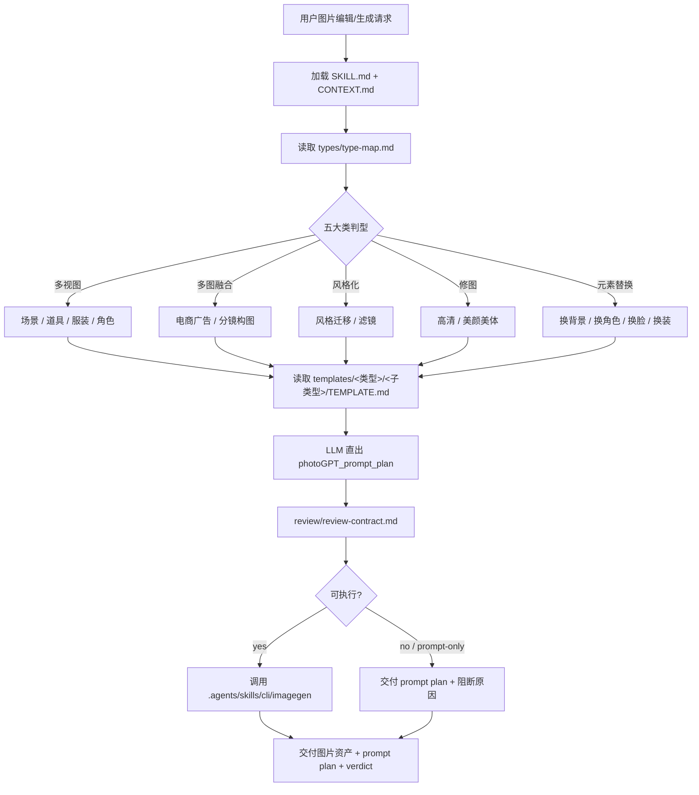
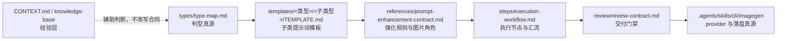
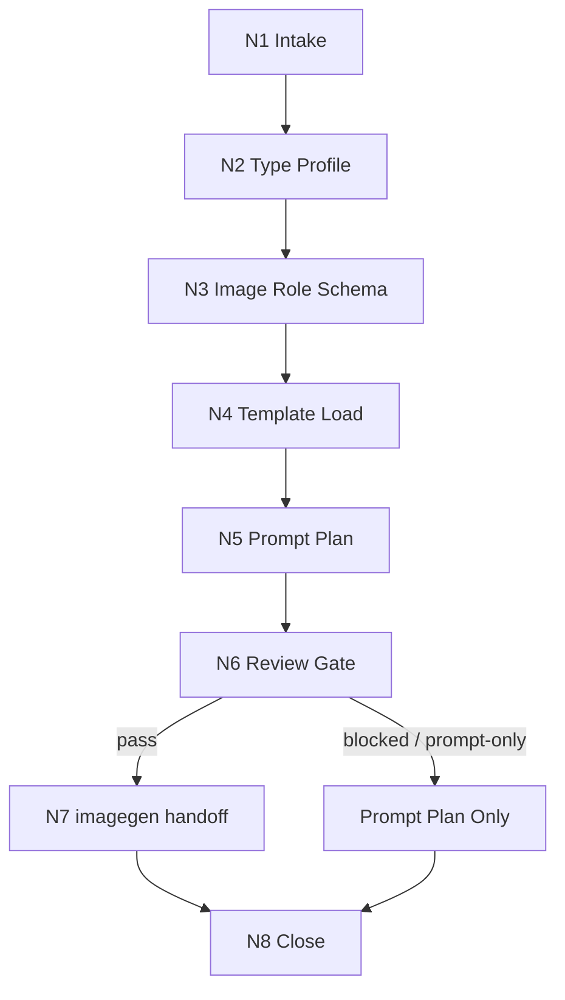

# photoGPT

`photoGPT` 是图像编辑任务的类型识别、提示词强化与 imagegen 执行编排层。它的类型真源固定为五大类十四子类：`多视图/场景|道具|服装|角色`、`多图融合/电商广告|分镜构图`、`风格化/风格迁移|滤镜`、`修图/高清|美颜美体`、`元素替换/换背景|换角色|换脸|换装`。本技能不替代 `.agents/skills/cli/imagegen` 的 provider 合同，也不让脚本生成主创提示词；核心创作判断必须由 LLM 完成，然后把清晰的图片角色、编辑类型、强化提示词、负面约束和输出要求交给 `imagegen` 执行。

## Context Loading Contract

- 每次调用本技能时，必须同时加载同目录 `CONTEXT.md`。
- 执行前必须按 `Reference Loading Guide` 读取 `types/type-map.md`，形成 `type_profile` 后再选择模板。
- 调用生图或修图前必须读取 `.agents/skills/cli/imagegen/SKILL.md + CONTEXT.md`，并遵守其模式、默认 2K 目标、输出持久化和 CLI fallback 规则。
- 若任务绑定 `projects/aigc/<项目名>/`，还必须先加载项目根 `MEMORY.md` 与相关 `CONTEXT/` 文件，再进入提示词强化。
- 冲突优先级：用户显式请求 > 根 `AGENTS.md` / meta 规则 > 本 `SKILL.md` > `.agents/skills/cli/imagegen/SKILL.md` > `references/` / `steps/` / `types/` / `review/` / `templates/` > `agents/openai.yaml` > 项目记忆与上下文 > 本 `CONTEXT.md`。

## Scope

Use this skill for:

- `多视图`：场景、道具、服装、角色的多视图/设计页/生产 sheet 提示词强化。
- `多图融合`：电商广告和分镜构图类多参考图融合提示词强化。
- `风格化`：风格迁移和滤镜类视觉语言转换，同时保持主体与叙事事实。
- `修图`：高清修复、美颜美体和自然保真的画质/人物修整。
- `元素替换`：换背景、换角色、换脸、换装等替换类编辑。
- 用户只给自然语言但需要先判定“该进入哪一类/哪一个子类模板”的任务。
- 承接上游创作项目中的图片编辑/生成需求，并输出可审计的 prompt plan。

Do not use this skill for:

- 直接 API 参数、密钥、provider 网络问题排查；此类问题回到 `.agents/skills/cli/imagegen` 或具体 provider 技能。
- 非图片工件，如纯 SVG、HTML/CSS、视频剪辑、小说正文。
- 绕过用户意图重写主体身份、剧情事实或上游设计真源。

## Input Contract

- Accepted input: 自然语言图片编辑/生成需求、一张或多张本地/对话图片、五大类十四子类任一显式类型、参考图角色说明、目标输出目录、期望比例、输出用途、风格与禁区。
- Required input: 用户想进入的类型或足以判型的意图；用户想改变什么、必须保持什么；编辑任务必须能识别主编辑图与参考图角色。
- Optional input: 项目名、主体 ID/name、`--desc` 补充要求、输出文件名、dry-run / prompt-only、指定 `edit_family/edit_subtype`、希望保留的视觉不变量、反向约束。
- Ask before proceeding when: 无法在十四个子类中判定唯一模板；无法区分待编辑图与参考图；换脸/换角色缺少身份参照；多视图设计页缺少对应 id/name/desc 且输出必须带身份徽章；用户要求真实 API/CLI fallback 但环境变量或密钥不可确认。
- Reject or reroute when: 用户要求脚本自动生成核心创作提示词、要求覆盖原图而无明确授权、或任务应由非图片技能处理。

## Mode Selection

| mode | trigger | route |
| --- | --- | --- |
| `prompt_only` | 用户只要优化提示词、dry-run、缺少可执行图片输入、无法唯一判定十四子类 | 输出 prompt plan，不调用 imagegen |
| `single_edit` | 单图修图、高清、美颜美体、滤镜 | `types/type-map.md` -> 中文子模板 -> `imagegen` edit |
| `reference_edit` | 双图或多图换背景、换角色、换脸、换装、风格迁移 | 锁定图片角色顺序 -> 中文子模板 -> `imagegen` edit |
| `fusion_edit` | 多图融合、电商广告、分镜构图 | 标注每张图职责 -> 中文子模板 -> `imagegen` edit/generate |
| `design_sheet` | 多视图场景/道具/服装/角色、turnaround、sheet | 读取 `templates/多视图/<子类型>/TEMPLATE.md` -> 生成设计页 prompt -> `imagegen` generate/edit |

## Reference Loading Guide

| need | load |
| --- | --- |
| 判定图片编辑类型、子类型、图片角色和模板路线 | `types/type-map.md` |
| 提示词强化原则、图序锁定、不变量和负面约束 | `references/prompt-enhancement-contract.md` |
| 执行拓扑、分支、汇流、prompt-only 与 imagegen handoff | `steps/execution-workflow.md` |
| 交付前质量门禁和 reviewer 降级规则 | `review/review-contract.md` |
| 输出报告格式 | `templates/output-template.md.template` |
| 多视图模板 | `templates/多视图/场景/TEMPLATE.md`, `templates/多视图/道具/TEMPLATE.md`, `templates/多视图/服装/TEMPLATE.md`, `templates/多视图/角色/TEMPLATE.md` |
| 多图融合模板 | `templates/多图融合/电商广告/TEMPLATE.md`, `templates/多图融合/分镜构图/TEMPLATE.md` |
| 风格化模板 | `templates/风格化/风格迁移/TEMPLATE.md`, `templates/风格化/滤镜/TEMPLATE.md` |
| 修图模板 | `templates/修图/高清/TEMPLATE.md`, `templates/修图/美颜美体/TEMPLATE.md` |
| 元素替换模板 | `templates/元素替换/换背景/TEMPLATE.md`, `templates/元素替换/换角色/TEMPLATE.md`, `templates/元素替换/换脸/TEMPLATE.md`, `templates/元素替换/换装/TEMPLATE.md` |
| 稳定经验与失败模式 | `knowledge-base/photoGPT-heuristics.md` and `CONTEXT.md` |
| 产品入口元数据 | `agents/openai.yaml` |
| 机械辅助边界 | `scripts/README.md` |

## Visual Maps

`SKILL.md` 只保留入口级拓扑；详细节点、状态机和失败回路见 `steps/execution-workflow.md`。

## Execution Contract

1. 读取本 `SKILL.md + CONTEXT.md`，再读取 `types/type-map.md`。
2. 对输入图片标注角色：edit target、identity reference、background reference、costume reference、style/layout reference、supporting reference。
3. 形成 `type_profile`：`edit_family`、`edit_subtype`、`template_path`、`input_image_count`、`image_role_schema`、`identity_lock`、`composition_lock`、`output_mode`。
4. 读取命中的模板文件和 `references/prompt-enhancement-contract.md`，由 LLM 直接生成 canonical prompt，不使用脚本拼接创作正文。
5. 按 `review/review-contract.md` 检查图序、锁定项、负面约束、模板特异字段和 imagegen 可执行性。
6. 若图片与环境条件齐备，读取并调用 `.agents/skills/cli/imagegen`；否则输出 prompt plan、阻断原因和下一步所需输入。
7. 交付时记录最终类型、模板、图片角色、最终提示词、imagegen 模式、输出路径或 prompt-only 阻断。

## Root-Cause Execution Contract

当 photoGPT 输出或生成结果失败时，按以下链路追溯：

`Symptom -> Direct Prompt/Type Cause -> photoGPT Section Owner -> imagegen Contract -> AGENTS.md LLM-first / Skill 2.0 Rule`

| symptom | likely owner | repair route |
| --- | --- | --- |
| 编辑类型选错 | `types/type-map.md` | 修正 type signal 与子类型矩阵 |
| 五大类或十四子类与模板路径脱节 | `types/type-map.md` + `templates/` | 恢复 `templates/<类型>/<子类型>/TEMPLATE.md` 唯一路由 |
| 换背景/换角色/换脸/换装图序混乱 | `references/prompt-enhancement-contract.md` | 重新标注图片角色并强化图一/图二语义 |
| 多图融合把所有参考图平均混合 | `references/prompt-enhancement-contract.md` | 逐图标注商品/主体/场景/构图/风格职责 |
| 主体身份、服装、姿态漂移 | 对应 `templates/<类型>/<子类型>/TEMPLATE.md` | 增强 identity/composition lock 和禁止项 |
| 多视图 sheet 变成海报或九宫格错型 | `templates/多视图/<子类型>/TEMPLATE.md` | 恢复固定 layout grammar 与身份徽章 |
| CLI/API 路径被误用 | `.agents/skills/cli/imagegen/SKILL.md` | 回到 imagegen 模式合同，确认是否需要用户显式许可 |
| 输出没有审计信息 | `templates/output-template.md.template` / `review/review-contract.md` | 补齐 prompt plan、mode、path、verdict |

## Field Mapping

### Directory Ownership Table

| field_id | owner | must contain | fail code |
| --- | --- | --- | --- |
| `FIELD-PGPT-01` | `SKILL.md` | Input Contract, type-first route, imagegen handoff, Output Contract | `FAIL-PGPT-ENTRY` |
| `FIELD-PGPT-02` | `CONTEXT.md` | Type Map, Repair Playbook, Reusable Heuristics | `FAIL-PGPT-CONTEXT` |
| `FIELD-PGPT-03` | `types/` | edit family/subtype matrix and image role rules | `FAIL-PGPT-TYPE` |
| `FIELD-PGPT-04` | `templates/` | 用户给定中文细分类型目录、每个子类型 `TEMPLATE.md`、输出模板 | `FAIL-PGPT-TEMPLATE` |
| `FIELD-PGPT-05` | `references/` | prompt enhancement and invariant contract | `FAIL-PGPT-REFERENCE` |
| `FIELD-PGPT-06` | `steps/` | thinking-action nodes and imagegen handoff | `FAIL-PGPT-STEPS` |
| `FIELD-PGPT-07` | `review/` | prompt/output quality gate | `FAIL-PGPT-REVIEW` |
| `FIELD-PGPT-08` | `agents/` | OpenAI metadata with `$photoGPT` default prompt | `FAIL-PGPT-AGENT` |

### Node Handoff Table

| node_id | input | action | output | next_gate |
| --- | --- | --- | --- | --- |
| `N1-INTAKE` | 用户请求、图片、项目上下文 | 提取目标、约束、图片数量和输出意图 | `intake_summary` | `N2-TYPE` |
| `N2-TYPE` | `intake_summary` | 读取 `types/type-map.md` 形成类型画像 | `type_profile` | `N3-ROLES` |
| `N3-ROLES` | `type_profile` + 输入图 | 标注 edit target 与 reference roles | `image_roles` | `N4-TEMPLATE` |
| `N4-TEMPLATE` | `type_profile` | 读取对应模板和提示词强化合同 | `template_context` | `N5-PROMPT` |
| `N5-PROMPT` | 用户意图、图片角色、模板 | LLM 直出 canonical prompt plan | `photoGPT_prompt_plan` | `N6-REVIEW` |
| `N6-REVIEW` | prompt plan | 执行质量门禁 | `review_verdict` | `N7-IMAGEGEN` or close |
| `N7-IMAGEGEN` | prompt plan + imagegen 合同 | 调用 imagegen 或记录阻断 | image asset or prompt-only report | `N8-CLOSE` |
| `N8-CLOSE` | 执行结果 | 汇总路径、模式、风险和未决项 | final delivery | done |

### Failure Routing Table

| fail_code | symptom | rework_target |
| --- | --- | --- |
| `FAIL-PGPT-ENTRY` | 入口合同缺少输入/输出边界或 imagegen handoff | `SKILL.md` |
| `FAIL-PGPT-CONTEXT` | `CONTEXT.md` 缺少 Type Map / Repair Playbook / Reusable Heuristics | `CONTEXT.md` |
| `FAIL-PGPT-TYPE` | 编辑类型、子类型或图片角色无法判定 | `types/type-map.md` |
| `FAIL-PGPT-TEMPLATE` | 命中类型没有模板或模板缺锁定项 | `templates/<类型>/<子类型>/TEMPLATE.md` |
| `FAIL-PGPT-REFERENCE` | 图序、保留项、负面约束规则不清 | `references/prompt-enhancement-contract.md` |
| `FAIL-PGPT-STEPS` | 流程无法区分 prompt-only 与 imagegen execute | `steps/execution-workflow.md` |
| `FAIL-PGPT-REVIEW` | 交付前没有 prompt/output verdict | `review/review-contract.md` |
| `FAIL-PGPT-AGENT` | `agents/openai.yaml` 缺 metadata 或未提到 `$photoGPT` | `agents/openai.yaml` |

## Output Contract

- Required output: `photoGPT_prompt_plan` and, when executable, generated/edited bitmap asset(s) created through `.agents/skills/cli/imagegen`.
- Output format: Markdown report or JSON-compatible prompt plan containing `type_profile`, `image_roles`, `template_path`, `final_prompt`, `negative_constraints`, `imagegen_mode`, `output_path`, `review_verdict`.
- Output path: prompt-only reports stay in the conversation unless the user provides a project/output path; project-bound assets follow `.agents/skills/cli/imagegen` persistence rules and must not remain only in transient generated-image storage.
- Naming convention: prompt plans use descriptive names such as `<source-stem>-photogpt-plan.md` when saved; image outputs use stable sibling names that reflect the Chinese subtype, such as `<source-stem>-修图-高清.png`, `<source-stem>-元素替换-换背景.png`, or user-provided filenames.
- Completion gate: type/subtype selected, template loaded, image roles clear, final prompt includes preservation and change constraints, imagegen contract honored, final asset path exists when generation was executed, and `review/review-contract.md` returns `pass` or `pass_with_followups`.
