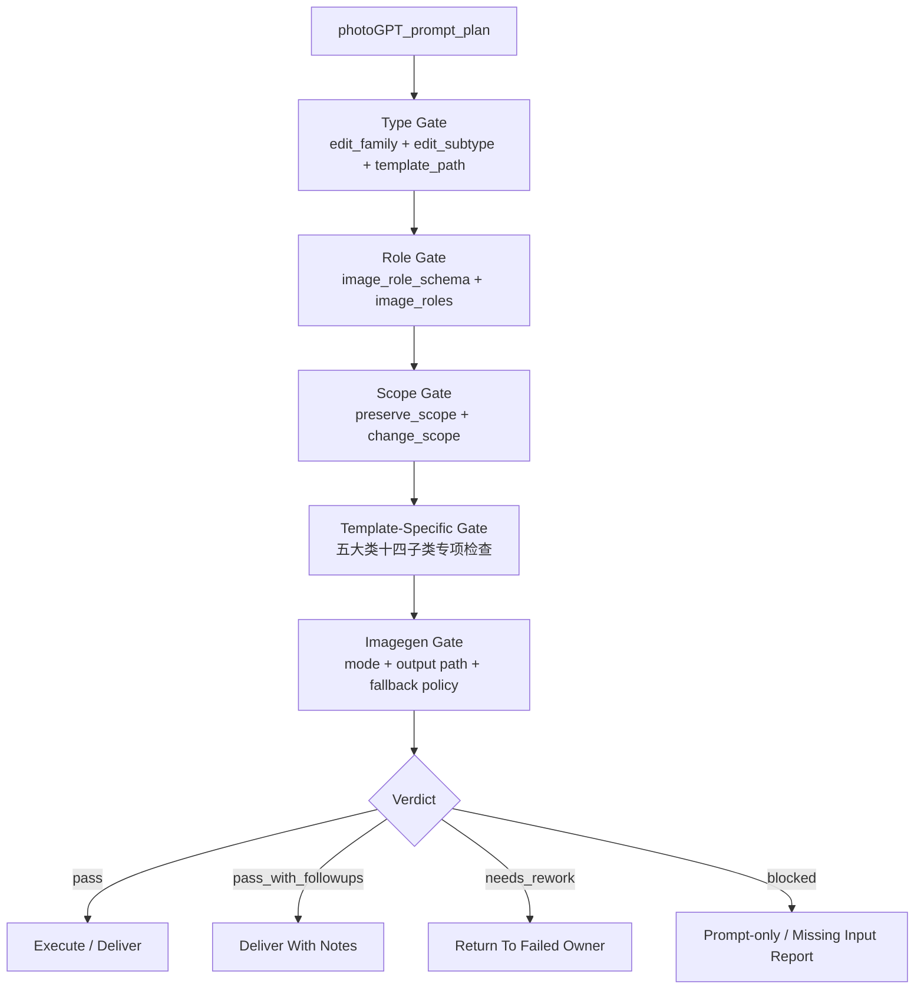

# Review Contract

## Default Provider

- 默认采用本地 checklist。
- 若上层策略允许且用户显式授权 subagents，可使用 reviewer/provider 辅助审查 prompt plan。
- 当前上层开发者策略要求只有用户显式要求 subagents/并行代理时才启动 subagent；未授权时降级为本地 checklist。

## Visual Map



## Prompt Gate

| dimension | pass condition |
| --- | --- |
| type | `edit_family` 与 `edit_subtype` 命中 `types/type-map.md` |
| image_roles | 每张输入图角色明确，图序与模板一致 |
| preserve_scope | 身份、构图、姿态、服装、背景等保留项清楚 |
| change_scope | 允许修改的区域和目标清楚 |
| negative_constraints | 至少包含模板关键禁止项 |
| template_specific | 中文细分模板已加载；多视图 layout、多图融合角色标注、风格化保真、修图真实感、元素替换锁定项完整 |
| imagegen_handoff | 已遵守 `.agents/skills/cli/imagegen` 模式与输出规则 |

## Type-Specific Gate

| edit_family | subtypes | must pass |
| --- | --- | --- |
| `多视图` | 场景、道具、服装、角色 | 模板路径正确；ID/name/desc 与短 ASCII ID 注入；顶左身份牌显示短 ID 或保留叠字区；完整名称进入 prompt plan / JSON 记录；layout grammar 明确；主体不变量与跨视图身份/形态一致；对应空场景/无人/无强角色护栏成立；场景模板额外要求每个 panel 左下角有视角标签或叠字预留条 |
| `多图融合` | 电商广告、分镜构图 | 每张参考图职责明确；主视觉优先级清楚；透视、光线、比例和阴影统一；无关主体、水印和竞品不被复制 |
| `风格化` | 风格迁移、滤镜 | 风格作用范围明确；主体身份、构图事实和叙事事实保留；滤镜类不得升级为重绘 |
| `修图` | 高清、美颜美体 | 修复目标明确；保持身份、构图和真实纹理；美颜美体自然克制，不改变人物身份或人体结构 |
| `元素替换` | 换背景、换角色、换脸、换装 | 图序正确；替换来源明确；保留范围明确；边缘融合、接触阴影和光线一致；禁止项完整 |

## Verdict Model

| verdict | meaning |
| --- | --- |
| `pass` | 可执行或可交付 |
| `pass_with_followups` | 可交付，但有非阻断风险 |
| `needs_rework` | prompt 或路由有阻断问题 |
| `blocked` | 缺输入、权限、图片或 imagegen 条件 |

## Finding Shape

```yaml
finding:
  severity: critical | high | medium | low
  dimension: type | subtype | roles | prompt | template | imagegen | output
  symptom: ""
  direct_cause: ""
  rework_target: ""
```
