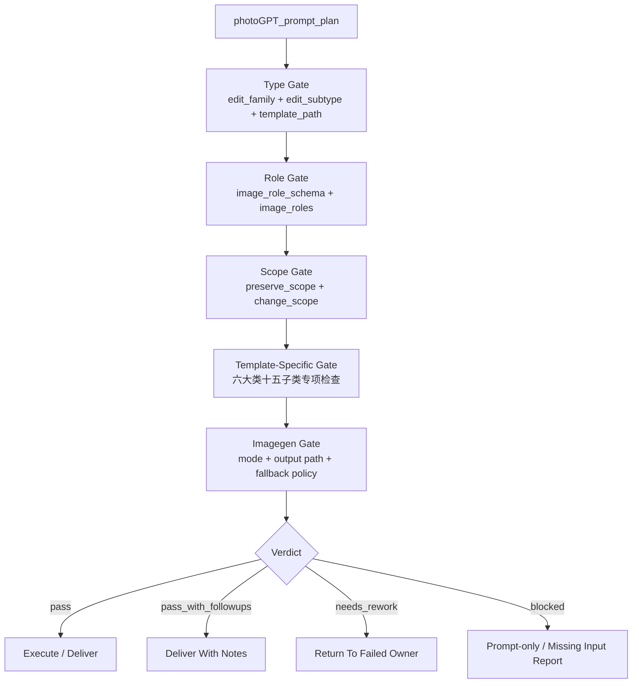

# Review Contract

## Default Provider

- 默认采用本地 checklist。
- 若上层策略允许且用户显式授权 subagents，可使用 reviewer/provider 辅助审查 prompt plan。
- 当前上层开发者策略要求只有用户显式要求 subagents/并行代理时才启动 subagent；未授权时降级为本地 checklist。

## Visual Map



## Prompt Gate

| dimension | pass condition | fail_code | rework_target |
| --- | --- | --- | --- |
| type | `edit_family` 与 `edit_subtype` 命中 `types/type-map.md` | `FAIL-PGPT-TYPE` | `SKILL.md N2-TYPE` |
| image_roles | 每张输入图角色明确，图序与模板一致 | `FAIL-PGPT-ROLES` | `SKILL.md N3-ROLES` |
| preserve_scope | 身份、构图、姿态、服装、背景等保留项清楚；涉及角色形象保留时必须明确原角色形象和妆容不变；涉及服装保留或替换时必须明确服装样式和版型 | `FAIL-PGPT-PROMPT` | `SKILL.md N5-PROMPT` |
| change_scope | 允许修改的区域和目标清楚 | `FAIL-PGPT-PROMPT` | `SKILL.md N5-PROMPT` |
| negative_constraints | 至少包含模板关键禁止项 | `FAIL-PGPT-PROMPT` | `SKILL.md N5-PROMPT` |
| creative_authorship | 未使用脚本批量生成、批量插入、正则套句或映射投影创作正文 | `FAIL-CREATIVE-AUTHORSHIP-SCRIPT` | `SKILL.md LLM-First Creative Authorship Contract` |
| template_specific | 中文细分模板已加载；多视图 layout、多镜头九宫格镜头组合、多图融合角色标注、风格化保真、修图真实感、元素替换锁定项完整 | `FAIL-PGPT-TEMPLATE` | 命中模板 |
| imagegen_handoff | `imagegen_handoff.model == gpt-image-2`，且已遵守 `.agents/skills/cli/imagegen` 的 `gpt-image-2` 模式与输出规则 | `FAIL-PGPT-PROVIDER` | `SKILL.md Provider Boundary` |

## Type-Specific Gate

| edit_family | subtypes | must pass |
| --- | --- | --- |
| `多视图` | 场景、道具、服装、角色 | 模板路径正确；ID/name/desc 与短 ASCII ID 注入；顶左身份牌显示短 ID 或保留叠字区；完整名称进入 prompt plan / JSON 记录；layout grammar 明确；主体不变量与跨视图身份/形态一致；角色多视图默认必须是面部放大版：顶部面部高清放大特写，底部全身正面、侧面、背面三视图；只有用户显式要求时才进入多细节界面版；角色多视图必须保留原角色形象和妆容不变；服装多视图必须锁定服装样式和版型；对应空场景/无人/无强角色护栏成立；场景模板额外要求每个 panel 左下角有视角标签或叠字预留条 |
| `多镜头` | 九宫格 | 模板路径正确；输出是严格 3x3 电影镜头九宫格；参照图画面风格、构图元素、主体信息、服装/道具/环境和叙事事实不变；九个 panel 分别体现常用景别或机位组合；不得变成九个不同场景、漫画分格、剧情分镜或海报拼贴 |
| `多图融合` | 电商广告、分镜构图 | 每张参考图职责明确；主视觉优先级清楚；透视、光线、比例和阴影统一；无关主体、水印和竞品不被复制 |
| `风格化` | 风格迁移、滤镜 | 风格作用范围明确；主体身份、构图事实和叙事事实保留；滤镜类不得升级为重绘 |
| `修图` | 高清、美颜美体 | 修复目标明确；保持身份、构图和真实纹理；美颜美体自然克制，不改变人物身份或人体结构 |
| `元素替换` | 换背景、换角色、换脸、换装 | 图序正确；替换来源明确；保留范围明确；换装、换角色、换脸必须明确保留原角色形象和妆容不变；换装必须锁定服装样式和版型；边缘融合、接触阴影和光线一致；禁止项完整 |

## Provider Gate

- pass: `imagegen_handoff.model` 明确为 `gpt-image-2`，且未声明、调用或建议其他图像 provider。
- blocked: 任务依赖 nano-banana、AnyFast Gemini image、InsightFace、inswapper、Roop、DeepFace、Photoshop generative edit 或其他非 `gpt-image-2` provider。
- finding code: `blocked_provider_not_gpt_image_2`。

## Review Gate Mapping

| review_question | review_gate | fail_code | rework_target | report_evidence |
| --- | --- | --- | --- | --- |
| 类型、子类型和模板路径是否一致？ | `Prompt Gate.type` + `Type-Specific Gate` | `FAIL-PGPT-TYPE` | `SKILL.md N2-TYPE` | `type_profile` |
| 每张图是否有明确职责？ | `Prompt Gate.image_roles` | `FAIL-PGPT-ROLES` | `SKILL.md N3-ROLES` | `image_roles` |
| 角色多视图是否使用正确分支？ | 未显式要求多细节界面版时，必须使用面部放大版；顶部高清面部特写和底部正/侧/背三视图缺一即失败 | `FAIL-PGPT-CHARACTER-MULTIVIEW-MODE` | `templates/多视图/角色/TEMPLATE.json` | character branch verdict |
| 多镜头九宫格是否保留参照图事实且只变化镜头语言？ | `Type-Specific Gate.多镜头` | `FAIL-PGPT-MULTI-SHOT` | `templates/多镜头/九宫格/TEMPLATE.json` | shot grid review |
| prompt plan 是否满足字段和作者性门禁？ | `Prompt Gate.preserve_scope/change_scope/negative_constraints/creative_authorship` | `FAIL-PGPT-PROMPT` / `FAIL-CREATIVE-AUTHORSHIP-SCRIPT` | `SKILL.md N5-PROMPT` | prompt plan audit |
| 是否只允许 `gpt-image-2`？ | `Provider Gate` | `FAIL-PGPT-PROVIDER` | `SKILL.md Provider Boundary` | `imagegen_handoff` |
| verdict 是否可汇流？ | `Verdict Model` | `FAIL-PGPT-REVIEW` | `SKILL.md N6-REVIEW` | `review_verdict` |

## Verdict Model

| verdict | meaning |
| --- | --- |
| `pass` | 可执行或可交付 |
| `pass_with_followups` | 可交付，但有非阻断风险 |
| `needs_rework` | prompt 或路由有阻断问题 |
| `blocked` | 缺输入、权限、图片或 imagegen 条件 |

## Finding Shape

```yaml
finding:
  severity: critical | high | medium | low
  dimension: type | subtype | roles | prompt | template | imagegen | output
  symptom: ""
  direct_cause: ""
  rework_target: ""
```
