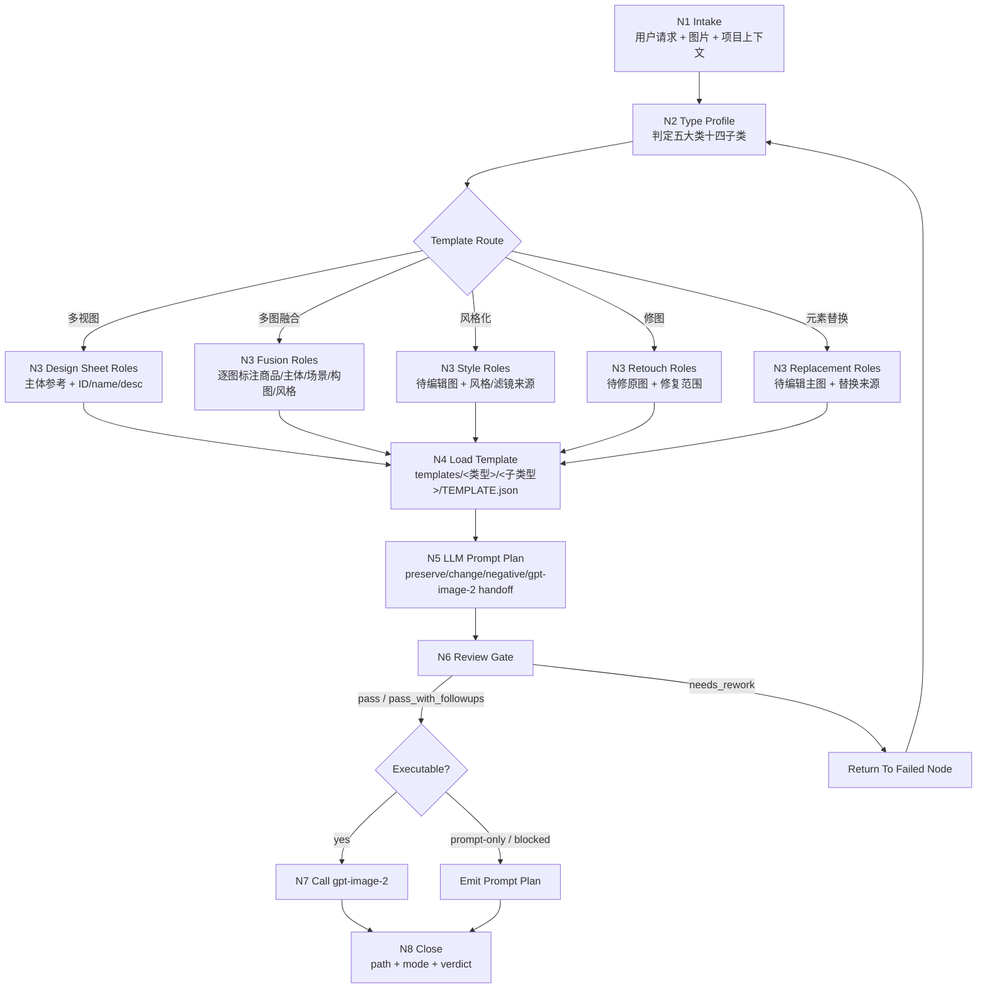
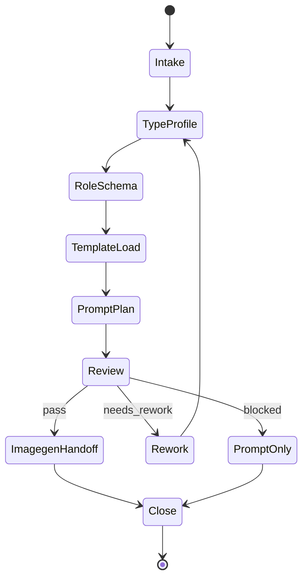

# Execution Workflow

本文件承载 `photoGPT` 的思行一体节点。每个节点都必须同时产生判断、动作和证据。

## Visual Maps

## Nodes

| node_id | input | action | output | gate |
| --- | --- | --- | --- | --- |
| `N1-INTAKE` | 用户请求、图片、项目上下文 | 提取目标、约束、图片数量和输出意图 | `intake_summary` | 缺关键编辑目标则 prompt-only |
| `N2-TYPE` | `intake_summary` | 读取 `types/type-map.md`，形成 `type_profile` | `type_profile` | family/subtype 属于五大类十四子类，且有中文模板映射 |
| `N3-ROLES` | `type_profile` + 图片 | 按子类标注 edit target/reference roles | `image_roles` | 图片角色满足该子类 schema |
| `N4-TEMPLATE` | `type_profile` | 读取 `templates/<类型>/<子类型>/TEMPLATE.json` 与 prompt enhancement contract | `template_context` | 模板存在且字段齐全 |
| `N5-PROMPT` | 用户意图 + 模板 | LLM 直出 canonical final prompt | `photoGPT_prompt_plan` | preserve/change/negative 三组齐全 |
| `N6-REVIEW` | prompt plan | 执行 `review/review-contract.md` | `review_verdict` | pass 或 pass_with_followups 才可执行 |
| `N7-IMAGEGEN` | prompt plan + imagegen 合同 | 仅调用 `.agents/skills/cli/imagegen` 的 `gpt-image-2` 路径或输出阻断 | image asset or prompt-only report | `imagegen_handoff.model == gpt-image-2` 且路径/模式可追溯 |
| `N8-CLOSE` | 执行结果 | 汇总类型、模板、prompt、模式、路径和风险 | final delivery | 不伪造未生成资产 |

## Branch Rules

- `prompt_only`: 执行到 `N6-REVIEW` 后交付 prompt plan。
- `single_edit`: `修图` 或 `风格化/滤镜`，`N3-ROLES` 至少有一个 `edit_target`。
- `reference_edit`: `元素替换` 或 `风格化/风格迁移`，`N3-ROLES` 必须有 `edit_target` 与至少一个 reference role。
- `fusion_edit`: `多图融合`，`N3-ROLES` 必须逐张标注商品/主体/场景/构图/风格职责。
- `design_sheet`: `多视图`，`N5-PROMPT` 必须有对应 ID/name/desc 注入。
- provider boundary: 所有可执行分支只能进入 `gpt-image-2`；若需要 nano-banana、InsightFace、inswapper 或其他 provider，返回 `blocked_provider_not_gpt_image_2`。

## Subtype Evidence Gates

| subtype group | required evidence |
| --- | --- |
| `多视图/*` | object id/name/desc, main_subject_reference, layout grammar, cross-view consistency lock |
| `多图融合/电商广告` | product_reference, scene/style/composition roles, product identity lock, commercial focus |
| `多图融合/分镜构图` | subject_reference, scene_reference, storyboard_composition_reference, single-frame guard |
| `风格化/风格迁移` | edit_target, style_reference or textual style, subject/story preservation |
| `风格化/滤镜` | edit_target, filter_direction, content-preservation lock |
| `修图/高清` | edit_target, quality defects, texture/detail preservation |
| `修图/美颜美体` | edit_target, natural beauty/body scope, identity/proportion lock |
| `元素替换/*` | edit_target, replacement reference, preserve scope, replacement-only negative constraints |

## Failure Loop

| failure | loop target |
| --- | --- |
| 类型不明确 | `N2-TYPE` |
| 图片角色冲突 | `N3-ROLES` |
| 模板缺字段 | `N4-TEMPLATE` |
| prompt 缺锁定项 | `N5-PROMPT` |
| imagegen 执行模式冲突或非 gpt-image-2 provider 被选中 | `SKILL.md` + `.agents/skills/cli/imagegen/SKILL.md` |
