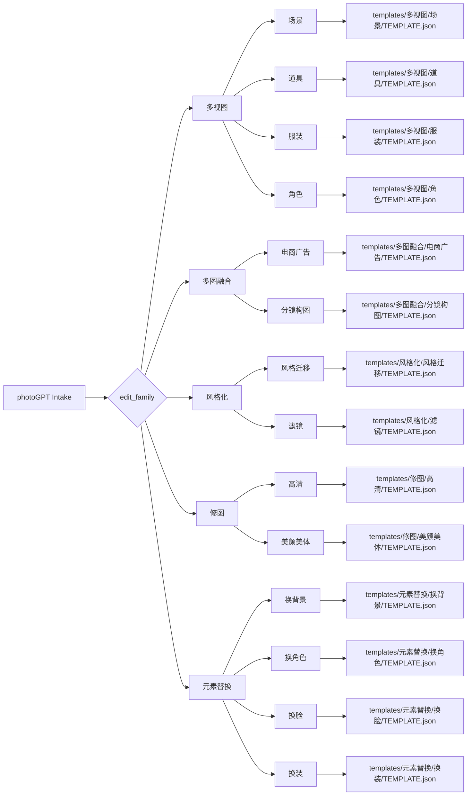

# Type Map

## 类型包加载边界

- 每次调用本技能时，必须依据本文件识别并加载同目录 `types/` 中选中的类型包（单选或多选）。
- `types/` 中命中的类型包作为固定上下文加载；`knowledge-base/` 只作为按需检索、切片或向量召回的知识库，不替代类型包。

`photoGPT` 必须先判型，再读取对应模板。类型矩阵是路由真源；具体提示词正文属于 `templates/`。

## Visual Map

## Type Profile Variables

| variable | allowed values | meaning |
| --- | --- | --- |
| `edit_family` | `多视图`, `多图融合`, `风格化`, `修图`, `元素替换` | 主任务类型 |
| `edit_subtype` | family-specific | 细分编辑意图 |
| `template_path` | `templates/<类型>/<子类型>/TEMPLATE.json` | 命中的唯一模板路径 |
| `image_role_schema` | subtype-specific | 该子类要求的图片角色集合 |
| `input_image_count` | `0`, `1`, `2`, `multi` | 输入图片数量 |
| `role_confidence` | `high`, `medium`, `low` | 图片角色识别置信度 |
| `identity_lock` | `strict`, `soft`, `none` | 主体身份锁定强度 |
| `composition_lock` | `strict`, `soft`, `none` | 构图/镜头锁定强度 |
| `output_mode` | `prompt_only`, `imagegen_execute` | 是否调用 imagegen |

## Family And Subtype Matrix

| edit_family | trigger signals | required images | subtypes | template |
| --- | --- | --- | --- | --- |
| `多视图` | 多视图、设计页、转身图、sheet、正侧背、九宫格场景 | 1+ | `场景`, `道具`, `服装`, `角色` | `templates/多视图/<subtype>/TEMPLATE.json` |
| `多图融合` | 多图融合、把这些图合成、电商广告、商品融合、按分镜构图融合 | 2+ | `电商广告`, `分镜构图` | `templates/多图融合/<subtype>/TEMPLATE.json` |
| `风格化` | 风格迁移、套某种风格、滤镜、调色、胶片感、赛博感、水彩感 | 1+ | `风格迁移`, `滤镜` | `templates/风格化/<subtype>/TEMPLATE.json` |
| `修图` | 修图、精修、变高清、去瑕疵、美颜、美体、皮肤优化、清晰度增强 | 1 | `高清`, `美颜美体` | `templates/修图/<subtype>/TEMPLATE.json` |
| `元素替换` | 换背景、换角色、换脸、换装、替换人物、替换衣服、保留主体换环境 | 2 | `换背景`, `换角色`, `换脸`, `换装` | `templates/元素替换/<subtype>/TEMPLATE.json` |

## Subtype Routing Matrix

| edit_family | edit_subtype | trigger signals | image roles | template path |
| --- | --- | --- | --- | --- |
| `多视图` | `场景` | 场景多视图、场景九宫格、SCENE_DESIGN_SHEET | 主场景参考图 + 辅助场景/材质参考 | `templates/多视图/场景/TEMPLATE.json` |
| `多视图` | `道具` | 道具多视图、道具设计页、PROP_DESIGN_SHEET | 主道具参考图 + 辅助材质/细节参考 | `templates/多视图/道具/TEMPLATE.json` |
| `多视图` | `服装` | 服装多视图、服装设计页、服装转身图、COSTUME_DESIGN_SHEET | 主服装参考图 + 面料/配饰参考 | `templates/多视图/服装/TEMPLATE.json` |
| `多视图` | `角色` | 角色多视图、角色设计页、转身图、CHARACTER_DESIGN_SHEET | 主角色参考图 + 姿态/表情/服装细节参考 | `templates/多视图/角色/TEMPLATE.json` |
| `多图融合` | `电商广告` | 商品广告、多图合成电商主图、商品放进场景 | 商品图 + 场景图 + 风格/构图参考 | `templates/多图融合/电商广告/TEMPLATE.json` |
| `多图融合` | `分镜构图` | 按这个分镜、参考构图、把角色放进这个镜头 | 主体图 + 场景图 + 分镜/构图参考 | `templates/多图融合/分镜构图/TEMPLATE.json` |
| `风格化` | `风格迁移` | 变成某风格、参考这张风格、赛博/水彩/油画等 | 待编辑图 + 风格参考图/文字 | `templates/风格化/风格迁移/TEMPLATE.json` |
| `风格化` | `滤镜` | 加滤镜、调色、胶片感、清透感、复古滤镜 | 待编辑图 + 滤镜方向 | `templates/风格化/滤镜/TEMPLATE.json` |
| `修图` | `高清` | 变高清、修复画质、去噪、提升清晰度、锐化 | 待修原图 | `templates/修图/高清/TEMPLATE.json` |
| `修图` | `美颜美体` | 美颜、美体、瘦脸、皮肤、腿长、体态优化 | 待修人像/人物图 | `templates/修图/美颜美体/TEMPLATE.json` |
| `元素替换` | `换背景` | 换背景、抠图换景、主体不动换环境 | 待编辑主图 + 背景参照图 | `templates/元素替换/换背景/TEMPLATE.json` |
| `元素替换` | `换角色` | 换角色、角色替换、把图里的人换成这个角色 | 待编辑主图 + 角色参照图 | `templates/元素替换/换角色/TEMPLATE.json` |
| `元素替换` | `换脸` | 换脸、保留服装换面貌、把脸换成这张 | 待编辑主图 + 身份/面貌参照图 | `templates/元素替换/换脸/TEMPLATE.json` |
| `元素替换` | `换装` | 换装、换衣服、服装替换、穿上这套衣服 | 角色原图 + 服装参照图 | `templates/元素替换/换装/TEMPLATE.json` |

## Routing Gates

1. 若用户显式指定模板，优先采用该模板，但仍检查必需图片数量。
2. 若同一句同时命中换脸和换装，按用户主谓关系判定主编辑；无法判定时输出 prompt-only 并追问。
3. 若输入图片数量不足，不能伪造参考图；输出 `blocked_missing_reference_image`。
4. 多视图任务必须具备对应 `id/name/desc`，并能提取或安全转换出短 ASCII ID（如 `scene_short_id`、`prop_short_id`、`costume_short_id`、`character_short_id`）；缺字段时可由用户原话合理提取，无法提取则 prompt-only。
5. 修图不得升级为风格化重绘，除非用户明确写出风格替换。
6. `多图融合` 必须逐张图标注职责；无法区分商品/主体/场景/构图图时进入 prompt-only。
7. `元素替换` 必须同时写清替换来源和保留范围；只说“换一下”但无法判断替换对象时进入 prompt-only。

## Review Mapping

| edit_family | critical checks |
| --- | --- |
| `多视图` | layout grammar、主体不变量、身份/形态一致、短 ASCII 身份徽章、完整名称记录、非目标元素护栏；角色多视图额外检查原角色形象和妆容不变；服装多视图额外检查服装样式和版型；场景额外检查 panel 左下角视角标签 |
| `多图融合` | 图片角色清晰、主次关系清楚、光线/透视/阴影融合自然 |
| `风格化` | 风格改变不覆盖主体身份、构图事实和叙事事实 |
| `修图` | 身份/构图/真实感锁定；避免过度磨皮、假细节和重绘 |
| `元素替换` | 图序正确、替换范围明确、保留范围明确、漂移禁止项完整；换装、换角色、换脸额外检查原角色形象和妆容不变；换装额外检查服装样式和版型 |
