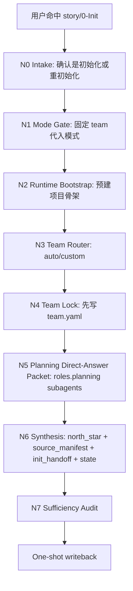
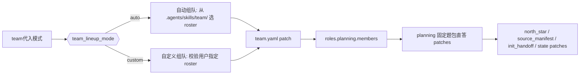
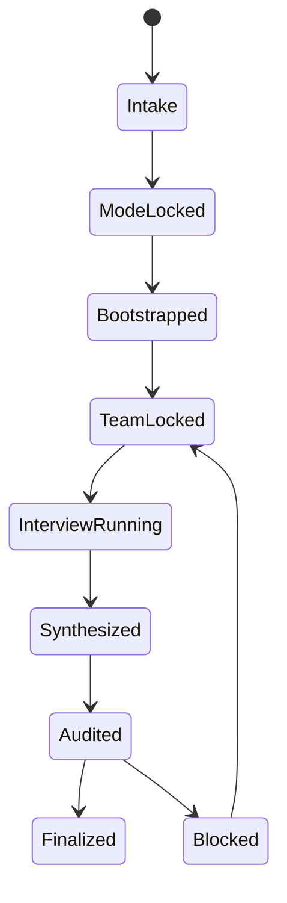
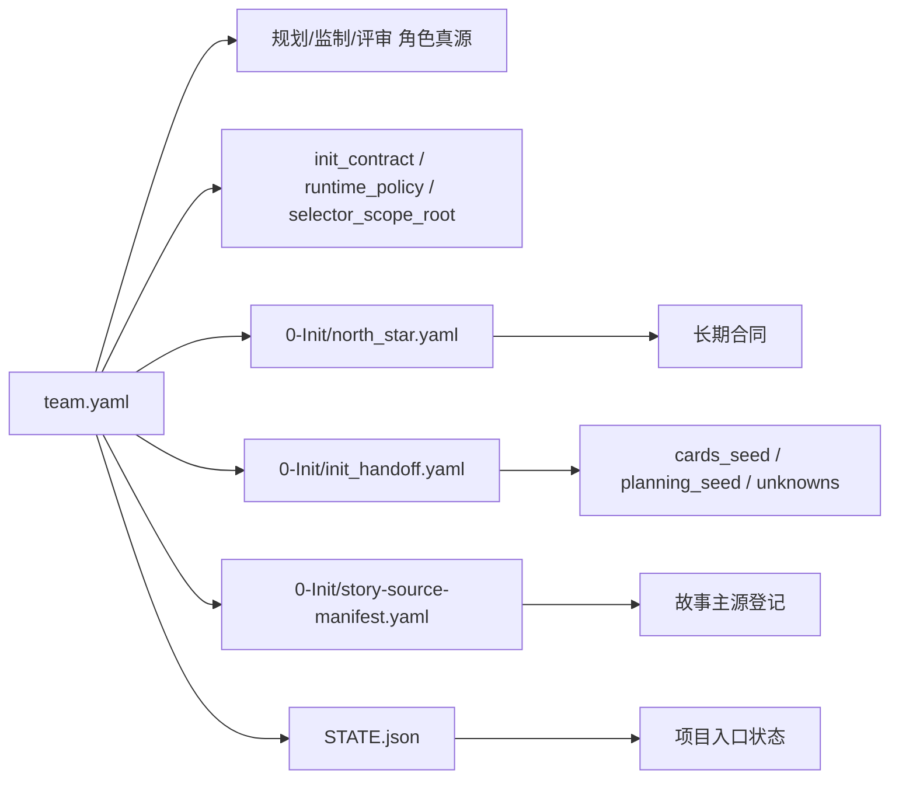

# story 0-Init

## Context Loading Contract

- 每次调用本技能时，必须同时加载同目录 `CONTEXT.md`。
- `CONTEXT.md` 只承载初始化经验、返工顺序与 team 选型启发，不得覆盖本 `SKILL.md` 的单一模式合同、`team.yaml` 真源合同与写回位点。
- 若 `init_project.py`、项目模板与本合同冲突，先修脚本与本合同，再修经验层描述。

## 概述

`story2026/0-Init` 已从旧的 `顾问团模式 / 快速模式 / 自主问卷` 三模式结构，收束为单一 `team代入模式`。

当前合同固定为：

- 主模式只有一个：`team代入模式`
- 仅允许两种编组子路径：`自动组队`、`自定义组队`
- `planning` 角色必须先以真实 subagents 执行固定题包直答，再综合写回 `0-Init/north_star.yaml`
- 项目根 `team.yaml` 是团队治理唯一真源
- 初始化不再允许退回问卷调查或“快速补完”平行路径

## 单一真源目录合同

- 本 `SKILL.md` 是 `story/0-Init` 的唯一规范真源。
- `CONTEXT.md` 只承载经验层知识库，不再保存模式并行合同。
- `agents/openai.yaml` 若存在，只承载入口元数据，不得扩写执行规则。
- `references/creative-seed-routing/module-spec.md` 是创意缺口路由细则，不是模式入口。
- `references/advisor-council-mode/`、`references/fast-mode/`、`references/autonomous-mode/` 已退出真源体系；后续不得恢复为平行 mode-playbook。

## When to Use

- 需要新建一个 `story2026` 小说项目。
- 已初始化项目因方向失效，需要退回初始化层重新起盘。
- 需要先锁团队代入阵容，再通过固定题包直答 产出初始化长期合同与阶段种子。
- 需要把项目级团队治理稳定落到 `team.yaml`，并生成 `0-Init` 三件套。

## When Not to Use

- 已有稳定项目骨架，只需补写局部设定或单字段。
- 当前任务是 `1-Cards / 2-Planning / 3-Drafting / 4-Validation / review / resume` 的续跑，而不是初始化。
- 用户只需要查询项目状态，不需要重新立项。

## 业务需求分析合同

### business_goal

- 固定只走 `team代入模式`，避免初始化入口再次长出平行模式。
- 让用户只在 `自动组队 / 自定义组队` 间拍板，而不是在“是否问卷”之间摇摆。
- 让 `planning` 角色顾问团先执行固定题包直答，再综合产出长期合同与下游种子。
- 把团队治理真源固定在 `team.yaml`，避免并行 manifest 再次长出来。

### business_object

- `projects/story/<项目名>/team.yaml`
- `projects/story/<项目名>/STATE.json`
- `projects/story/<项目名>/CHANGELOG.md`
- `projects/story/<项目名>/0-Init/{north_star.yaml,story-source-manifest.yaml,init_handoff.yaml}`

### constraint_profile

- `init_mode` 固定归一到 `team代入模式`
- 子路径只允许 `auto | custom`
- `selector_scope_root` 固定为 `.agents/skills/team/`
- 初始化问题必须先经 `roles.planning.members` 的 subagents 固定题包直答执行 收束
- `team.yaml` 必须先于 `0-Init/north_star.yaml` 锁定
- 初始化不得退回问卷调查、长表单或快速补全平行路径
- 未经用户明确授权，不删除项目故事主源与不可再生资产

### success_criteria

- 已锁定 `init_mode == team代入模式`
- 已锁定 `team_lineup_mode == auto|custom`
- `team.yaml` 已生成，且记录 `.agents/skills/team/` 为唯一选人范围
- `team.yaml` 是唯一团队真源
- `planning` 顾问团固定题包直答已作为初始化主路径被声明
- `0-Init/north_star.yaml / 0-Init/init_handoff.yaml / STATE.json` 已同步 team provenance

### topology_fit

- 主干固定串行：模式锁定 -> runtime bootstrap -> 组队 -> planning 固定题包直答 -> synthesis -> sufficiency audit -> 写回
- 唯一分支只发生在 `team_lineup_mode`
- 创意缺口由 `creative-seed-routing` 作为 sidecar 路由，不参与模式分叉

### non_goals

- 不重新引入快速模式或问卷模式
- 不在初始化阶段直接生成 `1-Cards` 之后的业务主稿
- 不把团队治理写成多个并行 manifest

## Visual Maps









## Total Input Contract (Mandatory)

进入本技能前，父流程必须锁定以下总输入：

1. `global charter context`
   - 根 `AGENTS.md`
   - `.agents/skills/story/SKILL.md`
   - 当前目录 `SKILL.md + CONTEXT.md`
   - `.agents/skills/team/SKILL.md + CONTEXT.md`
2. `task context`
   - 项目目标、题材、故事核、平台、受众、用户偏好与非目标
3. `mode context`
   - `init_mode == team代入模式`
   - `team_lineup_mode`
   - `mode_source`
   - `decision_owner`
   - `selector_scope_root`
4. `evidence context`
   - 当前项目根已有工件
   - 用户给出的 roster 或极简 brief
   - 任何已有 `Init/*` 旧工件仅作为 legacy 证据，不可覆盖当前真源

硬规则：

1. 未锁定 `team_lineup_mode` 前，不得起草初始化主工件。
2. `selector_scope_root` 不得越出 `.agents/skills/team/`。
3. 已有共享 team 根索引时，先读 team 根，再做 shortlist，不得直接盲扫全树。
4. `team.yaml` 锁定前，不得综合 `north_star.yaml`。

## Internal Capability Fusion Contract (Mandatory)

`0-Init` 只允许以下内部能力面，不再长出平行模式模块：

| 能力面 | 作用 | 典型输出 | 触发条件 |
| --- | --- | --- | --- |
| `internal_router` | 裁剪本轮问题包、证据包、禁问项 | `route_plan_patch` | 命中 `0-Init` 后立即执行 |
| `team_auto_formation_engine` | 先读 `.agents/skills/team/` 根索引，再自动挑选顾问阵容 | `team_manifest_patch`、`selection_rationale` | `team_lineup_mode == auto` |
| `team_custom_formation_engine` | 校验用户自定义 roster 是否都位于 `.agents/skills/team/` | `team_manifest_patch`、`custom_lineup_validation_note` | `team_lineup_mode == custom` |
| `planning_direct_answer_engine` | 以 `roles.planning.members` 为 kickoff owner 执行固定题包直答 | `direct_answer_report`、`north_star_patch`、`init_handoff_patch` | `team.yaml` 已锁定后 |
| `creative_seed_routing` | 为创意缺口补最小参考组合，不改模式 | `creative_mandate_patch`、`planning_seed_patch` | 固定题包直答暴露创意缺口时 |
| `synthesis_engine` | 聚合 `team + direct-answer + state` patch | `artifact_patch_set` | 直答完成后 |
| `sufficiency_audit_engine` | 检查充分性、来源分层、下一入口一致性 | `audit_report`、`reentry_decision` | 写回前 |

硬规则：

1. 所有能力面都内收到当前 `SKILL.md`，不是新的 mode-playbook。
2. `planning_direct_answer_engine` 必须要求真实 subagents；若环境不允许，必须阻塞并报告。
3. `creative_seed_routing` 只负责创意缺口，不得抢 team 路由与模式裁决。

## Initialization Mode Contract (Mandatory)

`0-Init` 当前只允许一个初始化主模式：

- `init_mode = team代入模式`

用户只需要在下列两种编组方式间拍板：

| 编组子路径 | 触发 | 执行形态 | 是否允许问卷回退 | 默认拍板者 |
| --- | --- | --- | --- | --- |
| `自动组队` | 用户明确要求自动配队，或未给 roster | 根索引 shortlist -> 自动选人 -> 写 `team.yaml` | 否 | 用户 |
| `自定义组队` | 用户明确给出 roster / 角色指定 | 校验路径 -> 角色落位 -> 写 `team.yaml` | 否 | 用户 |

### 初始化元选项卡（唯一合法展示位）

```markdown
初始化元选项卡

1. 初始化方式（固定主模式）
A. team代入模式

2. 组队方式
A. 自动组队（推荐）
B. 自定义组队

3. 如果选 A
- 我会先从 `.agents/skills/team/` 根索引里做 shortlist，再自动选策划 / 监制 / 评审阵容
- 结果先写入 `team.yaml`
- 再由 `roles.planning.members` 围绕固定题包真实执行初始化直答

4. 如果选 B
- 你可以直接给 `策划 / 监制 / 评审` 的成员
- 也可以给 team skill 路径列表
- 所有候选都必须位于 `.agents/skills/team/`

5. 固定题包执行方式（固定）
- 由 `roles.planning.members` 作为 kickoff owner
- 必须使用真实 subagents
```

### 模式元数据记录

一旦锁定，必须立刻记录：

- `init_mode`
- `team_lineup_mode`
- `selector_scope_root`
- `mode_source`
- `decision_owner`
- `advisor_agents`（legacy mirror：默认映射 `planning`）
- `team_setup.roles.{planning,production,review}.members`

## Team Manifest Contract (`team.yaml`，Mandatory)

`team.yaml` 是项目根下的团队治理唯一真源：

- `projects/story/<项目名>/team.yaml`

它至少必须承载：

- `init_contract.init_mode == team_roleplay`
- `init_contract.init_mode_display == team代入模式`
- `init_contract.team_lineup_mode == auto|custom`
- `init_contract.selector_scope_root == ".agents/skills/team/"`
- `runtime_policy.require_subagents_for_init_execution == true`
- `runtime_policy.init_execution_owner_role == planning`
- `roles.planning.init_execution.*`

硬规则：

1. `team.yaml` 是唯一项目级 team 真源。
2. `roles.*.members` 只允许引用 `.agents/skills/team/` 下 skill。
3. `planning / production / review` 可以同人复用，也可以分人治理；默认允许重叠，不允许默认强制互斥。
4. 自动组队必须把自动选择理由写入 `init_contract.auto_selection_notes`。
5. 自定义组队必须把用户裁定理由写入 `init_contract.custom_selection_notes`。

## Prompt Packet Contract (Mandatory)

初始化必须先由 `roles.planning.members` 围绕既定题包执行固定题包直答，而不是再走模拟访谈或旧式问卷调查。

至少覆盖：

1. 项目名 / 工作名
2. 题材走廊与故事核
3. 读者承诺、平台与受众
4. 角色压力与世界约束
5. 需要留给 `1-Cards / 2-Planning` 的 unknowns

硬规则：

1. 第一轮题包由父技能固定，并交给 `planning` 顾问团并行直答后由父技能收束。
2. 只问当前最阻塞长期合同与阶段 seed 的缺口。
3. 更适合下游阶段解决的问题直接写入 `unknowns`。
4. 不允许回退到“每轮 4-8 题问卷卡”的旧路径。

## Canonical Landing

- `STATE.json`
- `team.yaml`
- `CHANGELOG.md`
- `0-Init/north_star.yaml`
- `0-Init/story-source-manifest.yaml`
- `0-Init/init_handoff.yaml`

## Execution Procedure

1. `N0 Intake`
   - 判定这是首次初始化、重初始化，还是应转去 `resume/`
2. `N1 Mode Gate`
   - 固定 `init_mode = team代入模式`
   - 锁定 `team_lineup_mode`
3. `N2 Runtime Bootstrap`
   - 预建项目目录、`0-Init` 目录与必要 runtime 骨架
4. `N3 Team Router`
   - 命中 `auto` 或 `custom`
   - 若 `auto`，先读 `.agents/skills/team/SKILL.md + CONTEXT.md`
5. `N4 Team Lock`
   - 先起草并锁定 `team.yaml`
6. `N5 Planning Direct-Answer Packet`
   - 以 `roles.planning.members` 为 kickoff owner 真实执行 subagents 固定题包直答
   - 必要时按需进入 `creative-seed-routing`
7. `N6 Synthesis`
   - 聚合 直答 patch 与初始化输入，收束到 `0-Init/north_star.yaml + 0-Init/story-source-manifest.yaml + 0-Init/init_handoff.yaml + STATE.json`
8. `N7 Sufficiency Audit`
   - 检查 team provenance、来源分层、唯一下一入口
   - 通过后一次性写回

## Sufficiency Gate (Mandatory)

写回前必须全部满足：

- 已锁定 `team_lineup_mode`
- `team.yaml` 已生成
- `team.yaml` 已声明 `.agents/skills/team/` 为唯一选人范围
- `planning` 固定题包直答已作为初始化主路径声明
- `0-Init/north_star.yaml / 0-Init/init_handoff.yaml / STATE.json` 的 team provenance 一致

## Root-Cause Execution Contract (Mandatory)

当出现模式漂移、team manifest 双真源、固定题包直答未收口、下游找不到团队真源等问题时，必须按下列链路上溯：

`Symptom / Failure -> Direct Technical Cause -> Rule Source -> Meta Rule Source -> Fix Landing Points`

本技能内的优先检查顺序：

1. `Initialization Mode Contract`
2. `Team Manifest Contract`
3. `Prompt Packet Contract`
4. `Execution Procedure`
5. `init_project.py`
6. 仓库 `AGENTS.md`

用户闭环输出固定为：

- 根因位置
- 立即修复
- 系统预防修复

## Verification

最小验证命令：

```bash
python3 .agents/skills/story/scripts/init_project.py \
  "./projects/story/示例小说" "示例小说" "悬疑" \
  --init-mode "team代入模式"
```

至少检查：

```bash
test -f "./projects/story/示例小说/team.yaml"
test -f "./projects/story/示例小说/STATE.json"
test -f "./projects/story/示例小说/0-Init/north_star.yaml"
test -f "./projects/story/示例小说/0-Init/story-source-manifest.yaml"
test -f "./projects/story/示例小说/0-Init/init_handoff.yaml"
```

## Field Master

| field_id | canonical_slot | meaning |
| --- | --- | --- |
| `FIELD-INIT-01` | `init_mode / team_lineup_mode` | 单一模式与编组子路径是否已锁定 |
| `FIELD-INIT-02` | `team.yaml` | 团队治理唯一真源是否成立 |
| `FIELD-INIT-03` | `planning 固定题包直答 provenance` | kickoff owner 与 subagents 主路径是否明确 |
| `FIELD-INIT-04` | `north_star + handoff + state` | 下游交接物是否同步 team provenance |
| `FIELD-INIT-05` | `single team truth` | `team.yaml` 是否保持唯一团队真源 |

## Step to Field Mapping

| step_id | field_id | intent | failure_signal | rework_entry |
| --- | --- | --- | --- | --- |
| `N1-mode-gate` | `FIELD-INIT-01` | 锁单一模式与 `auto/custom` | 仍出现快速/问卷分叉 | 回到 `Initialization Mode Contract` |
| `N4-team-lock` | `FIELD-INIT-02` | 先锁 `team.yaml` 再综合 | 先写三件套，后补 team | 回到 `Team Manifest Contract` |
| `N5-planning-direct-answer` | `FIELD-INIT-03` | 固定 planning kickoff owner | 固定题包直答未被声明为主路径 | 回到 `Prompt Packet Contract` |
| `N6-synthesis` | `FIELD-INIT-04` | 同步各工件 provenance | state/handoff/team 不一致 | 回到 `Execution Procedure` |
| `N7-audit` | `FIELD-INIT-05` | 压制双真源漂移 | 出现并行 team 真源或 init 三件套分工混线 | 回到 `Sufficiency Gate` |

## Field to Quality Mapping

| field_id | quality_dimension | fail_code | rework_entry |
| --- | --- | --- | --- |
| `FIELD-INIT-01` | 模式治理清晰度 | `FAIL-INIT-01` | `Initialization Mode Contract` |
| `FIELD-INIT-02` | 团队真源单一性 | `FAIL-INIT-02` | `Team Manifest Contract` |
| `FIELD-INIT-03` | 直答主路径完整性 | `FAIL-INIT-03` | `Prompt Packet Contract` |
| `FIELD-INIT-04` | 初始化交接一致性 | `FAIL-INIT-04` | `Execution Procedure` |
| `FIELD-INIT-05` | 兼容迁移稳定性 | `FAIL-INIT-05` | `Sufficiency Gate` |
