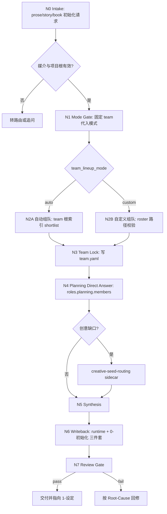
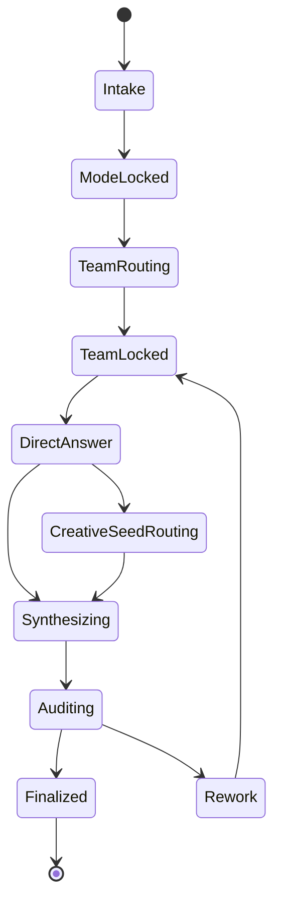
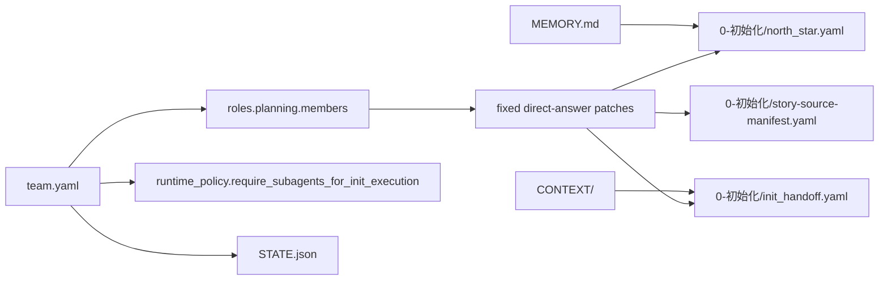

# story 0-初始化

`story-init` 是 `story2026` 小说项目初始化入口。它只负责把一个 prose/story/book 项目起盘为可继续进入 `1-设定` 与 `2-卷章规划` 的稳定运行时，不负责直接生成后续阶段主稿。

## Context Loading Contract

- 每次调用本技能时，必须同时加载同目录 `CONTEXT.md`。
- 每次调用本技能时，必须同时识别并加载同目录 `types/` 中选中的类型包（单选或多选）。
- 若已绑定项目根 `projects/story/<项目名>/`，必须继续加载项目根 `MEMORY.md`，再按需加载项目根 `CONTEXT/` 中与初始化相关的文件。
- `CONTEXT.md` 只承载初始化经验、返工顺序与 team 选型启发，不得覆盖本 `SKILL.md` 的入口、路由、输出、`team.yaml` 真源与写回位点。
- 若 `.agents/skills/story/scripts/init_project.py`、模板或分区文件与本合同冲突，先以本 `SKILL.md` 裁决，再回修分区或脚本。

## Scope

### When To Use

- 用户要求初始化小说、网文、长篇故事、书、novel、book、story2026 项目。
- 需要新建或重初始化 `projects/story/<项目名>/`。
- 需要先锁团队代入阵容，再通过 planning 固定题包直答产出初始化长期合同与阶段种子。
- 需要生成项目级 `team.yaml`、`MEMORY.md`、`STATE.json`、`CONTEXT/` 和 `0-初始化` 三件套。

### When Not To Use

- 用户要求初始化影片、电影、影视、视频或 AIGC film project；route to `.agents/skills/aigc/0-初始化/SKILL.md`。
- 已有稳定项目骨架，只需补写局部设定或查询状态；route to `story-resume` 或对应阶段技能。
- 当前任务是 `1-设定 / 2-卷章规划 / 3-初稿 / 4-润色 / review / 5-上下文回流` 的续跑。
- 用户只要求写正文、生成卡片、规划卷章或执行审查。

## Input Contract

Accepted input:

- 项目名或目标项目根。
- 小说/网文/书项目的题材、故事核、平台、受众、偏好、禁区或已有 brief。
- 用户明确的 `自动组队` 或 `自定义组队` 选择。
- 自定义 roster，必须引用 `.agents/skills/team/` 下的成员技能。
- 已有项目根中的 legacy `Init/*` 或旧初始化工件，作为证据而非当前真源。

Required input:

- 可解析的 `projects/story/<项目名>/` 目标。
- 媒介必须为 prose/story/book/novel，而非 film/video/aigc。
- `team_lineup_mode` 必须能锁定为 `auto` 或 `custom`；未给 roster 时默认可进入 `auto` 候选。

Optional input:

- `decision_owner`、`mode_source`、平台、读者承诺、题材走廊、人物压力、世界约束、已有设定包、用户长期偏好。
- 用于创意缺口补强的题材、反套路、市场定位或卖点方向。

Reject or clarify when:

- 用户媒介意图在小说与影视之间冲突，且无法从上下文判断 canonical runtime。
- 用户要求跳过 `team.yaml` 或要求把团队治理写入多个并行 manifest。
- 用户要求恢复快速模式、问卷模式或旧三模式作为并行主路径。
- 自定义 roster 越出 `.agents/skills/team/`。
- 重初始化会覆盖不可再生故事主源，而用户没有明确授权。

## Mode Selection

`init_mode` 固定为 `team代入模式`。本技能只允许一个主模式和两个编组子路径：

| selector | trigger | route | fallback |
| --- | --- | --- | --- |
| `auto` | 用户要求自动组队，或没有给 roster | 读取 `.agents/skills/team/SKILL.md + CONTEXT.md` 后 shortlist 并写 `team.yaml` | 不回退问卷 |
| `custom` | 用户给出 roster、角色指定或 team skill 路径 | 校验成员路径后写 `team.yaml` | 不接受 team 根外成员 |

## Reference Loading Guide

| 场景 | 读取文件 |
| --- | --- |
| 初始化模式、team 真源、固定题包与 subagent 要求 | `references/mode-and-team-contract.md` |
| 项目骨架、`STATE.json`、项目 `MEMORY.md` 与 `CONTEXT/` 写回边界 | `references/runtime-and-handoff-contract.md` |
| planning 固定题包直答、创意缺口与下游 unknowns | `references/prompt-packet-contract.md` |
| 创意缺口需要题材、反套路、市场或卖点路由 | `references/creative-seed-routing/module-spec.md`，再由该模块按需读取内部 leaf docs |
| 需要执行完整初始化拓扑 | `steps/init-workflow.md` |
| 需要判定首次初始化、重初始化、自动组队或自定义组队 | `types/init-type-map.md` |
| 写回前验收、review provider、充分性审计 | `review/init-review-gate.md` |
| 输出结构样板 | `templates/output-template.md`、`templates/*.template.yaml`、`templates/project-memory.template.md` |
| 机械初始化入口或脚本边界 | `scripts/README.md` 与 `.agents/skills/story/scripts/init_project.py` |
| 可复用初始化启发 | `knowledge-base/init-heuristics.md` |
| 产品侧入口元数据 | `agents/openai.yaml` |

## Visual Maps

## Execution Contract

1. `N0 Intake`
   - 判定首次初始化、重初始化或应转去其他 story 阶段。
   - 加载本 `SKILL.md + CONTEXT.md`，并在项目存在时加载项目 `MEMORY.md + CONTEXT/`。
2. `N1 Mode Gate`
   - 固定 `init_mode = team代入模式`。
   - 锁定 `team_lineup_mode = auto|custom`、`mode_source`、`decision_owner`。
3. `N2 Team Routing`
   - `auto` 先读 `.agents/skills/team/SKILL.md + CONTEXT.md`，再 shortlist。
   - `custom` 校验 roster 均位于 `.agents/skills/team/`。
4. `N3 Team Lock`
   - 在综合任何 `north_star` 前先写或更新项目根 `team.yaml`。
5. `N4 Planning Direct Answer`
   - 由 `roles.planning.members` 执行固定题包直答。
   - 仓库合同要求真实 subagents；若更高优先级 system/developer/tool/user 策略阻断真实 dispatch，必须阻塞或显式报告降级来源、原路径、实际路径和未启动成员。
6. `N5 Synthesis`
   - 汇总用户输入、team patch、planning 直答和创意缺口 sidecar。
   - 更适合下游解决的问题写入 `unknowns`，不得用初始化问卷强行补完。
7. `N6 Writeback`
   - 一次性同步项目骨架、`STATE.json`、`team.yaml`、`MEMORY.md`、`CONTEXT/` 与 `0-初始化` 三件套。
8. `N7 Review Gate`
   - 加载 `review/init-review-gate.md`，执行充分性审计后交付。

## Field Mapping

| field_id | owner | canonical slot | validation gate |
| --- | --- | --- | --- |
| `FIELD-INIT-01` | `SKILL.md` + `references/mode-and-team-contract.md` | `init_mode / team_lineup_mode` | 单一主模式，只有 `auto/custom` 分支 |
| `FIELD-INIT-02` | `references/mode-and-team-contract.md` | `team.yaml` | 团队治理唯一真源，不存在并行 manifest |
| `FIELD-INIT-03` | `references/prompt-packet-contract.md` | `roles.planning.members` 固定题包直答 | planning kickoff owner 与 subagent 证据明确 |
| `FIELD-INIT-04` | `references/runtime-and-handoff-contract.md` | `STATE.json + MEMORY.md + CONTEXT/ + 0-初始化/*` | runtime、handoff、provenance 同步 |
| `FIELD-INIT-05` | `review/init-review-gate.md` | sufficiency audit | 下游唯一下一入口可判断 |

## Root-Cause Execution Contract

失败时按以下链路上溯：

`Symptom -> Direct Technical Cause -> Section Owner -> Source Contract -> Meta Rule Source`

优先修复顺序：

1. 媒介路由错误：回到 `Scope`、registry routes 与 `agents/openai.yaml`。
2. 模式漂移或旧问卷回潮：回到 `references/mode-and-team-contract.md`。
3. `team.yaml` 不唯一或 roster 越界：回到 `references/mode-and-team-contract.md` 与 `.agents/skills/team/` 根索引。
4. 固定题包直答未执行或 provenance 缺失：回到 `references/prompt-packet-contract.md`。
5. 目录骨架、`STATE.json`、`MEMORY.md` 或 `CONTEXT/` 不同步：回到 `references/runtime-and-handoff-contract.md`。
6. 创意资料散点直连：回到 `references/creative-seed-routing/module-spec.md`。
7. 交付验收不明确：回到 `review/init-review-gate.md` 与 `templates/output-template.md`。
8. 脚本只改了一半：回到 `.agents/skills/story/scripts/init_project.py`，脚本只能做机械落盘，不替代 LLM 初始化判断。

## Output Contract

- Required output:
  - 项目根：`team.yaml`、`STATE.json`、`MEMORY.md`、`CHANGELOG.md`、`CONTEXT/`。
  - 初始化目录：`0-初始化/north_star.yaml`、`0-初始化/story-source-manifest.yaml`、`0-初始化/init_handoff.yaml`。
  - 验收证据：team provenance、固定题包直答来源、runtime 同步状态、下一入口建议。
- Output format:
  - 结构化 YAML/JSON/Markdown 项目工件，按 `templates/` 样板渲染。
  - 用户闭环用简短中文摘要，包含已写文件、验证结果、下一阶段入口。
- Output path:
  - 仅写入 `projects/story/<项目名>/` 及其标准子路径。
  - 不写入 `projects/aigc/`，不生成旧 `.webnovel/tasks/`，不生成旧 `Init/*` 平行真源。
- Naming convention:
  - 项目运行时路径使用 `projects/story/<项目名>/`。
  - 初始化主工件固定为 `team.yaml`、`STATE.json`、`MEMORY.md`、`0-初始化/north_star.yaml`、`0-初始化/story-source-manifest.yaml`、`0-初始化/init_handoff.yaml`。
  - `STATE.json.workflow_runtime.execution_state.stage_progress` 中初始化阶段标识为 `0-init`，`latest_command` 为 `story-init`。
- Completion gate:
  - `team_lineup_mode` 已锁定。
  - `team.yaml` 存在且声明 `.agents/skills/team/` 为唯一选人范围。
  - `MEMORY.md` 和项目 `CONTEXT/` 存在。
  - `STATE.json.paths` 与实际目录骨架一致。
  - `0-初始化` 三件套存在，且 team provenance 与 `STATE.json` 一致。
  - `review/init-review-gate.md` 的 sufficiency verdict 为 `pass` 或带明示非阻断 follow-up 的 `pass_with_followups`。
