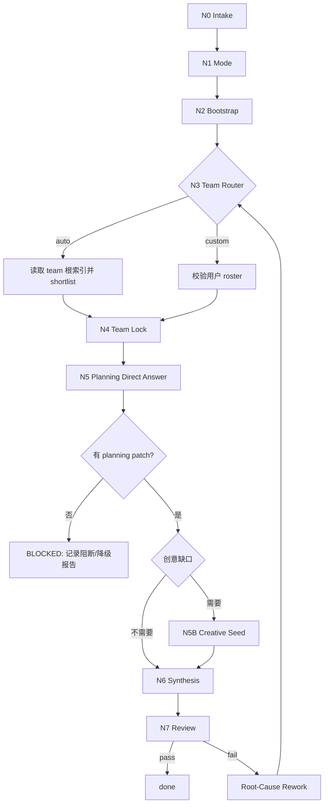

# Init Workflow

本文件拥有 `story-init` 的思行一体化执行拓扑。根 `SKILL.md` 只保留入口路由和门禁摘要。

## Business Requirement Analysis

| slot | value |
| --- | --- |
| `business_goal` | 初始化或重初始化小说项目，使其具备 team 真源、runtime 状态、项目记忆和下游阶段种子 |
| `business_object` | `projects/story/<项目名>/` 目录与其中的 YAML/JSON/Markdown 工件 |
| `constraint_profile` | 单模式、team 真源、planning subagents、runtime 同步、项目记忆、媒介路由 |
| `success_criteria` | 五件套和 `0-初始化` 三件套存在且 provenance 一致 |
| `non_goals` | 影视初始化、后续阶段主稿、旧问卷/快速模式 |
| `complexity_source` | auto/custom 分支、subagent 证据、创意缺口 sidecar、状态写回汇流 |
| `topology_fit` | 串行主干 + team 分支 + 创意 sidecar + 单点 review 汇流 |

## Node Network

| node_id | objective | inputs | actions | evidence | route_out | gate |
| --- | --- | --- | --- | --- | --- | --- |
| `N0-INTAKE` | 判定任务是否归属小说初始化 | 用户请求、项目路径、媒介词 | 区分 story 与 aigc film，解析项目根 | `route_decision` | `N1-MODE` 或转路由 | prose/story/book 明确 |
| `N1-MODE` | 锁定单一初始化模式 | `SKILL.md`、`types/init-type-map.md` | 固定 `team代入模式`，判定 `auto/custom` | `mode_context` | `N2-BOOTSTRAP` | `team_lineup_mode` 可确定 |
| `N2-BOOTSTRAP` | 建立运行时骨架 | `references/runtime-and-handoff-contract.md` | 创建目录、`MEMORY.md`、`CONTEXT/`、初始状态容器 | `runtime_manifest` | `N3-TEAM-ROUTER` | 目录与 `STATE.json.paths` 可同步 |
| `N3-TEAM-ROUTER` | 形成 team patch | `.agents/skills/team/SKILL.md + CONTEXT.md` 或用户 roster | auto shortlist 或 custom 校验 | `team_manifest_patch` | `N4-TEAM-LOCK` | 成员均在 `.agents/skills/team/` |
| `N4-TEAM-LOCK` | 先锁唯一 team 真源 | `references/mode-and-team-contract.md` | 写或覆盖刷新 `team.yaml` | `team.yaml` | `N5-DIRECT-ANSWER` | `team.yaml` 是唯一 team 真源 |
| `N5-DIRECT-ANSWER` | 执行 planning 固定题包直答 | `roles.planning.members`、`references/prompt-packet-contract.md` | 启动真实 subagents；若被阻断则生成阻断报告并停止 synthesis | `direct_answer_report` 或 `subagent_block_report` | 有 planning patch 才能进 `N5B-CREATIVE-SEED` 或 `N6-SYNTHESIS`；仅有阻断报告则进 `BLOCKED` | 有可聚合 planning patch |
| `N5B-CREATIVE-SEED` | 补创意缺口 | `references/creative-seed-routing/module-spec.md` | 按模块路由读取 leaf docs，产出最小 creative patch | `creative_mandate_patch` | `N6-SYNTHESIS` | 不改 team/mode 真源 |
| `N6-SYNTHESIS` | 聚合初始化工件 | 用户输入、team、直答、runtime patch | 写 `north_star`、source manifest、handoff、STATE、MEMORY | `artifact_patch_set` | `N7-REVIEW` | provenance 分层一致 |
| `N7-REVIEW` | 执行充分性审计 | `review/init-review-gate.md` | 检查输出、路径、下一入口和阻断项 | `sufficiency_verdict` | done 或返工 | `pass` 或 `pass_with_followups` |

## Mermaid Topology

## Failure Loops

- 媒介误判：回 `N0-INTAKE`，必要时转 `aigc-init`。
- team 越界：回 `N3-TEAM-ROUTER`。
- `team.yaml` 缺失或滞后：回 `N4-TEAM-LOCK`。
- subagent 阻断未报告：回 `N5-DIRECT-ANSWER`。
- 只有 subagent 阻断报告但没有 planning patch：进入 `BLOCKED`，不得继续 synthesis。
- `STATE.json.paths` 与目录不一致：回 `N2-BOOTSTRAP` 与 `N6-SYNTHESIS`。
- 交付缺工件：回 `N6-SYNTHESIS`。
