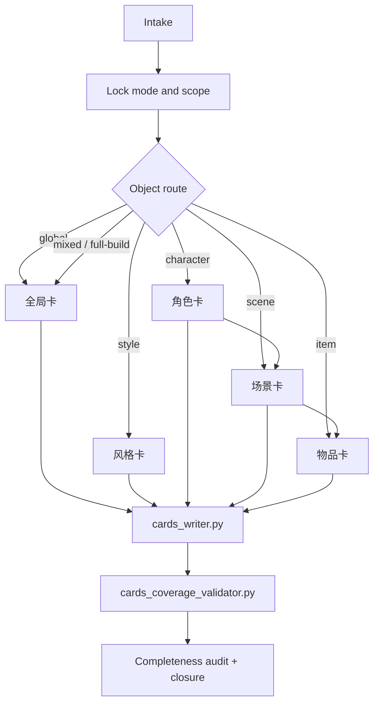
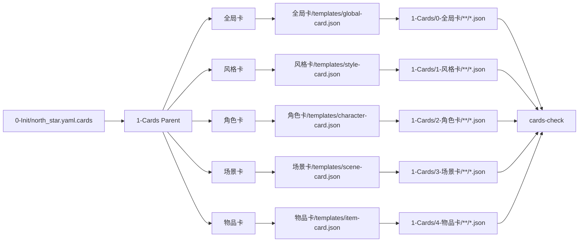
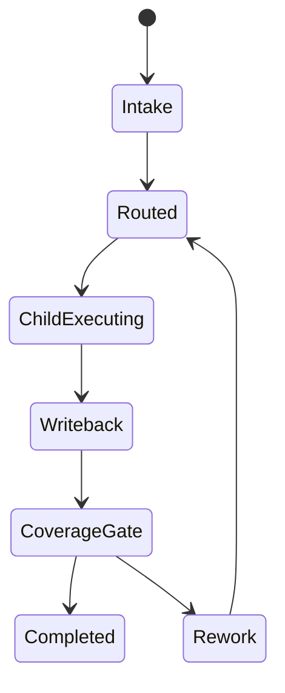

# 1-Cards

## Context Loading Contract

- 每次调用本技能时，必须同时加载同目录 `CONTEXT.md`。
- 根级 `CONTEXT.md` 只承载 cards 体系经验、返工顺序与成功/失败模式，不得覆盖本 `SKILL.md` 的子技能路由、写回合同与 gate。
- 若任一子技能 `SKILL.md / CONTEXT.md` 缺失，必须先补齐该子技能包基线，再继续 cards 执行。

## Overview

`1-Cards` 现在是 `story2026` 的 cards 父 skill。

它不再在根层维护对象私有 `references/` 或 `templates/`，而是直接治理五个直连子技能包：

1. `全局卡`
2. `风格卡`
3. `角色卡`
4. `场景卡`
5. `物品卡`

当前阶段的 canonical truth 分工固定为：

- `0-Init/north_star.yaml`
  - 长期共同约束与世界/人物/对象总体边界。
- `1-Cards/**/*.json`
  - 正式对象真源。
- `1-Cards/SKILL.md`
  - 父层路由、并发/串行裁决、shared writeback/gate、系统完善度裁决。
- `全局卡 / 风格卡 / 角色卡 / 场景卡 / 物品卡`
  - 各自对象类型的思行网络、字段成立条件、正式 payload 决策。

一句话裁决：

- 父层负责总线与闭环。
- 子技能负责对象裁决与对应 card JSON 产出。
- 对象私有模板与合同都收束在各自子技能包内部。

## Parent Positioning

### 父层拥有

- 任务模式判定：`full-build / incremental-writeback / coverage-repair / source-contract-fix`
- 对象路由裁决与直连子技能调度
- 并发/串行策略裁决
- shared templates / writer / validator / tests 的统一契约
- 最终 writeback、coverage gate、系统完善度评估
- source-layer migration 与跨子技能一致性修复

### 父层不拥有

- 代替 `全局卡` 判断世界观、规则体系、年代约束、文化艺术、科技/武功与金手指
- 代替 `风格卡` 判断整书风格契约、读者承诺与审美轴
- 代替 `角色卡` 判断角色桶、成长、关系与专属物接口
- 代替 `场景卡` 判断场景功能、规则、危险与复用策略
- 代替 `物品卡` 判断剧情杠杆、归属、代价与专属适配
- 把五个子技能再压回根层 `references/` 或 `templates/`

## Governed Child Skills

| child_skill | canonical owner | 正式输出 |
| --- | --- | --- |
| `全局卡` | 世界观、`rule_system`、年代约束、文化艺术、科技/武功、金手指、`global_contract_refs` | `1-Cards/0-全局卡/**/*.json` |
| `风格卡` | 整书风格契约、`reader_promise`、`aesthetic_axes`、`style_system`、`style_gate` | `1-Cards/1-风格卡/**/*.json` |
| `角色卡` | 角色对象真源、关系边、成长时间线、`exclusive_item_hooks` 输入接口、角色关系图谱 | `1-Cards/2-角色卡/**/*.json` + `1-Cards/2-角色卡/角色关系图谱.md` |
| `场景卡` | 场景对象真源、规则与风险、`scene_links`、复用策略 | `1-Cards/3-场景卡/**/*.json` |
| `物品卡` | 物品对象真源、归属链、使用规则、代价、专属适配 | `1-Cards/4-物品卡/**/*.json` |

硬规则：

1. 没有 `水月 / 镜花` 这种中间 parent；`1-Cards` 直接调五个子技能。
2. 五个子技能都必须输出正式 `.json` card payload；其中 `角色卡` 额外允许一个正式图谱 side output：`1-Cards/2-角色卡/角色关系图谱.md`。
3. 根层不再维护对象私有 `references/` 或 `templates/`。
4. 技能包名称不承载调度语义；是否串行或并发只由依赖关系和父层路由决定。

## Dispatch Policy

- 默认允许并发：
  - 全局卡与风格卡。
  - 风格卡与其他四个对象子技能。
  - 单对象请求。
  - 多个彼此独立的增量修复。
  - 不共享同一 writeback 决议的 source-contract-fix。
- 必须串行：
  - `mixed` 请求。
  - `full-build`。
  - 任何需要先稳定角色接口、再稳定场景规则、最后收束物品代价的请求。
- 父层固定裁决：
  - “名称无序号”不代表“永远并发”。
  - “允许并发”只在对象间不存在真实上游依赖时生效。

## Shared Canonical Sources

- `.agents/skills/story/scripts/cards_writer.py`
- `.agents/skills/story/scripts/cards_coverage_validator.py`
- `.agents/skills/story/scripts/story.py`
- `全局卡/SKILL.md + CONTEXT.md + templates/global-card.json + references/golden-finger-templates.md`
- `风格卡/SKILL.md + CONTEXT.md + templates/style-card.json`
- `角色卡/SKILL.md + CONTEXT.md + templates/character-card.json`
- `场景卡/SKILL.md + CONTEXT.md + templates/scene-card.json`
- `物品卡/SKILL.md + CONTEXT.md + templates/item-card.json`

真源分工：

- 本 `SKILL.md`
  - 父层 topology、dispatch、writeback、gate、migration。
- 子技能 `SKILL.md`
  - 对象类型的思行网络与输出合同。
- 子技能包内 templates
  - 各自 card JSON skeleton。
- writer / validator
  - 运行时落盘与审计闭环。

## Canonical Output Root

- `1-Cards` 的正式业务落盘根目录固定为 `projects/story/<项目名>/1-Cards/`
- 五类正式 card JSON 必须写到：
  - `projects/story/<项目名>/1-Cards/0-全局卡/**/*.json`
  - `projects/story/<项目名>/1-Cards/1-风格卡/**/*.json`
  - `projects/story/<项目名>/1-Cards/2-角色卡/**/*.json`
  - `projects/story/<项目名>/1-Cards/3-场景卡/**/*.json`
  - `projects/story/<项目名>/1-Cards/4-物品卡/**/*.json`
- 角色体系额外正式 side output 固定为：
  - `projects/story/<项目名>/1-Cards/2-角色卡/角色关系图谱.md`
- 不得把技能目录、临时 sidecar 或 repo 根层模板当成项目业务输出根。

## Business Requirement Analysis Contract

| analysis_slot | 当前结论 |
| --- | --- |
| `business_goal` | 把 `0-Init` 交出的世界、风格与对象种子收敛为可长期维护的 cards 体系，并通过五个直连子技能把全局/风格/角色/场景/物品正式落盘。 |
| `business_object` | `projects/story/<项目名>/0-Init/north_star.yaml`、`projects/story/<项目名>/0-Init/init_handoff.yaml`、`projects/story/<项目名>/1-Cards/**/*.json`、cards writer/validator/tests、五个 child skill package。 |
| `constraint_profile` | 父层必须保持单一总线；子技能必须直接输出 `.json`；正式 writeback 只能走 shared writer；coverage gate 必须覆盖 trace、单卡结构、规模密度与 child-skill parity。 |
| `success_criteria` | 五个子技能都能独立解释自己的对象成立条件，writer/validator/test 全部识别新子技能路径，cards 系统可通过定向 gate。 |
| `non_goals` | 不把 cards 真源挪回 `references/`；不新造第二套平行 schema；不把项目级对象真源落回技能目录。 |
| `complexity_source` | 复杂度来自父子技能分工、shared runtime parity、trace 合同、长篇密度门禁，而不是单张卡的 prose 丰富度。 |
| `topology_fit` | `intake -> mode lock -> child dispatch -> parallel or serial by dependency -> writeback -> coverage gate -> completeness audit -> closure` |
| `step_strategy` | 父层只做总线与闭环，详细对象判断下沉到五个直连 child skills。 |

## Visual Maps







## Context Preload (Mandatory)

固定加载顺序：

1. `.agents/skills/story/SKILL.md + CONTEXT.md`
2. 本 `SKILL.md + CONTEXT.md`
3. `0-Init/north_star.yaml`
4. `0-Init/init_handoff.yaml`
5. `team.yaml`
6. `全局卡/SKILL.md + CONTEXT.md`
7. `风格卡/SKILL.md + CONTEXT.md`
8. `角色卡/SKILL.md + CONTEXT.md`
9. `场景卡/SKILL.md + CONTEXT.md`
10. `物品卡/SKILL.md + CONTEXT.md`
11. 命中的子技能包本地 `templates/*.json`
12. 命中的子技能包 `references/*.md`
13. 既有 `1-Cards/**/*.json`

## Total Input Contract

### 必需输入

- `0-Init/north_star.yaml`
- `0-Init/init_handoff.yaml`

### 推荐输入

- `team.yaml`
- 既有 `1-Cards/0-全局卡/**/*.json`
- 既有 `1-Cards/1-风格卡/**/*.json`
- 既有 `1-Cards/2-角色卡/**/*.json`
- 既有 `1-Cards/3-场景卡/**/*.json`
- 既有 `1-Cards/4-物品卡/**/*.json`

### 硬规则

1. 不得把 `planning_seed` 直接当对象 canonical。
2. 全量建卡至少包含 `全局卡 + 风格卡 + 角色卡 + 场景卡 + 物品卡`。
3. 角色、场景、物品的依赖链固定顺序：`角色 -> 场景 -> 物品`。
3. 物品卡不得绕过角色卡与场景卡的稳定接口直接发明专属逻辑。
4. 所有正式写回都必须经 `cards_writer.py`。

## Route Contract

| request_shape | target_child | route_reason |
| --- | --- | --- |
| 世界观、规则体系、年代、文化艺术、科技、武功、金手指、总设定 | `全局卡` | 全局卡负责整书级稳定设定与金手指合同 |
| 风格、读者承诺、审美轴、风格禁区、整体气质 | `风格卡` | 风格卡负责整书风格契约与下游风格 gate |
| 人物、关系、弧光、专属物接口 | `角色卡` | 角色是物品专属适配的强上游 |
| 地点、规则、危险、常驻空间、复用策略 | `场景卡` | 场景负责“谁来做什么、代价是什么” |
| 武器、线索、重要叙事物、遗物、代价、归属 | `物品卡` | 物品负责剧情杠杆、归属链和成本 |
| 多个彼此独立的单对象请求 | `全局卡 / 风格卡 / 角色卡 / 场景卡 / 物品卡` 可并发 | 互不共享 writeback 决议时允许并发 |
| mixed 请求 | `全局卡 || 风格卡 || (角色卡 -> 场景卡 -> 物品卡)` | 全局卡与风格卡可并发，后三者存在依赖链 |
| full-build | `全局卡 || 风格卡 || (角色卡 -> 场景卡 -> 物品卡)` | 全局卡与风格卡独立；后三者存在强上游依赖 |

## Thinking-Action Network

| step_id | objective | actions | evidence | fail_code |
| --- | --- | --- | --- | --- |
| S1 | 锁定任务模式 | 判定 `full-build / incremental / repair / source-contract-fix` | `mode` | `FAIL-CD-MODE-01` |
| S2 | 锁定对象路由 | 把请求映射到 1 个或多个 child skill | `target_children` | `FAIL-CD-ROUTE-01` |
| S3 | 读取上游真源 | 读取 `north_star.yaml / init_handoff.yaml / 既有 Cards` | `input_trace` | `FAIL-CD-INPUT-01` |
| S4 | 调度 child skill | 进入命中的 child `SKILL.md + CONTEXT.md` | `child_dispatch` | `FAIL-CD-CHILD-01` |
| S5 | shared writeback | 调用 `cards_writer.py` 落正式 JSON | `write_report` | `FAIL-CD-WRITE-01` |
| S6 | coverage gate | 调用 `cards-check` 验证 trace、结构、密度 | `gate_report` | `FAIL-CD-GATE-01` |
| S7 | completeness audit | 评估 templates/writer/validator/tests 是否与 child skill 路由一致 | `completeness_verdict` | `FAIL-CD-COMP-01` |
| S8 | closure | 输出 `根因位置 + 立即修复 + 系统预防修复` | `closure` | `FAIL-CD-CLOSE-01` |

## One-Shot Output Contract

父层最终只允许向用户与运行时交付一套收束结果：

1. 正式 `1-Cards/**/*.json`
2. `cards-check` gate 结论
3. 系统完善度评估
4. `root cause location + immediate fix + systemic prevention fix`

禁止：

- 并列交付多套未收束 payload
- 让子技能各自维护平行索引真源
- 仅修改文档，不同步 writer / validator / tests

## System Completeness Audit (Mandatory)

每次非平凡重构后，父层必须评估 cards 系统至少这 6 项：

| dimension | 要求 | blocking signal |
| --- | --- | --- |
| `child-skill topology` | 全局/风格/角色/场景/物品五个模块已升格为直连 child skills | 仍存在 active `references/*-module` 业务真源 |
| `trace parity` | child-local template / writer / validator / tests 指向同一 child skill 路径 | 文档与脚本使用不同 route |
| `schema parity` | 正式卡、索引卡、validator 共享同一字段口径 | 单卡过不了 validator 或 validator 不检查新增 trace |
| `runtime parity` | `cards-write` 与 `cards-check` 都消费 child skill 合同 | 只改 writer 或只改 validator |
| `density gate` | 覆盖率仍同时检查数量、结构、规则刚性 | 只剩文件存在检查 |
| `cross-skill consistency` | 角色接口、场景规则、物品代价之间的上游关系清晰 | 物品绕过角色/场景直接自说自话 |

## Root-Cause Execution Contract

非平凡问题必须上溯：

`Symptom -> Direct Technical Cause -> Rule Source -> Meta Rule Source -> Fix Landing Points`

本阶段固定优先级：

1. 父技能路由与 child ownership
2. shared template / writer / validator / tests
3. child skill 合同
4. 单张 card 内容

收尾固定返回：

- `根因位置`
- `立即修复`
- `系统预防修复`

## Field Master Table

| field_id | type | slot | owner | fail_code |
| --- | --- | --- | --- | --- |
| `FIELD-CD-IDN-01` | IDN | `meta.skill_id / meta.source_skill_id` | parent + child template | `FAIL-CD-IDN-01` |
| `FIELD-CD-ROUTE-01` | STR | `content.module_route` | parent + writer | `FAIL-CD-ROUTE-01` |
| `FIELD-CD-TRACE-01` | CTX | `content.loaded_references` | child + writer + validator | `FAIL-CD-TRACE-01` |
| `FIELD-CD-WRITE-01` | BHV | `content.writeback_plan` | parent + writer | `FAIL-CD-WRITE-01` |
| `FIELD-CD-MAT-00` | MAT | `1-Cards/0-全局卡/**/*.json` | `全局卡` | `FAIL-CD-MAT-00` |
| `FIELD-CD-MAT-01` | MAT | `1-Cards/1-风格卡/**/*.json` | `风格卡` | `FAIL-CD-MAT-01` |
| `FIELD-CD-MAT-02` | MAT | `1-Cards/2-角色卡/**/*.json` | `角色卡` | `FAIL-CD-MAT-02` |
| `FIELD-CD-MAT-03` | MAT | `1-Cards/3-场景卡/**/*.json` | `场景卡` | `FAIL-CD-MAT-03` |
| `FIELD-CD-MAT-04` | MAT | `1-Cards/4-物品卡/**/*.json` | `物品卡` | `FAIL-CD-MAT-04` |
| `FIELD-CD-GATE-01` | CST | `gate_summary.status` | validator | `FAIL-CD-GATE-01` |

## Step To Field Mapping

| step_id | field_id | intent | rework_entry |
| --- | --- | --- | --- |
| `S1` | `FIELD-CD-IDN-01` | 锁定本轮 cards 身份与模式 | 回到模式判定 |
| `S2` | `FIELD-CD-ROUTE-01` | 锁定 child skill 路由 | 回到对象路由 |
| `S3` | `FIELD-CD-TRACE-01` | 锁定上游输入与加载链 | 回到输入读取 |
| `S4` | `FIELD-CD-MAT-00/01/02/03/04` | 进入具体 child skill 产出正式 payload | 回 child skill |
| `S5` | `FIELD-CD-WRITE-01` | 落 shared writeback | 回 writer |
| `S6` | `FIELD-CD-GATE-01` | coverage gate 通过 | 回 validator |
| `S7` | `FIELD-CD-TRACE-01` | 完成 trace/runtime parity 审计 | 回 completeness audit |
| `S8` | `FIELD-CD-GATE-01` | 输出闭环 | 回 closure |

## Field Quality Mapping

| field_id | quality_dimension | pass_condition | rework_entry |
| --- | --- | --- | --- |
| `FIELD-CD-IDN-01` | identity parity | root skill 与 child skill 身份不冲突 | 回 template/writer |
| `FIELD-CD-ROUTE-01` | route parity | `module_route` 精确指向命中 child skill | 回 route / writer |
| `FIELD-CD-TRACE-01` | trace completeness | `loaded_references` 至少覆盖 root + child + child-local template | 回 child contract / writer / validator |
| `FIELD-CD-WRITE-01` | writeback hygiene | mode、target_paths、boundary_notes 完整 | 回 writer |
| `FIELD-CD-MAT-00` | global completeness | 全局卡具备世界观/规则/年代/文化/力量/金手指 | 回 `全局卡` |
| `FIELD-CD-MAT-01` | style completeness | 风格卡具备承诺/审美轴/风格系统 | 回 `风格卡` |
| `FIELD-CD-MAT-02` | character completeness | 角色卡具备关系/成长/接口 | 回 `角色卡` |
| `FIELD-CD-MAT-03` | scene completeness | 场景卡具备功能/规则/复用 | 回 `场景卡` |
| `FIELD-CD-MAT-04` | item completeness | 物品卡具备归属/代价/专属适配 | 回 `物品卡` |
| `FIELD-CD-GATE-01` | system readiness | `cards-check` 无 blocking finding | 回 validator + child repair |

## Migration Contract

### Retired Source Layer

- 根层 `references/`
- 根层 `templates/`

这些目录不再承载 cards 业务真源。

### New Structure

```text
.agents/skills/story/1-Cards/
├── SKILL.md
├── CONTEXT.md
├── 全局卡/
│   ├── SKILL.md
│   ├── CONTEXT.md
│   ├── references/golden-finger-templates.md
│   └── templates/global-card.json
├── 风格卡/
│   ├── SKILL.md
│   ├── CONTEXT.md
│   └── templates/style-card.json
├── 角色卡/
│   ├── SKILL.md
│   ├── CONTEXT.md
│   └── templates/character-card.json
├── 场景卡/
│   ├── SKILL.md
│   ├── CONTEXT.md
│   └── templates/scene-card.json
├── 物品卡/
│   ├── SKILL.md
│   ├── CONTEXT.md
│   └── templates/item-card.json
```

## Completion Gate

- 父 skill 已只保留 orchestrator 职责。
- 全局/风格/角色/场景/物品五个模块已升格为直连 child skills。
- template / writer / validator / tests 都已切到 child skill trace。
- 覆盖率 gate 仍保留结构、数量、规则刚性与 trace parity 检查。
- 不存在仍把 `references/*-module` 当 active business truth 的路径。
