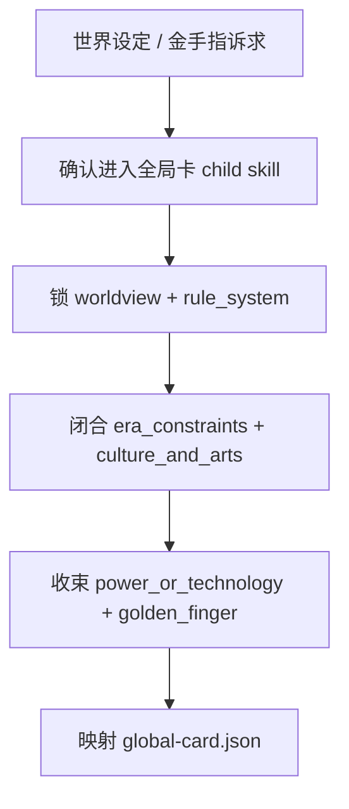
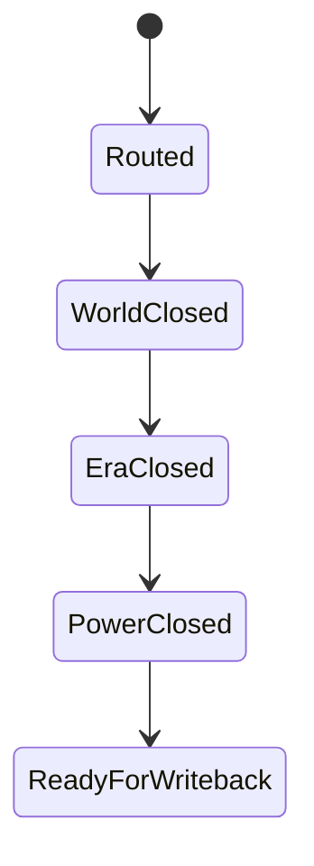

# 全局卡

## Context Loading Contract

- 每次调用本技能时，必须同时加载同目录 `CONTEXT.md`。
- 本技能只负责全局设定判断与正式全局卡 payload，不替父层承担总线路由与最终 gate。
- 金手指相关判断必须同时引用 `references/golden-finger-templates.md`，不得临时即兴发明一套外挂合同。
- 势力/力量/世界规则相关判断可按需参考 `.agents/skills/story_backup/templates/worldbuilding/{world-rules,faction-systems,power-systems}.md`；这些文件是跨阶段共享工法，不是本技能的本地 canonical truth。
- 冲突优先级：用户显式请求 > 仓库 `AGENTS.md` > `1-Cards/SKILL.md` > 本 `SKILL.md` > 本 `CONTEXT.md`。

## Overview

`全局卡` 是 `1-Cards` 的直连 child skill，负责把整书级稳定设定收束为正式全局卡 JSON。

它必须直接产出：

- `worldview`
- `rule_system`
- `era_constraints`
- `culture_and_arts`
- `power_or_technology`
- `golden_finger`
- `global_contract_refs`

它不负责：

- 用风格卡代替世界设定卡
- 用角色卡代替力量体系或金手指合同
- 父层 mixed/full-build 总路由

硬规则：

1. 金手指是全局卡的高优先级槽位，不得一笔带过。
2. 如果作品明确无金手指，也必须显式写成“无金手指”合同，而不是省略该字段。
3. 金手指强度、代价、升级路径与反制方式，必须显式回链 `references/golden-finger-templates.md`。

## Reference Loading Contract

固定加载：

1. `references/golden-finger-templates.md`
2. `0-Init/north_star.yaml`
3. `0-Init/init_handoff.yaml`
4. 既有 `1-Cards/0-全局卡/**/*.json`

按需推荐加载：

5. `.agents/skills/story_backup/templates/worldbuilding/world-rules.md`
6. `.agents/skills/story_backup/templates/worldbuilding/faction-systems.md`
7. `.agents/skills/story_backup/templates/worldbuilding/power-systems.md`

硬规则：

- 上述 `worldbuilding` 文件只提供共享 craft support，不得复制降格为本地 `references/`，也不得替代 `1-Cards/0-全局卡/**/*.json` 的正式真源地位。

## Business Requirement Analysis Contract

| analysis_slot | 当前结论 |
| --- | --- |
| `business_goal` | 把整书级世界设定、规则系统、年代边界、文化艺术、科技/武功与金手指压成可长期复用的全局卡。 |
| `business_object` | `1-Cards/0-全局卡/**/*.json`、全局索引、供风格卡/规划/正文/验证引用的总设定 ref。 |
| `constraint_profile` | 全局卡记录“这是什么世界、靠什么规则运行、主角拥有什么特殊优势以及要付什么代价”，不替具体角色或场景写局部戏。 |
| `success_criteria` | 全局卡能回答世界怎么运作、有哪些硬规则、时代与文化气味是什么、力量/科技边界在哪、金手指如何服务主线且付代价。 |
| `non_goals` | 不替风格卡写 prose 语感；不替角色卡写人物弧线；不替场景卡写单空间规则；不替物品卡写具体道具代价。 |
| `topology_fit` | `route confirm -> worldview closure -> era/culture closure -> power/golden-finger closure -> template mapping -> writeback payload` |

## Visual Maps

## Total Input Contract

- `0-Init/north_star.yaml`
- `0-Init/init_handoff.yaml`
- `references/golden-finger-templates.md`
- 既有 `1-Cards/0-全局卡/**/*.json`（若存在）

## Thinking-Action Network

| step_id | intent | required_output | fail_code | rework_entry |
| --- | --- | --- | --- | --- |
| `G1` | 确认当前真的是全局设定问题 | `module_route=story-cards > 全局卡/SKILL.md` | `FAIL-CD-GLOBAL-ROUTE` | 回父技能重路由 |
| `G2` | 锁世界观与规则骨架 | `worldview + rule_system` | `FAIL-CD-GLOBAL-WORLD` | 回世界观闭合 |
| `G3` | 闭合年代、文化与艺术约束 | `era_constraints + culture_and_arts` | `FAIL-CD-GLOBAL-ERA` | 回年代/文化 |
| `G4` | 收束力量边界与金手指合同 | `power_or_technology + golden_finger` | `FAIL-CD-GLOBAL-POWER` | 回力量/金手指 |
| `G5` | 输出全局契约引用 | `global_contract_refs` | `FAIL-CD-GLOBAL-REF` | 回契约引用 |
| `G6` | 映射模板 | `global-card payload` | `FAIL-CD-GLOBAL-TEMPLATE` | 回模板映射 |

## Qualified Generation Frame

一个合格的全局卡，至少要把下列问题压进正式 payload，而不是停留在世界观口号：

| output_slot | 至少要回答的问题 |
| --- | --- |
| `worldview` | 这是什么类型、什么尺度的世界？核心冲突源是什么？主角成长舞台长什么样？ |
| `rule_system` | 这个世界什么能做、什么不能做？能量/力量从哪里来？代价和铁律是什么？ |
| `era_constraints` | 当前时代锚点是什么？哪些历史/制度/地图限制决定了角色不能随便行动？ |
| `culture_and_arts` | 这个世界推崇什么、忌讳什么、如何说话、如何生活、如何审美？ |
| `power_or_technology` | 角色如何变强？资源怎么分布？越级为什么有限？后期如何防膨胀？ |
| `golden_finger` | 主角外挂具体做什么？何时触发？要付什么代价？为什么不会立刻无敌？ |
| `global_contract_refs` | 这套全局设定要回链哪些正式卡、模板与下游引用入口？ |

推荐生成顺序：

1. 先锁 `worldview`，把世界写成“舞台”而不是“百科”。
2. 再锁 `rule_system + era_constraints`，明确铁律、资源与地图推进限制。
3. 再锁 `culture_and_arts`，把长期气味写成剧情成本与行为边界。
4. 再锁 `power_or_technology`，把升级路径、资源分布、越级上限与膨胀阀门写清。
5. 最后锁 `golden_finger`，用功能、触发、代价、限制、反制、成长闭合外挂合同。

最小自检问题：

1. 这个世界的天然冲突从哪里来？
2. 主角的上升通道是什么？
3. 为什么主角不能直接跳到终局地图？
4. 这套规则问深一层时会不会塌？
5. 金手指是否在放大戏剧张力，而不是吃掉戏剧张力？

## One-Shot Output Contract

本技能只交付一套正式全局卡 payload：

- `1-Cards/0-全局卡/**/*.json`
- 可进入索引的 `global_contract_refs`
- 明确引用 `references/golden-finger-templates.md` 的 `golden_finger`

禁止交付平行 Markdown 总设定、散落式世界观草稿和未收束的外挂说明。

## Root-Cause Execution Contract

全局设定问题上溯顺序固定为：

`全局设定症状 -> 上游真源缺口 -> 本技能合同 -> 1-Cards 父层路由 -> 仓库 AGENTS`

优先修：

1. `worldview`
2. `rule_system + era_constraints`
3. `culture_and_arts + power_or_technology`
4. `golden_finger`
5. 模板映射

## Lite Field Mapping

| field_id | step_id | intent | required_output | fail_code | rework_entry |
| --- | --- | --- | --- | --- | --- |
| `FIELD-CD-GLOBAL-01` | `G1` | 全局路由正确 | `content.module_route` | `FAIL-CD-GLOBAL-ROUTE` | 回父技能 |
| `FIELD-CD-GLOBAL-02` | `G2-G3` | 世界与时代成立 | `worldview + rule_system + era_constraints + culture_and_arts` | `FAIL-CD-GLOBAL-ERA` | 回全局闭合 |
| `FIELD-CD-GLOBAL-03` | `G4` | 力量与金手指合同成立 | `power_or_technology + golden_finger` | `FAIL-CD-GLOBAL-POWER` | 回力量/金手指 |
| `FIELD-CD-GLOBAL-04` | `G5` | 下游引用成立 | `global_contract_refs` | `FAIL-CD-GLOBAL-REF` | 回契约引用 |
| `FIELD-CD-GLOBAL-05` | `G6` | 正式模板可写回 | `global-card payload` | `FAIL-CD-GLOBAL-TEMPLATE` | 回模板映射 |

## Completion Gate

- `worldview`、`rule_system`、`era_constraints` 已形成稳定总设定。
- `culture_and_arts` 与 `power_or_technology` 不是空名词，而能约束后续写作。
- `golden_finger` 已写清功能、限制、代价、成长和反制。
- `global_contract_refs` 能指向当前正式全局卡。
- 全局卡能解释冲突源、上升通道与地图推进限制，而不是只剩世界名词表。

## Dispatch Note

- 本技能包名称不承载串行语义。
- 全局卡默认可与 `风格卡` 并发执行，因为两者都主要消费初始化真源。
- 当父技能要求全量建卡时，默认采用 `全局卡 || 风格卡 || (角色卡 -> 场景卡 -> 物品卡)`。
