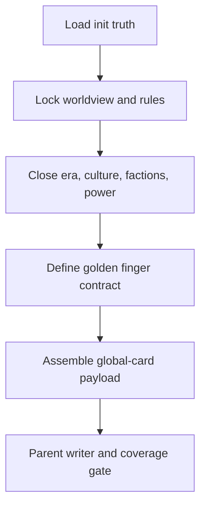

# Global Card Workflow

| step_id | action | evidence | gate |
| --- | --- | --- | --- |
| `G1` | 读取 init、父层 cards 路由与本地模板 | `input_trace` | trace 指向全局卡 |
| `G2` | 稳定世界观、规则体系与年代约束 | `world_note` | 不是空名词 |
| `G3` | 稳定文化艺术、势力与力量体系 | `system_note` | 可约束后续写作 |
| `G4` | 写金手指功能、限制、代价、成长与反制 | `golden_finger_note` | 合同闭合 |
| `G5` | 组装 payload 并交父层写回 | `global_payload` | coverage gate 通过 |
