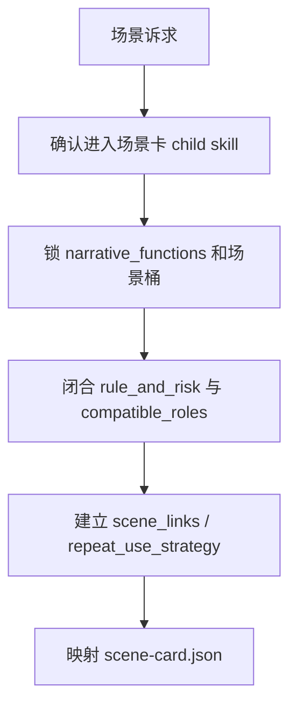
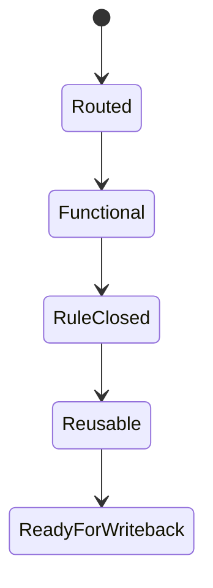

# 场景卡

## Context Loading Contract

- 每次调用本技能时，必须同时加载同目录 `CONTEXT.md`。
- 本技能只负责场景对象判断与正式场景卡 payload，不替父层承担总线路由与最终 gate。

## Overview

`场景卡` 负责把地点、空间、规则与危险收束为可写戏场景卡。

它必须直接产出：

- `narrative_functions`
- `rule_and_risk`
- `compatible_roles`
- `scene_links`
- `repeat_use_strategy`

## Business Requirement Analysis Contract

| analysis_slot | 当前结论 |
| --- | --- |
| `business_goal` | 把“可看场景”收束成“可写戏空间”。 |
| `business_object` | `Cards/3-场景卡/**/*.json`、`scene_links`、场景索引。 |
| `constraint_profile` | 规则先于奇观，复用先于一次性布景。 |
| `success_criteria` | 场景能回答谁来、做什么、代价是什么、为什么值得返场。 |

## Visual Maps

## Total Input Contract

- `0-Init/north_star.yaml`
- `0-Init/init_handoff.yaml`
- 既有 `Cards/3-场景卡/**/*.json`（若存在）
- mixed/full-build 时来自角色卡的进入者与关系压力

## Thinking-Action Network

| step_id | intent | required_output | fail_code | rework_entry |
| --- | --- | --- | --- | --- |
| `S1` | 确认当前真的是场景问题 | `module_route=story-cards > 场景卡/SKILL.md` | `FAIL-CD-SCENE-ROUTE` | 回父技能 |
| `S2` | 锁场景功能与桶位 | `narrative_functions + group` | `FAIL-CD-SCENE-FUNC` | 回场景功能 |
| `S3` | 闭合规则与危险 | `rule_and_risk + compatible_roles` | `FAIL-CD-SCENE-RULE` | 回规则闭合 |
| `S4` | 建立返场能力 | `scene_links + repeat_use_strategy` | `FAIL-CD-SCENE-REUSE` | 回复用策略 |
| `S5` | 映射模板 | `scene-card payload` | `FAIL-CD-SCENE-TEMPLATE` | 回模板映射 |

## One-Shot Output Contract

本技能只交付：

- 正式场景卡 payload
- 可进入索引的 `scene_links`
- 可验证的 `repeat_use_strategy`

## Root-Cause Execution Contract

场景问题优先检查：

1. 场景功能是否成立
2. 规则/危险/代价是否成立
3. 返场策略是否成立
4. 模板映射是否完整

## Lite Field Mapping

| field_id | step_id | intent | required_output | fail_code | rework_entry |
| --- | --- | --- | --- | --- | --- |
| `FIELD-CD-SCENE-01` | `S1` | 场景路由正确 | `content.module_route` | `FAIL-CD-SCENE-ROUTE` | 回父技能 |
| `FIELD-CD-SCENE-02` | `S2-S3` | 场景成立 | `narrative_functions + rule_and_risk + compatible_roles` | `FAIL-CD-SCENE-RULE` | 回规则闭合 |
| `FIELD-CD-SCENE-03` | `S4` | 返场能力成立 | `scene_links + repeat_use_strategy` | `FAIL-CD-SCENE-REUSE` | 回复用策略 |
| `FIELD-CD-SCENE-04` | `S5` | 正式模板可写回 | `scene-card payload` | `FAIL-CD-SCENE-TEMPLATE` | 回模板映射 |

## Completion Gate

- 场景不是布景板，而是可写戏空间。
- `rule_and_risk` 与 `compatible_roles` 成立。
- `scene_links` 与 `repeat_use_strategy` 可支撑长篇返场。

## Dispatch Note

- 本技能包名称不承载串行语义。
- 当请求只命中场景对象，或与兄弟子技能不存在共享 writeback 依赖时，允许与兄弟子技能并发执行。
- 只有在父技能判定 mixed/full-build 需要先吸收角色接口或为物品提供规则前置时，才进入串行链。
